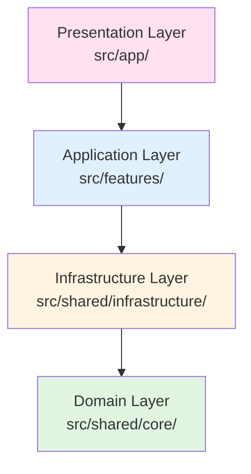

# フルスタックアプリケーション構築

このコマンドは、Next.js App Routerベースのフルスタックアプリケーションを構築します。

## 📋 実行フロー

### Phase 1: アプリ名と機能の確認

**引数解析**:

```bash
# アプリ名（必須）
app-name: "$1"

# 機能リスト（オプション、カンマ区切り）
features: "$2"（例: auth,dashboard,api）

# 未指定の場合
対話的に収集
```

### Phase 2: ドメインモデル設計（domain-modeler）

**使用エージェント**: `.claude/agents/domain-modeler.md`

**エージェントへの依頼内容**:

```markdown
アプリケーション「${app-name}」のドメインモデルを設計してください。

**機能リスト**: ${features}

**要件**:

1. エンティティ設計（`src/shared/core/entities/`）
2. バリューオブジェクト設計
3. 集約の境界決定（Bounded Context）
4. ドメインイベント定義（必要時）
5. ユビキタス言語の定義（用語集）

**スキル参照**:

- `.claude/skills/bounded-context/SKILL.md`
- `.claude/skills/ubiquitous-language/SKILL.md`
- `.claude/skills/clean-architecture-principles/SKILL.md`

**成果物**:

- `src/shared/core/entities/*.ts`（エンティティ）
- `src/shared/core/interfaces/*.ts`（インターフェース）
- ドメインモデル図（Mermaid）
- 用語集
```

### Phase 3: データベース設計（db-architect）

**使用エージェント**: `.claude/agents/db-architect.md`

**エージェントへの依頼内容**:

```markdown
アプリケーション「${app-name}」のデータベースを設計してください。

**入力**: Phase 2のドメインモデル

**要件**:

1. スキーマ設計（`src/shared/infrastructure/database/schema.ts`）:
   - Drizzle ORM使用
   - UUID主キー
   - タイムスタンプ（created_at, updated_at）
   - ソフトデリート（deleted_at）

2. 正規化（第3正規形まで）
3. インデックス設計（検索条件、外部キー、複合インデックス）
4. 制約設計（外部キー、UNIQUE、NOT NULL、CHECK）
5. マイグレーション設計

**プロジェクト構造**:

- `src/shared/infrastructure/database/schema.ts`（Drizzleスキーマ）
- `drizzle/migrations/`（マイグレーションSQL）

**スキル参照**:

- `.claude/skills/database-normalization/SKILL.md`
- `.claude/skills/indexing-strategies/SKILL.md`
- `.claude/skills/foreign-key-constraints/SKILL.md`

**成果物**:

- `src/shared/infrastructure/database/schema.ts`
- `drizzle/migrations/0001_initial_schema.sql`
- ER図（Mermaid）
```

### Phase 4: Repository実装（repo-dev）

**使用エージェント**: `.claude/agents/repo-dev.md`

**エージェントへの依頼内容**:

```markdown
アプリケーション「${app-name}」のRepositoryを実装してください。

**入力**: Phase 3のDBスキーマ

**要件**:

1. IRepository インターフェース実装
2. CRUD操作実装（create, findById, findMany, update, delete）
3. トランザクション管理
4. エラーハンドリング（DB接続エラー、制約違反等）

**プロジェクト構造**:

- `src/shared/infrastructure/database/repositories/`

**スキル参照**:

- `.claude/skills/repository-pattern/SKILL.md`
- `.claude/skills/transaction-management/SKILL.md`
- `.claude/skills/query-optimization/SKILL.md`

**成果物**:

- `src/shared/infrastructure/database/repositories/*.ts`（各エンティティのRepository）
```

### Phase 5: API Gateway設計（gateway-dev）

**使用エージェント**: `.claude/agents/gateway-dev.md`

**エージェントへの依頼内容**:

```markdown
アプリケーション「${app-name}」のAPI Gatewayを設計してください。

**入力**: Phase 2のドメインモデル、Phase 4のRepository

**要件**:

1. エンドポイント設計（RESTful、`/api/v1/`）:
   - POST /api/v1/[resource]: リソース作成
   - GET /api/v1/[resource]/{id}: リソース取得
   - GET /api/v1/[resource]: リソース一覧
   - PATCH /api/v1/[resource]/{id}: リソース更新
   - DELETE /api/v1/[resource]/{id}: リソース削除

2. バリデーション（Zod）
3. エラーレスポンス（7.3章準拠）
4. 認証・認可（必要時）
5. レート制限（必要時）

**プロジェクト構造**:

- `src/app/api/v1/[resource]/route.ts`（Next.js Route Handlers）

**スキル参照**:

- `.claude/skills/http-best-practices/SKILL.md`
- `.claude/skills/rest-api-design/SKILL.md`
- `.claude/skills/zod-validation/SKILL.md`

**成果物**:

- `src/app/api/v1/*/route.ts`（API Routes）
- API仕様書（OpenAPI形式、オプション）
```

### Phase 6: ルーティング実装（router-dev）

**使用エージェント**: `.claude/agents/router-dev.md`

**エージェントへの依頼内容**:

```markdown
アプリケーション「${app-name}」のページとルーティングを実装してください。

**要件**:

1. ディレクトリベースルーティング（App Router）
2. Layout/Page の責務分離
3. Server Components 優先、Client Components 最小化
4. メタデータ設定（SEO、OGP）
5. エラーハンドリング（error.tsx、not-found.tsx）
6. ローディング状態（loading.tsx）

**プロジェクト構造**:

- `src/app/layout.tsx`（Root Layout）
- `src/app/page.tsx`（Home Page）
- `src/app/[route]/page.tsx`（各ページ）
- `src/app/error.tsx`、`src/app/not-found.tsx`

**スキル参照**:

- `.claude/skills/nextjs-app-router/SKILL.md`
- `.claude/skills/server-components-patterns/SKILL.md`
- `.claude/skills/seo-optimization/SKILL.md`

**成果物**:

- `src/app/**/*.tsx`（Layout、Page、Error Handling）
```

### Phase 7: UIコンポーネント実装（ui-designer）

**使用エージェント**: `.claude/agents/ui-designer.md`

**エージェントへの依頼内容**:

```markdown
アプリケーション「${app-name}」のUIコンポーネントを実装してください。

**機能リスト**: ${features}

**要件**:

1. デザインシステム基盤:
   - Tailwind CSS設定
   - デザイントークン定義
   - 基本コンポーネント（Button, Input, Card等）

2. 機能別コンポーネント:
   - Composition Pattern適用
   - Slot Pattern活用
   - アクセシビリティ（WCAG 2.1、ARIA）

3. レスポンシブデザイン
4. エラー状態・ローディング状態

**プロジェクト構造**:

- `src/app/components/ui/`（基本コンポーネント）
- `src/app/components/${feature}/`（機能別コンポーネント）

**スキル参照**:

- `.claude/skills/component-composition-patterns/SKILL.md`
- `.claude/skills/accessibility-wcag/SKILL.md`
- `.claude/skills/tailwind-css-patterns/SKILL.md`

**成果物**:

- `src/app/components/ui/*.tsx`（基本コンポーネント）
- `src/app/components/${feature}/*.tsx`（機能コンポーネント）
- `tailwind.config.ts`（デザイントークン）
```

### Phase 8: 状態管理実装（state-manager）

**使用エージェント**: `.claude/agents/state-manager.md`

**エージェントへの依頼内容**:

```markdown
アプリケーション「${app-name}」の状態管理を実装してください。

**要件**:

1. データフェッチ戦略（SWR または React Query）
2. カスタムフック設計
3. エラー状態・ローディング状態管理
4. Optimistic Updates（楽観的更新）
5. キャッシュ戦略

**プロジェクト構造**:

- `src/hooks/`（カスタムフック）
- `src/app/providers.tsx`（SWR/ReactQuery Provider）

**スキル参照**:

- `.claude/skills/data-fetching-strategies/SKILL.md`
- `.claude/skills/custom-hooks-patterns/SKILL.md`
- `.claude/skills/state-lifting/SKILL.md`

**成果物**:

- `src/hooks/use${Feature}.ts`（カスタムフック）
- `src/app/providers.tsx`（Provider設定）
```

### Phase 9: 統合・検証

**実行内容**:

1. ディレクトリ構造検証（4.3章準拠）
2. 依存関係検証（ESLint boundaries plugin）
3. 型チェック（`pnpm typecheck`）
4. ビルド確認（`pnpm build`）
5. テスト実行（`pnpm test`）

### Phase 10: 完了報告

**完了報告**:

```markdown
## フルスタックアプリケーション完成: ${app-name}

### アーキテクチャ構成

- Presentation層: Next.js App Router、React Server Components
- Application層: API Gateway、ワークフローエンジン
- Domain層: エンティティ、ドメインロジック
- Infrastructure層: Drizzle ORM、Repository、外部API連携

### 成果物

✅ フロントエンド:

- src/app/\*_/_.tsx（Page、Layout、Error Handling）
- src/app/components/（UIコンポーネント、デザインシステム）
- src/hooks/（カスタムフック、データフェッチ）

✅ バックエンド:

- src/shared/core/entities/（エンティティ）
- src/shared/infrastructure/database/（スキーマ、Repository）
- src/features/（機能プラグイン）
- src/app/api/v1/（API Routes）

✅ データベース:

- src/shared/infrastructure/database/schema.ts（Drizzleスキーマ）
- drizzle/migrations/（マイグレーションSQL）

### 品質指標

- 型チェック: ✅ strict モード、エラーなし
- ビルド: ✅ 成功
- テスト: カバレッジ XX%
- アクセシビリティ: ✅ WCAG 2.1準拠

### Next Steps

1. 環境変数設定（.env）
2. データベースマイグレーション実行（`pnpm db:push`）
3. 開発サーバー起動（`pnpm dev`）
4. 統合テスト作成
5. デプロイ準備（Railway）
```

## 使用例

### 基本的な使用（機能指定なし）

```bash
/ai:create-full-stack-app my-app
```

対話的に機能リストを収集し、全レイヤーを実装

### 機能指定あり

```bash
/ai:create-full-stack-app task-manager --features auth,dashboard,tasks,api
```

指定された4機能を含むフルスタックアプリを構築

## アーキテクチャ図（master_system_design.md 5.1章準拠）



**レイヤー責務**:

- **Domain層**（`src/shared/core/`）: ビジネスルール、エンティティ定義（外部依存ゼロ）
- **Infrastructure層**（`src/shared/infrastructure/`）: DB、AI、Discord等の外部サービス接続
- **Application層**（`src/features/`）: 機能ごとのビジネスロジック（垂直スライス）
- **Presentation層**（`src/app/`）: Next.js App Router、UIコンポーネント

## 技術スタック（master_system_design.md 3章準拠）

| レイヤー       | 技術              | バージョン           |
| -------------- | ----------------- | -------------------- |
| **Framework**  | Next.js           | 15.x（App Router）   |
| **Language**   | TypeScript        | 5.x（strict モード） |
| **Database**   | Turso（SQLite）   | -                    |
| **ORM**        | Drizzle           | 0.39.x               |
| **Validation** | Zod               | 3.x                  |
| **UI**         | Tailwind CSS      | 3.x                  |
| **State**      | SWR / React Query | 最新                 |
| **Testing**    | Vitest            | 2.x                  |

## トラブルシューティング

### ビルドエラー

**原因**: 型エラー、インポート不正

**解決策**:

```bash
# 型チェック
pnpm typecheck

# ESLint
pnpm lint

# ビルド
pnpm build
```

### 依存関係違反

**原因**: Clean Architecture違反（app ← features等）

**解決策**:

```bash
# ESLint boundaries plugin で検出
pnpm lint

# 違反箇所を修正
```

### テスト失敗

**原因**: テストケース不足、モック不正

**解決策**:

- Phase 7（unit-tester）で網羅的テスト作成
- 外部依存を適切にモック化
- TDDサイクル実践（Red-Green-Refactor）

## ベストプラクティス

### Server Components優先

```tsx
// ✅ 正しい: Server Component（デフォルト）
export default async function Page() {
  const data = await fetchData();
  return <div>{data}</div>;
}

// ❌ 間違い: 不要なClient Component
("use client");
export default function Page() {
  // サーバーで実行可能な処理
}
```

### 機能プラグイン設計

```
src/features/${feature-name}/
├── schema.ts           # 入出力スキーマ（Zod）
├── executor.ts         # ビジネスロジック
└── __tests__/          # テスト
    └── executor.test.ts
```

## 参照

### エージェント

- router-dev: `.claude/agents/router-dev.md`
- ui-designer: `.claude/agents/ui-designer.md`
- state-manager: `.claude/agents/state-manager.md`
- domain-modeler: `.claude/agents/domain-modeler.md`
- db-architect: `.claude/agents/db-architect.md`
- repo-dev: `.claude/agents/repo-dev.md`
- gateway-dev: `.claude/agents/gateway-dev.md`
