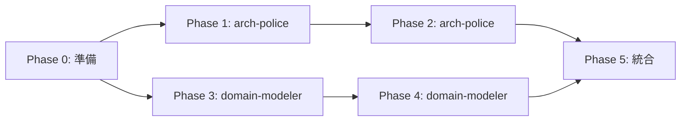

# システムアーキテクチャ設計

## 目的

ハイブリッドアーキテクチャに準拠したシステム全体の設計を行い、長期保守性とスケーラビリティを確保します。

## 実行フロー

### Phase 0: 準備と確認

**引数処理**:

- `$ARGUMENTS` が指定されている場合: `$1` をアーキテクチャスタイルとして使用（clean/hexagonal/onion）
- 未指定の場合: プロジェクト要件とmaster_system_design.mdに基づいて最適スタイルを選択

**プロジェクト仕様確認**:

1. `docs/00-requirements/master_system_design.md` の第5章を参照
2. ハイブリッド構造（shared/core, shared/infrastructure, features, app）の理解
3. 既存のアーキテクチャ設計書（`docs/10-architecture/`）の確認

### Phase 1: アーキテクチャレビューと現状分析

**`.claude/agents/arch-police.md` エージェント起動** - 並列実行1

```
タスク: 現状のプロジェクト構造をレビューし、アーキテクチャ基盤を分析してください。

**MANDATORY**: 以下のプロジェクト仕様を必ず参照してください:
- docs/00-requirements/master_system_design.md 第1.5章（アーキテクチャ原則）
  → Clean Architecture、Event-driven、Specification-Driven、Fault Tolerance、TDDの5原則
- docs/00-requirements/master_system_design.md 第4章（ディレクトリ構造）
  → ハイブリッドアーキテクチャの詳細
- docs/00-requirements/master_system_design.md 第4.4章（依存関係ルール）
  → app → features → shared/infrastructure → shared/core

必須スキル参照:
- `.claude/skills/clean-architecture-principles/SKILL.md`（hybrid-architecture-mapping.mdを含む）
- `.claude/skills/architectural-patterns/SKILL.md`
- `.claude/skills/dependency-analysis/SKILL.md`

実行内容:
1. アーキテクチャ原則の確認（master_system_design.md 第1.5章）
2. ディレクトリ構造確認（src/shared/core, src/shared/infrastructure, src/features, src/app）
3. 依存関係グラフの構築
4. レイヤー違反の検出
5. アーキテクチャパターンの評価（$ARGUMENTSで指定されたスタイルとの適合性）
6. 循環依存の検出

成果物:
- docs/10-architecture/current-analysis.md（現状分析レポート、5原則の評価を含む）
- 依存関係グラフ
- 検出された問題リスト
```

### Phase 2: SOLID原則とアーキテクチャ原則の適用

**`.claude/agents/arch-police.md` エージェント継続** - 連続実行

```
タスク: SOLID原則に基づくアーキテクチャ原則を適用し、設計ガイドラインを策定してください。

必須スキル参照:
- `.claude/skills/solid-principles/SKILL.md`
- `.claude/skills/clean-architecture-principles/SKILL.md`

実行内容:
1. SOLID原則の各項目評価（SRP, OCP, LSP, ISP, DIP）
2. 依存関係ルールの定義（app → features → shared/infrastructure → shared/core）
3. レイヤー責務の明確化
4. アーキテクチャ決定記録（ADR）の作成

成果物:
- docs/10-architecture/layer-structure.md（レイヤー構造定義）
- docs/10-architecture/dependency-rules.md（依存関係ルール）
- docs/99-adr/002-architecture-principles.md（アーキテクチャ原則ADR）
```

### Phase 3: ドメインモデル設計

**`.claude/agents/domain-modeler.md` エージェント起動** - 並列実行2

```
タスク: DDD原則に基づくドメインモデルを設計してください。

**MANDATORY**: 以下のプロジェクト仕様を必ず参照してください:
- docs/00-requirements/master_system_design.md 第6章（コアインターフェース仕様）
  → IWorkflowExecutor、IRepository、ExecutionContextの定義
- docs/00-requirements/master_system_design.md 第5.2.3章（workflows テーブル）
  → Workflowエンティティの構造、status ENUM、状態遷移図
- docs/00-requirements/master_system_design.md 第14章（用語集）
  → Workflow、Executor、Registry等のプロジェクト固有用語

必須スキル参照:
- `.claude/skills/domain-driven-design/SKILL.md`
- `.claude/skills/ubiquitous-language/SKILL.md`
- `.claude/skills/bounded-context/SKILL.md`

実行内容:
1. ユビキタス言語の抽出と定義（master_system_design.md 第14章を基準として使用）
2. 境界付けられたコンテキストの特定
3. Entity/ValueObject/Aggregateの識別（Workflowエンティティを中心に）
4. プロジェクト固有インターフェース（IWorkflowExecutor等）の設計反映
5. shared/core/entities/ 配下の型定義設計
6. 状態遷移図の設計（PENDING→PROCESSING→COMPLETED/FAILED/RETRYING）

成果物:
- docs/10-architecture/domain-model.md（ドメインモデル設計書、状態遷移図を含む）
- docs/10-architecture/ubiquitous-language.md（用語集、master_system_design.md第14章準拠）
- docs/10-architecture/bounded-contexts.md（コンテキスト境界定義）
- docs/10-architecture/core-interfaces.md（IWorkflowExecutor、IRepository設計）
```

### Phase 4: 詳細ドメイン設計

**`.claude/agents/domain-modeler.md` エージェント継続** - 連続実行

```
タスク: 値オブジェクトとドメインサービスの詳細設計を行ってください。

必須スキル参照:
- `.claude/skills/value-object-patterns/SKILL.md`
- `.claude/skills/domain-services/SKILL.md`

実行内容:
1. プリミティブ型から値オブジェクトへの変換計画
2. ドメインサービスの配置設計
3. 不変条件の定義
4. ドメインイベントの特定

成果物:
- docs/10-architecture/value-objects.md（値オブジェクト設計）
- docs/10-architecture/domain-services.md（ドメインサービス設計）
- docs/10-architecture/invariants.md（不変条件定義）
```

### Phase 5: 統合と最終レポート作成

**統合作業**:

1. arch-police と domain-modeler の成果物を統合
2. システム全体のアーキテクチャ設計書を生成
3. 実装ガイドラインの作成
4. 次フェーズ（実装）への引き継ぎ準備

**最終成果物**:

- `docs/10-architecture/system-design.md`: システムアーキテクチャ全体設計書
- `docs/10-architecture/implementation-guide.md`: 実装ガイドライン
- `docs/99-adr/`: アーキテクチャ決定記録（ADR）群

## エージェント起動タイミング



**並列実行**:

- Phase 1（arch-police）と Phase 3（domain-modeler）は並列実行可能

**連続実行**:

- Phase 1 → Phase 2（arch-police内での依存関係）
- Phase 3 → Phase 4（domain-modeler内での依存関係）

## アーキテクチャスタイル選択ガイド

**clean** (デフォルト):

- 用途: 標準的なレイヤードアーキテクチャ
- 特徴: 依存関係ルールが明確、学習コスト低

**hexagonal**:

- 用途: 外部サービス統合が多いシステム
- 特徴: ポート&アダプターパターン、テスタビリティ高

**onion**:

- 用途: ドメイン駆動設計を重視
- 特徴: ドメイン層の独立性が最大

## master_system_design.md準拠チェックリスト

- [ ] 第5章（アーキテクチャ設計詳細）のハイブリッド構造に準拠
- [ ] 依存関係ルール: `app/ → features/ → shared/infrastructure/ → shared/core/`
- [ ] 各層の責務定義が明確
- [ ] ESLintによる依存関係強制（eslint-plugin-boundaries）
- [ ] TDD原則との整合性（テスタビリティ）
- [ ] スキーマレス設計（JSON活用）への対応
- [ ] ベクトル検索への対応（必要に応じてvector extension）

## 品質基準

**完了条件**:

- [ ] システム全体のアーキテクチャ設計書が作成されている
- [ ] 依存関係ルールが明確に定義されている
- [ ] ドメインモデルが設計されている
- [ ] ユビキタス言語が確立されている
- [ ] アーキテクチャ決定記録（ADR）が作成されている
- [ ] 実装ガイドラインが提供されている

**品質メトリクス**:

- アーキテクチャ原則の遵守率: > 95%
- ドメイン用語の一貫性: 100%
- 依存関係ルール違反: 0件

## トラブルシューティング

**問題**: アーキテクチャスタイルの選択が困難

- **対処**: master_system_design.mdの要件を優先し、cleanアーキテクチャをデフォルト使用

**問題**: 既存コードとの整合性が取れない

- **対処**: arch-policeによる現状分析を先行実施、段階的移行計画を策定

**問題**: ドメインモデルの境界が不明確

- **対処**: domain-modelerのbounded-contextスキルを活用、ステークホルダーヒアリング実施
