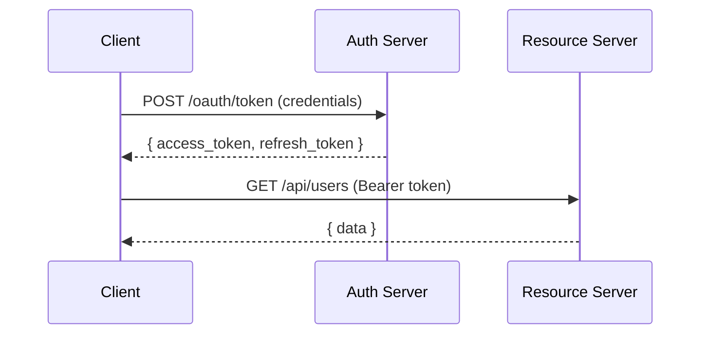

# 認証ドキュメント作成

## 概要

API認証フローを明確に文書化し、開発者がスムーズに認証を実装できるようにします。

## Bearer Token認証

### 概要

Bearer Token認証は、HTTPヘッダーにトークンを含めてリクエストを認証する方式です。

### ヘッダー形式

```
Authorization: Bearer <access_token>
```

### トークン取得フロー



### トークン取得リクエスト

```http
POST /oauth/token HTTP/1.1
Host: auth.example.com
Content-Type: application/x-www-form-urlencoded

grant_type=client_credentials
&client_id=your_client_id
&client_secret=your_client_secret
```

### トークン取得レスポンス

```json
{
  "access_token": "eyJhbGciOiJIUzI1NiIs...",
  "token_type": "Bearer",
  "expires_in": 3600,
  "refresh_token": "dGhpcyBpcyBhIHJlZnJl..."
}
```

### トークンリフレッシュ

```http
POST /oauth/token HTTP/1.1
Host: auth.example.com
Content-Type: application/x-www-form-urlencoded

grant_type=refresh_token
&refresh_token=dGhpcyBpcyBhIHJlZnJl...
&client_id=your_client_id
```

## API Key認証

### 概要

API Keyは、シンプルな認証方式で、主にサーバー間通信で使用されます。

### ヘッダー形式

```
X-API-Key: your_api_key_here
```

### 使用例

```bash
curl -X GET https://api.example.com/v1/users \
  -H "X-API-Key: sk_live_abc123xyz"
```

### API Keyの種類

| タイプ   | プレフィックス | 用途             |
| :------- | :------------- | :--------------- |
| 本番用   | `sk_live_`     | 本番環境         |
| テスト用 | `sk_test_`     | 開発・テスト環境 |

## OAuth 2.0

### Authorization Code Flow

1. **認可リクエスト**

```
GET /oauth/authorize?
  response_type=code
  &client_id=your_client_id
  &redirect_uri=https://your-app.com/callback
  &scope=read write
  &state=random_state_string
```

2. **コールバック**

```
https://your-app.com/callback?
  code=authorization_code
  &state=random_state_string
```

3. **トークン交換**

```http
POST /oauth/token HTTP/1.1
Content-Type: application/x-www-form-urlencoded

grant_type=authorization_code
&code=authorization_code
&redirect_uri=https://your-app.com/callback
&client_id=your_client_id
&client_secret=your_client_secret
```

### スコープ定義

| スコープ | 説明     | 許可される操作    |
| :------- | :------- | :---------------- |
| `read`   | 読み取り | GET リクエスト    |
| `write`  | 書き込み | POST, PUT, PATCH  |
| `delete` | 削除     | DELETE リクエスト |
| `admin`  | 管理者   | すべての操作      |

## セキュリティベストプラクティス

### すべきこと

- トークンは安全に保管（環境変数、Secret Manager）
- HTTPSを必ず使用
- トークンの有効期限を短く設定
- Refresh Tokenを使用して更新

### 避けるべきこと

- トークンをURLパラメータに含めない
- トークンをログに出力しない
- トークンをクライアントサイドに保存しない
- 長期間有効なトークンを発行しない

## エラーハンドリング

| エラー           | 対処方法            |
| :--------------- | :------------------ |
| 401 Unauthorized | トークンを再取得    |
| 403 Forbidden    | スコープを確認      |
| Token Expired    | Refresh Tokenで更新 |
