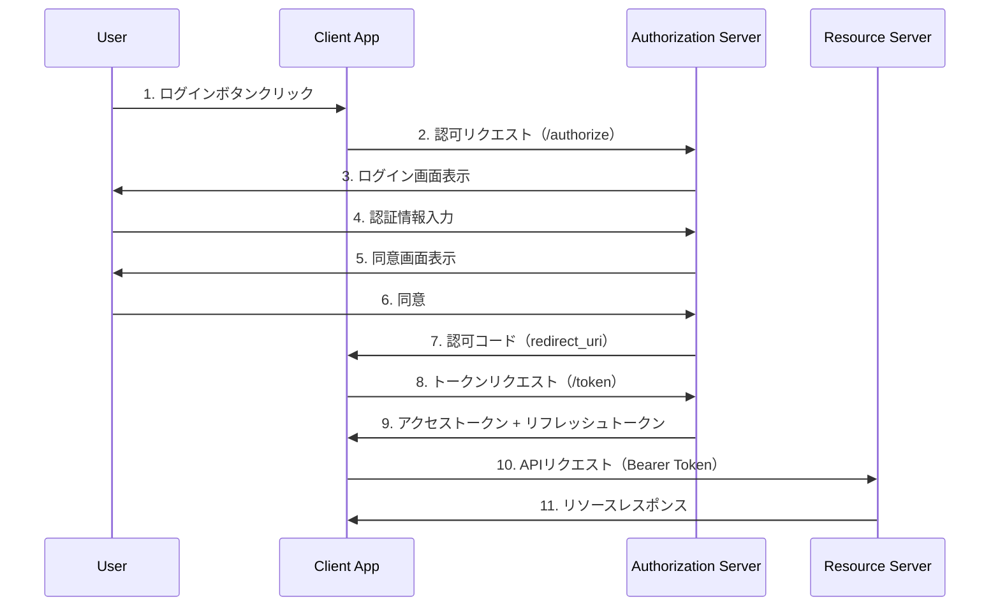
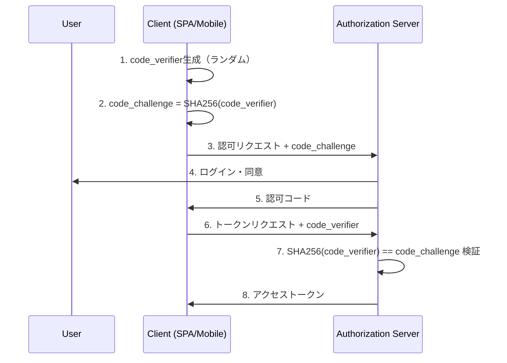
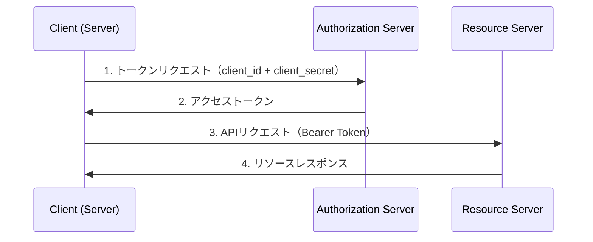
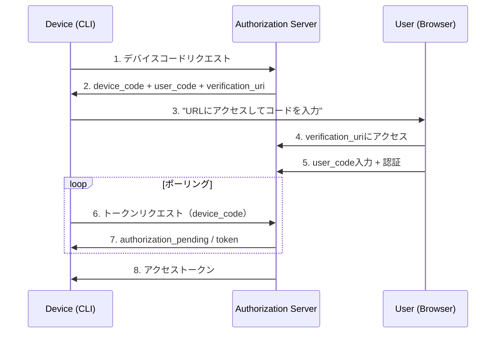

# OAuth 2.0 フロー詳細ガイド

## フロー選択ガイド

| クライアント種別 | 推奨フロー | 理由 |
|----------------|-----------|------|
| Webアプリ（サーバーサイド） | Authorization Code | シークレット安全保持可能 |
| SPA/モバイル | Authorization Code + PKCE | シークレット保持不可 |
| CLIツール | Device Code | ブラウザ利用不可環境 |
| サーバー間通信 | Client Credentials | ユーザー不在 |
| 信頼済みアプリ | Resource Owner Password | 限定的使用のみ |

---

## 1. Authorization Code Flow

### 概要

最も安全で推奨されるフロー。
Webアプリケーションに最適。

### シーケンス図



### ステップ詳細

#### Step 1-2: 認可リクエスト

```http
GET /oauth/authorize HTTP/1.1
Host: auth.example.com

?response_type=code
&client_id=your_client_id
&redirect_uri=https://yourapp.com/callback
&scope=read write
&state=abc123xyz
```

| パラメータ | 必須 | 説明 |
|-----------|------|------|
| response_type | ✅ | "code"を指定 |
| client_id | ✅ | アプリケーションID |
| redirect_uri | ✅ | コールバックURL（事前登録必須） |
| scope | ✅ | 要求する権限（スペース区切り） |
| state | ✅ | CSRF対策用ランダム値 |

#### Step 7: 認可コード受け取り

```http
GET /callback HTTP/1.1
Host: yourapp.com

?code=AUTH_CODE_HERE
&state=abc123xyz
```

#### Step 8-9: トークン取得

```bash
curl -X POST "https://auth.example.com/oauth/token" \
  -H "Content-Type: application/x-www-form-urlencoded" \
  -d "grant_type=authorization_code" \
  -d "code=AUTH_CODE_HERE" \
  -d "redirect_uri=https://yourapp.com/callback" \
  -d "client_id=your_client_id" \
  -d "client_secret=your_client_secret"
```

**レスポンス:**

```json
{
  "access_token": "eyJhbGciOiJSUzI1NiIsInR5cCI6IkpXVCJ9...",
  "token_type": "Bearer",
  "expires_in": 3600,
  "refresh_token": "dGhpcyBpcyBhIHJlZnJlc2ggdG9rZW4...",
  "scope": "read write"
}
```

---

## 2. Authorization Code Flow + PKCE

### 概要

SPA・モバイルアプリ向け。
クライアントシークレットなしで安全に認証。

### シーケンス図



### PKCE実装

#### code_verifier生成（JavaScript）

```javascript
function generateCodeVerifier() {
  const array = new Uint8Array(32);
  crypto.getRandomValues(array);
  return btoa(String.fromCharCode.apply(null, array))
    .replace(/\+/g, '-')
    .replace(/\//g, '_')
    .replace(/=/g, '');
}

async function generateCodeChallenge(verifier) {
  const encoder = new TextEncoder();
  const data = encoder.encode(verifier);
  const digest = await crypto.subtle.digest('SHA-256', data);
  return btoa(String.fromCharCode.apply(null, new Uint8Array(digest)))
    .replace(/\+/g, '-')
    .replace(/\//g, '_')
    .replace(/=/g, '');
}
```

#### 認可リクエスト

```http
GET /oauth/authorize HTTP/1.1
Host: auth.example.com

?response_type=code
&client_id=your_client_id
&redirect_uri=https://yourapp.com/callback
&scope=read write
&state=abc123xyz
&code_challenge=E9Melhoa2OwvFrEMTJguCHaoeK1t8URWbuGJSstw-cM
&code_challenge_method=S256
```

#### トークンリクエスト

```bash
curl -X POST "https://auth.example.com/oauth/token" \
  -H "Content-Type: application/x-www-form-urlencoded" \
  -d "grant_type=authorization_code" \
  -d "code=AUTH_CODE_HERE" \
  -d "redirect_uri=https://yourapp.com/callback" \
  -d "client_id=your_client_id" \
  -d "code_verifier=dBjftJeZ4CVP-mB92K27uhbUJU1p1r_wW1gFWFOEjXk"
```

---

## 3. Client Credentials Flow

### 概要

サーバー間通信用。ユーザー介在なし。
バックグラウンドジョブ、マイクロサービス連携に最適。

### シーケンス図



### 実装

```bash
curl -X POST "https://auth.example.com/oauth/token" \
  -H "Content-Type: application/x-www-form-urlencoded" \
  -u "client_id:client_secret" \
  -d "grant_type=client_credentials" \
  -d "scope=api:read api:write"
```

または:

```bash
curl -X POST "https://auth.example.com/oauth/token" \
  -H "Content-Type: application/x-www-form-urlencoded" \
  -d "grant_type=client_credentials" \
  -d "client_id=your_client_id" \
  -d "client_secret=your_client_secret" \
  -d "scope=api:read api:write"
```

**レスポンス:**

```json
{
  "access_token": "eyJhbGciOiJSUzI1NiIsInR5cCI6IkpXVCJ9...",
  "token_type": "Bearer",
  "expires_in": 3600,
  "scope": "api:read api:write"
}
```

> ⚠️ **注意**: このフローではリフレッシュトークンは発行されません。
> 期限切れ時は再度トークンリクエストを行います。

---

## 4. Device Code Flow

### 概要

ブラウザのないデバイス（CLI、スマートTV、IoT）向け。
別デバイスで認証を完了。

### シーケンス図



### 実装

#### Step 1-2: デバイスコード取得

```bash
curl -X POST "https://auth.example.com/oauth/device/code" \
  -H "Content-Type: application/x-www-form-urlencoded" \
  -d "client_id=your_client_id" \
  -d "scope=read write"
```

**レスポンス:**

```json
{
  "device_code": "GmRhmhcxhwAzkoEqiMEg_DnyEysNkuNhszIySk9eS",
  "user_code": "WDJB-MJHT",
  "verification_uri": "https://auth.example.com/device",
  "verification_uri_complete": "https://auth.example.com/device?user_code=WDJB-MJHT",
  "expires_in": 1800,
  "interval": 5
}
```

#### ユーザーへの表示

```
デバイスを認証するには:
1. ブラウザで https://auth.example.com/device を開く
2. コード WDJB-MJHT を入力
3. ログインして許可

または、このURLを直接開く:
https://auth.example.com/device?user_code=WDJB-MJHT
```

#### Step 6-8: ポーリング

```bash
curl -X POST "https://auth.example.com/oauth/token" \
  -H "Content-Type: application/x-www-form-urlencoded" \
  -d "grant_type=urn:ietf:params:oauth:grant-type:device_code" \
  -d "device_code=GmRhmhcxhwAzkoEqiMEg_DnyEysNkuNhszIySk9eS" \
  -d "client_id=your_client_id"
```

**待機中レスポンス:**

```json
{
  "error": "authorization_pending",
  "error_description": "ユーザーの認証を待っています"
}
```

**成功レスポンス:**

```json
{
  "access_token": "eyJhbGciOiJSUzI1NiIsInR5cCI6IkpXVCJ9...",
  "token_type": "Bearer",
  "expires_in": 3600,
  "refresh_token": "dGhpcyBpcyBhIHJlZnJlc2ggdG9rZW4..."
}
```

---

## スコープ設計

### スコープ命名規則

```
{resource}:{action}

例:
read          - 読み取り全般
write         - 書き込み全般
users:read    - ユーザー読み取り
users:write   - ユーザー書き込み
admin         - 管理者権限
offline_access - リフレッシュトークン取得
```

### スコープ階層

```
admin
├── users:write
│   └── users:read
├── orders:write
│   └── orders:read
└── settings:write
    └── settings:read
```

---

## エラーレスポンス

### OAuth 2.0標準エラー

| error | 説明 |
|-------|------|
| invalid_request | リクエストパラメータ不正 |
| invalid_client | クライアント認証失敗 |
| invalid_grant | 認可コード/リフレッシュトークン無効 |
| unauthorized_client | クライアントに許可されていない |
| unsupported_grant_type | grant_type未サポート |
| invalid_scope | スコープ無効 |

**エラーレスポンス例:**

```json
{
  "error": "invalid_grant",
  "error_description": "認可コードが無効または期限切れです"
}
```
