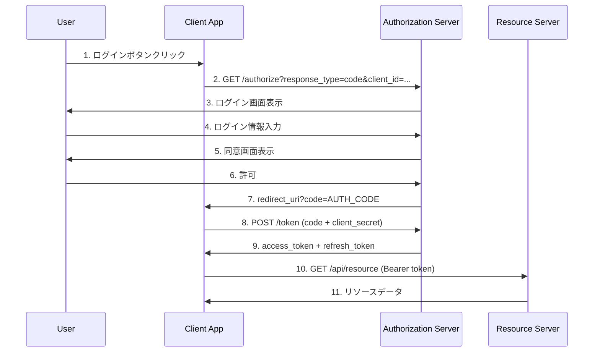
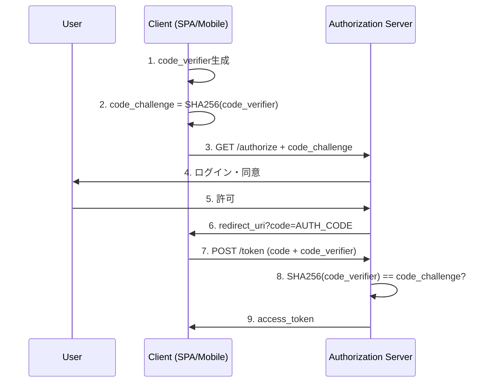
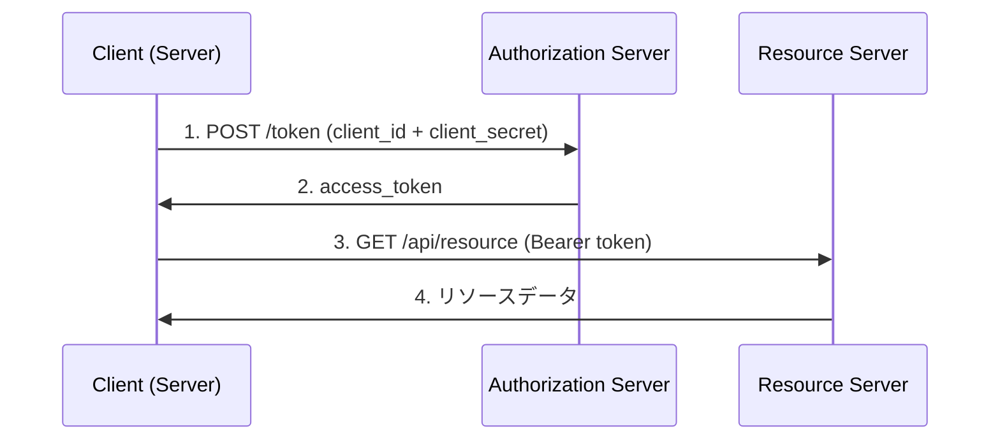
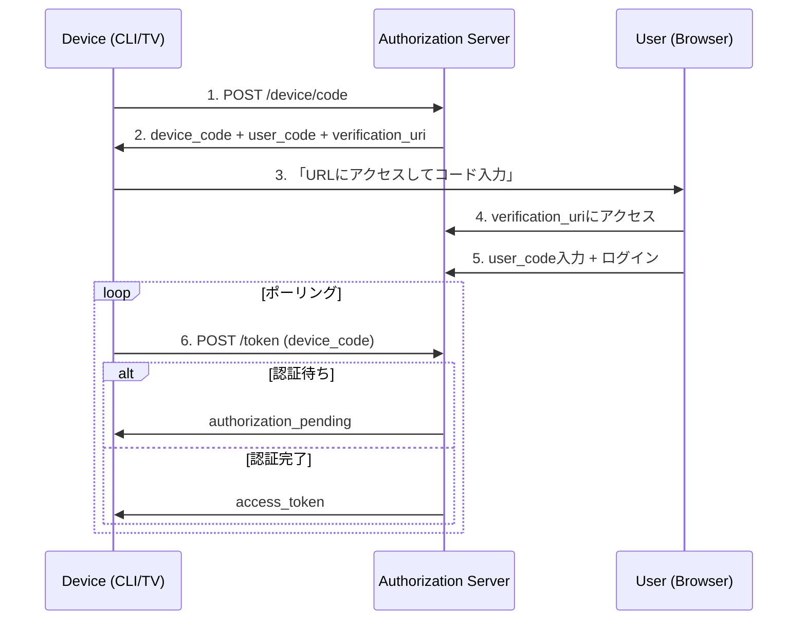
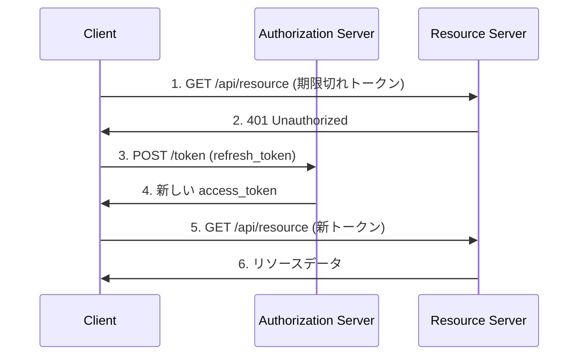
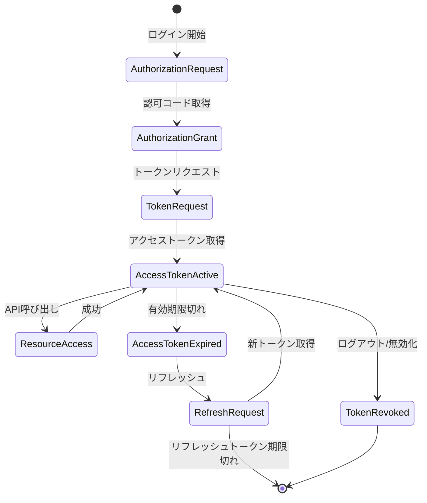
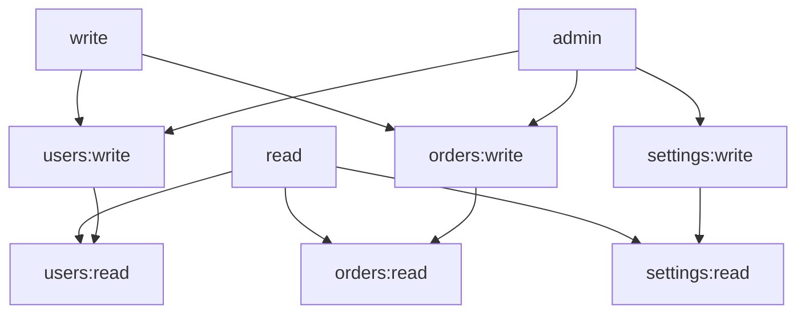
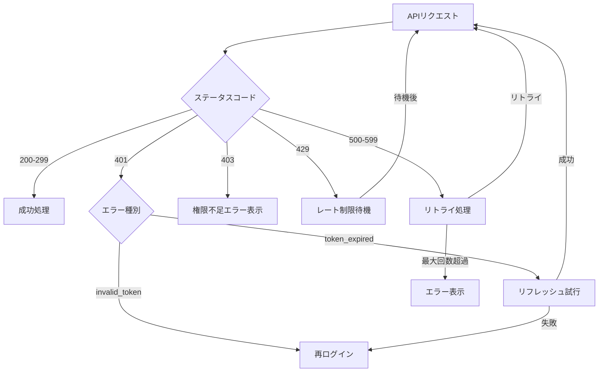

# OAuth 2.0 フロー図テンプレート

## Authorization Code Flow



---

## Authorization Code Flow + PKCE



---

## Client Credentials Flow



---

## Device Code Flow



---

## Refresh Token Flow



---

## Token Lifecycle



---

## スコープ階層図



---

## 認証エンドポイント構成

```mermaid
graph LR
    subgraph "Authorization Server"
        authorize[/authorize]
        token[/token]
        revoke[/revoke]
        userinfo[/userinfo]
        jwks[/.well-known/jwks.json]
        config[/.well-known/openid-configuration]
    end

    subgraph "Client"
        login[ログイン]
        callback[コールバック]
        api_call[API呼び出し]
    end

    subgraph "Resource Server"
        api[/api/...]
    end

    login --> authorize
    authorize --> callback
    callback --> token
    token --> api_call
    api_call --> api
```

---

## エラーハンドリングフロー



---

## 使用方法

### Mermaidの埋め込み

**Markdown:**

````markdown
```mermaid
sequenceDiagram
    ...
```
````

**HTML:**

```html
<div class="mermaid">
sequenceDiagram
    ...
</div>
<script src="https://cdn.jsdelivr.net/pnpm/mermaid/dist/mermaid.min.js"></script>
<script>mermaid.initialize({startOnLoad:true});</script>
```

### カスタマイズ

```javascript
mermaid.initialize({
  theme: 'default',  // default, forest, dark, neutral
  securityLevel: 'loose',
  sequence: {
    diagramMarginX: 50,
    diagramMarginY: 10,
    actorMargin: 50,
    width: 150,
    height: 65
  }
});
```
