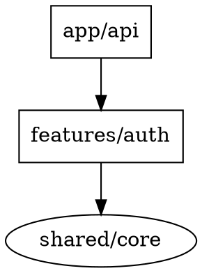
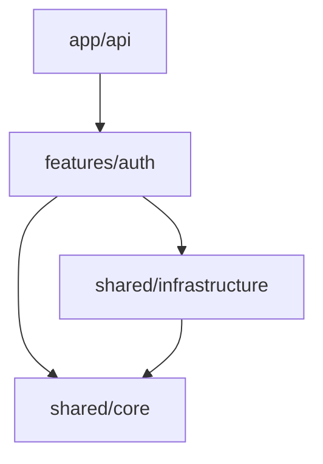

# 依存グラフ構築

## 概要

依存グラフは、モジュール間の依存関係を視覚化したグラフ構造。
ノードはモジュール、エッジは依存関係を表す。

## グラフの種類

### モジュール依存グラフ

```
       ┌─────────┐
       │  app/   │
       └────┬────┘
            │
    ┌───────┼───────┐
    ▼       ▼       ▼
┌───────┐ ┌───────┐ ┌───────┐
│feature│ │feature│ │feature│
│   A   │ │   B   │ │   C   │
└───┬───┘ └───┬───┘ └───┬───┘
    │         │         │
    └─────────┼─────────┘
              ▼
        ┌───────────┐
        │shared/    │
        │infra      │
        └─────┬─────┘
              ▼
        ┌───────────┐
        │shared/    │
        │core       │
        └───────────┘
```

### パッケージ依存グラフ

```
package.json の dependencies/devDependencies を
可視化した外部依存グラフ
```

### クラス依存グラフ

```
クラス間の継承、コンポジション、使用関係を
可視化した細粒度の依存グラフ
```

## グラフ構築手法

### 静的解析

```typescript
// import/export文を解析
import { readFile } from 'fs/promises';

interface DependencyNode {
  path: string;
  imports: string[];
  exports: string[];
}

async function analyzeFile(filePath: string): Promise<DependencyNode> {
  const content = await readFile(filePath, 'utf-8');

  // import文を抽出
  const importRegex = /import\s+.*\s+from\s+['"]([^'"]+)['"]/g;
  const imports: string[] = [];
  let match;
  while ((match = importRegex.exec(content)) !== null) {
    imports.push(match[1]);
  }

  // export文を抽出
  const exportRegex = /export\s+(?:default\s+)?(?:class|function|const|interface|type)\s+(\w+)/g;
  const exports: string[] = [];
  while ((match = exportRegex.exec(content)) !== null) {
    exports.push(match[1]);
  }

  return { path: filePath, imports, exports };
}
```

### グラフデータ構造

```typescript
interface DependencyGraph {
  nodes: Map<string, DependencyNode>;
  edges: Array<{ from: string; to: string; type: DependencyType }>;
}

type DependencyType =
  | 'import'      // 直接import
  | 're-export'   // 再export
  | 'type-only'   // 型のみ
  | 'dynamic';    // 動的import
```

## ツール活用

### madge（推奨）

```bash
# インストール
pnpm install -g madge

# 依存グラフ生成
madge src/ --image graph.svg

# 循環依存検出
madge src/ --circular

# JSON出力
madge src/ --json > dependencies.json
```

### dependency-cruiser

```bash
# インストール
pnpm install -g dependency-cruiser

# ルール設定初期化
depcruise --init

# 検証実行
depcruise src --include-only "^src" --output-type dot | dot -T svg > deps.svg
```

### TypeScript Compiler API

```typescript
import * as ts from 'typescript';

function getImportsFromFile(sourceFile: ts.SourceFile): string[] {
  const imports: string[] = [];

  ts.forEachChild(sourceFile, node => {
    if (ts.isImportDeclaration(node)) {
      const moduleSpecifier = node.moduleSpecifier;
      if (ts.isStringLiteral(moduleSpecifier)) {
        imports.push(moduleSpecifier.text);
      }
    }
  });

  return imports;
}
```

## 可視化形式

### DOT形式



### Mermaid形式



## 分析ポイント

### 健全なグラフの特徴

- **DAG（有向非巡回グラフ）**: 循環がない
- **階層的**: 依存が一方向
- **疎結合**: エッジ数が適切

### 問題のあるグラフの特徴

- **循環**: 相互依存が存在
- **密結合**: 過度に多いエッジ
- **逆依存**: 内側から外側への依存
