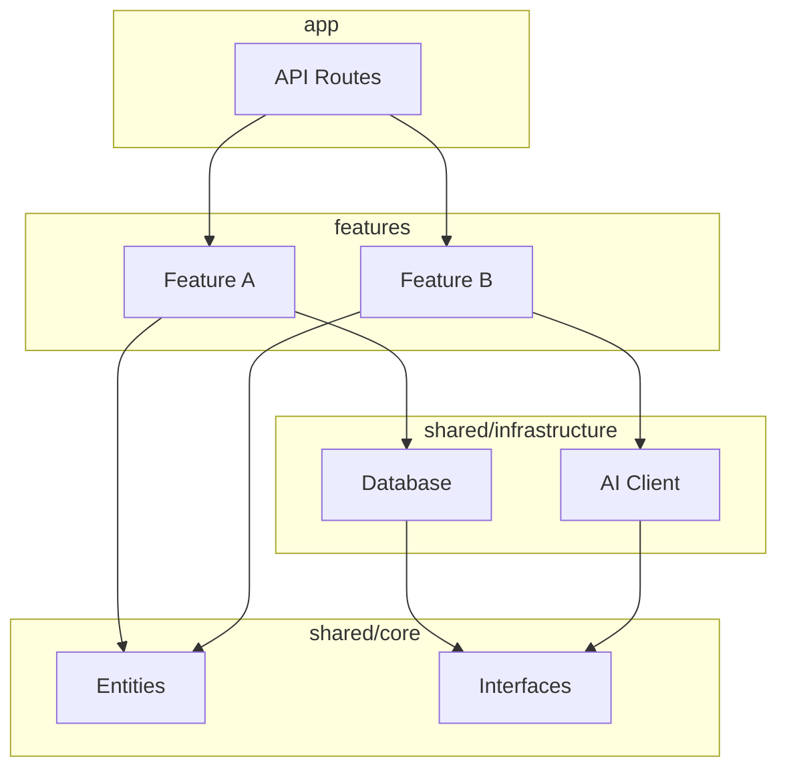

# 依存関係分析レポート

## 基本情報

- **分析日**: {{date}}
- **分析対象**: {{target}}
- **分析担当**: @arch-police

---

## 1. サマリー

| 項目 | 値 |
|------|---|
| 総モジュール数 | |
| 総ファイル数 | |
| 循環依存数 | |
| 平均不安定度(I) | |

---

## 2. モジュール安定度

### 2.1 安定度マトリクス

| モジュール | ファイル数 | Ca(入力) | Ce(出力) | I(不安定度) | 評価 |
|-----------|-----------|---------|---------|------------|------|
| | | | | | |

### 2.2 レイヤー別分析

#### shared/core（Entities層）

- **期待値**: I ≈ 0（最も安定）
- **実測値**: I =
- **評価**:

#### shared/infrastructure（Interface Adapters層）

- **期待値**: I ≈ 0.3-0.5
- **実測値**: I =
- **評価**:

#### features（Use Cases層）

- **期待値**: I ≈ 0.5-0.7
- **実測値**: I =
- **評価**:

#### app（Frameworks層）

- **期待値**: I ≈ 0.8-1.0（最も不安定）
- **実測値**: I =
- **評価**:

---

## 3. 循環依存

### 3.1 検出された循環

| # | 循環パス | 深刻度 | 推奨対応 |
|---|---------|--------|----------|
| 1 | | | |

### 3.2 解消提案

1.

---

## 4. 依存関係グラフ

### 4.1 レイヤー間依存

### 4.2 問題のある依存

| 依存元 | 依存先 | 問題 |
|--------|--------|------|
| | | |

---

## 5. レイヤー違反

### 5.1 検出された違反

| # | ファイル | 違反内容 | 深刻度 |
|---|---------|----------|--------|
| 1 | | | |

### 5.2 違反パターン分類

- **外側→内側の逆依存**: 件
- **feature間の相互依存**: 件
- **core層の外部依存**: 件

---

## 6. 是正提案

### 6.1 Critical（即時対応）

1.

### 6.2 High（早期対応）

1.

### 6.3 Medium（計画的対応）

1.

---

## 7. 推奨アクション

### 短期（1-2週間）

- [ ]

### 中期（1ヶ月）

- [ ]

### 長期（四半期）

- [ ]

---

## 8. 付録

### A. 使用ツール

- dependency-analysis スクリプト
- madge
- dependency-cruiser

### B. 参考資料

- [依存グラフ構築](../resources/dependency-graph.md)
- [循環依存の検出と解消](../resources/circular-dependency.md)
- [安定度メトリクス](../resources/stability-metrics.md)
