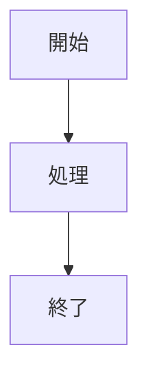

# Markdown 基礎知識

> **相対パス**: `references/basics.md`
> **読込条件**: 初回使用時

---

## Markdown とは

| 概念       | 説明                                           |
| ---------- | ---------------------------------------------- |
| Markdown   | 軽量マークアップ言語、プレーンテキストで構造化 |
| CommonMark | 標準化された Markdown 仕様                     |
| GFM        | GitHub Flavored Markdown、拡張構文             |

---

## 基本構文一覧

| 要素   | 構文                    | 出力例              |
| ------ | ----------------------- | ------------------- |
| 見出し | `# H1` `## H2` `### H3` | H1, H2, H3          |
| 強調   | `**太字**` `*斜体*`     | **太字** _斜体_     |
| リスト | `- 項目` `1. 項目`      | 箇条書き/番号リスト |
| リンク | `[テキスト](URL)`       | [テキスト](URL)     |
| 画像   | ``           | 画像表示            |
| コード | `` `inline` ``          | `inline`            |
| 引用   | `> 引用テキスト`        | > 引用              |
| 水平線 | `---`                   | ───────             |

---

## テーブル基本構文

```markdown
| ヘッダー1 | ヘッダー2 |
| --------- | --------- |
| セル1     | セル2     |
```

**カラム整列**:

| 構文    | 整列     |
| ------- | -------- |
| `:---`  | 左揃え   |
| `:---:` | 中央揃え |
| `---:`  | 右揃え   |

---

## コードブロック

````markdown
```typescript
const hello = "world";
```
````

**言語サポート**: typescript, javascript, python, bash, yaml, json, etc.

---

## Mermaid 図の基本

````markdown

````

**対応図種**:

| 種類       | キーワード        |
| ---------- | ----------------- |
| フロー図   | `flowchart`       |
| シーケンス | `sequenceDiagram` |
| ER図       | `erDiagram`       |
| 状態遷移   | `stateDiagram`    |

---

## YAML Front-matter

```yaml
---
title: ドキュメントタイトル
version: 1.0.0
author: Author Name
status: draft | review | approved
---
```

---

## 関連リソース

- **高度パターン**: See [patterns.md](patterns.md)
- **Mermaid詳細**: See [mermaid-diagrams.md](mermaid-diagrams.md)
- **テーブル詳細**: See [advanced-tables.md](advanced-tables.md)
