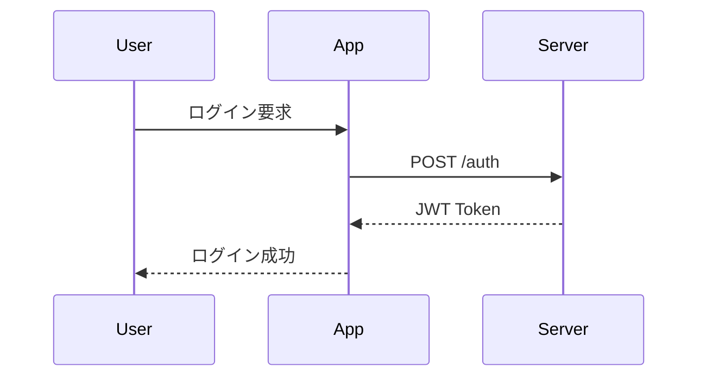
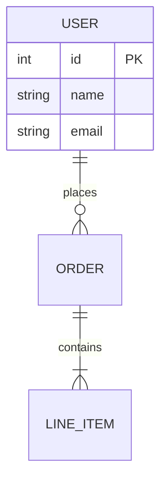
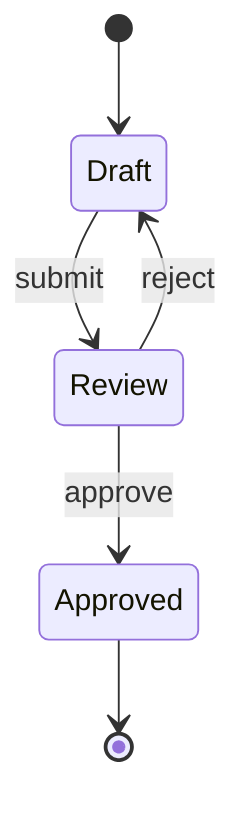

# Markdown 高度パターン

> **相対パス**: `references/patterns.md`
> **読込条件**: 実装時

---

## 構造化ドキュメントパターン

### 仕様書構造

```markdown
---
title: API仕様書
version: 1.0.0
status: approved
---

# 概要

## エンドポイント一覧

| メソッド | パス | 説明 |
| -------- | ---- | ---- |
| GET      | /api | 一覧 |

## 詳細

### GET /api

[Mermaid シーケンス図]
[リクエスト/レスポンス テーブル]
[コード例]
```

---

## Mermaid 高度パターン

### シーケンス図（認証フロー）



### ER 図（データモデル）



### 状態遷移図



---

## テーブル高度パターン

### API レスポンス定義

| フィールド | 型       | 必須 | 説明              |
| ---------- | -------- | :--: | ----------------- |
| `id`       | `string` |  ✓   | ユニークID        |
| `name`     | `string` |  ✓   | 表示名            |
| `email`    | `string` |  ✓   | メールアドレス    |
| `role`     | `enum`   |      | `admin` \| `user` |

### 比較表

| 項目   | オプションA | オプションB |
| ------ | :---------: | :---------: |
| 速度   |   ⭐⭐⭐    |    ⭐⭐     |
| コスト |    ⭐⭐     |   ⭐⭐⭐    |
| 保守性 |   ⭐⭐⭐    |    ⭐⭐     |

---

## コードブロックパターン

### ファイル名付き

```typescript title="src/utils/logger.ts"
export const logger = {
  info: (msg: string) => console.log(`[INFO] ${msg}`),
  error: (msg: string) => console.error(`[ERROR] ${msg}`),
};
```

### 差分表示

```diff
- const old = "previous";
+ const new = "updated";
```

### 行ハイライト（プラットフォーム依存）

```typescript {2-3}
function example() {
  const highlighted = true;
  return highlighted;
}
```

---

## 数式パターン

### インライン数式

$E = mc^2$ のような単純な式

### ブロック数式

$$
\sum_{i=1}^{n} x_i = x_1 + x_2 + ... + x_n
$$

---

## アクセシビリティパターン

| 要素     | ベストプラクティス                           |
| -------- | -------------------------------------------- |
| 画像     | 必ず alt テキストを含める                    |
| リンク   | 意味のあるリンクテキスト（「こちら」避ける） |
| テーブル | ヘッダー行を必ず含める                       |
| 見出し   | 階層を飛ばさない（H1→H3 禁止）               |

---

## 関連リソース

- **基礎知識**: See [basics.md](basics.md)
