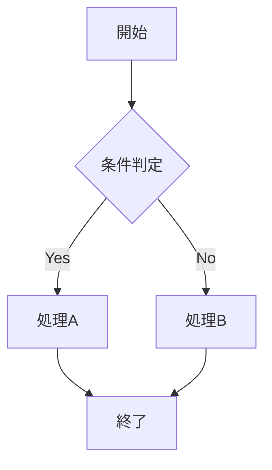
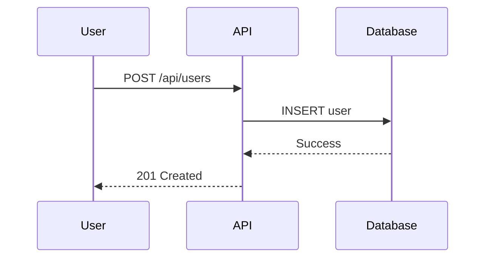
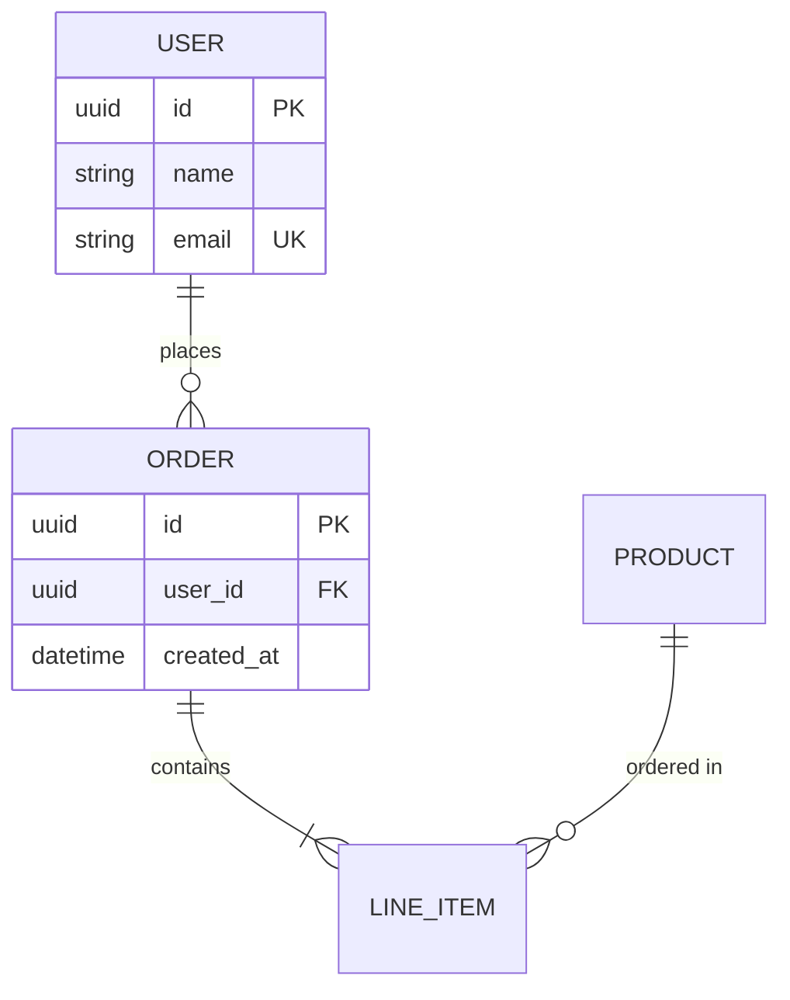
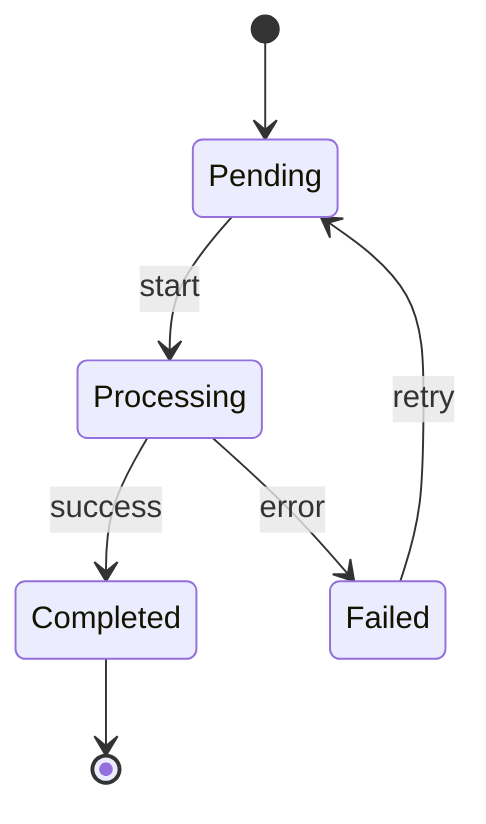

# Mermaid図 詳細ガイド

## 概要

Mermaidは、テキストベースの記述から図を生成するツールです。Markdown内に埋め込むことで、コードと同様にバージョン管理でき、差分の追跡も容易になります。

## 対応図タイプ

### 1. フローチャート

処理の流れや条件分岐を表現します。

**構文要素**:

- `TD`: Top to Down（上から下）
- `LR`: Left to Right（左から右）
- `[]`: 四角形ノード
- `{}`: ひし形（判断）
- `()`: 角丸ノード
- `-->`: 矢印
- `-->|ラベル|`: ラベル付き矢印

### 2. シーケンス図

システム間の時系列的な相互作用を表現します。

**構文要素**:

- `participant`: 参加者の定義
- `->>`: 同期メッセージ
- `-->>`: 応答メッセージ
- `Note over`: 注釈
- `loop`: ループ
- `alt/else`: 条件分岐

### 3. ER図

データモデルの関係性を表現します。

**リレーション記号**:

- `||--||`: 1対1
- `||--o{`: 1対多
- `}o--o{`: 多対多

### 4. 状態遷移図

ステートマシンの動作を表現します。

## ベストプラクティス

### すべきこと

- ノード数は30以下に抑える
- 適切な図タイプを選択する
- 凡例やコメントを追加する

### 避けるべきこと

- 1つの図に詰め込みすぎない
- 複雑すぎる条件分岐
- 読みにくい長いラベル

## トラブルシューティング

### 図がレンダリングされない

1. 構文エラーを確認
2. 特殊文字をエスケープ
3. Mermaid対応環境で確認
