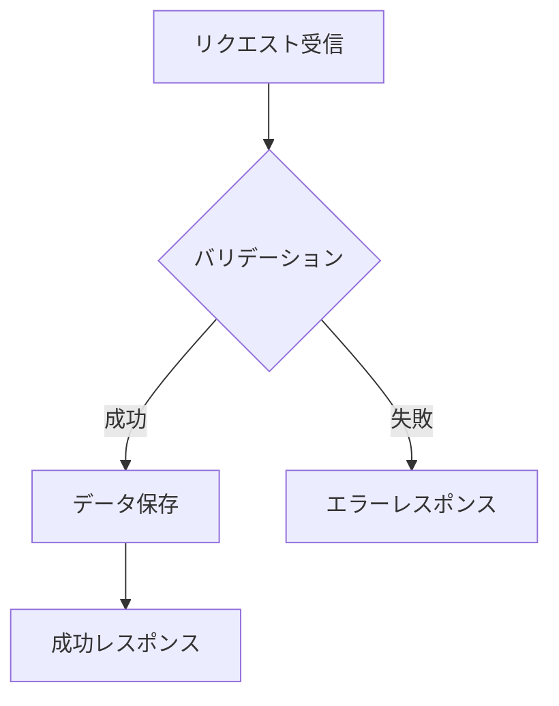
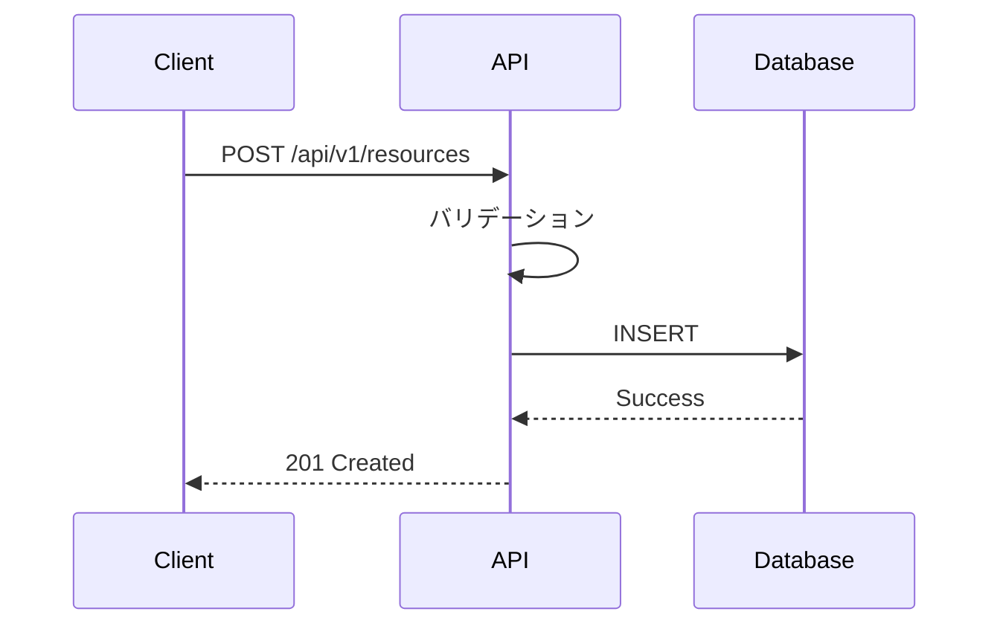

# [機能名] 仕様書

## 概要

[機能の目的と概要を1-2段落で説明]

## 前提条件

- [前提条件1]
- [前提条件2]
- 認証: [共通仕様の認証方式](../common/authentication.md)を参照

## データモデル

### エンティティ定義

```typescript
interface EntityName {
  id: string;          // UUID形式
  name: string;        // 名前（最大100文字）
  status: Status;      // ステータス
  createdAt: Date;     // 作成日時
  updatedAt: Date;     // 更新日時
}

type Status = 'active' | 'inactive' | 'deleted';
```

### 制約条件

| フィールド | 制約 |
|:-----------|:-----|
| `id` | UUID形式、必須 |
| `name` | 1-100文字、必須 |
| `status` | enum値のみ、デフォルト 'active' |

## API仕様

### エンドポイント一覧

| メソッド | パス | 概要 | 認証 |
|:---------|:-----|:-----|:----:|
| GET | `/api/v1/resources` | リソース一覧取得 | ○ |
| POST | `/api/v1/resources` | リソース作成 | ○ |
| GET | `/api/v1/resources/{id}` | リソース詳細取得 | ○ |

### POST /api/v1/resources

#### リクエスト

```json
{
  "name": "サンプルリソース",
  "description": "説明文"
}
```

#### レスポンス（成功: 201）

```json
{
  "id": "550e8400-e29b-41d4-a716-446655440000",
  "name": "サンプルリソース",
  "status": "active",
  "createdAt": "2025-01-15T10:30:00Z"
}
```

#### エラーレスポンス

| ステータス | コード | 説明 |
|:-----------|:-------|:-----|
| 400 | VALIDATION_ERROR | 入力値が不正 |
| 401 | UNAUTHORIZED | 認証が必要 |
| 500 | INTERNAL_ERROR | サーバーエラー |

## ワークフロー

### 処理フロー



### シーケンス図



## エラーハンドリング

| エラーコード | HTTP Status | 説明 | 対応方法 |
|:-------------|:------------|:-----|:---------|
| VALIDATION_ERROR | 400 | 入力値が不正 | リクエストを確認 |
| NOT_FOUND | 404 | リソースが存在しない | IDを確認 |
| INTERNAL_ERROR | 500 | サーバーエラー | リトライ後サポートに連絡 |

## セキュリティ考慮事項

- [ ] 入力値のサニタイズ
- [ ] 認証トークンの検証
- [ ] レート制限の適用

## 変更履歴

| バージョン | 日付 | 変更内容 |
|:-----------|:-----|:---------|
| 1.0.0 | YYYY-MM-DD | 初版作成 |

## 関連資料

- [要件定義書](../../00-requirements/xxx.md)
- [アーキテクチャ設計](../../10-architecture/xxx.md)
