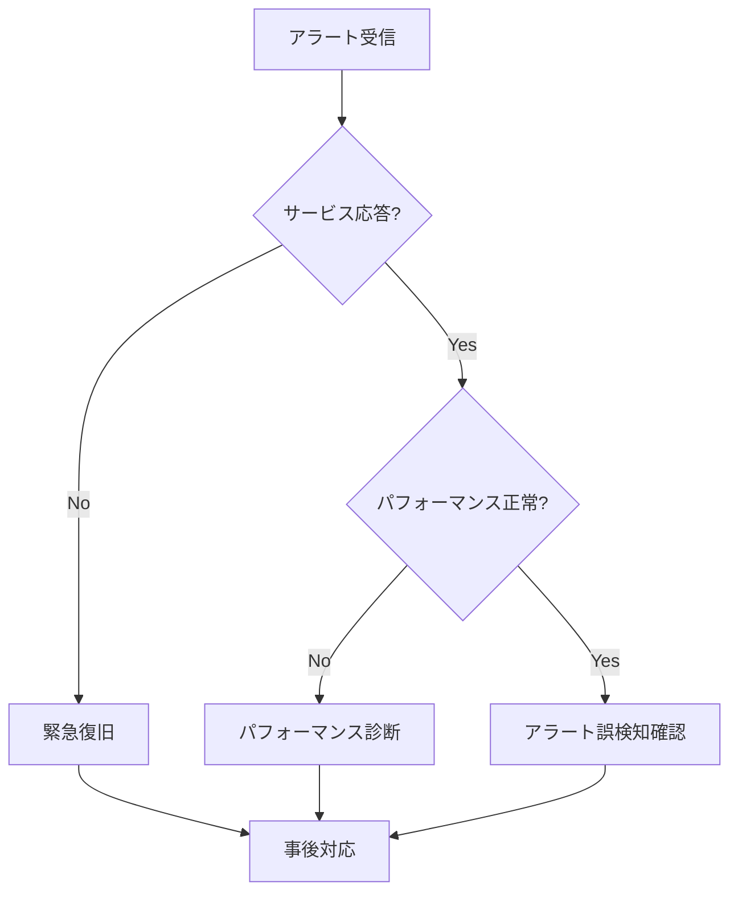

# インシデント対応: {{インシデントタイプ}}

## メタデータ

| 項目         | 値                           |
| ------------ | ---------------------------- |
| 最終更新日   | {{YYYY-MM-DD}}               |
| 担当者       | {{担当者名}}                 |
| 重大度       | {{Critical/High/Medium/Low}} |
| 想定所要時間 | {{約XX分}}                   |

---

## アラート情報

| 項目         | 値             |
| ------------ | -------------- |
| アラート名   | {{アラート名}} |
| トリガー条件 | {{条件}}       |
| 発生頻度     | {{頻度}}       |
| 影響サービス | {{サービス名}} |

---

## 初期対応（最初の5分）

### 1. 状況確認

```bash
# ダッシュボード確認
{{ダッシュボードURL}}

# 関連メトリクス確認
{{メトリクス確認コマンド}}
```

### 2. 影響範囲の特定

- [ ] 影響を受けるユーザー数を確認
- [ ] 影響を受けるサービス/機能を特定
- [ ] 他システムへの波及を確認

### 3. インシデント宣言

| 重大度判定基準                 | 判定     |
| ------------------------------ | -------- |
| ユーザー影響が{{閾値}}を超える | Critical |
| コア機能が停止                 | Critical |
| 一部機能が低下                 | High     |
| 軽微な影響                     | Medium   |

---

## 診断フロー



---

## 復旧手順

### Step 1: 影響最小化

**目的**: サービス影響を最小限に抑える

```bash
{{影響最小化コマンド}}
```

**期待される結果**: {{結果}}

### Step 2: 原因特定

**目的**: 根本原因を特定する

```bash
# ログ確認
{{ログ確認コマンド}}

# メトリクス確認
{{メトリクス確認コマンド}}
```

**確認ポイント**:

- [ ] エラーログの有無
- [ ] リソース使用状況
- [ ] 直近の変更

### Step 3: 復旧実行

**目的**: サービスを正常状態に復旧する

```bash
{{復旧コマンド}}
```

**期待される結果**: {{結果}}

### Step 4: 復旧確認

**目的**: サービスが正常に動作していることを確認

```bash
{{確認コマンド}}
```

**確認チェックリスト**:

- [ ] アラートが解消されている
- [ ] メトリクスが正常値に戻っている
- [ ] ユーザー影響が解消されている

---

## エスカレーション

### 即時エスカレーション条件

- [ ] サービス完全停止
- [ ] データ損失の可能性
- [ ] セキュリティインシデントの疑い
- [ ] {{時間}}以内に解決できない

### 連絡先

| 役割             | 担当者     | 連絡方法     |
| ---------------- | ---------- | ------------ |
| オンコール担当   | {{担当者}} | {{連絡方法}} |
| サービスオーナー | {{担当者}} | {{連絡方法}} |
| インシデント管理 | {{担当者}} | {{連絡方法}} |

---

## 事後対応

### インシデントクローズ条件

- [ ] アラートが解消
- [ ] サービスが正常動作
- [ ] ユーザー影響が解消
- [ ] 暫定対応が完了

### 必須アクション

1. [ ] インシデントレポート作成
2. [ ] タイムライン記録
3. [ ] 関係者への通知
4. [ ] ポストモーテム日程調整

### ポストモーテム項目

- 発生原因の詳細分析
- 対応の振り返り
- 再発防止策の検討
- ランブックの改善点

---

## 関連リンク

- アラート設定: {{URL}}
- ダッシュボード: {{URL}}
- インシデント管理ツール: {{URL}}
- 関連ランブック: {{リンク}}

---

## 変更履歴

| バージョン | 日付     | 変更者     | 変更内容 |
| ---------- | -------- | ---------- | -------- |
| v1.0.0     | {{日付}} | {{担当者}} | 初版作成 |
