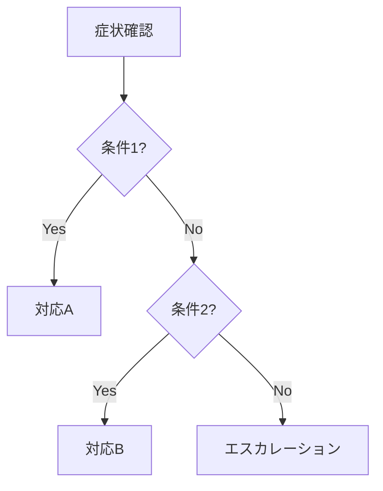

# ランブック: {{タイトル}}

## メタデータ

| 項目         | 値             |
| ------------ | -------------- |
| 最終更新日   | {{YYYY-MM-DD}} |
| 担当者       | {{担当者名}}   |
| レビュー日   | {{YYYY-MM-DD}} |
| バージョン   | v1.0.0         |
| 想定所要時間 | {{約XX分}}     |

---

## 目的

{{このランブックの目的を1-2文で明確に記述する}}

---

## 適用条件

このランブックを使用するのは以下の場合：

- {{条件1：具体的な判断基準を記載（例：アラート○○が5分以上継続）}}
- {{条件2：数値や状態で判断可能な条件}}
- {{条件3：必要に応じて追加}}

**使用しない場合**:

- {{除外条件1}}
- {{除外条件2}}

---

## 前提条件

### 必要なアクセス権限

- [ ] {{権限1：例：本番環境へのSSHアクセス}}
- [ ] {{権限2：例：データベースのread/write権限}}
- [ ] {{権限3}}

### 必要なツール

- {{ツール1：例：kubectl v1.25以上}}
- {{ツール2：例：psql 14以上}}

### 必要な知識

- {{知識1：例：Kubernetesの基本操作}}
- {{知識2}}

---

## 診断フロー



---

## 手順

### Step 1: {{ステップタイトル}}

**目的**: {{このステップで達成すること}}

**実行コマンド**:

```bash
{{実際に動作するコマンドを記載}}
```

**期待される結果**:

```
{{正常時の出力例}}
```

**異常時の対応**:

- エラー「{{エラー内容}}」の場合: {{対処法}}
- タイムアウトの場合: {{対処法}}

---

### Step 2: {{ステップタイトル}}

**目的**: {{このステップで達成すること}}

**実行コマンド**:

```bash
{{コマンド}}
```

**期待される結果**:

```
{{正常時の出力例}}
```

**異常時の対応**:

- {{エラーパターン}}: {{対処法}}

---

### Step 3: {{ステップタイトル}}

{{以下同様に続ける}}

---

## ロールバック手順

この手順で問題が発生した場合のロールバック方法：

### ロールバック Step 1: {{タイトル}}

```bash
{{ロールバックコマンド}}
```

### ロールバック Step 2: {{タイトル}}

```bash
{{ロールバックコマンド}}
```

---

## エスカレーション

### エスカレーション基準

| 条件                     | エスカレートする |
| ------------------------ | ---------------- |
| 手順完了後も問題継続     | ✅               |
| {{時間}}以上解決しない   | ✅               |
| 影響範囲が{{条件}}を超過 | ✅               |
| 判断に迷う場合           | ✅               |

### 連絡先

| 役割     | 担当者     | 連絡方法           | 備考       |
| -------- | ---------- | ------------------ | ---------- |
| 一次対応 | {{担当者}} | Slack: {{channel}} | 営業時間内 |
| 二次対応 | {{担当者}} | 電話: {{番号}}     | 緊急時     |
| 管理者   | {{担当者}} | {{連絡方法}}       | 重大障害時 |

### エスカレーション時の伝達事項

1. インシデント発生時刻
2. 現在の症状
3. 実施した対応と結果
4. 影響範囲
5. 緊急度の判断

---

## トラブルシューティング

### よくある問題と対処法

| 問題      | 原因     | 対処法     |
| --------- | -------- | ---------- |
| {{問題1}} | {{原因}} | {{対処法}} |
| {{問題2}} | {{原因}} | {{対処法}} |
| {{問題3}} | {{原因}} | {{対処法}} |

---

## 関連リンク

- ダッシュボード: {{URL}}
- アラート設定: {{URL}}
- 関連ランブック: {{リンク}}
- システム構成図: {{リンク}}

---

## 変更履歴

| バージョン | 日付     | 変更者     | 変更内容 |
| ---------- | -------- | ---------- | -------- |
| v1.0.0     | {{日付}} | {{担当者}} | 初版作成 |
