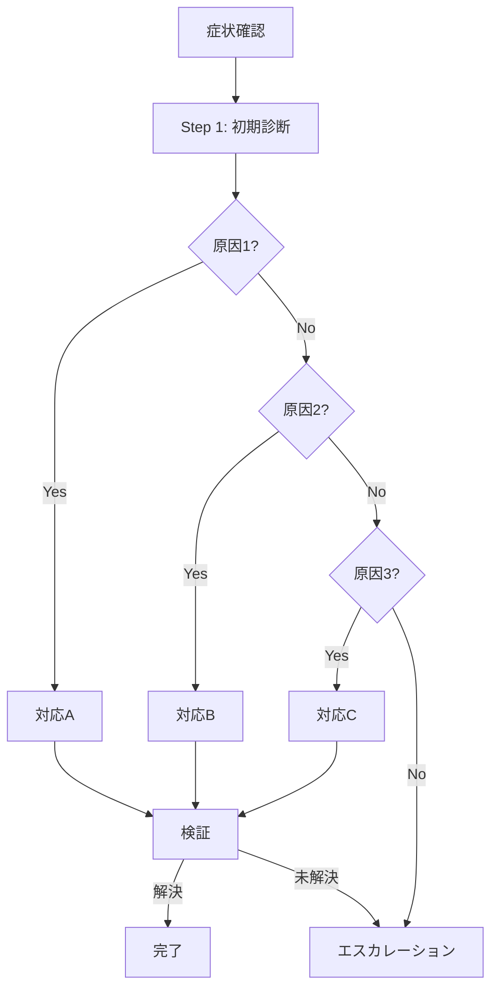

# トラブルシューティング: {{症状/問題名}}

## メタデータ

| 項目         | 値             |
| ------------ | -------------- |
| 最終更新日   | {{YYYY-MM-DD}} |
| 担当者       | {{担当者名}}   |
| 対象システム | {{システム名}} |
| 想定所要時間 | {{約XX分}}     |

---

## 症状

### 観察される症状

- {{症状1：具体的に記述}}
- {{症状2}}
- {{症状3}}

### ユーザー影響

- {{影響1：例：ログインできない}}
- {{影響2}}

### 関連アラート

- {{アラート1}}
- {{アラート2}}

---

## 原因候補

| 優先度 | 原因候補  | 確認方法              | 対応手順           |
| ------ | --------- | --------------------- | ------------------ |
| 1      | {{原因1}} | {{確認コマンド/手順}} | → Step 3A          |
| 2      | {{原因2}} | {{確認コマンド/手順}} | → Step 3B          |
| 3      | {{原因3}} | {{確認コマンド/手順}} | → Step 3C          |
| 4      | {{原因4}} | {{確認コマンド/手順}} | → エスカレーション |

---

## 診断フロー



---

## 診断手順

### Step 1: 初期診断

**目的**: 症状の詳細を把握し、原因を絞り込む

```bash
# システム状態確認
{{状態確認コマンド}}

# ログ確認
{{ログ確認コマンド}}

# メトリクス確認
{{メトリクス確認コマンド}}
```

**確認ポイント**:

| 項目          | 正常値     | 確認結果 |
| ------------- | ---------- | -------- |
| {{確認項目1}} | {{正常値}} | [ ]      |
| {{確認項目2}} | {{正常値}} | [ ]      |
| {{確認項目3}} | {{正常値}} | [ ]      |

### Step 2: 原因特定

**目的**: 具体的な原因を特定する

#### 原因1の確認: {{原因名}}

```bash
{{確認コマンド}}
```

**判定基準**:

- 正常: {{正常時の結果}}
- 異常: {{異常時の結果}} → Step 3A へ

#### 原因2の確認: {{原因名}}

```bash
{{確認コマンド}}
```

**判定基準**:

- 正常: {{正常時の結果}}
- 異常: {{異常時の結果}} → Step 3B へ

#### 原因3の確認: {{原因名}}

```bash
{{確認コマンド}}
```

**判定基準**:

- 正常: {{正常時の結果}}
- 異常: {{異常時の結果}} → Step 3C へ

---

## 対応手順

### Step 3A: {{原因1}}への対応

**原因**: {{原因の詳細説明}}

```bash
{{対応コマンド}}
```

**期待される結果**:

```
{{正常時の出力}}
```

**解決確認**:

```bash
{{確認コマンド}}
```

---

### Step 3B: {{原因2}}への対応

**原因**: {{原因の詳細説明}}

```bash
{{対応コマンド}}
```

**期待される結果**:

```
{{正常時の出力}}
```

---

### Step 3C: {{原因3}}への対応

**原因**: {{原因の詳細説明}}

```bash
{{対応コマンド}}
```

**期待される結果**:

```
{{正常時の出力}}
```

---

## エスカレーション

### エスカレーション条件

- [ ] 上記の対応で解決しない
- [ ] 原因が特定できない
- [ ] {{時間}}以上経過

### 連絡先

| 役割       | 担当者     | 連絡方法     |
| ---------- | ---------- | ------------ |
| 専門担当   | {{担当者}} | {{連絡方法}} |
| オンコール | {{担当者}} | {{連絡方法}} |

### エスカレーション時の情報

エスカレーション時は以下を伝えること：

1. 症状の詳細
2. 実施した診断結果
3. 試した対応と結果
4. 影響範囲

---

## よくある間違いと注意点

| よくある間違い | 正しい対応     |
| -------------- | -------------- |
| {{間違い1}}    | {{正しい対応}} |
| {{間違い2}}    | {{正しい対応}} |
| {{間違い3}}    | {{正しい対応}} |

---

## 関連リンク

- ログ検索: {{URL}}
- メトリクスダッシュボード: {{URL}}
- システム構成図: {{URL}}
- 関連ランブック: {{リンク}}

---

## 変更履歴

| バージョン | 日付     | 変更者     | 変更内容 |
| ---------- | -------- | ---------- | -------- |
| v1.0.0     | {{日付}} | {{担当者}} | 初版作成 |
