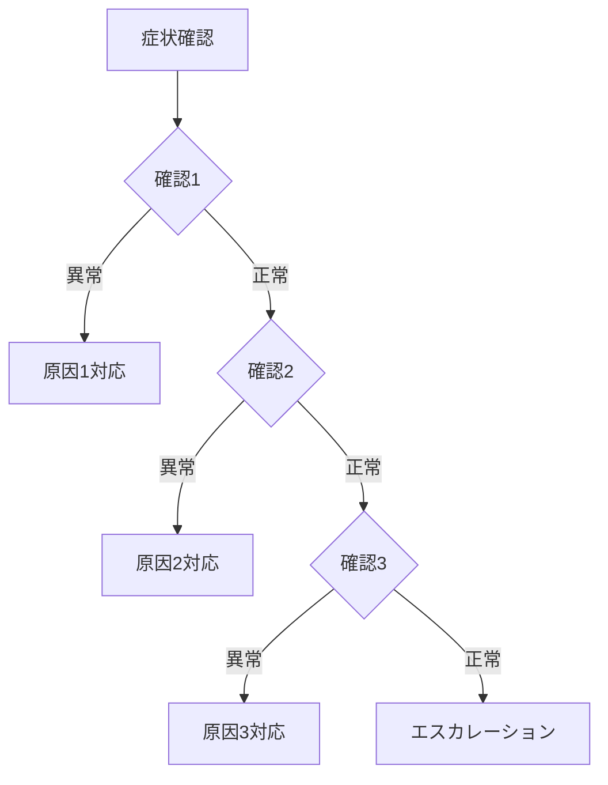

# ランブックパターン集

> **読込条件**: Task 3（ランブック作成）実行時

---

## 1. パターンカタログ

### 1.1 インシデント対応パターン

| パターン名   | 用途                         |
| ------------ | ---------------------------- |
| アラート対応 | 特定アラートへの標準対応     |
| 障害切り分け | 原因特定のための診断手順     |
| 緊急復旧     | 最速でサービス復旧させる手順 |
| 影響範囲確認 | 障害の影響範囲を特定する手順 |

### 1.2 運用パターン

| パターン名   | 用途                                |
| ------------ | ----------------------------------- |
| デプロイ手順 | アプリケーションデプロイの手順      |
| スケーリング | リソースのスケールアップ/ダウン手順 |
| バックアップ | バックアップ取得の手順              |
| メンテナンス | 計画メンテナンスの手順              |

---

## 2. アラート対応パターン

### 2.1 構造

```markdown
# アラート対応: {{アラート名}}

## アラート情報

| 項目         | 値                        |
| ------------ | ------------------------- |
| アラート名   | {{アラート名}}            |
| 重大度       | {{Critical/Warning/Info}} |
| トリガー条件 | {{条件}}                  |
| 発生頻度     | {{頻度}}                  |

## 対応フロー

1. **アラート確認**
   - ダッシュボード: {{URL}}
   - 関連メトリクス: {{メトリクス}}

2. **初期診断**
   - {{診断手順1}}
   - {{診断手順2}}

3. **対応実行**
   - {{対応手順}}

4. **確認**
   - アラート解消を確認
   - サービス正常性を確認

## エスカレーション

- 15分で解消しない場合: {{連絡先}}
```

### 2.2 適用例

- CPU使用率アラート
- メモリ使用率アラート
- ディスク容量アラート
- APIレスポンス時間アラート
- エラーレートアラート

---

## 3. 障害切り分けパターン

### 3.1 構造

````markdown
# 障害切り分け: {{症状}}

## 症状

- {{観察された症状1}}
- {{観察された症状2}}

## 原因候補

| 原因候補  | 確認方法              | 対応ランブック       |
| --------- | --------------------- | -------------------- |
| {{原因1}} | {{確認コマンド/手順}} | {{ランブックリンク}} |
| {{原因2}} | {{確認コマンド/手順}} | {{ランブックリンク}} |
| {{原因3}} | {{確認コマンド/手順}} | {{ランブックリンク}} |

## 診断フロー


````

## 診断コマンド集

### 確認1: {{確認項目}}

```bash
{{確認コマンド}}
```

期待結果: {{正常時の結果}}
異常判定: {{異常判定基準}}

````

---

## 4. 緊急復旧パターン

### 4.1 構造

```markdown
# 緊急復旧: {{対象システム}}

## 適用条件

このランブックを使用するのは以下の場合：
- {{条件1：サービス完全停止}}
- {{条件2：重大な機能障害}}

## 前提条件

- [ ] 本番環境へのアクセス権限
- [ ] 復旧判断権限（または承認取得済み）
- [ ] 関係者への通知完了

## 復旧手順（最速パス）

### Step 1: 状況確認（目安: 2分）

```bash
{{状況確認コマンド}}
````

### Step 2: 緊急対応実行（目安: 5分）

```bash
{{復旧コマンド}}
```

### Step 3: 復旧確認（目安: 3分）

```bash
{{確認コマンド}}
```

## ロールバック

復旧操作が状況を悪化させた場合：

```bash
{{ロールバックコマンド}}
```

## 事後対応

- [ ] インシデントレポート作成
- [ ] 根本原因分析（RCA）
- [ ] 再発防止策検討

````

---

## 5. デプロイ手順パターン

### 5.1 構造

```markdown
# デプロイ手順: {{アプリケーション名}}

## 事前確認

- [ ] デプロイ対象バージョン: {{バージョン}}
- [ ] 変更内容の確認
- [ ] テスト完了確認
- [ ] ロールバック計画確認

## デプロイ手順

### Phase 1: 準備

1. メンテナンスモード有効化
2. バックアップ取得
3. デプロイ準備確認

### Phase 2: デプロイ実行

1. アプリケーションデプロイ
2. 設定適用
3. サービス再起動

### Phase 3: 確認

1. ヘルスチェック
2. 機能確認
3. メトリクス確認

### Phase 4: 完了

1. メンテナンスモード解除
2. 関係者通知

## ロールバック手順

緊急時のロールバック：
```bash
{{ロールバックコマンド}}
````

## チェックリスト

| 確認項目       | 確認者 | 確認結果 |
| -------------- | ------ | -------- |
| デプロイ完了   |        | [ ]      |
| ヘルスチェック |        | [ ]      |
| 機能確認       |        | [ ]      |

````

---

## 6. スケーリングパターン

### 6.1 構造

```markdown
# スケーリング: {{対象リソース}}

## 適用条件

### スケールアップ条件
- CPU使用率 > 80% が10分以上継続
- メモリ使用率 > 85%
- リクエストキュー長 > 100

### スケールダウン条件
- CPU使用率 < 30% が30分以上継続
- コスト最適化の必要性

## スケールアップ手順

### Step 1: 現状確認
```bash
{{現状確認コマンド}}
````

### Step 2: スケールアップ実行

```bash
{{スケールアップコマンド}}
```

### Step 3: 確認

```bash
{{確認コマンド}}
```

## スケールダウン手順

### Step 1: 負荷確認

### Step 2: スケールダウン実行

### Step 3: 確認

## 注意事項

- スケールダウン時はドレイン処理を実施
- 自動スケーリング設定との整合性確認

```

---

## 7. パターン選択ガイド

| 状況                       | 推奨パターン             |
| -------------------------- | ------------------------ |
| アラート発生時             | アラート対応パターン     |
| 原因不明の障害             | 障害切り分けパターン     |
| サービス停止時             | 緊急復旧パターン         |
| リリース時                 | デプロイ手順パターン     |
| 負荷対応時                 | スケーリングパターン     |
| 定期メンテナンス           | メンテナンスパターン     |

---

## 関連リソース

- **基礎概念**: See [Level1_basics.md](Level1_basics.md)
- **構造パターン**: See [Level2_intermediate.md](Level2_intermediate.md)
- **テンプレート**: See [../assets/](../assets/)
```
