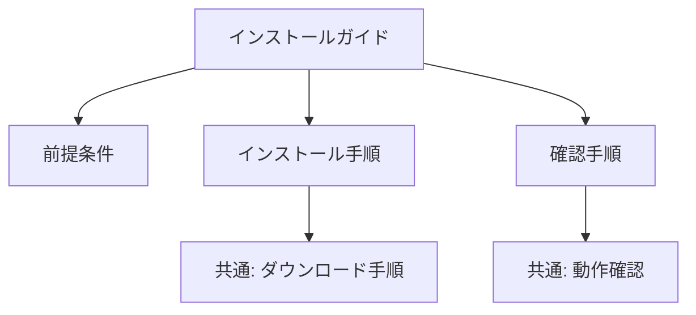

# モジュラー設計

## 概要

文書をモジュール（再利用可能な部品）として設計し、保守性と一貫性を高める手法です。

## 設計原則

### 1. 単一責任

各モジュールは1つの明確な目的を持ちます。

```
✅ 良い設計
├── install-prerequisites.md（前提条件のインストール）
├── install-application.md（アプリケーションのインストール）
└── verify-installation.md（インストールの確認）

❌ 悪い設計
└── install-everything.md（すべてを1つに）
```

### 2. 疎結合

モジュール間の依存を最小化します。

```markdown
✅ 疎結合
「OAuth認証を使用するには、[OAuth設定](./configure-oauth.md)を完了してください。」

❌ 密結合
「前のセクションで設定したクライアントIDを使用して...」
```

### 3. 高凝集

関連する情報を1つのモジュールにまとめます。

```markdown
✅ 高凝集: 認証設定

- 認証方式の選択
- 認証情報の設定
- 認証のテスト

❌ 低凝集: 設定

- 認証の設定
- データベースの設定
- ログの設定
  （無関係な項目の混在）
```

## モジュール構造

### ディレクトリ構造

```
docs/
├── _shared/                    # 共通モジュール
│   ├── snippets/               # 再利用可能なテキスト断片
│   │   ├── api-base-url.md
│   │   └── support-contact.md
│   ├── warnings/               # 警告・注意文
│   │   ├── backup-warning.md
│   │   └── production-warning.md
│   └── procedures/             # 共通手順
│       ├── login-steps.md
│       └── logout-steps.md
├── concepts/                   # 概念トピック
├── tasks/                      # タスクトピック
├── reference/                  # リファレンストピック
└── guides/                     # 組み立てたガイド
```

### モジュールの命名規則

| タイプ    | パターン               | 例                   |
| :-------- | :--------------------- | :------------------- |
| Concept   | `what-is-{topic}.md`   | `what-is-oauth.md`   |
| Task      | `{verb}-{object}.md`   | `configure-oauth.md` |
| Reference | `{topic}-reference.md` | `api-reference.md`   |
| Snippet   | `{topic}.md`           | `api-base-url.md`    |

## 再利用パターン

### スニペット（短い断片）

```markdown
<!-- _shared/snippets/api-base-url.md -->

`https://api.example.com/v1`

<!-- 使用箇所 -->

APIのベースURLは {{include:_shared/snippets/api-base-url.md}} です。
```

### 手順モジュール（手順の集合）

```markdown
<!-- _shared/procedures/login-steps.md -->

1. ブラウザで https://app.example.com を開く
2. ユーザー名とパスワードを入力
3. **ログイン**をクリック

<!-- 使用箇所 -->

## ログイン手順

{{include:_shared/procedures/login-steps.md}}
```

### 条件付きモジュール

```markdown
<!-- 環境別の設定を切り替え -->

{{if env="production"}}
{{include:_shared/config/production-settings.md}}
{{else}}
{{include:_shared/config/development-settings.md}}
{{/if}}
```

## 粒度の決定

### 適切な粒度の判断基準

| 基準     | 分割する         | 統合する        |
| :------- | :--------------- | :-------------- |
| 再利用   | 複数箇所で使用   | 1箇所のみで使用 |
| 更新頻度 | 異なる頻度で更新 | 同時に更新      |
| 対象読者 | 異なる読者       | 同じ読者        |
| 文脈     | 独立して理解可能 | 文脈が必要      |

### 粒度の例

```
粗すぎる:
└── complete-guide.md（1000行）

適切:
├── introduction.md（50行）
├── installation/
│   ├── prerequisites.md（30行）
│   ├── install-linux.md（40行）
│   └── install-windows.md（40行）
└── configuration.md（80行）

細かすぎる:
├── step-1.md（5行）
├── step-2.md（5行）
├── step-3.md（5行）
...
```

## 依存関係の管理

### 依存グラフ



### 循環依存の回避

```
❌ 循環依存
A.md → B.md を参照
B.md → A.md を参照

✅ 依存の方向を統一
概念 ← タスク ← リファレンス
（タスクは概念を参照、リファレンスはタスクを参照）
```

## バージョン管理

### モジュールのバージョニング

```yaml
---
module: install-guide
version: 2.1.0
min-compatible: 2.0.0
---
```

### 変更影響の追跡

```
モジュールAを変更した場合の影響:
- 使用箇所: guide-1.md, guide-2.md, guide-3.md
- 影響範囲: 3ファイル
- テスト必要: はい
```
