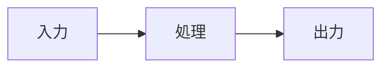

# [概念名]

## 概要

[概念の簡潔な定義を1-2文で記述]

## なぜ重要か

[この概念が重要である理由を説明]

- [重要な理由1]
- [重要な理由2]
- [重要な理由3]

## 主要な構成要素

### [構成要素1]

[構成要素1の説明]

### [構成要素2]

[構成要素2の説明]

### [構成要素3]

[構成要素3の説明]

## 仕組み

[概念がどのように機能するかを説明]



## 例

### 基本的な例

[シンプルな具体例を示す]

```
[コード例やサンプル]
```

### 実践的な例

[より実践的な例を示す]

## ベストプラクティス

| すべきこと | 避けるべきこと |
|:-----------|:---------------|
| [推奨事項1] | [非推奨事項1] |
| [推奨事項2] | [非推奨事項2] |
| [推奨事項3] | [非推奨事項3] |

## 関連概念

- [関連概念1](./related-concept-1.md) - [簡潔な説明]
- [関連概念2](./related-concept-2.md) - [簡潔な説明]

## 次のステップ

この概念を理解したら:

- [実際に試す: タスクへのリンク](../tasks/try-this.md)
- [詳細を学ぶ: 別の概念へのリンク](./advanced-concept.md)
- [リファレンスを確認: 仕様へのリンク](../reference/specification.md)
