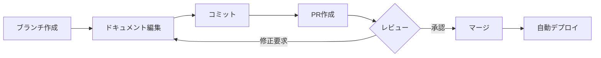

# Documentation as Codeプラクティス

## 概要

Documentation as Codeは、ドキュメントをソースコードと同様に扱い、バージョン管理、レビュー、自動化を適用するアプローチです。

## 基本原則

### 1. プレーンテキスト形式
- Markdown、reStructuredText、AsciiDoc
- バイナリ形式（Word、PDF）を避ける
- Git diffで変更が追跡可能

### 2. バージョン管理
- Gitでドキュメントを管理
- ブランチ戦略の適用
- コミットメッセージの規約

### 3. レビュープロセス
- Pull Requestでのレビュー
- 承認ワークフロー
- コメントによるフィードバック

### 4. 自動化
- CIによる構文チェック
- 自動ビルド・デプロイ
- リンク切れ検出

## ツールチェーン

### Linting
| ツール | 用途 |
|:-------|:-----|
| markdownlint | Markdown構文チェック |
| textlint | 日本語文章校正 |
| vale | 文体・スタイルチェック |

### ビルド
| ツール | 用途 |
|:-------|:-----|
| MkDocs | 静的サイト生成 |
| Docusaurus | React製ドキュメントサイト |
| VitePress | Vue製ドキュメントサイト |

### CI/CD
```yaml
# .github/workflows/docs.yml
name: Documentation
on: [push, pull_request]
jobs:
  lint:
    runs-on: ubuntu-latest
    steps:
      - uses: actions/checkout@v4
      - run: npx markdownlint docs/**/*.md
  build:
    runs-on: ubuntu-latest
    steps:
      - uses: actions/checkout@v4
      - run: pnpm run docs:build
```

## ディレクトリ構造

```
docs/
├── 00-requirements/     # 要件定義
├── 10-architecture/     # アーキテクチャ
├── 20-specifications/   # 詳細仕様
│   ├── common/          # 共通定義
│   ├── features/        # 機能仕様
│   └── api/             # API仕様
└── 30-guides/           # 開発ガイド
```

## ワークフロー



## ベストプラクティス

### すべきこと
- コードと同じリポジトリで管理
- 小さな単位でコミット
- 意味のあるコミットメッセージ
- レビューを必須化

### 避けるべきこと
- ドキュメント専用リポジトリの分離
- 大きな変更の一括コミット
- レビューなしのマージ
- 手動デプロイ

## 導入ステップ

1. **Markdownへの移行**
   - 既存ドキュメントを変換
   - テンプレートを作成

2. **バージョン管理の設定**
   - Git初期化
   - .gitignoreの設定

3. **CI/CDの構築**
   - Lintの自動実行
   - ビルドの自動化

4. **レビュープロセスの確立**
   - PRテンプレート作成
   - レビュアー設定
