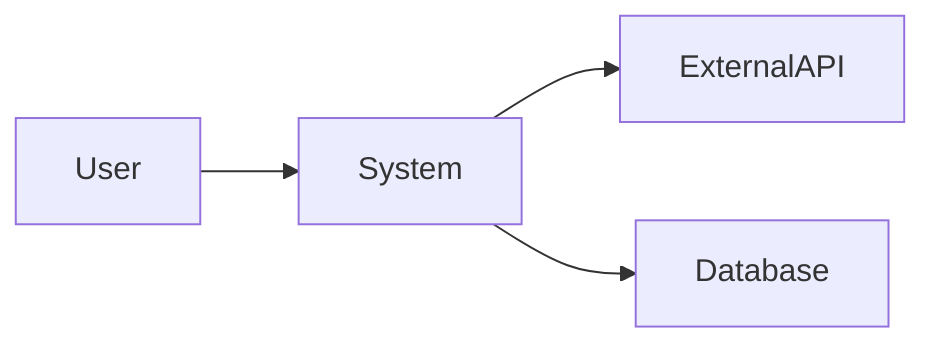

# [システム名] ソフトウェア要件仕様書 (SRS)

## 1. はじめに

### 1.1 目的

本文書は、[システム名]のソフトウェア要件を定義します。
対象読者: [開発者、テスター、プロジェクトマネージャー]

### 1.2 スコープ

[システムの範囲と境界を説明]

- 含まれる機能: [機能A、機能B]
- 含まれない機能: [機能X、機能Y]

### 1.3 定義・略語

| 用語    | 定義   |
| :------ | :----- |
| [用語1] | [定義] |
| [用語2] | [定義] |

### 1.4 参考資料

- [参考資料1]
- [参考資料2]

## 2. 全体説明

### 2.1 製品の視点

[システムの全体像、外部システムとの関係]

### 2.2 製品の機能

| 機能ID | 機能名   | 概要   |
| :----- | :------- | :----- |
| F-001  | [機能名] | [概要] |
| F-002  | [機能名] | [概要] |

### 2.3 ユーザー特性

| ユーザータイプ | 特性   | 技術レベル |
| :------------- | :----- | :--------- |
| 一般ユーザー   | [特性] | 低         |
| 管理者         | [特性] | 中         |

### 2.4 制約条件

- 技術制約: [制約1]
- ビジネス制約: [制約2]
- 法的制約: [制約3]

### 2.5 前提と依存関係

- 前提: [前提1]
- 依存: [依存1]

## 3. 詳細要件

### 3.1 機能要件

#### REQ-001: [要件名]

**説明**: [要件の詳細説明]

**入力**:
| パラメータ | 型 | 必須 | 制約 |
|:-----------|:---|:----:|:-----|
| [param1] | string | ○ | 最大100文字 |

**出力**:
| フィールド | 型 | 説明 |
|:-----------|:---|:-----|
| [field1] | string | [説明] |

**処理**:

1. [処理ステップ1]
2. [処理ステップ2]

**エラー条件**:
| 条件 | エラーコード | メッセージ |
|:-----|:-------------|:-----------|
| [条件1] | E001 | [メッセージ] |

### 3.2 外部インターフェース要件

#### 3.2.1 ユーザーインターフェース

- [UI要件1]

#### 3.2.2 ハードウェアインターフェース

- [HW要件1]

#### 3.2.3 ソフトウェアインターフェース

- [SW要件1]

### 3.3 性能要件

| 要件ID | 項目             | 目標値    | 測定条件        |
| :----- | :--------------- | :-------- | :-------------- |
| P-001  | レスポンスタイム | 200ms以下 | 同時100ユーザー |
| P-002  | スループット     | 1000req/s | ピーク時        |

### 3.4 セキュリティ要件

| 要件ID | 項目 | 要件   |
| :----- | :--- | :----- |
| S-001  | 認証 | [要件] |
| S-002  | 認可 | [要件] |

### 3.5 品質属性

| 属性   | 目標   |
| :----- | :----- |
| 可用性 | 99.9%  |
| 保守性 | [目標] |

## 4. 変更履歴

| バージョン | 日付       | 変更者  | 変更内容 |
| :--------- | :--------- | :------ | :------- |
| 1.0.0      | YYYY-MM-DD | @author | 初版作成 |
