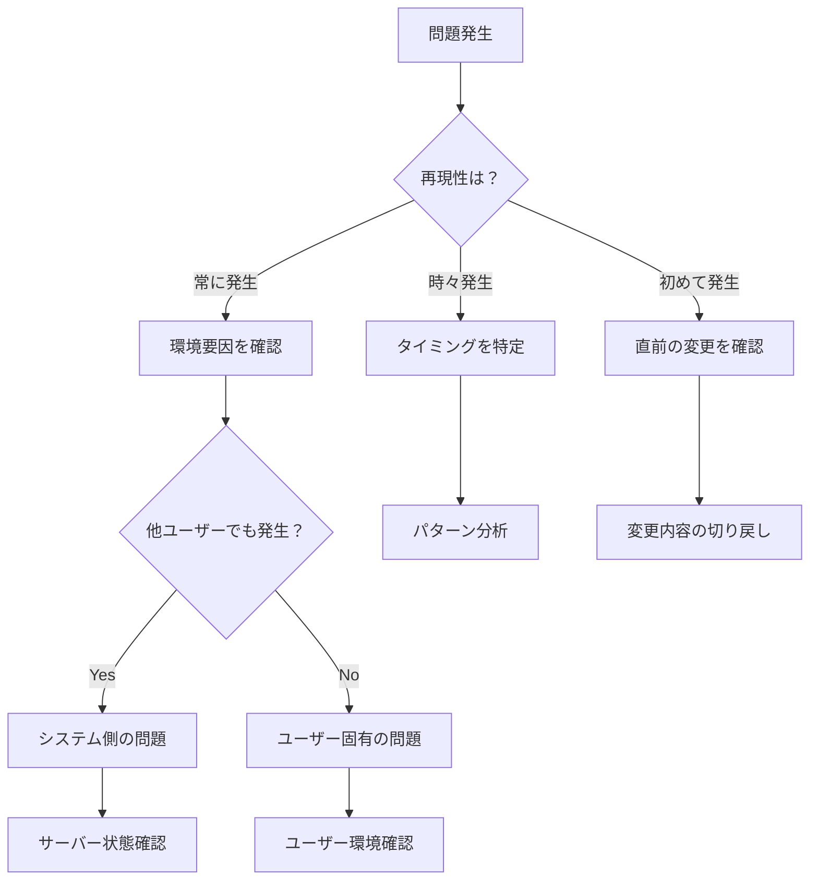

# 問題分類ガイド

## 概要

このガイドは、ユーザーが報告する問題を効果的に分類し、
適切な解決策に誘導するためのフレームワークを提供します。

## 問題分類の階層

### 第1階層: 問題タイプ

```
すべての問題
├── 接続・通信の問題
├── 認証・権限の問題
├── データ・コンテンツの問題
├── 操作・機能の問題
├── パフォーマンスの問題
└── 表示・UIの問題
```

### 第2階層: 具体的なカテゴリ

#### 接続・通信の問題

| カテゴリ             | 症状例                       | よくある原因                       |
| -------------------- | ---------------------------- | ---------------------------------- |
| ネットワーク接続不可 | 「サーバーに接続できません」 | ネットワーク障害、ファイアウォール |
| タイムアウト         | 「時間切れになりました」     | 低速回線、サーバー高負荷           |
| 同期エラー           | 「同期に失敗しました」       | 競合、ネットワーク不安定           |

#### 認証・権限の問題

| カテゴリ       | 症状例                       | よくある原因                     |
| -------------- | ---------------------------- | -------------------------------- |
| ログイン失敗   | 「ログインできません」       | 認証情報誤り、アカウントロック   |
| 権限不足       | 「アクセス権限がありません」 | ロール設定、グループ未所属       |
| セッション切れ | 「再ログインが必要です」     | タイムアウト、他デバイスログイン |

#### データ・コンテンツの問題

| カテゴリ           | 症状例                       | よくある原因               |
| ------------------ | ---------------------------- | -------------------------- |
| データ表示されない | 「データがありません」       | フィルター、権限、削除済み |
| データ不整合       | 「データが正しくありません」 | 同期遅延、キャッシュ       |
| ファイル問題       | 「ファイルを開けません」     | 形式不対応、破損           |

#### 操作・機能の問題

| カテゴリ           | 症状例                   | よくある原因             |
| ------------------ | ------------------------ | ------------------------ |
| 操作が反映されない | 「保存できません」       | 入力エラー、制限超過     |
| 機能が動作しない   | 「ボタンが反応しません」 | ブラウザ、JavaScript無効 |
| 予期しない動作     | 「期待と違う結果に」     | 設定ミス、仕様理解不足   |

#### パフォーマンスの問題

| カテゴリ     | 症状例                     | よくある原因             |
| ------------ | -------------------------- | ------------------------ |
| 読み込み遅延 | 「表示が遅いです」         | 大量データ、ネットワーク |
| 処理遅延     | 「処理に時間がかかります」 | 複雑な処理、リソース不足 |
| フリーズ     | 「画面が固まりました」     | メモリ不足、無限ループ   |

#### 表示・UIの問題

| カテゴリ       | 症状例                         | よくある原因        |
| -------------- | ------------------------------ | ------------------- |
| レイアウト崩れ | 「画面が崩れています」         | ブラウザ互換性、CSS |
| 文字化け       | 「文字が正しく表示されません」 | エンコーディング    |
| 画像表示不可   | 「画像が表示されません」       | パス誤り、権限      |

## 診断フロー設計

### 基本診断フロー



### 問題切り分けチェックリスト

```markdown
## 問題切り分けチェックリスト

### 環境確認

- [ ] 別のブラウザで試しましたか？
- [ ] ブラウザのキャッシュをクリアしましたか？
- [ ] 別のネットワーク（例：モバイル回線）で試しましたか？
- [ ] 別のデバイスで試しましたか？

### 再現性確認

- [ ] 問題は常に発生しますか？
- [ ] 特定の操作後に発生しますか？
- [ ] 特定の時間帯に発生しますか？

### 範囲確認

- [ ] 同じ問題を他のユーザーも経験していますか？
- [ ] 特定のデータ/ファイルでのみ発生しますか？
- [ ] 特定の機能でのみ発生しますか？
```

## エラーコード体系

### コード設計原則

1. **一意性**: 各エラーに固有のコードを割り当て
2. **分類可能性**: コード範囲で問題タイプを識別
3. **拡張性**: 将来のエラー追加に対応
4. **可読性**: ある程度意味が推測できる

### コード範囲定義

```
1000-1999: バリデーションエラー
  1000-1099: 入力形式エラー
  1100-1199: 必須項目エラー
  1200-1299: 範囲エラー
  1300-1399: 整合性エラー

2000-2999: ビジネスエラー
  2000-2099: 認証エラー
  2100-2199: 権限エラー
  2200-2299: リソースエラー
  2300-2399: 状態エラー

3000-3999: 外部サービスエラー
  3000-3099: 接続エラー
  3100-3199: タイムアウト
  3200-3299: レート制限
  3300-3399: サービス障害

4000-4999: インフラエラー
  4000-4099: データベースエラー
  4100-4199: ストレージエラー
  4200-4299: ネットワークエラー

5000-5999: 内部エラー
  5000-5099: 未処理例外
  5100-5199: 設定エラー
  5200-5299: 実装バグ
```

## 重要度・緊急度マトリクス

### 分類基準

| 重要度 | 影響範囲       | 業務影響 |
| ------ | -------------- | -------- |
| 高     | 多数のユーザー | 業務停止 |
| 中     | 一部のユーザー | 業務遅延 |
| 低     | 個別ユーザー   | 不便     |

| 緊急度 | 対応時間   | 例             |
| ------ | ---------- | -------------- |
| 即時   | 1時間以内  | システム全停止 |
| 急     | 4時間以内  | 主要機能停止   |
| 通常   | 24時間以内 | 一部機能不具合 |
| 低     | 1週間以内  | 軽微な問題     |

### 対応優先度マトリクス

|                | 緊急度：高     | 緊急度：中     | 緊急度：低       |
| -------------- | -------------- | -------------- | ---------------- |
| **重要度：高** | P1（即時対応） | P2（優先対応） | P3（通常対応）   |
| **重要度：中** | P2（優先対応） | P3（通常対応） | P4（計画対応）   |
| **重要度：低** | P3（通常対応） | P4（計画対応） | P5（余裕時対応） |

## エスカレーションフロー

```
ユーザー自己解決
    ↓ (解決しない場合)
Level 1: FAQ/ドキュメント参照
    ↓ (解決しない場合)
Level 2: チャットボット/自動応答
    ↓ (解決しない場合)
Level 3: ヘルプデスク（一般サポート）
    ↓ (解決しない場合)
Level 4: 技術サポート
    ↓ (解決しない場合)
Level 5: 開発チーム
```

## 問題レポートテンプレート

```markdown
## 問題レポート

### 基本情報

- **報告日時**:
- **報告者**:
- **問題ID**:

### 問題の説明

[問題の概要を記述]

### 再現手順

1.
2.
3.

### 期待される動作

[本来どうあるべきか]

### 実際の動作

[実際に何が起こったか]

### 環境情報

- ブラウザ:
- OS:
- 画面解像度:

### スクリーンショット/エラーログ

[添付]

### 影響範囲

- ユーザー数:
- 業務影響:
```
