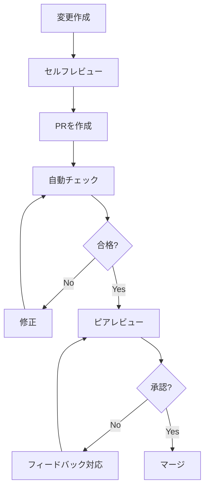

# レビューワークフロー

## 概要

文書変更のレビュープロセスを標準化し、品質を確保するためのワークフローです。

## レビューフロー



## セルフレビューチェックリスト

### 内容

- [ ] 技術的に正確か
- [ ] 最新の情報か
- [ ] 対象読者に適切か
- [ ] 必要な情報がすべて含まれているか

### 構造

- [ ] 論理的な流れになっているか
- [ ] 見出しが適切か
- [ ] 適切な長さか

### スタイル

- [ ] 明確で簡潔か
- [ ] 一貫した用語を使用しているか
- [ ] スタイルガイドに従っているか

### 形式

- [ ] Markdownが正しいか
- [ ] リンクが機能するか
- [ ] 画像が表示されるか
- [ ] コードブロックが正しいか

## Pull Request作成

### PRタイトル

```
[docs] <変更の簡潔な説明>
```

例:

```
[docs] Add OAuth 2.0 authentication guide
[docs] Fix broken links in API reference
[docs] Update installation instructions for v2.0
```

### PR説明テンプレート

```markdown
## 変更内容

<!-- 変更の概要を記述 -->

## 変更の種類

- [ ] 新規文書
- [ ] 既存文書の更新
- [ ] 誤り修正
- [ ] 構造の変更
- [ ] スタイルの変更

## 関連Issue

<!-- 関連するIssue番号 -->

Closes #

## チェックリスト

- [ ] セルフレビュー完了
- [ ] スタイルガイドに準拠
- [ ] リンクの動作確認済み
- [ ] スペルチェック済み

## スクリーンショット（該当する場合）

<!-- 変更前後の比較画像など -->

## レビューアーへのメモ

<!-- 特に確認してほしい点など -->
```

## 自動チェック

### CI設定例

```yaml
# .github/workflows/docs-check.yml
name: Docs Check

on:
  pull_request:
    paths:
      - "docs/**"
      - "*.md"

jobs:
  lint:
    runs-on: ubuntu-latest
    steps:
      - uses: actions/checkout@v4

      - name: Markdown lint
        uses: articulate/actions-markdownlint@v1
        with:
          files: "docs/**/*.md"

      - name: Check links
        uses: gaurav-nelson/github-action-markdown-link-check@v1
        with:
          folder-path: "docs"

      - name: Spell check
        uses: streetsidesoftware/cspell-action@v5
```

### チェック項目

| チェック       | ツール              | 失敗時   |
| :------------- | :------------------ | :------- |
| Markdownリント | markdownlint        | ブロック |
| リンク確認     | markdown-link-check | ブロック |
| スペルチェック | cspell              | 警告     |
| ファイルサイズ | custom script       | 警告     |

## ピアレビュー

### レビューアーの役割

1. **技術レビュー**: 内容の正確性
2. **編集レビュー**: 文章の品質
3. **UXレビュー**: ユーザビリティ

### レビューコメントの書き方

#### 良いコメント

```markdown
🔴 **必須**: この手順は現在のバージョンでは動作しません。
v2.0では `config.yaml` が `settings.yaml` に変更されています。

🟡 **提案**: この段落は長いため、箇条書きにすると読みやすくなります。

🟢 **軽微**: タイポ: "conifguration" → "configuration"

💭 **質問**: この例はWindows環境でも動作しますか？
```

#### コメントの優先度

| ラベル  | 意味       | 対応           |
| :------ | :--------- | :------------- |
| 🔴 必須 | 修正必須   | マージ前に対応 |
| 🟡 提案 | 改善推奨   | 可能なら対応   |
| 🟢 軽微 | 些細な指摘 | 対応任意       |
| 💭 質問 | 確認事項   | 回答のみでOK   |

### レビュー観点

| 観点                 | 確認事項                         |
| :------------------- | :------------------------------- |
| **正確性**           | 技術的に正しいか                 |
| **完全性**           | 必要な情報が揃っているか         |
| **明確性**           | 曖昧な表現はないか               |
| **一貫性**           | 用語・スタイルが統一されているか |
| **アクセシビリティ** | 多様な読者が理解できるか         |

## 承認基準

### マージ条件

- [ ] 自動チェックがすべて通過
- [ ] 1名以上のレビューアーが承認
- [ ] すべての必須コメントが解決済み
- [ ] コンフリクトなし

### 例外ケース

| ケース         | 対応                |
| :------------- | :------------------ |
| 緊急の誤り修正 | 1名承認で可         |
| タイポ修正     | セルフマージ可      |
| 大規模変更     | 2名以上の承認が必要 |

## マージ後

### タスク

1. リリースノートに変更を記載
2. 必要に応じて通知を送信
3. 関連Issueをクローズ
4. ドキュメントサイトの再ビルド（該当する場合）

### フィードバック収集

- ユーザーからのフィードバックを追跡
- 改善点をIssueとして記録
- 定期的にレビュープロセスを振り返り
