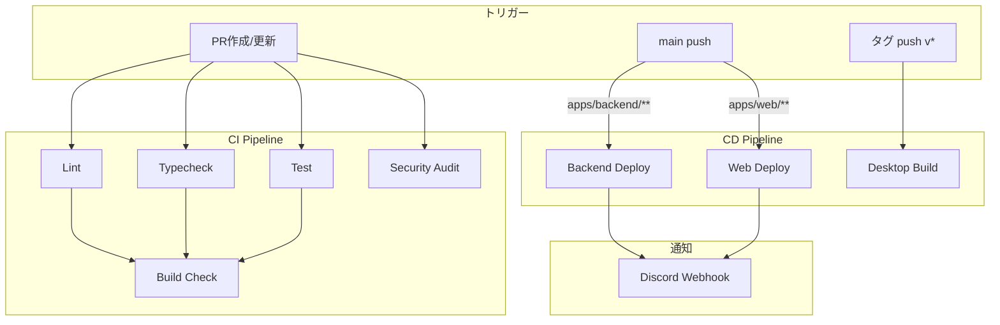

# GitHub Actions ワークフロー

このディレクトリには、プロジェクトのCI/CDワークフローが含まれています。

## ワークフロー構成図



## ワークフロー一覧

### CI/CD

| ワークフロー            | トリガー                         | 説明                                          |
| ----------------------- | -------------------------------- | --------------------------------------------- |
| **ci.yml**              | Push/PR to main                  | Lint、TypeCheck、Test、Buildの実行            |
| **backend-ci.yml**      | Push to main (`apps/backend/**`) | Railwayへのバックエンドデプロイ + Discord通知 |
| **web-cd.yml**          | Push to main (`apps/web/**`)     | RailwayへのWebデプロイ + Discord通知          |
| **release-desktop.yml** | Tag push (`v*`)                  | Electronデスクトップアプリのリリース          |

### メンテナンス

| ワークフロー       | トリガー             | 説明               |
| ------------------ | -------------------- | ------------------ |
| **stale.yml**      | スケジュール（日次） | 古いIssue/PRの管理 |
| **auto-label.yml** | Issue/PR作成時       | 自動ラベル付け     |

## 品質ゲート

| チェック       | 必須 | 失敗時       |
| -------------- | ---- | ------------ |
| Lint           | ✅   | PRマージ不可 |
| Typecheck      | ✅   | PRマージ不可 |
| Test           | ✅   | PRマージ不可 |
| Build          | ✅   | PRマージ不可 |
| Security Audit | ❌   | 警告のみ     |

## ローカル検証

```bash
# フルチェック
./scripts/validate-ci.sh

# クイックチェック
./scripts/validate-ci.sh --quick
```

### Git Hooks（自動実行）

| Hook       | タイミング | 内容                  |
| ---------- | ---------- | --------------------- |
| pre-commit | コミット前 | lint-staged           |
| pre-push   | プッシュ前 | lint, typecheck, test |

スキップ: `git push --no-verify`

## セットアップ手順

### 1. GitHub Secretsの設定

#### CI/CDデプロイ用

| Secret名              | 必須 | 用途                                     |
| --------------------- | ---- | ---------------------------------------- |
| `RAILWAY_TOKEN`       | ✅   | Railway CLIデプロイ認証                  |
| `RAILWAY_DOMAIN`      | ✅   | バックエンドヘルスチェックURL            |
| `RAILWAY_WEB_DOMAIN`  | ❌   | Webヘルスチェック URL（web未デプロイ時） |
| `DISCORD_WEBHOOK_URL` | ❌   | デプロイ成功/失敗の通知                  |

#### デスクトップリリース用

| Secret名                      | 必須          | 取得方法                 |
| ----------------------------- | ------------- | ------------------------ |
| `APPLE_ID`                    | macOS         | Apple Developer ID       |
| `APPLE_APP_SPECIFIC_PASSWORD` | macOS         | App-specific password    |
| `APPLE_TEAM_ID`               | macOS         | Team ID                  |
| `CSC_LINK`                    | macOS/Windows | 証明書のbase64エンコード |
| `CSC_KEY_PASSWORD`            | macOS/Windows | 証明書のパスワード       |

**設定場所**: GitHub → Settings → Secrets and variables → Actions

### 2. ワークフローの有効化

1. GitHubリポジトリを開く
2. **Actions** タブをクリック
3. 各ワークフローを有効化

### 3. 動作確認

#### CIワークフローの確認

```bash
# 変更をコミット
git add .
git commit -m "test: CI workflow"
git push origin main

# GitHubでActions → CI を確認
```

#### デプロイワークフローの確認

```bash
# バックエンドを変更
touch apps/backend/test.txt
git add .
git commit -m "feat(backend): test deploy"
git push origin main

# GitHubでActions → Deploy Backend to Railway を確認
```

## ワークフロー詳細

### ci.yml

**5つのジョブ**:

1. **Lint**: ESLintによるコード品質チェック
2. **Type Check**: TypeScriptの型チェック
3. **Test**: 単体テスト + カバレッジ
4. **Security**: 依存関係の脆弱性スキャン
5. **Build**: 全パッケージのビルド検証

**並列実行**: Lint、TypeCheck、Test、Securityは並列実行

**ビルドチェック対象**:

- `@repo/shared` - 共有ライブラリ
- `@repo/desktop` - Electronデスクトップアプリ
- `@repo/backend` - Next.jsバックエンドAPI

### deploy-backend.yml

**3段階デプロイ**:

1. **Validate**: ビルド・テスト・型チェック・Lint
2. **Deploy**: Railway CLIでデプロイ + ヘルスチェック
3. **Notify**: デプロイ結果の通知

**トリガー条件**:

- `apps/backend/**` の変更
- `packages/shared/**` の変更
- ワークフローファイル自体の変更

**同時実行制御**: 1つのデプロイのみ実行（`cancel-in-progress: false`）

**手動実行**: GitHub UI から `workflow_dispatch` で実行可能

## トラブルシューティング

### 「Workflow file is invalid」エラー

YAMLの構文エラーです。以下を確認：

```bash
# YAMLの検証
cat .github/workflows/deploy-backend.yml | yq .

# インデントの確認（スペース2つ）
```

### 「Secret not found」エラー

1. Secret名が正確か確認（大文字小文字を区別）
2. Secretsセクションで設定されているか確認
3. リポジトリレベルのSecretか確認（Organizationレベルではない）

### デプロイが失敗する

1. **Build Logs**を確認
2. ローカルでビルドが成功するか確認:

```bash
pnpm install
pnpm --filter @repo/shared build
pnpm --filter @repo/backend build
```

3. Railway側の設定を確認（Part 4参照）

### ヘルスチェックが失敗する

1. `RAILWAY_DOMAIN` が正しく設定されているか確認
2. Railway側でドメインが生成されているか確認
3. ローカルでヘルスチェックが動作するか確認:

```bash
curl http://localhost:3001/api/health
```

## 参考資料

- [GitHub Actions公式ドキュメント](https://docs.github.com/en/actions)
- [Railway CLIドキュメント](https://docs.railway.com/develop/cli)
- [Railwayバックエンドデプロイガイド](../../docs/30-workflows/deployment/setup-guide-railway-backend.md)
- [Electronリリースガイド](../../docs/30-workflows/deployment/task-step2-electron-desktop-deployment.md)
