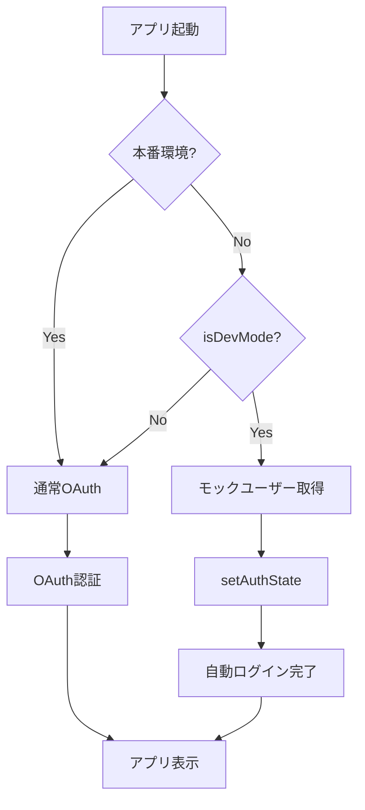

# 開発環境での認証バイパス機能

## 概要

Worktree環境やE2Eテスト環境で、毎回OAuth認証を行わずに開発できるようにするための自動認証バイパス機能です。

## 動作原理

### 自動認証バイパスの条件

以下のいずれかの条件を満たす場合、自動的にモックユーザーでログインします：

1. **本番環境以外** (`import.meta.env.PROD === false`)
2. **ElectronAPIが利用できない環境** (E2Eテスト、ブラウザ表示)
3. **E2E環境フラグ** (`import.meta.env.VITE_E2E_MODE === "true"`)
4. **URLパラメータ** (`?skipAuth=true`)
5. **localStorage** (`dev-skip-auth === "true"`)

### 認証フロー



## 使用方法

### 基本的な使い方（自動）

特に何も設定しなくても、以下の環境では自動的に認証がバイパスされます：

```bash
# 開発サーバー起動
pnpm --filter @repo/desktop dev

# プレビュー起動
pnpm --filter @repo/desktop preview

# E2Eテスト実行
pnpm --filter @repo/desktop test:e2e
```

**アプリ起動時のコンソールログ**:

```
[AuthGuard] 🔧 Development mode: auto-login with mock user
[DevMockAuth] Development Mode Active
🔧 Authentication is bypassed
👤 Mock User: {id: "dev-user-123", email: "dev@example.com", ...}
🔑 Mock Session: {access_token: "mock-dev-access-token", expires_at: ...}
💡 To disable: run `localStorage.removeItem('dev-skip-auth')` and reload
```

### カスタムモックユーザーの設定

DevToolsコンソールから、カスタムユーザーを設定できます：

```javascript
// カスタムモックユーザーを設定
const customUser = {
  id: "my-custom-id",
  email: "custom@example.com",
  user_metadata: {
    full_name: "Custom Developer",
    avatar_url: "https://example.com/avatar.png",
  },
};

const customSession = {
  access_token: "custom-token",
  refresh_token: "custom-refresh",
  expires_at: Date.now() + 24 * 60 * 60 * 1000,
};

// localStorage に保存
localStorage.setItem("dev-mock-user", JSON.stringify(customUser));
localStorage.setItem("dev-mock-session", JSON.stringify(customSession));

// ページをリロード
location.reload();
```

### 一時的にOAuth認証をテストする

開発モードバイパスを一時的に無効化してOAuth認証をテストする：

```javascript
// DevToolsコンソール
localStorage.removeItem("dev-skip-auth");
location.reload();
```

または、URLパラメータで制御：

```
http://localhost:5173/?skipAuth=false
```

## ファイル構成

### 実装ファイル

| ファイル                                      | 説明                                    |
| --------------------------------------------- | --------------------------------------- |
| `src/renderer/utils/devMockAuth.ts`           | 開発モード判定・モックデータ管理        |
| `src/renderer/components/AuthGuard/index.tsx` | 自動ログイン処理を含むAuthGuard         |
| `e2e/global-setup.ts`                         | PlaywrightテストのElectronAPIモック注入 |
| `playwright.config.ts`                        | globalSetup設定                         |
| `vite.e2e.config.ts`                          | E2E環境フラグ設定                       |

### 関数リファレンス

#### `isDevMode(): boolean`

開発モードかどうかを判定します。

```typescript
import { isDevMode } from "@renderer/utils/devMockAuth";

if (isDevMode()) {
  console.log("Development mode active");
}
```

#### `getMockAuthData(): { user, session }`

モックユーザーとセッションデータを取得します。

```typescript
import { getMockAuthData } from "@renderer/utils/devMockAuth";

const mockData = getMockAuthData();
console.log("Mock user:", mockData.user);
```

#### `setDevModeFlag(enabled: boolean): void`

開発モードフラグをlocalStorageに保存/削除します。

```typescript
import { setDevModeFlag } from "@renderer/utils/devMockAuth";

// 開発モード有効化（次回起動時も継続）
setDevModeFlag(true);

// 開発モード無効化
setDevModeFlag(false);
```

## E2Eテストでの使用

### 自動的にモックが注入される

E2Eテストファイルでは、`global-setup.ts`により自動的にElectronAPIのモックが注入されます。

```typescript
// e2e/chat-history-navigation.spec.ts
import { test, expect } from "@playwright/test";

test.describe("チャット履歴ナビゲーション", () => {
  test.beforeEach(async ({ page }) => {
    // 特別な設定なしで、認証済み状態でテスト開始
    await page.goto("/");
    await page.waitForLoadState("networkidle");

    // 認証が自動完了するまで少し待機
    await page.waitForTimeout(500);
  });

  test("履歴ボタンが表示される", async ({ page }) => {
    // 認証は既に完了しているので、直接機能テストができる
    const historyButton = page.getByRole("button", { name: "チャット履歴" });
    await expect(historyButton).toBeVisible();
  });
});
```

### カスタマイズが必要な場合

特定のテストで異なるモックデータが必要な場合：

```typescript
test.beforeEach(async ({ page }) => {
  // カスタムモックユーザーを注入
  await page.addInitScript(() => {
    window.electronAPI.auth.getSession = async () => ({
      user: {
        id: "custom-test-user",
        email: "custom@test.com",
        user_metadata: { full_name: "Custom Test User" },
      },
      session: {
        access_token: "custom-token",
        refresh_token: "custom-refresh",
        expires_at: Date.now() + 3600000,
      },
    });
  });

  await page.goto("/");
});
```

## トラブルシューティング

### Q1: 開発モードが有効にならない

**A**: コンソールログを確認してください：

```javascript
// DevToolsコンソール
import { isDevMode, logDevModeStatus } from "./utils/devMockAuth";

isDevMode(); // true/falseを確認
logDevModeStatus(); // 詳細情報を表示
```

### Q2: パッケージ版（.app）でも開発モードになってしまう

**A**: パッケージ版では`import.meta.env.PROD === true`なので、自動的に無効化されます。

### Q3: E2Eテストで認証エラーが出る

**A**: `e2e/.auth/user.json`が存在することを確認してください：

```bash
ls -la apps/desktop/e2e/.auth/user.json
```

存在しない場合：

```bash
# globalSetupを手動実行
npx playwright test --headed --grep ".*" --max-failures=1
```

### Q4: 本番環境でOAuth認証をテストしたい

**A**: localStorageのフラグを削除：

```javascript
// DevToolsコンソール
localStorage.removeItem("dev-skip-auth");
location.reload();
```

または、パッケージ版（.app）を使用してください。

## セキュリティ考慮事項

### ✅ 安全な設計

1. **本番環境では完全に無効化**
   - `import.meta.env.PROD === true`で必ず通常のOAuth
   - 環境変数のチェックにより、本番ビルドでは開発モードコードが削除される

2. **実際の認証情報を含まない**
   - モックデータはハードコードされた固定値のみ
   - .envファイルに実際のトークンは不要

3. **localStorageのスコープ**
   - localhost:5173のみ有効
   - 本番環境のドメインには影響しない

### ⚠️ 注意点

- このモック機能は**開発・テスト目的のみ**です
- 本番環境にデプロイする前に、必ず実際のOAuth認証フローをテストしてください
- パッケージング版（.app）で最終確認を行ってください

## まとめ

| 環境                            | 認証方法      | 設定必要 |
| ------------------------------- | ------------- | -------- |
| **開発環境** (`pnpm dev`)       | ✅ 自動モック | ❌ 不要  |
| **プレビュー** (`pnpm preview`) | ✅ 自動モック | ❌ 不要  |
| **E2Eテスト** (`pnpm test:e2e`) | ✅ 自動モック | ❌ 不要  |
| **パッケージ版** (`.app`)       | ❌ 通常OAuth  | ❌ 不要  |
| **本番環境**                    | ❌ 通常OAuth  | ❌ 不要  |

**これで、Worktreeごとに認証設定を繰り返す必要がなくなりました！**
