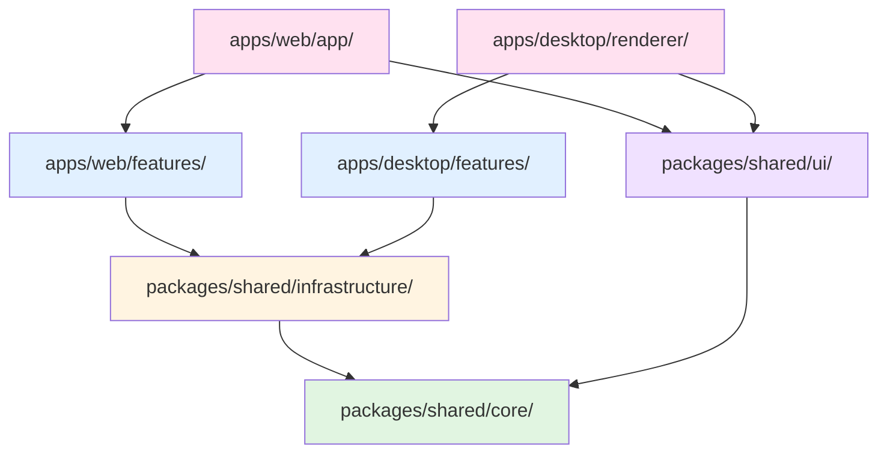

# ディレクトリ構造（モノレポ - Web/Desktop統合）

> 本ドキュメントは統合システム設計仕様書の一部です。
> マスタードキュメント: [master_system_design.md](./master_system_design.md)

## 4.1 設計方針

### 変数表記の凡例

| 表記 | 説明 | 例 |
|------|------|-----|
| `[feature-name]/` | 機能名 | workflow-executor, log-analyzer |
| `[component-name].tsx` | コンポーネント名 | Button.tsx, Card.tsx |
| `[entity-name].ts` | エンティティ・型名 | workflow.ts, user.ts |
| `[service-name].ts` | サービス名 | ai-client.ts, db.ts |
| `[page-name]/` | ページ名 | dashboard/, settings/ |
| `[test-target].test.ts` | テスト対象ファイル名に対応 | - |

### モノレポ構造の採用理由

| パッケージ | 役割 |
|-----------|------|
| `packages/shared/` | Web/Desktop共通のコード（UI、ロジック、型定義） |
| `apps/web/` | Next.js Webアプリケーション |
| `apps/desktop/` | Electronデスクトップアプリケーション |

**メリット**:
- **コード再利用**: 1箇所の変更が両プラットフォームに反映
- **独立デプロイ**: Web（Railway）とDesktop（GitHub Releases）を別々に管理

### 4つの基本原則

1. **機能ベース分離**: 機能ごとにフォルダを分け、関連ファイルを集約
2. **テストの同居**: 実装ファイルと同じ場所にテストを配置（`[target].test.ts`）
3. **階層の明確化**: 各階層の責務を明確にし、依存方向を制御
4. **拡張容易性**: 新機能追加時は新フォルダ作成のみで完結

## 4.2 ルート構造（モノレポ）

```text
root/
├── .claude/                         # AI開発アシスタント設定
│   ├── agents/                      # エージェント定義
│   ├── commands/                    # カスタムコマンド
│   └── skills/                      # スキル定義
│
├── docs/                            # 仕様書
│   ├── 00-requirements/             # 要件定義書
│   ├── 10-design/                   # 設計書
│   ├── 20-specifications/           # 機能仕様書
│   └── 99-adr/                      # アーキテクチャ決定記録
│
├── packages/
│   └── shared/                      # Web/Desktop共通コード
│       ├── core/                    # ビジネスルール（外部依存なし）
│       ├── infrastructure/          # 外部サービス接続
│       ├── ui/                      # 共通UIコンポーネント
│       └── types/                   # 共通型定義
│
├── apps/
│   ├── web/                         # Next.js Webアプリ
│   └── desktop/                     # Electronデスクトップアプリ
│
├── local-agent/                     # ローカルファイル監視エージェント
│
├── .github/
│   └── workflows/                   # CI/CD
│
└── [config-files]                   # 設定ファイル群
```

**構造の特徴**:
- `packages/shared/`: 4階層（core → infrastructure → ui → types）で依存方向を制御
- `apps/`: 各アプリは独立してデプロイ可能
- `docs/`: 番号プレフィックスで整理（参照しやすい）

## 4.3 packages/shared/ 詳細構造

```text
packages/shared/
├── core/                                # ビジネスルール層（外部依存ゼロ）
│   ├── entities/                        # ドメインエンティティ
│   │   ├── [entity-name].ts             # エンティティ定義
│   │   ├── [entity-name].test.ts        # エンティティテスト
│   │   └── index.ts                     # エクスポート
│   │
│   ├── interfaces/                      # インターフェース定義
│   │   ├── [repository-name].ts         # リポジトリインターフェース
│   │   └── [service-name].ts            # サービスインターフェース
│   │
│   └── errors/                          # ドメインエラー
│       └── [error-type].ts              # カスタムエラークラス
│
├── infrastructure/                       # 外部サービス接続層
│   ├── database/                         # データベース
│   │   ├── schema/                       # Drizzleスキーマ
│   │   │   └── [table-name].ts          # テーブル定義
│   │   ├── repositories/                 # リポジトリ実装
│   │   │   ├── [entity-name]-repository.ts
│   │   │   └── [entity-name]-repository.test.ts
│   │   └── client.ts                     # DB接続クライアント
│   │
│   ├── ai/                               # AI API統合
│   │   ├── providers/                    # プロバイダー実装
│   │   │   └── [provider-name].ts       # OpenAI, Anthropic等
│   │   ├── [provider-name].test.ts      # プロバイダーテスト
│   │   └── client.ts                     # 統一AIクライアント
│   │
│   ├── external/                         # 外部サービス
│   │   ├── [service-name]/              # Discord, LINE等
│   │   │   ├── client.ts
│   │   │   └── client.test.ts
│   │   └── index.ts
│   │
│   └── logging/                          # ログ基盤
│       ├── logger.ts                     # ログ出力
│       └── logger.test.ts
│
├── ui/                                   # 共通UIコンポーネント層
│   ├── primitives/                       # 基本コンポーネント
│   │   ├── [component-name]/
│   │   │   ├── [component-name].tsx
│   │   │   ├── [component-name].test.tsx
│   │   │   └── index.ts
│   │   └── index.ts
│   │
│   ├── patterns/                         # 複合コンポーネント
│   │   ├── [pattern-name]/
│   │   │   ├── [pattern-name].tsx
│   │   │   ├── [pattern-name].test.tsx
│   │   │   └── index.ts
│   │   └── index.ts
│   │
│   ├── tokens/                           # Design Tokens
│   │   ├── global.ts                     # グローバルトークン
│   │   ├── alias.ts                      # エイリアストークン
│   │   └── component.ts                  # コンポーネントトークン
│   │
│   └── hooks/                            # 共通カスタムフック
│       ├── [hook-name].ts
│       └── [hook-name].test.ts
│
├── types/                                # 共通型定義
│   ├── [domain-name].ts                  # ドメイン型
│   ├── api.ts                            # API型
│   └── index.ts
│
└── package.json
```

**依存方向**: `types` ← `core` ← `infrastructure` ← `ui`（逆方向禁止）

## 4.4 apps/web/ 詳細構造（Next.js）

```text
apps/web/
├── src/
│   ├── features/                         # ★機能ベース分離（最重要）
│   │   └── [feature-name]/               # 各機能フォルダ
│   │       ├── schema.ts                 # 入出力スキーマ（Zod）
│   │       ├── executor.ts               # ビジネスロジック
│   │       ├── executor.test.ts          # ユニットテスト
│   │       ├── api.ts                    # API Routesハンドラー
│   │       ├── hooks/                    # 機能固有フック（オプション）
│   │       │   ├── [hook-name].ts
│   │       │   └── [hook-name].test.ts
│   │       └── components/               # 機能固有UI（オプション）
│   │           ├── [component-name].tsx
│   │           └── [component-name].test.tsx
│   │
│   ├── app/                              # Next.js App Router
│   │   ├── layout.tsx                    # ルートレイアウト
│   │   ├── page.tsx                      # ホームページ
│   │   ├── globals.css                   # グローバルスタイル
│   │   │
│   │   ├── api/                          # API Routes
│   │   │   └── v1/
│   │   │       ├── [resource-name]/      # リソースごとにフォルダ
│   │   │       │   └── route.ts          # HTTPハンドラー
│   │   │       └── health/
│   │   │           └── route.ts
│   │   │
│   │   ├── ([route-group])/              # Route Groups（レイアウト共有）
│   │   │   ├── layout.tsx                # グループレイアウト
│   │   │   └── [page-name]/
│   │   │       └── page.tsx
│   │   │
│   │   └── [page-name]/                  # 個別ページ
│   │       ├── page.tsx                  # Server Component（デフォルト）
│   │       ├── page.test.tsx             # ページテスト
│   │       └── loading.tsx               # ローディングUI
│   │
│   ├── components/                       # Web固有の共通コンポーネント
│   │   ├── server/                       # Server Components専用
│   │   │   ├── [component-name].tsx
│   │   │   └── [component-name].test.tsx
│   │   │
│   │   └── client/                       # Client Components専用
│   │       ├── [component-name].tsx      # 'use client'ディレクティブ
│   │       └── [component-name].test.tsx
│   │
│   └── lib/                              # Web固有ユーティリティ
│       ├── [utility-name].ts
│       └── [utility-name].test.ts
│
├── package.json
└── [config-files]                        # next.config.js, tailwind.config.js等
```

**Server/Client Component分離**:
- `components/server/`: RSC（React Server Components）のみ
- `components/client/`: 'use client'ディレクティブを持つコンポーネント

## 4.5 apps/desktop/ 詳細構造（Electron）

```text
apps/desktop/
├── src/
│   ├── main/                             # Main Process（Node.js環境）
│   │   ├── index.ts                      # エントリーポイント
│   │   │
│   │   ├── ipc/                          # IPC通信（型安全）
│   │   │   ├── channels.ts               # チャネル定義（型定義）
│   │   │   ├── handlers/                 # ハンドラー実装
│   │   │   │   ├── [channel-name].ts
│   │   │   │   └── [channel-name].test.ts
│   │   │   └── index.ts                  # ハンドラー登録
│   │   │
│   │   ├── services/                     # バックグラウンドサービス
│   │   │   ├── [service-name]/
│   │   │   │   ├── [service-name].ts     # サービス実装
│   │   │   │   └── [service-name].test.ts
│   │   │   └── index.ts
│   │   │
│   │   ├── windows/                      # ウィンドウ管理
│   │   │   ├── [window-type].ts          # ウィンドウ設定・生成
│   │   │   └── manager.ts                # ウィンドウマネージャー
│   │   │
│   │   └── config/                       # 設定
│   │       ├── security.ts               # セキュリティ設定
│   │       └── app.ts                    # アプリ設定
│   │
│   ├── preload/                          # Preload Scripts（セキュリティ境界）
│   │   ├── index.ts                      # contextBridge設定
│   │   ├── api.ts                        # Renderer公開API定義
│   │   └── types.d.ts                    # 型定義（window.electronAPI）
│   │
│   └── renderer/                         # Renderer Process（React）
│       ├── App.tsx                       # アプリルート
│       ├── index.tsx                     # エントリーポイント
│       │
│       ├── pages/                        # ページコンポーネント
│       │   ├── [page-name]/
│       │   │   ├── [page-name].tsx
│       │   │   └── [page-name].test.tsx
│       │   └── index.ts
│       │
│       ├── components/                   # Electron固有コンポーネント
│       │   ├── [component-name]/
│       │   │   ├── [component-name].tsx
│       │   │   └── [component-name].test.tsx
│       │   └── index.ts
│       │
│       ├── hooks/                        # IPC通信フック
│       │   ├── [hook-name].ts            # useElectronAPI等
│       │   └── [hook-name].test.ts
│       │
│       └── store/                        # 状態管理（Zustand）
│           ├── [store-name].ts
│           └── [store-name].test.ts
│
├── resources/                            # 静的リソース
│   ├── icons/                            # アプリアイコン
│   └── [resource-type]/
│
├── package.json
└── electron-builder.yml                  # ビルド設定
```

**Electron 3プロセスモデル**:
| プロセス | 環境 | 役割 |
|----------|------|------|
| Main | Node.js全API使用可 | システム操作担当 |
| Preload | contextBridge経由 | 安全なAPI公開 |
| Renderer | Chromium環境、sandbox有効 | UIのみ担当 |

## 4.6 local-agent/ 詳細構造

```text
local-agent/
├── src/
│   ├── index.ts                          # エントリーポイント
│   │
│   ├── watchers/                         # ファイル監視
│   │   ├── [watcher-type].ts             # 監視実装
│   │   └── [watcher-type].test.ts
│   │
│   ├── sync/                             # クラウド同期
│   │   ├── client.ts                     # API通信クライアント
│   │   └── client.test.ts
│   │
│   └── config/                           # 設定
│       └── [config-type].ts
│
└── package.json
```

## 4.7 .github/workflows/ 詳細構造

```text
.github/
└── workflows/
    ├── ci.yml                            # CI（テスト、lint、型チェック）
    ├── deploy-web.yml                    # Webデプロイ（Railway）
    ├── release-desktop.yml               # Electronリリース（GitHub Releases）
    └── [workflow-name].yml               # その他ワークフロー
```

## 4.8 ルートの設定ファイル群

```text
root/
├── package.json                          # ワークスペースルート
├── pnpm-workspace.yaml                   # pnpmワークスペース設定
├── tsconfig.json                         # TypeScript基本設定
├── tsconfig.base.json                    # 共通TypeScript設定
├── .eslintrc.js                          # ESLint設定
├── .prettierrc                           # Prettier設定
├── vitest.config.ts                      # Vitest設定
├── .env.example                          # 環境変数サンプル
├── .gitignore
└── README.md
```

## 4.9 機能追加の手順（変更容易性の実現）

**新機能を追加する場合**:

```text
1. フォルダ作成: apps/web/src/features/[feature-name]/
2. 必須ファイル作成:
   ├── schema.ts              # 入出力スキーマ（Zod）
   ├── executor.ts            # ビジネスロジック
   ├── executor.test.ts       # ユニットテスト
   └── api.ts                 # APIハンドラー
3. オプション:
   ├── hooks/                 # 機能固有フック
   └── components/            # 機能固有UI
4. API登録: apps/web/src/app/api/v1/[feature-name]/route.ts
```

**影響範囲**: 新規フォルダのみ、既存コードの変更なし

## 4.10 構造の選択理由

**なぜ機能ベース（Feature-First）か？**

| 比較項目 | レイヤーベース | 機能ベース（採用） |
|---------|--------------|------------------|
| **ファイル配置** | 型別に分散 | 機能でまとめる |
| **新機能追加** | 複数フォルダに分散 | 1フォルダで完結 |
| **機能削除** | 複数箇所から削除 | フォルダ削除のみ |
| **関連ファイル確認** | 探し回る必要あり | 同じ場所にある |
| **テスト管理** | テストが実装から離れる | テストが実装の隣 |
| **初心者の理解** | 難しい | 直感的 |

## 4.11 依存関係ルール



**依存方向**（逆方向禁止）:
- `apps/*/` → `features/` → `packages/shared/infrastructure/` → `packages/shared/core/`
- `apps/*/` → `packages/shared/ui/` → `packages/shared/core/`
- ESLint `eslint-plugin-boundaries` で強制

**各層の責務**:

| 層 | パス | 責務 |
|----|------|------|
| Core | `packages/shared/core/` | ビジネスルール、エンティティ（外部依存ゼロ） |
| Infrastructure | `packages/shared/infrastructure/` | 外部サービス接続（DB、AI、Discord） |
| UI | `packages/shared/ui/` | 共通UIコンポーネント、Design Tokens |
| Features | `apps/*/features/` | プラットフォーム固有の機能ロジック |
| App | `apps/web/app/` | Next.js App Router、API Routes |
| Desktop | `apps/desktop/src/` | Electron Main/Preload/Renderer |

## 4.12 pnpm-workspace 設定

```yaml
# pnpm-workspace.yaml
packages:
  - 'packages/*'
  - 'apps/*'
  - 'local-agent'
```

```json
// apps/web/package.json
{
  "dependencies": {
    "@repo/shared": "workspace:*"
  }
}

// apps/desktop/package.json
{
  "dependencies": {
    "@repo/shared": "workspace:*"
  }
}
```

---

## 関連ドキュメント

- [プロジェクト概要](./01-overview.md)
- [アーキテクチャ設計](./05-architecture.md)
- [プラグイン開発手順](./11-plugin-development.md)
