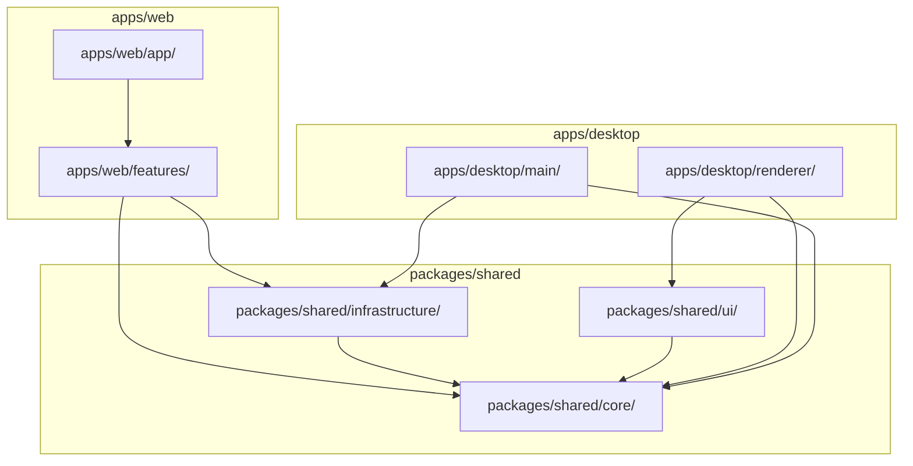
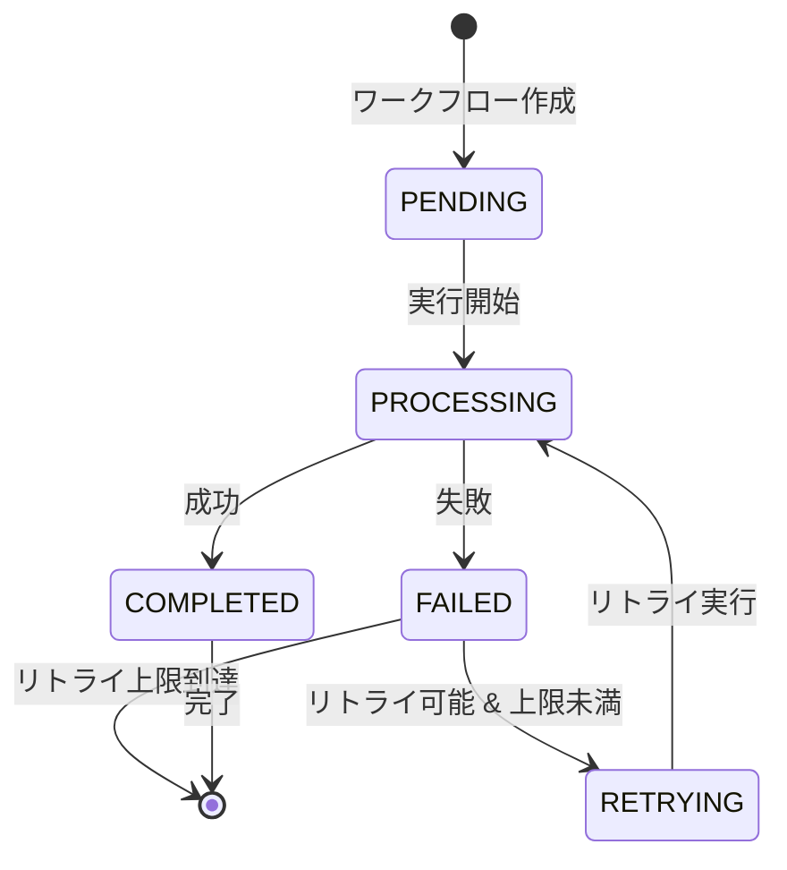

# アーキテクチャ設計 (Architecture)

> 本ドキュメントは統合システム設計仕様書の一部です。
> マスタードキュメント: [master_system_design.md](./master_system_design.md)

## 5.1 モノレポアーキテクチャの適用

### レイヤー定義（Web/Desktop統合）

| レイヤー | ディレクトリ | 責務 | 依存許可 | 共有範囲 |
|----------|-------------|------|----------|---------|
| 共通ドメイン | `packages/shared/core/` | 共通エンティティ、インターフェース定義 | なし（外部依存ゼロ） | Web + Desktop |
| 共通UI | `packages/shared/ui/` | UIコンポーネント、Design Tokens | shared/core のみ | Web + Desktop |
| 共通インフラ | `packages/shared/infrastructure/` | DB、AI、Discord等の共通サービス | shared/core のみ | Web + Desktop |
| 機能プラグイン | `apps/web/features/` | 機能ごとのビジネスロジック | shared/* | Web専用 |
| Web API層 | `apps/web/app/` | HTTPエンドポイント、Next.js App Router | すべて | Web専用 |
| Desktop Main | `apps/desktop/src/main/` | システムAPI、IPC、ウィンドウ管理 | shared/infrastructure, shared/core | Desktop専用 |
| Desktop Renderer | `apps/desktop/src/renderer/` | React UI、クライアント状態管理 | shared/ui, shared/core | Desktop専用 |

### 依存関係ルール（モノレポ版）

### 主要原則

| 原則 | 説明 |
|------|------|
| 内側から外側への依存禁止 | `packages/shared/core/` は外部依存ゼロ |
| 機能の独立性 | `features/` 各機能は相互依存禁止 |
| 共通コードの活用 | UI、ビジネスロジック、インフラを `packages/shared/` で共有 |
| プラットフォーム分離 | Web固有（apps/web）とDesktop固有（apps/desktop）を明確に分離 |
| ESLint 強制 | `eslint-plugin-boundaries` で違反を CI でブロック |

### モノレポ構造の利点

1. **コード再利用**: UIコンポーネント、ビジネスロジック、型定義をWeb/Desktopで共有
2. **一貫性**: 同一のDesign TokensとコンポーネントによりUI/UXを統一
3. **変更容易性**: 1箇所の変更が両プラットフォームに反映
4. **独立デプロイ**: Web（Railway）とDesktop（GitHub Releases）を独立して管理
5. **テスト効率**: 共通コンポーネントのテストを一度だけ実装

### 機能追加の具体例（YouTube要約機能）

YouTube要約機能を追加する場合の実装フロー：

**ステップ1: スキーマ定義**
- `features/youtube-summarize/schema.ts` にZodスキーマを定義
- 入力フィールド: `url`（URL型、必須）、`language`（列挙型、デフォルト'ja'）
- 出力フィールド: `summary`（文字列）、`keyPoints`（文字列配列）

**ステップ2: Executor実装**
- `features/youtube-summarize/executor.ts` に `IWorkflowExecutor` 実装
- `type` プロパティに 'YOUTUBE_SUMMARIZE' を設定
- `execute` メソッドで入力バリデーション → AI処理 → 出力バリデーション

**ステップ3: Registry登録**
- `features/registry.ts` にエグゼキューターを追加
- `['YOUTUBE_SUMMARIZE', new YouTubeSummarizeExecutor()]` を登録

**この構造の利点**:
- 機能追加は `features/新機能/` フォルダ作成のみ
- AI クライアントは shared/infrastructure/ai から取得（重複なし）
- テストは `features/新機能/__tests__/` で完結
- 削除はフォルダごと可能
- 機能間の独立性により他機能への影響ゼロ

---

## 5.2 データベース設計原則

### 5.2.1 リレーショナルDB設計方針

#### 基本原則

| 原則 | 説明 |
|------|------|
| 正規化 | 第3正規形までを基本とし、パフォーマンス上必要な場合のみ意図的な非正規化 |
| JSONB活用 | 柔軟なスキーマが必要な箇所（workflow の input/output）は JSONB を使用 |
| UUID主キー | 分散システム対応、推測不可能性、セキュリティ向上 |
| タイムスタンプ | `created_at`, `updated_at` を全テーブルに必須 |
| ソフトデリート | 物理削除ではなく `deleted_at` カラムによる論理削除を推奨 |

#### トランザクション管理

| 設定項目 | 値 | 説明 |
|----------|-----|------|
| ACID特性 | 必須 | すべての DB 操作はトランザクション内で実行 |
| 分離レベル | READ COMMITTED | デフォルト、必要に応じて SERIALIZABLE |
| ロック戦略 | 楽観的ロック | バージョニング優先、悲観的ロックは最小限 |
| トランザクション境界 | Repository | Repository パターンでカプセル化 |

#### インデックス戦略

| 対象 | 説明 |
|------|------|
| 検索条件 | WHERE 句で頻繁に使用するカラムにインデックス |
| 外部キー | 全外部キーにインデックス（JOIN 性能向上） |
| 複合インデックス | 複数カラムでの検索は複合インデックス |
| JSONB索引 | GIN インデックスで JSONB カラムの検索を高速化 |
| カーディナリティ | 選択性の高いカラムを優先 |

#### マイグレーション原則

| 原則 | 説明 |
|------|------|
| バージョン管理 | すべてのスキーマ変更は Drizzle マイグレーションで管理 |
| ロールバック可能 | UP/DOWN マイグレーションを必ず定義 |
| データ移行分離 | スキーマ変更とデータ移行を分離（安全性向上） |
| 本番適用 | ダウンタイムを最小化（オンラインマイグレーション） |

### 5.2.2 ベクトルデータベース設計（pgvector）

#### 採用理由

| 理由 | 説明 |
|------|------|
| pgvector | PostgreSQL 拡張、Neon でネイティブサポート、追加インフラ不要 |
| 用途 | AI 埋め込みベクトルの保存、セマンティック検索、類似検索 |
| 統合性 | リレーショナルデータとベクトルデータを同一DB で管理 |

#### ベクトル設計方針

| 項目 | 設定 |
|------|------|
| 次元数 | 使用する AI モデルに応じて設定（OpenAI: 1536次元、Claude: 3072次元等） |
| 距離関数 | コサイン類似度（`<=>` 演算子）を標準使用 |
| インデックス | HNSW または IVFFlat インデックスで検索高速化 |
| 正規化 | ベクトルは L2 正規化を推奨 |

#### ベクトルテーブル設計パターン

embeddings テーブルの構造：
- `id`: UUID（主キー）
- `resource_type`: VARCHAR（リソース種別: 'workflow', 'document'等）
- `resource_id`: UUID（元リソースへの外部キー）
- `embedding`: VECTOR(dimension)（埋め込みベクトル）
- `metadata`: JSONB（メタデータ）
- `created_at`: TIMESTAMPTZ

類似検索クエリパターン：
- ORDER BY embedding <=> query_vector（コサイン類似度）
- LIMIT で上位N件取得
- WHERE 句で resource_type によるフィルタ併用

### 5.2.3 workflows テーブル（主要エンティティ）

#### カラム定義

| カラム名 | データ型 | NULL | デフォルト | 説明 |
|----------|----------|------|------------|------|
| `id` | UUID | NO | `gen_random_uuid()` | 主キー |
| `type` | VARCHAR(50) | NO | - | ワークフロー識別子 |
| `user_id` | VARCHAR(100) | NO | - | 実行ユーザーID |
| `status` | ENUM | NO | `'PENDING'` | 実行状態 |
| `input_payload` | JSONB | YES | `'{}'` | 入力データ（柔軟なスキーマ） |
| `output_payload` | JSONB | YES | `NULL` | 出力データ（柔軟なスキーマ） |
| `error_log` | TEXT | YES | `NULL` | エラー詳細 |
| `retry_count` | INTEGER | NO | `0` | リトライ回数 |
| `created_at` | TIMESTAMPTZ | NO | `NOW()` | 作成日時 |
| `updated_at` | TIMESTAMPTZ | NO | `NOW()` | 更新日時 |
| `completed_at` | TIMESTAMPTZ | YES | `NULL` | 完了日時 |
| `deleted_at` | TIMESTAMPTZ | YES | `NULL` | 削除日時（ソフトデリート） |

#### status ENUM 値

| 値 | 説明 | 遷移元 | 遷移条件 |
|----|------|--------|----------|
| `PENDING` | 実行待ち | 初期状態 | ワークフロー作成時 |
| `PROCESSING` | 実行中 | PENDING, RETRYING | Executor実行開始時 |
| `COMPLETED` | 正常完了 | PROCESSING | Executor正常終了時 |
| `FAILED` | 失敗 | PROCESSING | Executor異常終了時 |
| `RETRYING` | リトライ中 | FAILED | retry_count < MAX_RETRY_COUNT かつ retryable エラー |

#### 状態遷移図

#### インデックス設計

| インデックス名 | カラム | 用途 |
|---------------|--------|------|
| `idx_workflows_status` | `status` | ステータス別検索 |
| `idx_workflows_user_id` | `user_id` | ユーザー別検索 |
| `idx_workflows_type_status` | `type, status` | タイプ＆ステータス複合検索 |
| `idx_workflows_created_at` | `created_at DESC` | 時系列ソート |
| `idx_workflows_input_payload` | `input_payload` GIN | JSONB 検索高速化 |
| `idx_workflows_deleted_at` | `deleted_at` | ソフトデリート対応（WHERE deleted_at IS NULL） |

---

## 関連ドキュメント

- [プロジェクト概要](./01-overview.md)
- [ディレクトリ構造](./04-directory-structure.md)
- [コアインターフェース仕様](./06-core-interfaces.md)
- [エラーハンドリング仕様](./07-error-handling.md)
