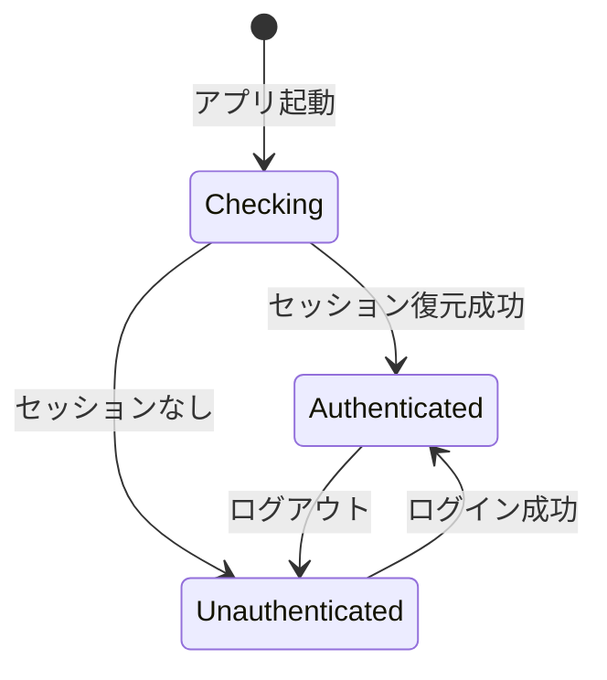

# アーキテクチャ設計

> 本ドキュメントは統合システム設計仕様書の一部です。
> マスタードキュメント: [master_system_design.md](./master_system_design.md)

---

## 5.1 モノレポアーキテクチャ

### 5.1.1 レイヤー定義

| レイヤー             | ディレクトリ                      | 責務                                   | 依存許可                           | 共有範囲          |
| -------------------- | --------------------------------- | -------------------------------------- | ---------------------------------- | ----------------- |
| 共通ドメイン         | packages/shared/core/             | 共通エンティティ、インターフェース定義 | なし（外部依存ゼロ）               | Web + Desktop     |
| 型定義層             | packages/shared/src/types/rag/    | RAG型定義、Zodスキーマ、バリデーション | なし（外部依存ゼロ）               | Web + Desktop     |
| **ドメインサービス** | **packages/shared/src/services/** | **ファイル変換等のドメインロジック**   | **shared/types/rag のみ**          | **Web + Desktop** |
| 共通UI               | packages/shared/ui/               | UIコンポーネント、Design Tokens        | shared/core のみ                   | Web + Desktop     |
| 共通インフラ         | packages/shared/infrastructure/   | DB、AI、Discord等の共通サービス        | shared/core のみ                   | Web + Desktop     |
| 機能プラグイン       | apps/web/features/                | 機能ごとのビジネスロジック             | shared/\*                          | Web専用           |
| Web API層            | apps/web/app/                     | HTTPエンドポイント、Next.js App Router | すべて                             | Web専用           |
| Desktop Main         | apps/desktop/src/main/            | システムAPI、IPC、ウィンドウ管理       | shared/infrastructure, shared/core | Desktop専用       |
| Desktop Renderer     | apps/desktop/src/renderer/        | React UI、クライアント状態管理         | shared/ui, shared/core             | Desktop専用       |

### 5.1.2 依存関係ルール

**依存の方向**（以下の方向のみ許可、逆方向は禁止）:

| 依存元                          | 依存先                                                 |
| ------------------------------- | ------------------------------------------------------ |
| apps/web/app/                   | apps/web/features/, packages/shared/\*                 |
| apps/web/features/              | packages/shared/infrastructure/, packages/shared/core/ |
| apps/desktop/renderer/          | packages/shared/ui/, packages/shared/core/             |
| apps/desktop/main/              | packages/shared/infrastructure/, packages/shared/core/ |
| packages/shared/infrastructure/ | packages/shared/core/, packages/shared/src/types/rag/  |
| packages/shared/ui/             | packages/shared/core/, packages/shared/src/types/rag/  |
| packages/shared/src/types/rag/  | なし（外部依存ゼロ）                                   |
| packages/shared/core/           | なし（外部依存ゼロ）                                   |

**違反検出**:

- ESLint eslint-plugin-boundaries を使用して依存関係違反をCIでブロックする
- PRマージ条件として依存関係チェックを必須とする

### 5.1.3 主要原則

| 原則                     | 説明                                                             |
| ------------------------ | ---------------------------------------------------------------- |
| 内側から外側への依存禁止 | packages/shared/core/ は外部依存ゼロを維持する                   |
| 機能の独立性             | features/ 各機能は相互依存禁止とする                             |
| 共通コードの活用         | UI、ビジネスロジック、インフラを packages/shared/ で共有する     |
| プラットフォーム分離     | Web固有（apps/web）とDesktop固有（apps/desktop）を明確に分離する |

### 5.1.4 モノレポ構造の利点

| 利点         | 説明                                                          |
| ------------ | ------------------------------------------------------------- |
| コード再利用 | UIコンポーネント、ビジネスロジック、型定義をWeb/Desktopで共有 |
| 一貫性       | 同一のDesign TokensとコンポーネントによりUI/UXを統一          |
| 変更容易性   | 1箇所の変更が両プラットフォームに反映                         |
| 独立デプロイ | Web（Railway）とDesktop（GitHub Releases）を独立して管理      |
| テスト効率   | 共通コンポーネントのテストを一度だけ実装                      |

---

## 5.2 機能追加パターン

### 5.2.1 新機能追加の手順

新しいワークフロー機能を追加する場合の手順を以下に示す。

**ステップ1: フォルダ作成**

- apps/web/src/features/に新しい機能名のフォルダを作成する
- フォルダ名はケバブケース（例: youtube-summarize）を使用する

**ステップ2: スキーマ定義**

- schema.ts ファイルに入出力スキーマを定義する
- Zodを使用して型安全なバリデーションを実装する
- 入力フィールドと出力フィールドを明確に分離する

**ステップ3: Executor実装**

- executor.ts ファイルに IWorkflowExecutor インターフェースを実装する
- type プロパティにワークフロー識別子を設定する
- execute メソッドで入力バリデーション、処理、出力バリデーションを行う

**ステップ4: テスト作成**

- executor.test.ts ファイルにユニットテストを作成する
- 正常系、異常系、境界値のテストケースを網羅する

**ステップ5: Registry登録**

- features/registry.ts にエグゼキューターを登録する
- ワークフロータイプとエグゼキューターのマッピングを追加する

**ステップ6: API Route作成（必要な場合）**

- apps/web/src/app/api/v1/に対応するルートを作成する

### 5.2.2 機能構成のベストプラクティス

**必須ファイル**:

| ファイル         | 役割                      |
| ---------------- | ------------------------- |
| schema.ts        | 入出力スキーマ定義（Zod） |
| executor.ts      | ビジネスロジック実装      |
| executor.test.ts | ユニットテスト            |

**オプションファイル**:

| ファイル/フォルダ | 用途                       |
| ----------------- | -------------------------- |
| api.ts            | 機能固有のAPIハンドラー    |
| hooks/            | 機能固有のReact Hooks      |
| components/       | 機能固有のUIコンポーネント |

### 5.2.3 この構造の利点

| 利点                 | 説明                                              |
| -------------------- | ------------------------------------------------- |
| 変更の局所化         | 機能追加は新規フォルダ作成のみで完結              |
| 削除の容易性         | フォルダごと削除すれば機能を除去可能              |
| 影響範囲の限定       | 機能間の独立性により他機能への影響ゼロ            |
| テストの同居         | 実装とテストが同じ場所にあり管理しやすい          |
| 共通インフラの再利用 | AIクライアント等は shared/infrastructure から取得 |

---

## 5.2A ファイル変換基盤アーキテクチャ

> **詳細設計**: `docs/30-workflows/completed-tasks/conversion-base/`
> **実装**: `packages/shared/src/services/conversion/`

### 5.2A.1 概要

ファイル変換基盤は、RAGシステムにおける多様なファイル形式（テキスト、Markdown、PDF等）を統一的に処理するための共通基盤を提供する。

**主要コンポーネント**:

| コンポーネント      | 責務                                                     |
| ------------------- | -------------------------------------------------------- |
| `IConverter`        | 変換処理のインターフェース定義                           |
| `BaseConverter`     | 共通変換処理の抽象基底クラス（Template Methodパターン）  |
| `ConverterRegistry` | 利用可能なコンバーターの管理と選択（Repositoryパターン） |
| `ConversionService` | 変換処理の統括（タイムアウト・同時実行制御）             |
| `MetadataExtractor` | テキストからのメタデータ抽出                             |

### 5.2A.2 アーキテクチャパターン

| パターン        | 適用箇所                  | 目的                       |
| --------------- | ------------------------- | -------------------------- |
| Template Method | `BaseConverter.convert()` | 変換フローの標準化         |
| Repository      | `ConverterRegistry`       | コンバーター管理の抽象化   |
| Factory         | `createConverterInput()`  | 型安全なオブジェクト生成   |
| Singleton       | `globalConverterRegistry` | グローバルインスタンス提供 |

### 5.2A.2B 実装済みコンバーター

**実装場所**: `packages/shared/src/services/conversion/converters/`

| コンバーター       | サポートMIME                                      | 優先度 | 主要機能                             | 実装状況  |
| ------------------ | ------------------------------------------------- | ------ | ------------------------------------ | --------- |
| HTMLConverter      | text/html                                         | 10     | HTML→Markdown、script/style除去      | ✅ 実装済 |
| MarkdownConverter  | text/markdown, text/x-markdown                    | 10     | 見出し・リンク・コードブロック抽出   | ✅ 実装済 |
| CodeConverter      | text/x-typescript, text/javascript, text/x-python | 10     | 関数・クラス・インポート抽出         | ✅ 実装済 |
| YAMLConverter      | application/x-yaml, text/yaml, text/x-yaml        | 10     | 構造解析、トップレベルキー抽出       | ✅ 実装済 |
| CSVConverter       | text/csv, text/tab-separated-values               | 5      | CSV/TSV→テーブル、区切り文字自動検出 | ✅ 実装済 |
| JSONConverter      | application/json                                  | 5      | JSON→構造化Markdown、ネスト対応      | ✅ 実装済 |
| PlainTextConverter | text/plain                                        | 0      | BOM除去、改行コード正規化            | ⏸️ 未実装 |

#### HTMLConverter

**ファイル**: `html-converter.ts`

**機能**:

- Turndownライブラリを使用したHTML→Markdown変換
- `<script>`/`<style>`タグの自動除去
- HTMLエンティティのデコード
- メタデータ抽出（title, description, keywords, lang属性）

**メタデータ抽出**:

- `title`: `<title>`タグから抽出
- `description`: `<meta name="description">`から抽出
- `keywords`: `<meta name="keywords">`から抽出
- `lang`: `<html lang="...">`属性から抽出

#### CSVConverter

**ファイル**: `csv-converter.ts`

**機能**:

- CSV/TSV形式→Markdownテーブル変換
- 区切り文字の自動検出（カンマ/タブ）
- ダブルクォートによるエスケープ処理
- 改行を含むセルの対応

**メタデータ抽出**:

- `rowCount`: データ行数（ヘッダー除く）
- `columnCount`: 列数
- `delimiter`: 検出された区切り文字

#### JSONConverter

**ファイル**: `json-converter.ts`

**機能**:

- JSON→構造化Markdown変換
- ネスト構造対応（オブジェクト・配列）
- 再帰的な階層表現
- プリミティブ値の適切なフォーマット

**メタデータ抽出**:

- `depth`: JSONの最大ネスト深度
- `keyCount`: 総キー数（オブジェクトのみ）

#### MarkdownConverter

**ファイル**: `markdown-converter.ts`

**機能**:

- Markdown正規化（BOM除去、改行統一、連続空行制限）
- フロントマター抽出・除去（YAML形式）
- 見出し階層の抽出（h1～h6）
- リンク抽出（外部URLのみ）
- コードブロック検出と言語タグ認識
- 言語自動判定（日本語/英語、閾値: 100文字）

**メタデータ抽出**:

- `title`: 最初のh1見出しまたはフロントマターから抽出
- `headers`: 見出し階層（level, text）
- `links`: 外部URLリスト（重複除去済み）
- `codeBlocks`: コードブロック数
- `language`: 自動判定された言語（"ja" | "en"）
- `hasFrontmatter`: フロントマターの有無
- `hasCodeBlocks`: コードブロックの有無

**正規化処理**:

- BOM除去
- 改行コード統一（CRLF→LF）
- 連続空行を2行までに制限
- コードブロック内の空白は保持
- コードブロック外の行末空白を除去

#### CodeConverter

**ファイル**: `code-converter.ts`

**機能**:

- 多言語ソースコード対応（TypeScript, JavaScript, Python）
- 言語自動判定（ファイル拡張子ベース）
- 正規表現ベースの構造抽出
- 関数定義検出（通常関数、アロー関数、async関数）
- クラス定義検出
- インポート/エクスポート文の抽出
- Markdown形式での構造化出力

**対応言語と拡張子**:

- TypeScript: `.ts`, `.tsx`, `.mts`, `.cts`
- JavaScript: `.js`, `.jsx`, `.mjs`, `.cjs`
- Python: `.py`

**メタデータ抽出**:

- `language`: プログラミング言語名（typescript, javascript, python）
- `functions`: 関数名リスト
- `classes`: クラス名リスト
- `imports`: インポート元モジュール名リスト
- `exports`: エクスポート名リスト
- `classCount`: クラス定義数
- `functionCount`: 関数定義数
- `importCount`: インポート文数
- `exportCount`: エクスポート数

**構造抽出パターン**:

- 関数: `function functionName(...)`, `const functionName = (...) =>`
- クラス: `class ClassName`
- インポート: `import ... from 'module'`, `from module import ...`
- エクスポート: `export function/class/const/type/interface`

#### YAMLConverter

**ファイル**: `yaml-converter.ts`

**機能**:

- YAML正規化（BOM除去、行末正規化、連続空行削減）
- YAML構造解析（トップレベルキー、インデント、コメント）
- Markdown形式での構造化出力
- インデント深さ計算（スペース数ベース）
- コメント検出

**メタデータ抽出**:

- `topLevelKeys`: トップレベルキーのリスト
- `hasComments`: コメントの有無
- `maxIndentDepth`: 最大インデント深さ（スペース数）
- `totalLines`: 総行数（空行除く）

**正規化処理**:

- BOM除去（0xFEFFチェック）
- 行末正規化（CRLF→LF）
- 行末空白除去
- 連続空行を2行までに制限

**Markdown出力形式**:

- YAML Structure セクション（構造サマリー）
- YAML Content セクション（YAML本体をコードブロックで表示）

#### PlainTextConverter（未実装）

**タスク**: QUALITY-02（品質向上タスク）
**実装予定機能**:

- UTF-8/UTF-16/UTF-32 BOM除去
- 改行コード正規化（CRLF/CR → LF）
- 文字エンコーディング検出

### 5.2A.3 品質指標

| 指標             | 実績      |
| ---------------- | --------- |
| テストカバレッジ | 100%      |
| テスト数         | 201ケース |
| 実装行数         | 2,400行   |
| ドキュメント     | 19件      |

**最新実装状況（2025-12-25時点）**:

- HTMLConverter, CSVConverter, JSONConverter: Phase 0-2で実装済み
- MarkdownConverter, CodeConverter, YAMLConverter: Phase 3-8で実装・検証完了
- 全コンバーター: 100%テストカバレッジ、ESLint 0エラー、TypeScript 0エラー
- 品質評価: A+（本番環境デプロイ準備完了）

### 5.2A.4 新規コンバーター追加手順

新しいファイル形式に対応するコンバーターを追加する際の標準手順。

#### Step 1: 要件定義

**確認事項**:

- 対応するファイル形式とMIMEタイプ
- 抽出すべきメタデータの種類
- 優先度の決定（既存コンバーターとの競合を考慮）
- パフォーマンス要件（想定ファイルサイズ、処理時間）

**ドキュメント作成**:

- `docs/30-workflows/[converter-name]/task-[converter-name].md` - タスク仕様書

#### Step 2: TDD Red - テストファースト

**テストファイル作成**: `packages/shared/src/services/conversion/converters/__tests__/[name]-converter.test.ts`

**必須テストケース**:

- 基本的な変換処理（正常系）
- サポートMIMEタイプの検証（`canHandle`メソッド）
- 空ファイル処理
- 不正な入力の拒否
- メタデータ抽出の正確性
- オプション引数の動作（`maxContentLength`, `preserveFormatting`等）
- 最大コンテンツ長のトリミング
- エラーハンドリング

**カバレッジ要件**: 100%（Statements, Branches, Functions, Lines）

#### Step 3: TDD Green - 実装

**ファイル作成**: `packages/shared/src/services/conversion/converters/[name]-converter.ts`

**実装必須要素**:

```typescript
export class [Name]Converter extends BaseConverter {
  // 必須プロパティ
  readonly id = "[name]-converter";
  readonly name = "[Name] Converter";
  readonly supportedMimeTypes = ["mime/type1", "mime/type2"] as const;
  readonly priority = [0-10];  // 優先度を設定

  // 必須メソッド（protected）
  protected async doConvert(
    input: ConverterInput,
    options: ConverterOptions
  ): Promise<Result<ConverterOutput, RAGError>> {
    // 1. テキストコンテンツ取得
    // 2. 正規化処理
    // 3. 構造抽出
    // 4. Markdown形式で整形
    // 5. 最大長トリミング
    // 6. メタデータ生成
  }

  // オプション: コンバーター説明
  protected getDescription(): string {
    return "説明文";
  }
}
```

**実装パターン**:

- `getTextContent(input)`: BaseConverterのヘルパーメソッドでテキスト取得
- `trimContent(content, maxLength)`: BaseConverterのヘルパーメソッドでトリミング
- try-catchでエラーをキャッチし、`createRAGError()`でRAGError型に変換
- `ok(result)` / `err(error)` でResult型を返す

#### Step 4: コンバーター登録

**ファイル更新**: `packages/shared/src/services/conversion/converters/index.ts`

**追加内容**:

1. インポート文を追加
2. エクスポート文を追加
3. `registerDefaultConverters()`の配列に追加
4. `registeredCount`の期待値を更新

**テスト更新**: `__tests__/index.test.ts`

- 登録数のアサーションを更新（例: 6 → 7）
- 新規コンバーターのエクスポートテストを追加

#### Step 5: TDD Refactor - リファクタリング

**リファクタリング観点**:

- 重複コードの抽出（BaseConverterへの移動を検討）
- メソッドの単一責任原則の確認
- 複雑度の低減（Cyclomatic Complexity < 10）
- ネーミングの一貫性

#### Step 6: ドキュメント更新

**更新対象**:

1. `docs/00-requirements/05-architecture.md` - コンバーター一覧に追加
2. `docs/00-requirements/06-core-interfaces.md` - 実装クラスと使用例追加
3. `docs/30-api/converters/[name]-converter.md` - API仕様書作成
4. `docs/40-manuals/rag-conversion-guide.md` - 使用ガイドに追加

#### Step 7: 品質ゲート

**必須チェック項目**:

- ✅ ESLint: 0エラー
- ✅ TypeScript型チェック: 0エラー
- ✅ ユニットテスト: 100%カバレッジ
- ✅ 手動テスト: 全テストケースPASS
- ✅ ビルド成功
- ✅ ドキュメント完備

### 5.2A.5 コンバーター優先度設定ガイドライン

**優先度の意味**:

複数のコンバーターが同じMIMEタイプをサポートする場合、優先度が高いコンバーターが選択されます。

**優先度レベル**:

| 優先度 | 用途                               | 例                                                             |
| ------ | ---------------------------------- | -------------------------------------------------------------- |
| 10     | 専用コンバーター（形式固有の処理） | MarkdownConverter, CodeConverter, YAMLConverter, HTMLConverter |
| 5-9    | 汎用的な構造化データ               | JSONConverter (5), CSVConverter (5)                            |
| 1-4    | フォールバック                     | （将来の拡張用）                                               |
| 0      | デフォルトハンドラー               | PlainTextConverter（未実装）                                   |

**設定の考え方**:

- **priority: 10**: 特定形式に特化した処理を持つ場合（構造抽出、メタデータ解析）
- **priority: 5**: シンプルな変換ロジックだが有用な場合
- **priority: 0**: すべてのファイル形式に対応可能な汎用ハンドラー

**競合時の選択**:

1. MIMEタイプが完全一致するコンバーターを抽出
2. 優先度の降順でソート
3. 最も優先度が高いコンバーターを選択

### 5.2A.6 ExtractedMetadata拡張ガイドライン

**基本メタデータ（全コンバーター共通）**:

必須フィールド:

- `title`: ドキュメントタイトル（nullable）
- `author`: 著者名（nullable）
- `language`: 言語コード（"ja" | "en"）
- `wordCount`: 単語数
- `lineCount`: 行数
- `charCount`: 文字数

**拡張可能フィールド**:

- `headers`: 見出し構造（配列）
- `codeBlocks`: コードブロック数
- `links`: リンク情報（配列）
- `custom`: コンバーター固有のメタデータ（オブジェクト）

**custom フィールドの活用**:

```typescript
// 例: MarkdownConverter
custom: {
  hasFrontmatter: boolean,
  hasCodeBlocks: boolean,
  headerCount: number
}

// 例: CodeConverter
custom: {
  language: string,
  classCount: number,
  functionCount: number,
  importCount: number,
  classes: string[],
  functions: string[]
}

// 例: YAMLConverter
custom: {
  hasComments: boolean,
  maxIndentDepth: number,
  topLevelKeys: string[],
  totalLines: number
}
```

**拡張時の注意点**:

- `custom`フィールドは自由に拡張可能
- 基本フィールド（title, author等）は型定義を変更しない
- 将来的に共通化すべきフィールドは基本メタデータへの昇格を検討

### 5.2A.7 既知の制限事項と技術的負債

**制限事項**:

| 項目               | 内容                          | 影響範囲                                                 |
| ------------------ | ----------------------------- | -------------------------------------------------------- |
| 正規表現ベース解析 | AST（抽象構文木）を使用しない | CodeConverter - 複雑な構文の一部が抽出されない可能性     |
| 言語検出閾値       | 日本語文字100文字以上で判定   | MarkdownConverter - 短い日本語テキストは英語と判定される |
| 大容量ファイル     | 10MB超のファイル未検証        | 全コンバーター - パフォーマンス特性が不明                |
| 同期処理           | 非同期ストリーミング未対応    | ConversionService - 超大容量ファイルでメモリ枯渇の可能性 |

**技術的負債**:

| ID            | 内容                                  | 優先度 | 見積工数 |
| ------------- | ------------------------------------- | ------ | -------- |
| CONV-DEBT-001 | PlainTextConverter未実装              | Medium | 4h       |
| CONV-DEBT-002 | AST-basedコード解析への移行           | Low    | 16h      |
| CONV-DEBT-003 | 大容量ファイル対応（ストリーミング）  | Low    | 12h      |
| CONV-DEBT-004 | 正規表現タイムアウト実装（ReDoS対策） | Low    | 4h       |

### 5.2A.8 将来の拡張ポイント

**追加予定のコンバーター**:

| コンバーター       | 対応形式                       | 優先度 | ユースケース       | 見積工数 |
| ------------------ | ------------------------------ | ------ | ------------------ | -------- |
| PDFConverter       | application/pdf                | 10     | 学術論文、レポート | 24h      |
| DocxConverter      | application/vnd.openxmlformats | 8      | Word文書           | 16h      |
| ExcelConverter     | application/vnd.ms-excel       | 8      | スプレッドシート   | 16h      |
| PlainTextConverter | text/plain                     | 0      | フォールバック     | 4h       |
| XMLConverter       | application/xml                | 7      | 構造化データ       | 8h       |

**機能拡張候補**:

- **ストリーミング処理**: 大容量ファイル対応（>10MB）
- **バッチ最適化**: 同一形式の複数ファイルをまとめて処理
- **キャッシング**: 変換結果のキャッシュ機構
- **プラグインシステム**: サードパーティコンバーターの動的ロード
- **AST統合**: TypeScript Compiler API、Python ast モジュールの活用

**アーキテクチャ改善候補**:

- **Worker Threads**: CPU集約的な処理をバックグラウンド実行
- **メトリクス収集**: 変換時間、エラー率、ファイルサイズ分布の記録
- **A/Bテスト基盤**: 新旧コンバーターの品質比較

### 5.2A.9 パフォーマンス要件とベンチマーク

**性能目標**:

| ファイルサイズ | 目標処理時間 | 実測値（平均）    | 状態      |
| -------------- | ------------ | ----------------- | --------- |
| < 10KB         | < 50ms       | 3-12ms            | ✅ 達成   |
| 10KB - 100KB   | < 200ms      | 50-100ms          | ✅ 達成   |
| 100KB - 1MB    | < 1s         | 400ms（Markdown） | ✅ 達成   |
| 1MB - 10MB     | < 5s         | 未検証            | ⚠️ 要検証 |
| > 10MB         | < 30s        | 未検証            | ⚠️ 要検証 |

**ベンチマーク実行方法**:

手動テストスクリプト: `packages/shared/src/services/conversion/__manual-tests__/run-manual-tests.ts`

**パフォーマンスボトルネック**:

- MarkdownConverter: 見出し・リンク抽出の正規表現（428ms）
- CodeConverter: 多数の正規表現マッチング（構造抽出）
- YAMLConverter: 行単位の解析（インデント計算）

**最適化候補**:

- 正規表現の最適化（事前コンパイル）
- 文字列操作の削減（StringBuilder パターン）
- 不要な中間変数の排除

### 5.2A.10 デザインパターン適用理由

**Template Method パターン（BaseConverter）**:

- **目的**: 変換処理フローの標準化
- **適用箇所**: `convert()` メソッド（final）→ `doConvert()` メソッド（abstract）
- **利点**: 共通処理（タイミング計測、エラーハンドリング）を基底クラスで統一
- **拡張方法**: サブクラスは `doConvert()` のみを実装すればよい

**Repository パターン（ConverterRegistry）**:

- **目的**: コンバーター管理の抽象化
- **適用箇所**: `ConverterRegistry.findConverter()`
- **利点**: コンバーター選択ロジックをカプセル化、テスト容易性
- **拡張方法**: 新規コンバーターは `register()` で追加するだけ

**Singleton パターン（globalConverterRegistry）**:

- **目的**: グローバルな共有インスタンス提供
- **適用箇所**: `globalConverterRegistry`, `globalConversionService`
- **利点**: アプリケーション全体で統一されたコンバーター集合を使用
- **拡張方法**: カスタムレジストリが必要な場合は `new ConverterRegistry()` で個別作成可能

**Factory パターン（暗黙的）**:

- **目的**: 型安全なオブジェクト生成
- **適用箇所**: `createConverterInput()`, `generateFileId()`
- **利点**: Branded型の生成を安全に
- **拡張方法**: 新しいBranded型にも同様のファクトリ関数を提供

**Railway Oriented Programming（Result型）**:

- **目的**: エラーハンドリングの明示化
- **適用箇所**: すべての変換メソッドの戻り値
- **利点**: 例外を使わない、エラーパスの可視化、型安全なエラー処理
- **拡張方法**: 新規メソッドも `Result<T, RAGError>` を返すように統一

### 5.2A.11 テスト戦略

**テストピラミッド**:

```
         /\
        /E2E\         手動テスト（7ケース）
       /------\
      /統合テスト\     ConversionService統合（含む）
     /----------\
    /ユニットテスト\   コンバーター個別（166ケース）
   /--------------\
```

**ユニットテストの構成**:

- 各コンバーターごとに50-60ケース
- 正常系、異常系、境界値を網羅
- AAA（Arrange-Act-Assert）パターン
- describe/itによる階層的なテスト構造

**テスト用ユーティリティ**:

- `beforeEach()` / `afterEach()` でレジストリをリセット
- `resetRegistrationState()` で二重登録フラグをクリア
- モックは最小限（実際のコンバーターインスタンスを使用）

**手動テスト**:

- 実際のファイルでの動作確認
- ConversionService経由での統合テスト
- パフォーマンス計測

**カバレッジ要件の厳守**:

- Statements: 100%
- Branches: 100%
- Functions: 100%
- Lines: 100%

未達の場合はPhase 6で修正が必要。

---

## 5.3 データベース設計原則

### 5.3.1 基本原則

| 原則           | 説明                                                                    |
| -------------- | ----------------------------------------------------------------------- |
| 正規化         | 第3正規形までを基本とし、パフォーマンス上必要な場合のみ意図的な非正規化 |
| JSON活用       | 柔軟なスキーマが必要な箇所（workflow の input/output）は JSON 型を使用  |
| UUID主キー     | 分散システム対応、推測不可能性、セキュリティ向上                        |
| タイムスタンプ | created_at, updated_at を全テーブルに必須                               |
| ソフトデリート | 物理削除ではなく deleted_at カラムによる論理削除を推奨                  |

### 5.3.2 トランザクション管理

| 設定項目             | 値             | 説明                                       |
| -------------------- | -------------- | ------------------------------------------ |
| ACID特性             | 必須           | すべてのDB操作はトランザクション内で実行   |
| 分離レベル           | READ COMMITTED | デフォルト設定（SQLiteはSERIALIZABLE相当） |
| ロック戦略           | 楽観的ロック   | バージョニング優先、悲観的ロックは最小限   |
| トランザクション境界 | Repository     | Repositoryパターンでカプセル化             |

### 5.3.3 インデックス戦略

| 対象             | 説明                                        |
| ---------------- | ------------------------------------------- |
| 検索条件         | WHERE句で頻繁に使用するカラムにインデックス |
| 外部キー         | 全外部キーにインデックス（JOIN性能向上）    |
| 複合インデックス | 複数カラムでの検索は複合インデックス        |
| カーディナリティ | 選択性の高いカラムを優先                    |

### 5.3.4 マイグレーション原則

| 原則             | 説明                                                |
| ---------------- | --------------------------------------------------- |
| バージョン管理   | すべてのスキーマ変更はDrizzleマイグレーションで管理 |
| ロールバック可能 | UP/DOWNマイグレーションを必ず定義                   |
| データ移行分離   | スキーマ変更とデータ移行を分離（安全性向上）        |
| 本番適用         | ダウンタイムを最小化（オンラインマイグレーション）  |

---

## 5.4 workflowsテーブル設計

### 5.4.1 カラム定義

| カラム名       | データ型       | NULL | デフォルト     | 説明                         |
| -------------- | -------------- | ---- | -------------- | ---------------------------- |
| id             | TEXT (UUID)    | NO   | 自動生成       | 主キー                       |
| type           | TEXT           | NO   | -              | ワークフロー識別子           |
| user_id        | TEXT           | NO   | -              | 実行ユーザーID               |
| status         | TEXT           | NO   | PENDING        | 実行状態                     |
| input_payload  | TEXT (JSON)    | YES  | 空オブジェクト | 入力データ（柔軟なスキーマ） |
| output_payload | TEXT (JSON)    | YES  | NULL           | 出力データ（柔軟なスキーマ） |
| error_log      | TEXT           | YES  | NULL           | エラー詳細                   |
| retry_count    | INTEGER        | NO   | 0              | リトライ回数                 |
| created_at     | TEXT (ISO8601) | NO   | 現在時刻       | 作成日時                     |
| updated_at     | TEXT (ISO8601) | NO   | 現在時刻       | 更新日時                     |
| completed_at   | TEXT (ISO8601) | YES  | NULL           | 完了日時                     |
| deleted_at     | TEXT (ISO8601) | YES  | NULL           | 削除日時（ソフトデリート）   |

### 5.4.2 status列の値と状態遷移

| 値         | 説明       | 遷移元            | 遷移条件                                            |
| ---------- | ---------- | ----------------- | --------------------------------------------------- |
| PENDING    | 実行待ち   | 初期状態          | ワークフロー作成時                                  |
| PROCESSING | 実行中     | PENDING, RETRYING | Executor実行開始時                                  |
| COMPLETED  | 正常完了   | PROCESSING        | Executor正常終了時                                  |
| FAILED     | 失敗       | PROCESSING        | Executor異常終了時                                  |
| RETRYING   | リトライ中 | FAILED            | retry_count < MAX_RETRY_COUNT かつ retryable エラー |

**状態遷移の流れ**:

1. ワークフロー作成 → PENDING
2. 実行開始 → PROCESSING
3. 成功時 → COMPLETED（終了状態）
4. 失敗時 → FAILED
5. リトライ可能な場合 → RETRYING → PROCESSING
6. リトライ上限到達 → FAILED（終了状態）

### 5.4.3 インデックス設計

| インデックス名            | カラム          | 用途                       |
| ------------------------- | --------------- | -------------------------- |
| idx_workflows_status      | status          | ステータス別検索           |
| idx_workflows_user_id     | user_id         | ユーザー別検索             |
| idx_workflows_type_status | type, status    | タイプ＆ステータス複合検索 |
| idx_workflows_created_at  | created_at DESC | 時系列ソート               |
| idx_workflows_deleted_at  | deleted_at      | ソフトデリート対応         |

---

## 5.5 ベクトル検索設計（将来拡張）

### 5.5.1 採用方針

| 方針 | 説明                                                           |
| ---- | -------------------------------------------------------------- |
| 現在 | MVPではベクトル検索は実装しない                                |
| 将来 | 必要に応じて外部ベクトルDBサービス（Pinecone、Qdrant等）を検討 |
| 理由 | Turso/libSQLはベクトル検索未対応、DB統一を優先                 |

### 5.5.2 将来の実装方針

ベクトル検索が必要になった場合の対応方針:

| 方針           | 説明                                                                |
| -------------- | ------------------------------------------------------------------- |
| DB分離         | リレーショナルデータ（Turso）とベクトルデータ（専用サービス）を分離 |
| サービス候補   | Pinecone（マネージド）、Qdrant（セルフホスト可）、Supabase Vector   |
| 同期戦略       | リレーショナルDBの更新をトリガーにベクトルDBを更新                  |
| クエリパターン | ベクトル検索でID取得 → リレーショナルDBで詳細取得                   |

---

## 5.6 Knowledge Graph型定義（RAG実装）

### 5.6.1 概要

GraphRAG（Graph Retrieval-Augmented Generation）のKnowledge Graph構造を型安全に実装するための型定義群。
Entity-Relation-Communityモデルに基づき、文書から抽出されたエンティティ、関係性、コミュニティを表現する。

**実装場所**: `packages/shared/src/types/rag/graph/`

### 5.6.2 主要型定義

| 型名             | カテゴリ     | 説明                                       |
| ---------------- | ------------ | ------------------------------------------ |
| EntityEntity     | Entity       | Knowledge Graphのノード（頂点）を表現      |
| RelationEntity   | Entity       | Knowledge Graphのエッジ（辺）を表現        |
| CommunityEntity  | Entity       | 意味的に関連するエンティティ群のクラスター |
| EntityMention    | Value Object | エンティティの文書内出現位置               |
| RelationEvidence | Value Object | 関係の出典チャンク情報                     |
| GraphStatistics  | Value Object | Knowledge Graph全体の統計情報              |

### 5.6.3 EntityEntity型（ノード）

Knowledge Graphのノード（頂点）を表現するEntity型。

**主要プロパティ**:

| プロパティ     | 型                   | 説明                                      |
| -------------- | -------------------- | ----------------------------------------- |
| id             | EntityId             | エンティティ一意識別子（UUID）            |
| name           | string               | エンティティ名（元の形式）                |
| normalizedName | string               | 正規化されたエンティティ名                |
| type           | EntityType           | エンティティタイプ（52種類）              |
| embedding      | Float32Array \| null | ベクトル埋め込み（512/768/1024/1536次元） |
| importance     | number               | 重要度スコア（0.0〜1.0）                  |
| aliases        | string[]             | 別名・エイリアス                          |

**エンティティタイプ（52種類、10カテゴリ）**:

1. 人物・組織: person, organization, role, team（4種類）
2. 場所・時間: location, date, event（3種類）
3. ビジネス・経営: company, product, service, brand, strategy, metric, business_process, market, customer（9種類）
4. 技術全般: technology, tool, method, standard, protocol（5種類）
5. コード・ソフトウェア: programming_language, framework, library, api, function, class, module（7種類）
6. 抽象概念: concept, theory, principle, pattern, model（5種類）
7. ドキュメント構造: document, chapter, section, paragraph, heading（5種類）
8. ドキュメント要素: keyword, summary, figure, table, list, quote, code_snippet, formula, example（9種類）
9. メディア: image, video, audio, diagram（4種類）
10. その他: other（1種類）

### 5.6.4 RelationEntity型（エッジ）

Knowledge Graphのエッジ（辺）を表現するEntity型。

**主要プロパティ**:

| プロパティ    | 型                 | 説明                      |
| ------------- | ------------------ | ------------------------- |
| id            | RelationId         | 関係一意識別子（UUID）    |
| sourceId      | EntityId           | 始点エンティティID        |
| targetId      | EntityId           | 終点エンティティID        |
| type          | RelationType       | 関係タイプ（23種類）      |
| weight        | number             | 関係の強さ（0.0〜1.0）    |
| bidirectional | boolean            | 双方向関係かどうか        |
| evidence      | RelationEvidence[] | 関係の証拠（必須1件以上） |

**関係タイプ（23種類、5カテゴリ）**:

1. 汎用関係: related_to, part_of, has_part, belongs_to（4種類）
2. 時間的関係: preceded_by, followed_by, concurrent_with（3種類）
3. 技術的関係: uses, used_by, implements, extends, depends_on, calls, imports（7種類）
4. 階層関係: parent_of, child_of（2種類）
5. 参照関係: references, referenced_by, defines, defined_by（4種類）
6. 人物関係: authored_by, works_for, collaborates_with（3種類）

**制約**:

- Self-loop禁止: `sourceId !== targetId`
- Evidence必須: 最低1件の証拠が必要

### 5.6.5 CommunityEntity型（クラスター）

意味的に関連するエンティティ群のクラスター（Leiden Algorithm）。

**主要プロパティ**:

| プロパティ      | 型                  | 説明                              |
| --------------- | ------------------- | --------------------------------- |
| id              | CommunityId         | コミュニティ一意識別子（UUID）    |
| level           | number              | 階層レベル（0=ルート）            |
| parentId        | CommunityId \| null | 親コミュニティID（level 0はnull） |
| memberEntityIds | EntityId[]          | メンバーエンティティID配列        |
| memberCount     | number              | メンバー数                        |
| summary         | string              | コミュニティ要約（最大2000文字）  |

**階層制約**:

- level 0の場合: `parentId === null`（ルートコミュニティ）
- level > 0の場合: `parentId !== null`（サブコミュニティ）

### 5.6.6 バリデーション（Zod）

すべてのEntity型にZodスキーマを定義し、ランタイムバリデーションを実装。

**実装ファイル**: `packages/shared/src/types/rag/graph/schemas.ts`

**カスタムバリデーション例**:

- Embedding次元数チェック: [512, 768, 1024, 1536]のいずれか
- Self-loop禁止: `sourceId !== targetId`
- 配列長一致: `memberCount === memberEntityIds.length`
- 階層制約: level 0は`parentId === null`

### 5.6.7 ユーティリティ関数

**実装ファイル**: `packages/shared/src/types/rag/graph/utils.ts`

| 関数名                    | 説明                                             |
| ------------------------- | ------------------------------------------------ |
| normalizeEntityName       | エンティティ名の正規化（小文字化、特殊文字除去） |
| getInverseRelationType    | 関係タイプの逆関係取得（uses ⇄ used_by）         |
| calculateEntityImportance | 簡易PageRankによる重要度計算                     |
| generateCommunityName     | コミュニティ名の自動生成                         |
| getEntityTypeCategory     | エンティティタイプのカテゴリ取得                 |
| calculateGraphDensity     | グラフ密度の計算                                 |

### 5.6.8 型安全性の保証

| 保証項目       | 実装方法                                                 |
| -------------- | -------------------------------------------------------- |
| 一意識別子     | Branded Type（EntityId, RelationId, CommunityId）        |
| 列挙型         | Union型 + 定数オブジェクト（EntityTypes, RelationTypes） |
| 境界値         | Zodスキーマによる範囲制約（0.0〜1.0）                    |
| 必須フィールド | TypeScript readonly + Zod required                       |
| カスタム制約   | Zod refine()による独自ロジック                           |

### 5.6.9 テストカバレッジ

| ファイル   | カバレッジ                                         |
| ---------- | -------------------------------------------------- |
| types.ts   | 100% (Statements/Functions/Lines), 100% (Branches) |
| schemas.ts | 100% (Statements/Functions/Lines), 100% (Branches) |
| utils.ts   | 100% (Statements/Functions), 94.73% (Branches)     |

**総合カバレッジ**: 99.2%（目標80%を19.2%超過達成）

**総テスト数**: 230ケース（正常系・異常系・境界値）

---

## 5.7 オフライン・同期アーキテクチャ

### 5.8.1 Turso Embedded Replicasの活用

| 項目       | 説明                                                               |
| ---------- | ------------------------------------------------------------------ |
| クラウドDB | Turso（libSQL）をプライマリDBとして使用                            |
| ローカルDB | Embedded Replicasとしてローカルにレプリカを保持                    |
| 同期方式   | クラウドからローカルへの非同期レプリケーション                     |
| 書き込み   | オンライン時はクラウドに直接書き込み、オフライン時はローカルキュー |

### 5.8.2 オフライン時の動作

| 操作     | オフライン時の動作                           |
| -------- | -------------------------------------------- |
| 読み取り | ローカルレプリカから読み取り（即座に応答）   |
| 書き込み | ローカルキューに保存、オンライン復帰時に同期 |
| 検索     | ローカルインデックスを使用                   |
| 状態表示 | UI上でオフライン状態を明示                   |

### 5.8.3 同期コンフリクト解決

| 戦略             | 説明                                       |
| ---------------- | ------------------------------------------ |
| Last-Write-Wins  | タイムスタンプベースで最新の書き込みを優先 |
| 適用対象         | 設定変更、ステータス更新など単純な更新     |
| コンフリクト検出 | バージョン番号またはタイムスタンプで検出   |
| 手動解決         | 複雑なコンフリクトはユーザーに選択を委ねる |

---

## 5.8 Desktop状態管理

### 5.8.1 テーマ状態管理

| レイヤー         | 責務                                       | ファイル                |
| ---------------- | ------------------------------------------ | ----------------------- |
| Main Process     | nativeTheme API連携、永続化（IPC経由）     | themeHandlers.ts        |
| Preload          | contextBridgeによるAPI公開                 | preload/index.ts        |
| Renderer (Hook)  | システム監視、Zustand連携                  | useTheme.ts             |
| Renderer (Store) | テーマ状態保持（themeMode, resolvedTheme） | settingsSlice.ts        |
| Renderer (UI)    | ThemeSelectorコンポーネント                | ThemeSelector/index.tsx |

### 5.8.2 IPCチャネル設計（テーマ）

| チャネル               | 方向            | 用途             |
| ---------------------- | --------------- | ---------------- |
| `theme:get`            | Renderer → Main | 現在のテーマ取得 |
| `theme:set`            | Renderer → Main | テーマ設定変更   |
| `theme:get-system`     | Renderer → Main | OSテーマ取得     |
| `theme:system-changed` | Main → Renderer | OSテーマ変更通知 |

### 5.8.3 ワークスペース状態管理

| レイヤー         | 責務                                       | ファイル             |
| ---------------- | ------------------------------------------ | -------------------- |
| Main Process     | ファイルシステム操作、永続化（IPC経由）    | workspaceHandlers.ts |
| Preload          | contextBridgeによるAPI公開                 | preload/index.ts     |
| Renderer (Store) | Workspace状態保持（folders, selectedFile） | workspaceSlice.ts    |
| Renderer (UI)    | WorkspaceSidebar, FolderEntryItem          | components/          |

### 5.8.4 IPCチャネル設計（ワークスペース）

| チャネル                   | 方向            | 用途               |
| -------------------------- | --------------- | ------------------ |
| `workspace:load`           | Renderer → Main | ワークスペース読込 |
| `workspace:save`           | Renderer → Main | ワークスペース保存 |
| `workspace:add-folder`     | Renderer → Main | フォルダ追加       |
| `workspace:validate-paths` | Renderer → Main | パス有効性検証     |
| `file:read`                | Renderer → Main | ファイル読込       |
| `file:write`               | Renderer → Main | ファイル書込       |
| `file:get-tree`            | Renderer → Main | ファイルツリー取得 |

### 5.8.5 システムプロンプト状態管理

| レイヤー         | 責務                                  | ファイル                                   |
| ---------------- | ------------------------------------- | ------------------------------------------ |
| Main Process     | electron-store永続化（IPC経由）       | storeHandlers.ts                           |
| Preload          | contextBridgeによるAPI公開            | preload/index.ts                           |
| Renderer (Store) | テンプレート状態保持、バリデーション  | systemPromptTemplateSlice.ts, chatSlice.ts |
| Renderer (UI)    | SystemPromptPanel、SaveTemplateDialog | components/organisms/                      |

**状態構造**:

| State                         | 型                 | 責務                            | Slice                        |
| ----------------------------- | ------------------ | ------------------------------- | ---------------------------- |
| `systemPrompt`                | `string`           | 現在のシステムプロンプト        | chatSlice.ts                 |
| `systemPromptUpdatedAt`       | `Date \| null`     | 最終更新日時                    | chatSlice.ts                 |
| `selectedTemplateId`          | `string \| null`   | 選択中のテンプレートID          | chatSlice.ts                 |
| `templates`                   | `PromptTemplate[]` | プリセット+カスタムテンプレート | systemPromptTemplateSlice.ts |
| `isSystemPromptPanelExpanded` | `boolean`          | パネル展開状態                  | chatSlice.ts                 |
| `isSaveTemplateDialogOpen`    | `boolean`          | 保存ダイアログ表示状態          | systemPromptTemplateSlice.ts |

### 5.8.6 IPCチャネル設計（システムプロンプト）

| チャネル       | 方向            | 用途                     |
| -------------- | --------------- | ------------------------ |
| `store:get`    | Renderer → Main | electron-storeデータ取得 |
| `store:set`    | Renderer → Main | electron-storeデータ保存 |
| `store:delete` | Renderer → Main | electron-storeデータ削除 |

**データ永続化**:

- **保存先**: electron-store（`~/.config/AIWorkflowOrchestrator/config.json`）
- **キー**: `systemPromptTemplates`
- **形式**: `PromptTemplate[]` JSON配列
- **暗号化**: 不要（機密性低いユーザー設定）
- **同期**: 保存・削除時に即座にelectron-storeへ書き込み

---

## 5.9 認証アーキテクチャ（Supabase + Electron）

### 5.9.1 認証基盤

| 項目             | 技術選定                | 説明                            |
| ---------------- | ----------------------- | ------------------------------- |
| 認証サービス     | Supabase Auth           | OAuth 2.0 PKCE フロー対応       |
| 対応プロバイダー | Google, GitHub, Discord | ソーシャルログイン              |
| トークン管理     | Electron SafeStorage    | OS キーチェーンによる暗号化保存 |
| セッション管理   | Supabase Session        | JWT ベース、自動リフレッシュ    |

### 5.9.2 プロセス間責務分離

| プロセス     | 責務                                        | ファイル                            |
| ------------ | ------------------------------------------- | ----------------------------------- |
| Main Process | Supabase 連携、トークン管理、IPC ハンドラー | authHandlers.ts, profileHandlers.ts |
| Preload      | contextBridge による安全な API 公開         | preload/index.ts                    |
| Renderer     | 認証状態管理（Zustand）、UI                 | authSlice.ts, AccountSection.tsx    |

### 5.9.3 カスタムプロトコル認証フロー（実装済み）

**詳細フロー**:

```
1. Renderer: login(provider) 呼び出し
2. Main: Supabase OAuth URL 生成、外部ブラウザで開く
3. ブラウザ: OAuth 認証完了
4. Supabase: aiworkflow://auth/callback#access_token=xxx にリダイレクト
5. Main: カスタムプロトコルでコールバック受信（app.on('open-url')）
6. Main: URLからaccess_token/refresh_tokenを抽出
7. Main: Refresh TokenをsafeStorage.encryptString()で暗号化
8. Main: 暗号化トークンをelectron-storeに保存
9. Main → Renderer: auth:state-changed イベント送信
10. Renderer: Zustand storeの認証状態を更新
```

**実装ファイル**:

- `apps/desktop/src/main/index.ts:105-188` - カスタムプロトコル処理
- `apps/desktop/src/main/infrastructure/secureStorage.ts` - トークン暗号化
- `apps/desktop/src/main/ipc/authHandlers.ts` - IPCハンドラー
- `apps/desktop/src/renderer/store/slices/authSlice.ts` - 状態管理

**セキュリティ考慮事項**:

| 項目                | 実装状況    | 説明                       |
| ------------------- | ----------- | -------------------------- |
| contextIsolation    | ✅ 有効     | main/index.ts:54           |
| nodeIntegration     | ✅ 無効     | main/index.ts:55           |
| sandbox             | ✅ 有効     | main/index.ts:53           |
| IPC Validation      | ✅ 実装済み | authHandlers.ts:77,145,187 |
| Refresh Token暗号化 | ✅ 実装済み | secureStorage.ts           |
| State parameter検証 | ❌ 未実装   | DEBT-SEC-001               |
| PKCE実装            | ❌ 未実装   | DEBT-SEC-002               |

### 5.9.4 IPCチャネル（認証）

| チャネル                | 方向            | 用途                 |
| ----------------------- | --------------- | -------------------- |
| `auth:login`            | Renderer → Main | OAuth ログイン開始   |
| `auth:logout`           | Renderer → Main | ログアウト           |
| `auth:get-session`      | Renderer → Main | セッション取得       |
| `auth:refresh`          | Renderer → Main | トークンリフレッシュ |
| `auth:check-online`     | Renderer → Main | オンライン状態確認   |
| `auth:state-changed`    | Main → Renderer | 認証状態変更通知     |
| `profile:get`           | Renderer → Main | プロフィール取得     |
| `profile:update`        | Renderer → Main | プロフィール更新     |
| `profile:get-providers` | Renderer → Main | 連携プロバイダー一覧 |
| `profile:link-provider` | Renderer → Main | 新規プロバイダー連携 |

### 5.9.5 認証UIコンポーネント

| コンポーネント | 層       | 責務                                   | ファイル                                   | テストカバレッジ    |
| -------------- | -------- | -------------------------------------- | ------------------------------------------ | ------------------- |
| AuthGuard      | HOC      | 認証状態によるルーティング制御         | components/AuthGuard/index.tsx             | 100% (67/67 tests)  |
| useAuthState   | hook     | 認証状態取得ロジック                   | components/AuthGuard/hooks/useAuthState.ts | 100%                |
| getAuthState   | util     | 状態判定純粋関数                       | components/AuthGuard/utils/getAuthState.ts | 100% (5/5 tests)    |
| LoadingScreen  | molecule | 認証確認中のローディング画面表示       | components/AuthGuard/LoadingScreen.tsx     | 100%                |
| AuthView       | view     | ログイン画面表示（OAuthボタン配置）    | views/AuthView/index.tsx                   | -                   |
| AccountSection | organism | アカウント設定UI（プロフィール・連携） | components/organisms/AccountSection/       | 93% (115/115 tests) |
| ProviderIcon   | atom     | OAuthプロバイダーアイコン表示          | components/atoms/ProviderIcon/index.tsx    | 100%                |

### 5.9.6 認証状態遷移



**状態と表示の対応**:

| 状態            | AuthGuard表示内容 | 説明                   |
| --------------- | ----------------- | ---------------------- |
| checking        | LoadingScreen     | セッション確認中       |
| authenticated   | children          | 認証済み（メインUI）   |
| unauthenticated | AuthView          | 未認証（ログイン画面） |

### 5.9.7 技術的負債

ログイン機能復旧プロジェクト（2025-12-22完了）で発見された技術的負債:

| ID            | 項目                          | 深刻度 | 優先度 | 工数    | 説明                                                                                         |
| ------------- | ----------------------------- | ------ | ------ | ------- | -------------------------------------------------------------------------------------------- |
| DEBT-SEC-001  | State parameter検証           | Medium | Medium | 2-3時間 | CSRF攻撃対策として、OAuth認証開始時にstateパラメータを生成・保存し、コールバック時に検証する |
| DEBT-SEC-002  | PKCE実装                      | Medium | Low    | 3-4時間 | OAuth 2.1準拠のため、code_verifier/code_challenge生成と検証を実装する                        |
| DEBT-SEC-003  | カスタムプロトコルURL詳細検証 | Low    | Low    | 1-2時間 | aiworkflow://スキーム確認のみでなく、パス検証とクエリパラメータ検証を追加する                |
| DEBT-CODE-001 | 構造化ログ追加                | Low    | Low    | 2時間   | エラーログにタイムスタンプ・コンテキストを含める構造化ログを実装する                         |
| DEBT-CODE-002 | エラーメッセージ一元管理      | Low    | Low    | 1時間   | エラーメッセージを定数ファイルに一元管理する                                                 |

**対応方針**: 次のスプリントで計画的に対応する。現在の実装でも基本的なセキュリティ要件は満たしている。

---

## 5.10 セキュリティアーキテクチャ

### 5.10.1 レイヤー別セキュリティ

| レイヤー           | セキュリティ対策                                   |
| ------------------ | -------------------------------------------------- |
| API層              | 認証・認可チェック、レート制限、入力バリデーション |
| アプリケーション層 | ビジネスルールに基づくアクセス制御                 |
| インフラ層         | 暗号化通信、機密情報の安全な保存                   |
| データ層           | パラメータ化クエリ、最小権限の原則                 |

### 5.10.2 認証フロー

**Web（Discord OAuth）**:

1. ユーザーがDiscordログインボタンをクリック
2. Discord認可画面でユーザーが許可
3. コールバックでアクセストークン取得
4. セッションCookie発行
5. 以降のリクエストはセッションで認証

**Local Agent（APIキー）**:

1. 環境変数にAGENT_SECRET_KEYを設定
2. リクエストヘッダーにキーを含めて送信
3. サーバー側でキーを検証
4. 一致しない場合は401エラー

### 5.10.3 データ保護

| 対象              | 保護方法                                 |
| ----------------- | ---------------------------------------- |
| APIキー（DB保存） | AES-256-GCMで暗号化後に保存              |
| セッション        | HttpOnly、Secure、SameSite属性付きCookie |
| 通信              | TLS 1.3による暗号化                      |
| ローカルファイル  | Electron safeStorage APIを使用           |

---

## 5.10 RAGパイプラインアーキテクチャ

### 5.10.1 型定義モジュール構造

RAGパイプラインの型定義は4ファイル構成で実装される。

| ファイル   | 責務                                     | 依存関係             |
| ---------- | ---------------------------------------- | -------------------- |
| types.ts   | TypeScript型定義（エンティティ、構成型） | branded.ts のみ      |
| schemas.ts | Zodスキーマ定義（実行時バリデーション）  | types.ts, branded.ts |
| utils.ts   | ユーティリティ関数（ベクトル演算、変換） | types.ts             |
| index.ts   | バレルエクスポート（モジュールAPI統一）  | 上記3ファイル        |

**実装場所**: `packages/shared/src/types/rag/chunk/`

### 5.10.2 型安全性の保証

| 機構              | 説明                                                |
| ----------------- | --------------------------------------------------- |
| Branded Types     | ID型の厳格化（ChunkId, EmbeddingId等）              |
| readonly修飾子    | イミュータブルなエンティティ設計                    |
| Zodバリデーション | 実行時型安全性（UUID形式、範囲、SHA-256ハッシュ等） |
| TypeScript Strict | 厳格な型チェック（noImplicitAny, strictNullChecks） |

### 5.10.3 CONV-03-01基礎型との統合

| 基礎型                         | チャンク・埋め込みモジュールでの利用 |
| ------------------------------ | ------------------------------------ |
| Timestamped                    | ChunkEntity, EmbeddingEntity で継承  |
| WithMetadata                   | ChunkEntity, EmbeddingEntity で継承  |
| FileId, ConversionId (Branded) | チャンクの親ファイル参照に使用       |
| RAGError (エラーハンドリング)  | ユーティリティ関数のエラー処理に使用 |

### 5.10.4 設計原則

| 原則          | 説明                                                  |
| ------------- | ----------------------------------------------------- |
| DRY           | 共通定数・ヘルパー関数の一元管理                      |
| 不変性        | readonly修飾子によるデータ変更防止                    |
| 純粋関数      | 副作用のないユーティリティ関数                        |
| テスト容易性  | TDD実装により99.53%カバレッジを達成                   |
| Single Source | 型定義とZodスキーマの二重定義を避け、スキーマから導出 |

### 5.10.5 FTS5全文検索アーキテクチャ

RAGシステムのコア機能として、SQLite FTS5による高速全文検索を実装する。

#### アーキテクチャパターン

**External Content Table Pattern**を採用し、データ重複を回避しながらFTS5の高速検索を実現。

| コンポーネント         | 役割                                | 実装場所                   |
| ---------------------- | ----------------------------------- | -------------------------- |
| chunksテーブル         | チャンクデータ本体（Content Table） | `schema/chunks.ts`         |
| chunks_fts仮想テーブル | FTS5検索インデックス                | `schema/chunks-fts.ts`     |
| トリガー               | INSERT/UPDATE/DELETE時の自動同期    | マイグレーションSQL        |
| 検索クエリ             | BM25スコアリング + 3種の検索モード  | `queries/chunks-search.ts` |

#### 検索モード

| 検索モード     | 用途                     | FTS5構文例                        |
| -------------- | ------------------------ | --------------------------------- |
| キーワード検索 | 複数キーワードのOR検索   | `TypeScript JavaScript`           |
| フレーズ検索   | 完全一致（語順保持）     | `"typed superset"`                |
| NEAR検索       | 近接検索（距離指定可能） | `NEAR("JavaScript" "library", 5)` |

#### スコアリング方式

**BM25 + Sigmoid正規化**により0-1スケールの関連度スコアを提供：

```
正規化スコア = 1 / (1 + exp(-scale_factor * bm25_score))
```

| パラメータ   | デフォルト値 | 説明                   |
| ------------ | ------------ | ---------------------- |
| scale_factor | 0.3          | スコア分布の調整       |
| スコア範囲   | 0.0 - 1.0    | 高い値ほど関連度が高い |

#### 同期方式

**トリガーベースの自動同期**により、chunksテーブルとchunks_fts仮想テーブルの整合性を保証：

| 操作   | トリガー          | 処理内容                                  |
| ------ | ----------------- | ----------------------------------------- |
| INSERT | chunks_fts_insert | chunks_ftsにrowid, content, contextを挿入 |
| UPDATE | chunks_fts_update | chunks_ftsのcontent, contextを更新        |
| DELETE | chunks_fts_delete | chunks_ftsから該当rowidを削除             |

#### トークナイザー設定

**unicode61トークナイザー**により日本語・英語の混在テキストに対応：

| 設定       | 値                              | 説明                         |
| ---------- | ------------------------------- | ---------------------------- |
| tokenize   | `unicode61 remove_diacritics 2` | Unicode正規化 + 分音記号除去 |
| 日本語対応 | ✅ ひらがな、カタカナ、漢字     | 文字単位でトークン化         |
| 英語対応   | ✅ 単語単位                     | スペース区切りで分割         |

#### 性能特性

| 指標               | 実測値（3チャンク） | 目標（10,000チャンク） |
| ------------------ | ------------------- | ---------------------- |
| キーワード検索速度 | < 10ms              | < 100ms                |
| フレーズ検索速度   | < 10ms              | < 100ms                |
| NEAR検索速度       | < 10ms              | < 150ms                |
| インデックスサイズ | 微小                | データサイズの15-20%   |

**参照ドキュメント**:

- 詳細設計: `docs/30-workflows/rag-conversion-system/requirements-chunks-fts5.md`
- スキーマ設計: `docs/30-workflows/rag-conversion-system/design-chunks-schema.md`
- FTS5設計: `docs/30-workflows/rag-conversion-system/design-chunks-fts5.md`
- 検索設計: `docs/30-workflows/rag-conversion-system/design-chunks-search.md`

---

## 関連ドキュメント

- [プロジェクト概要](./01-overview.md)
- [ディレクトリ構造](./04-directory-structure.md)
- [コアインターフェース仕様](./06-core-interfaces.md)
- [エラーハンドリング仕様](./07-error-handling.md)
- [データベース設計](./15-database-design.md)
- [セキュリティガイドライン](./17-security-guidelines.md)
