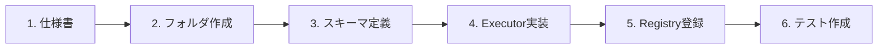

# 機能プラグイン追加手順（ハイブリッド構造）

> 本ドキュメントは統合システム設計仕様書の一部です。
> マスタードキュメント: [master_system_design.md](./master_system_design.md)

## 11.1 追加フロー（簡素化）



### ステップ詳細

| ステップ | 内容 | 成果物 |
|----------|------|--------|
| 1. 仕様書作成 | 機能要件の定義 | `../20-specifications/features/[feature-name].md` |
| 2. フォルダ作成 | 機能用ディレクトリ作成 | `src/features/[feature-name]/` |
| 3. スキーマ定義 | 入出力の Zod スキーマ定義 | `schema.ts` |
| 4. Executor実装 | `IWorkflowExecutor` 実装 | `executor.ts` |
| 5. Registry登録 | レジストリに1行追加 | `src/features/registry.ts` |
| 6. テスト作成 | ユニットテスト | `__tests__/executor.test.ts` |

---

## 11.2 ファイル構成テンプレート

新機能追加時の最小構成：

```
src/features/[新機能名]/
├── schema.ts           # 入出力スキーマ（Zod）
├── executor.ts         # ビジネスロジック
└── __tests__/
    └── executor.test.ts
```

---

## 11.3 共通インフラの使用方法

### AI クライアントの使用

| 項目 | 説明 |
|------|------|
| インポート元 | `@/shared/infrastructure/ai/client` |
| 関数 | `createAIClient(provider)` でクライアント取得 |
| プロバイダー選択 | 'openai', 'anthropic', 'google', 'xai' のいずれかを指定 |
| 戻り値 | 統一インターフェースを持つ AI クライアントオブジェクト |
| 用途 | テキスト生成、要約、翻訳などの AI 処理 |

### データベースアクセス

| 項目 | 説明 |
|------|------|
| インポート元 | `@/shared/infrastructure/database/db` |
| DB接続 | `db` オブジェクト経由で Drizzle ORM を使用 |
| Repository | `@/shared/infrastructure/database/repositories` から各エンティティの Repository を取得 |
| 用途 | workflow の CRUD 操作、ステータス更新 |

### Discord通知

| 項目 | 説明 |
|------|------|
| インポート元 | `@/shared/infrastructure/discord/client` |
| 関数 | `sendDiscordMessage()` でメッセージ送信 |
| 用途 | ワークフロー完了通知、エラー通知 |

---

## 11.4 実装要件チェックリスト

- [ ] `IWorkflowExecutor` インターフェースを実装
- [ ] 入出力は Zod でバリデーション
- [ ] 共通インフラ（AI、DB）は `@/shared/infrastructure/` から import
- [ ] エラーは `WorkflowError` サブクラスをスロー
- [ ] `features/registry.ts` に登録
- [ ] ユニットテストを `__tests__/` に作成

---

## 関連ドキュメント

- [コアインターフェース仕様](./06-core-interfaces.md)
- [アーキテクチャ設計](./05-architecture.md)
- [ディレクトリ構造](./04-directory-structure.md)
