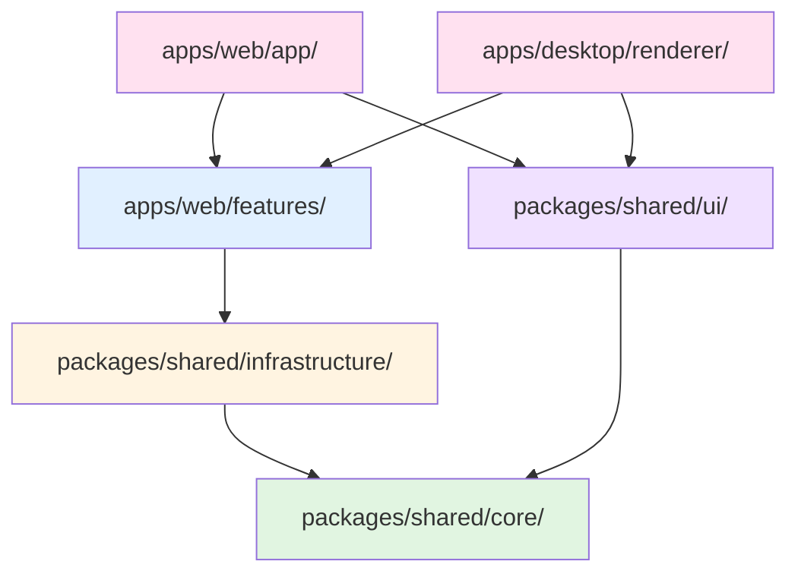
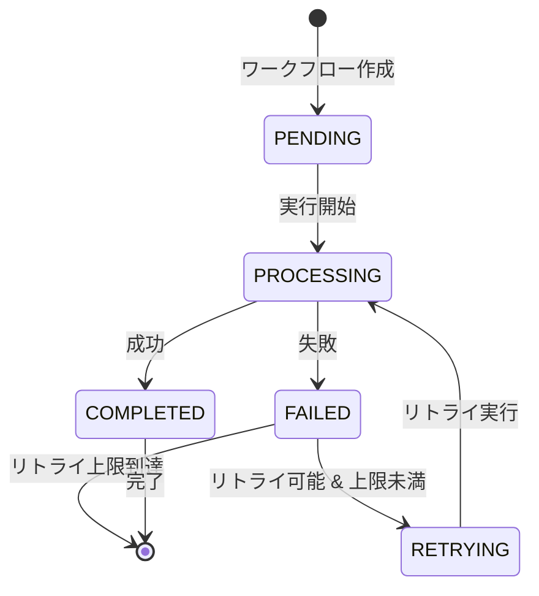
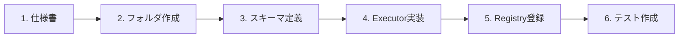

# 統合システム設計仕様書：Universal AI Workflow Orchestrator

## 1. プロジェクト概要 (Overview)

### 1.1 システムの目的

クラウド環境（Next.js）とローカル環境（PC）をシームレスに統合し、チャットツール（Discord/LINE）やファイル操作をトリガーとして、あらゆる業務プロセス（議事録作成、動画要約、データ変換など）を自動実行する「中央司令塔」システムを構築する。

### 1.2 設計の核心概念

1. **Hybrid Architecture (ハイブリッド構成):**
   - 重い AI 処理やデータ管理はクラウドで行う
   - ファイル監視やローカルアプリ連携は PC 上のエージェントが行う
2. **Infinite Extensibility (無限の拡張性):**
   - 将来的に「未知の業務フロー」が追加されても、データベースのテーブル変更を不要にする（JSONB 活用）
   - 機能追加は「プラグイン」のように独立したコードを追加するだけで完了する
3. **Specification-Driven (仕様駆動):**
   - ソースコードではなく「仕様書（Markdown）」を正本とし、AI アシスタント（Claude Code）がそれを読み込んで実装を行うフローを確立する

### 1.3 対象ユーザー

- **開発者:** 機能プラグインを追加実装する者
- **運用者:** システムの監視・保守を行う者
- **エンドユーザー:** Discord/LINE経由でワークフローを実行する者

### 1.4 スコープ定義

#### スコープ内（In Scope）

- クラウドワークフローエンジン（Next.js, Railway）
- ローカルファイル監視エージェント（Node.js）
- Discord Bot / LINEなどのチャットツール連携
- 複数AIプロバイダー対応（OpenAI, Anthropic, Google, xAI）
- PostgreSQL（Neon）によるデータ永続化

#### スコープ外（Out of Scope）

- モバイルアプリケーション
- リアルタイム協調編集機能
- 独自AIモデルのトレーニング
- オンプレミスデプロイメント

### 1.5 アーキテクチャ原則
- Clean Architecture: 依存関係は外から内へ（Infrastructure → Application → Domain）
- Event-driven: 非同期処理、疎結合なサービス連携
- Specification-Driven Development: 仕様書を正とし、実装はその変換結果とする
- Fault Tolerance: 障害を前提とした設計（リトライ、フォールバック、graceful degradation）
- Test-Driven Development（TDD）: すべてのユースケース/機能追加はテスト記述から着手する

---

## 2. 非機能要件 (Non-Functional Requirements)

### 2.1 基本要件（MVP）

| カテゴリ | 要件 | 実装方針 |
|----------|------|----------|
| **認証** | API キーベース認証 | 環境変数で管理、リクエストヘッダーで送信 |
| **通信暗号化** | TLS 1.3 | Railway がデフォルト対応 |
| **機密情報管理** | 環境変数による注入 | `.env`ファイルは `.gitignore` に含める |
| **入力検証** | Zod バリデーション | スキーマ定義を機能ごとに必須化 |
| **ログ出力** | 構造化ログ（JSON形式） | Railway Logs（自動収集） |
| **ファイル保存** | 一時ストレージ | Railway ボリューム or 外部ストレージ |

### 2.2 ロギング仕様

**ログフォーマット（JSON構造化ログ）**:
- **level**: ログレベル（`error`, `warn`, `info`, `debug`）
- **message**: ログメッセージ（人間が読める形式）
- **timestamp**: ISO8601 形式のタイムスタンプ
- **request_id**: リクエスト追跡ID（全ログに必須）
- **workflow_id**: ワークフローID（該当する場合）
- **user_id**: ユーザーID（該当する場合）
- **context**: コンテキスト情報（機能名、処理ステップ等）
- **error**: エラー情報（スタックトレース含む、エラー時のみ）

**ログレベルの使い分け**:
- **error**: システムエラー、例外、障害（即座の対応が必要）
- **warn**: 警告、リトライ、非推奨機能の使用
- **info**: 重要なイベント（ワークフロー開始/完了、デプロイ等）
- **debug**: デバッグ情報（開発環境のみ）

**ログ出力先**:
- 開発環境: console（標準出力）
- 本番環境: Railway Logs（自動収集、7日間保持）

### 2.3 ファイルストレージ戦略

**一時ファイル保存**:
- **保存先**: Railway の一時ボリューム（`/tmp` ディレクトリ）
- **用途**: アップロードファイルの一時保存、AI処理中のファイル
- **制約**: Railway の再デプロイ時に削除される（永続化不要）
- **最大サイズ**: 100MB per ファイル

**永続ストレージ（将来対応）**:
- **保存先候補**: AWS S3、Google Cloud Storage、Cloudflare R2
- **用途**: 処理済みファイルの長期保存、ユーザーダウンロード
- **MVP方針**: 一時保存のみで開始、必要に応じて外部ストレージを追加

**ファイル命名規則**:
- UUID ベース: `{workflow_id}_{timestamp}_{original_filename}`
- セキュリティ: ファイル名のサニタイズ（パストラバーサル対策）

### 2.4 テスト戦略（Test-Driven Development）

#### テストピラミッド

```
        /\
       /E2E\         少（遅い、高コスト、統合テスト）
      /------\
     /統合テスト\      中（API、DB統合）
    /----------\
   / ユニットテスト \   多（高速、低コスト、単体機能）
  /--------------\
 /   静的テスト    \  最多（型チェック、Lint、即座）
/------------------\
```

**各レベルの目的とカバレッジ目標**:
- **静的テスト（100%必須）**: 型エラー、未使用変数、コードスタイル違反の検出
- **ユニットテスト（60%以上）**: 個別関数・クラスの正しさ、境界値テスト
- **統合テスト（主要フロー）**: API エンドポイント、DB操作、外部サービス連携
- **E2Eテスト（クリティカルパス）**: ユーザーフロー、ブラウザ操作、実ファイル処理

#### 静的テスト要件

**TypeScript型チェック**:
- **実行タイミング**: ファイル保存時、PR作成時、デプロイ前
- **strict モード**: 必須、`any` 型の使用を最小限に
- **カバレッジ**: すべての .ts/.tsx ファイル
- **CI統合**: `pnpm typecheck` で型エラーがあればPRマージ不可

**ESLint**:
- **実行タイミング**: ファイル保存時、PR作成時
- **必須ルール**: 未使用変数、未使用インポート、console.log（warn）
- **境界チェック**: `eslint-plugin-boundaries` で依存関係違反を検出
- **自動修正**: 可能なものは `--fix` で自動修正

**Prettier**:
- **実行タイミング**: ファイル保存時
- **統一フォーマット**: シングルクォート、セミコロンあり、タブ幅2
- **適用範囲**: すべての .ts/.tsx/.json/.md ファイル

#### ユニットテスト要件（Vitest）

**テスト対象**:
- 全 Executor クラス（`features/*/executor.ts`）
- 全 スキーマバリデーション（`features/*/schema.ts`）
- ユーティリティ関数
- カスタムフック（React Hooks）

**テストファイル配置**:
- `features/[機能名]/__tests__/executor.test.ts`
- `shared/core/__tests__/`（共通ロジック）
- `shared/infrastructure/__tests__/`（インフラ層、モック使用）

**テスト原則（TDD）**:
1. **Red**: テストを先に書く（失敗を確認）
2. **Green**: 最小限の実装でテストをパスさせる
3. **Refactor**: コードをリファクタリング（テストは維持）

**モック/スタブ方針**:
- **外部API**: すべてモック化（AI API、Discord API等）
- **DB操作**: Repository をモック化、実DBは使用しない
- **ファイルシステム**: メモリ内で完結、実ファイルI/O回避
- **時刻**: `vi.setSystemTime()` で固定

**カバレッジ目標**:
- 全体: 60%以上（MVP では努力目標、本番投入前は必達）
- 重要ロジック（Executor）: 80%以上
- エラーハンドリング: 100%

#### 統合テスト要件

**テスト対象**:
- API エンドポイント（`/api/v1/workflows` 等）
- DB との統合（実際の Neon 接続）
- ワークフロー全体の実行（Executor + Repository + AI Client）

**テスト環境**:
- **DB**: Neon のテスト用データベース（本番とは別）
- **AI API**: モックまたは低コストモデル使用
- **Discord**: Webhook テスト用チャンネル

**データ管理**:
- **セットアップ**: テスト前にシードデータ投入
- **クリーンアップ**: テスト後にデータ削除（トランザクションロールバック推奨）
- **分離**: テストデータは本番データと完全分離

#### E2Eテスト要件（Playwright）

**テスト対象（クリティカルパスのみ）**:
- ユーザー登録・ログインフロー（将来）
- ワークフロー実行フロー（Discord → API → 完了通知）
- ファイルアップロードフロー（Local Agent → Cloud → 処理）

**テスト環境**:
- **ブラウザ**: Chromium（Railway でも実行可能）
- **データ**: E2E専用のテストユーザー・ワークフロー
- **クリーンアップ**: テスト後に全データ削除

**フレーキーテスト対策**:
- **明示的待機**: `waitFor` で要素の出現を待つ
- **リトライロジック**: 不安定なテストは最大3回リトライ
- **タイムアウト**: 適切なタイムアウト設定（デフォルト30秒）

#### TDD実践フロー（必須）

**新機能追加時の手順**:
1. **仕様書作成**: `docs/20-specifications/features/新機能.md`
2. **テスト作成**: `features/新機能/__tests__/executor.test.ts` を先に書く
3. **Red**: テストを実行して失敗を確認
4. **スキーマ定義**: `schema.ts` で入出力定義
5. **Executor実装**: `executor.ts` で最小限の実装
6. **Green**: テストがパスすることを確認
7. **Refactor**: コードを改善、テストは維持
8. **CI実行**: PR作成時に全テストが自動実行

**テスト命名規則**:
- **describe**: 機能名またはクラス名
- **it**: 「should + 動詞」形式（例: `should return summary when valid URL`）
- **Given-When-Then**: テストケース内のコメント

**テスト実行**:
- **開発中**: `pnpm test --watch`（ファイル変更時に自動実行）
- **PR作成時**: CI で全テスト自動実行
- **デプロイ前**: 全テスト + カバレッジチェック

### 2.5 設定ファイル基本要件

**TypeScript設定（tsconfig.json）**:
- **strict モード**: 有効化必須（型安全性の最大化）
- **ESM対応**: `"module": "ESNext"`, `"moduleResolution": "bundler"`
- **パスエイリアス**: `@/*` で `src/*` を参照可能にする
- **型チェック**: `noUnusedLocals`, `noUnusedParameters` を有効化

**ESLint設定（eslint.config.js）**:
- **Flat Config**: ESLint 9.x の新形式（`eslint.config.js`）を使用
- **必須ルール**: `no-unused-vars`, `no-console`（warn）, `@typescript-eslint` ルール
- **境界チェック**: `eslint-plugin-boundaries` で依存関係違反を検出
- **自動修正**: `--fix` オプションで自動修正可能なルールを優先

**Prettier設定**:
- **統一フォーマット**: シングルクォート、セミコロンあり、タブ幅2
- **ESLint統合**: `eslint-config-prettier` で競合回避
- **自動実行**: 保存時に自動フォーマット

**Vitest設定**:
- **グローバル設定**: テストファイルパターン `**/__tests__/**/*.test.ts`
- **カバレッジ**: 本番投入前に最低60%を目標
- **モック**: `vi.mock()` で外部依存をモック化
- **並列実行**: 高速化のためテストを並列実行

**Drizzle設定（drizzle.config.ts）**:
- **接続先**: 環境変数 `DATABASE_URL` から取得
- **スキーマパス**: `src/shared/infrastructure/database/schema.ts`
- **マイグレーションディレクトリ**: `drizzle/migrations/`

---

## 3. テクノロジースタック (Technology Stack)

### 3.1 選定基準

各技術は以下の基準で選定：
- **成熟度:** プロダクション実績があること
- **エコシステム:** ドキュメント・コミュニティが充実していること
- **保守性:** 長期サポートが期待できること
- **AI親和性:** AI（Claude Code）による実装支援が容易であること

### 3.2 Package & Process Management

| 技術 | バージョン | 採用理由 |
|------|-----------|----------|
| **pnpm** | 9.x | ディスク効率、高速インストール、厳格な依存解決 |
| **PM2** | 5.x | プロセス常駐、自動再起動、ログ管理が統合 |

### 3.3 Core Framework (Cloud)

| 技術 | バージョン | 採用理由 |
|------|-----------|----------|
| **Next.js** | 15.x | App Router、Server Actions、RSCによるパフォーマンス最適化 |
| **TypeScript** | 5.x | Strict Mode による型安全性確保 |
| **Node.js** | 22.x LTS | 最新ESM対応、パフォーマンス向上 |

### 3.4 Database & Data Integrity

| 技術 | バージョン | 採用理由 |
|------|-----------|----------|
| **Neon** | - | Serverless PostgreSQL、自動スケーリング、無料枠あり、Railway統合 |
| **Drizzle ORM** | 0.39.x | SQLライク構文、軽量、型推論が優秀 |
| **Zod** | 3.x | TypeScript型との一体化、軽量、エラーメッセージ優秀 |

### 3.5 AI & Logic Modules

| 技術 | バージョン | 採用理由 |
|------|-----------|----------|
| **Vercel AI SDK** | 4.x | 統一インターフェース、ストリーミング対応、構造化出力 |
| **@ai-sdk/openai** | 最新 | GPT-4o対応、Function Calling |
| **@ai-sdk/anthropic** | 最新 | Claude 3.5対応、長文コンテキスト |
| **@ai-sdk/google** | 最新 | Gemini対応、マルチモーダル |
| **date-fns** | 4.x | Tree-shakeable、軽量、イミュータブル |

### 3.6 External Integrations

| 技術 | バージョン | 採用理由 |
|------|-----------|----------|
| **discord.js** | 14.x | 公式推奨、Gateway Intents対応、型定義充実 |
| **googleapis** | 最新 | 公式SDK、全Google API対応 |

### 3.7 Quality Assurance

| 技術 | バージョン | 採用理由 |
|------|-----------|----------|
| **Vitest** | 2.x | Vite互換、ESM対応、高速、Jest互換API |
| **@testing-library/react** | 最新 | ユーザー視点テスト、ベストプラクティス、RTL推奨パターン |
| **@testing-library/user-event** | 最新 | 実ユーザー操作シミュレーション |
| **Playwright** | 最新 | クロスブラウザ、APIテスト、自動待機、E2Eテスト |
| **@axe-core/playwright** | 最新 | WCAG 2.1 AA準拠の自動アクセシビリティテスト |
| **jest-axe** | 最新 | Vitest統合アクセシビリティテスト |
| **Chromatic** | 最新 | ビジュアルリグレッションテスト（Storybook統合） |
| **MSW** | 最新 | Mock Service Worker、型安全なAPIモック |
| **ESLint** | 9.x | Flat Config、プラグイン豊富、境界チェック |
| **Prettier** | 3.x | デファクトスタンダード、ESLint統合 |

### 3.8 Frontend & Desktop Stack

| 技術 | バージョン | 採用理由 |
|------|-----------|----------|
| **React** | 18.x | Server Components、Suspense、Concurrent Features |
| **Electron** | 最新 | クロスプラットフォームデスクトップアプリ |
| **electron-builder** | 最新 | マルチプラットフォームビルド、コード署名、インストーラー生成 |
| **electron-updater** | 最新 | 自動更新システム（stable/beta/alphaチャネル対応） |
| **Vite** | 5.x | 高速ビルド、HMR、ESM対応 |
| **Tailwind CSS** | 3.x | ユーティリティファースト、Design Tokens統合 |
| **shadcn/ui** | 最新 | Headless UIコンポーネント、アクセシビリティ対応、カスタマイズ可能 |
| **Radix UI** | 最新 | Headless Primitives、ARIA対応、キーボードナビゲーション |
| **Zustand** | 最新 | 軽量状態管理、React Context補完 |
| **Jotai** | 最新 | Atomic状態管理、React Suspense統合 |
| **Storybook** | 8.x | コンポーネントカタログ、ビジュアルテスト、ドキュメンテーション |

### 3.9 Infrastructure

| 技術 | 採用理由 |
|------|----------|
| **Railway** | Git統合による自動デプロイ、長時間処理対応、Cron/バックグラウンドジョブ対応、Neonとのシームレス統合、環境変数グループ機能、プレビュー環境自動生成、使用量ベース課金で予測可能なコスト、CLI統合による優れた開発者体験 |
| **GitHub Actions** | GitHub統合、無料枠十分、豊富なアクション、Railway自動デプロイとの親和性 |
| **Railway CLI** | ローカル開発環境との統合、環境変数同期、ログストリーミング、デバッグ効率化、Railwayエコシステムの標準ツール |

---

## 4. ディレクトリ構造（モノレポ - Web/Desktop統合）

### 4.1 設計方針

**モノレポ構造の採用理由**:
- **packages/shared**: Web/Desktop共通のUIコンポーネント、ビジネスロジック、型定義を集約
- **apps/web**: Next.js Webアプリケーション（App Router、Server Components）
- **apps/desktop**: Electronデスクトップアプリケーション（Main/Renderer/Preload分離）
- **features**: 機能ごとの垂直スライス、1フォルダで完結
- **コード再利用**: 最大限のコード共有により、変更容易性と一貫性を実現
- **独立デプロイ**: Web（Railway）とDesktop（GitHub Releases）を独立して管理

### 4.2 ルート構造（モノレポ）

```text
root/
├── .claude/                            # AI開発アシスタント設定（41エージェント、114コマンド、241スキル）
├── docs/                               # 仕様書 (Single Source of Truth)
├── packages/                           # 共有パッケージ
│   └── shared/                         # Web/Desktop共通コード
│       ├── ui/                         # UIコンポーネント（Design System）
│       ├── core/                       # ドメイン共通要素
│       └── infrastructure/             # 共通インフラ
├── apps/                               # アプリケーション
│   ├── web/                            # Next.js Webアプリ
│   └── desktop/                        # Electronデスクトップアプリ
├── local-agent/                        # ローカルエージェント
├── .github/                            # CI/CD
└── 設定ファイル群
```

### 4.3 詳細構造（モノレポ完全版）

```text
root/
├── .claude/
│   ├── memory.md                       # プロジェクトの文脈・経緯
│   ├── rules.md                        # コーディング規約
│   ├── agents/                         # エージェント定義（41エージェント）
│   │   ├── agent_list.md               # エージェント一覧
│   │   ├── frontend-tester.md          # フロントエンドテスト統合
│   │   ├── electron-devops.md          # Electronビルド・配布統合（v2.0.0）
│   │   └── [その他38エージェント]
│   ├── commands/                       # カスタムコマンド（114コマンド）
│   │   ├── ai/
│   │   │   ├── generate-component-tests.md    # コンポーネントテスト生成
│   │   │   ├── setup-electron-updater.md      # Electron自動更新
│   │   │   ├── run-accessibility-audit.md     # a11y監査
│   │   │   └── [その他111コマンド]
│   │   └── sc/                         # ショートカットコマンド
│   └── skills/                         # スキル定義（241スキル）
│       ├── frontend-testing/           # フロントエンドテスト（新規）
│       │   ├── SKILL.md
│       │   ├── resources/              # 6リソースファイル
│       │   ├── templates/              # 4テンプレート
│       │   └── scripts/                # 3スクリプト
│       ├── electron-packaging/         # Electronパッケージング
│       ├── electron-distribution/      # Electron配布
│       └── [その他238スキル]
│
├── docs/
│   ├── 00-requirements/                # 要件定義書
│   │   └── master_system_design.md     # 本ドキュメント
│   ├── 10-architecture/                # アーキテクチャ設計図
│   ├── 20-specifications/              # 詳細仕様書
│   │   └── features/                   # 各機能の仕様
│   └── 99-adr/                         # アーキテクチャ決定記録
│
├── packages/                           # [モノレポ共有パッケージ]
│   └── shared/
│       ├── package.json
│       ├── tsconfig.json
│       │
│       ├── ui/                         # Web/Desktop共通UIコンポーネント
│       │   ├── primitives/             # Primitives層（Radix UI ベース）
│       │   │   ├── Button/
│       │   │   │   ├── Button.tsx
│       │   │   │   ├── Button.test.tsx
│       │   │   │   ├── Button.stories.tsx
│       │   │   │   └── index.ts
│       │   │   ├── Input/
│       │   │   ├── Checkbox/
│       │   │   ├── Radio/
│       │   │   └── [その他Primitives]
│       │   │
│       │   ├── patterns/               # Patterns層（Primitives組み合わせ）
│       │   │   ├── Card/
│       │   │   │   ├── Card.tsx
│       │   │   │   ├── Card.test.tsx
│       │   │   │   └── Card.stories.tsx
│       │   │   ├── Dialog/
│       │   │   ├── Dropdown/
│       │   │   └── [その他Patterns]
│       │   │
│       │   ├── features/               # Features層（業務固有UI）
│       │   │   ├── WorkflowCard/
│       │   │   ├── StatusBadge/
│       │   │   └── [業務コンポーネント]
│       │   │
│       │   ├── templates/              # Templates層（ページレイアウト）
│       │   │   ├── DashboardLayout/
│       │   │   ├── AuthLayout/
│       │   │   └── [その他Layout]
│       │   │
│       │   ├── tokens/                 # Design Tokens（3層構造）
│       │   │   ├── global.ts           # Layer 1: グローバルトークン
│       │   │   ├── alias.ts            # Layer 2: エイリアストークン
│       │   │   └── component.ts        # Layer 3: コンポーネントトークン
│       │   │
│       │   └── __tests__/              # UIコンポーネント統合テスト
│       │       ├── unit/               # ユニットテスト（40%）
│       │       ├── component/          # コンポーネントテスト（40% - RTL）
│       │       ├── integration/        # 統合テスト（15%）
│       │       ├── e2e/                # E2Eテスト（5% - Playwright）
│       │       ├── visual/             # ビジュアルリグレッション（Chromatic）
│       │       └── a11y/               # アクセシビリティ（axe-core）
│       │
│       ├── core/                       # ドメイン共通要素
│       │   ├── entities/               # 共通エンティティ
│       │   │   ├── workflow.ts         # Workflow型定義
│       │   │   ├── user.ts
│       │   │   └── index.ts
│       │   ├── interfaces/             # 共通インターフェース
│       │   │   ├── IWorkflowExecutor.ts
│       │   │   ├── IRepository.ts
│       │   │   └── index.ts
│       │   ├── hooks/                  # カスタムReact Hooks（共通）
│       │   │   ├── useWorkflow.ts
│       │   │   ├── useAuth.ts
│       │   │   ├── __tests__/
│       │   │   └── index.ts
│       │   └── errors/                 # エラークラス
│       │       ├── WorkflowError.ts
│       │       ├── ValidationError.ts
│       │       └── index.ts
│       │
│       └── infrastructure/             # 共通インフラ
│           ├── database/               # DB接続（全機能共通）
│           │   ├── db.ts               # Neon接続
│           │   ├── schema.ts           # Drizzleスキーマ
│           │   ├── migrations/         # マイグレーション
│           │   └── repositories/       # Repository実装
│           │       ├── WorkflowRepository.ts
│           │       └── index.ts
│           ├── ai/                     # AI SDK（全機能共通）
│           │   ├── client.ts           # 統一AIクライアント
│           │   └── providers/          # プロバイダー設定
│           │       ├── openai.ts
│           │       ├── anthropic.ts
│           │       ├── google.ts
│           │       └── xai.ts
│           ├── discord/                # Discord Bot（全機能共通）
│           │   ├── client.ts           # Bot初期化
│           │   ├── events/             # イベントハンドラー
│           │   │   ├── messageCreate.ts
│           │   │   └── interactionCreate.ts
│           │   └── commands/           # スラッシュコマンド
│           │       ├── summarize.ts
│           │       └── status.ts
│           └── storage/                # ファイルストレージ
│               ├── local.ts
│               └── s3.ts (将来)
│
├── apps/                               # [アプリケーション]
│   │
│   ├── web/                            # Next.js Webアプリケーション
│   │   ├── package.json
│   │   ├── tsconfig.json
│   │   ├── next.config.js
│   │   ├── tailwind.config.ts
│   │   ├── vitest.config.ts
│   │   │
│   │   └── src/
│   │       ├── features/               # 機能プラグイン（垂直スライス）
│   │       │   ├── registry.ts         # 機能レジストリ
│   │       │   │
│   │       │   ├── youtube-summarize/  # YouTube要約機能
│   │       │   │   ├── schema.ts
│   │       │   │   ├── executor.ts
│   │       │   │   └── __tests__/
│   │       │   │       └── executor.test.ts
│   │       │   │
│   │       │   ├── meeting-transcribe/ # 議事録文字起こし
│   │       │   │   ├── schema.ts
│   │       │   │   ├── executor.ts
│   │       │   │   └── __tests__/
│   │       │   │
│   │       │   └── [feature-name]/     # 新機能追加パターン
│   │       │       ├── schema.ts
│   │       │       ├── executor.ts
│   │       │       └── __tests__/
│   │       │
│   │       └── app/                    # Next.js App Router
│   │           ├── layout.tsx          # ルートレイアウト
│   │           ├── page.tsx            # ダッシュボード
│   │           ├── globals.css
│   │           │
│   │           ├── api/                # API Routes
│   │           │   ├── v1/
│   │           │   │   ├── workflows/
│   │           │   │   │   ├── route.ts       # POST /api/v1/workflows
│   │           │   │   │   └── [id]/
│   │           │   │   │       └── route.ts   # GET/PATCH/DELETE
│   │           │   │   └── health/
│   │           │   │       └── route.ts
│   │           │   ├── webhook/        # 外部トリガー受信
│   │           │   │   └── generic/
│   │           │   │       └── route.ts
│   │           │   └── agent/          # ローカルAgent連携
│   │           │       ├── upload/
│   │           │       │   └── route.ts
│   │           │       └── poll/
│   │           │           └── route.ts
│   │           │
│   │           └── (dashboard)/        # ダッシュボードページ（将来）
│   │               ├── workflows/
│   │               └── settings/
│   │
│   └── desktop/                        # Electronデスクトップアプリケーション
│       ├── package.json
│       ├── tsconfig.json
│       ├── electron-builder.yml        # ビルド・パッケージング設定
│       ├── forge.config.js             # Electron Forge設定（代替）
│       ├── vite.config.ts              # Viteビルド設定
│       │
│       └── src/
│           ├── main/                   # Main Process（Node.js環境）
│           │   ├── index.ts            # エントリーポイント
│           │   │
│           │   ├── services/           # サービス層
│           │   │   ├── updateService.ts      # electron-updater統合
│           │   │   ├── windowService.ts      # ウィンドウ管理
│           │   │   ├── workflowService.ts    # ワークフロー実行
│           │   │   └── index.ts
│           │   │
│           │   ├── ipc/                # IPC Handlers
│           │   │   ├── workflow.ts     # workflow:* チャネル
│           │   │   ├── update.ts       # update:* チャネル
│           │   │   ├── file.ts         # file:* チャネル
│           │   │   └── index.ts
│           │   │
│           │   └── config/             # Main設定
│           │       ├── window.ts       # BrowserWindow設定
│           │       └── security.ts     # セキュリティ設定
│           │
│           ├── preload/                # Preload Scripts（セキュリティ境界）
│           │   ├── index.ts            # メインPreload
│           │   ├── types.ts            # electronAPI型定義
│           │   └── contextBridge.ts    # contextBridge定義
│           │
│           └── renderer/               # Renderer Process（Chromium環境）
│               ├── index.html          # HTMLエントリー
│               ├── main.tsx            # Reactエントリーポイント
│               ├── App.tsx             # ルートコンポーネント
│               ├── vite-env.d.ts       # Vite型定義
│               │
│               ├── pages/              # ページコンポーネント
│               │   ├── Dashboard.tsx
│               │   ├── Workflows.tsx
│               │   └── Settings.tsx
│               │
│               ├── components/         # Renderer固有コンポーネント
│               │   ├── UpdateNotification.tsx
│               │   ├── TitleBar.tsx    # カスタムタイトルバー（macOS/Windows）
│               │   └── [その他]
│               │
│               ├── hooks/              # Electron固有フック
│               │   ├── useElectronAPI.ts     # IPC通信フック
│               │   ├── useAutoUpdate.ts      # 自動更新フック
│               │   └── index.ts
│               │
│               ├── store/              # 状態管理（Zustand/Jotai）
│               │   ├── workflowStore.ts
│               │   └── settingsStore.ts
│               │
│               └── styles/             # グローバルスタイル
│                   └── globals.css
│
├── local-agent/
│   ├── package.json
│   ├── tsconfig.json
│   ├── ecosystem.config.js             # PM2設定
│   ├── src/
│   │   ├── index.ts                    # エントリーポイント
│   │   ├── config.ts                   # 環境設定
│   │   ├── watcher.ts                  # Chokidarファイル監視
│   │   └── sync.ts                     # API通信
│   └── __tests__/
│       └── watcher.test.ts
│
├── .github/
│   └── workflows/
│       ├── ci.yml                      # PR時のCI（型チェック、lint、テスト）
│       ├── deploy.yml                  # Railway自動デプロイ通知
│       ├── build-electron.yml          # Electronビルド（マルチプラットフォーム）
│       ├── release-electron.yml        # Electronリリース（GitHub Releases）
│       ├── test-frontend.yml           # フロントエンドテスト専用
│       ├── accessibility-audit.yml     # アクセシビリティ監査
│       ├── reusable-test.yml           # 再利用可能ワークフロー
│       └── README.md                   # ワークフロー可視化
│
├── tests/                              # E2Eテスト（Playwright）
│   ├── e2e/
│   │   ├── web/                        # Web E2E
│   │   │   ├── workflow-execution.spec.ts
│   │   │   └── auth.spec.ts
│   │   └── desktop/                    # Desktop E2E
│   │       ├── window-management.spec.ts
│   │       └── auto-update.spec.ts
│   └── a11y/                           # アクセシビリティテスト
│       └── accessibility.test.ts
│
├── package.json                        # ルートpackage.json（ワークスペース定義）
├── pnpm-workspace.yaml                 # モノレポ設定
├── tsconfig.json                       # ベースTypeScript設定
├── eslint.config.js                    # ESLint設定（Flat Config）
├── .prettierrc                         # Prettier設定
├── vitest.config.ts                    # Vitestベース設定
├── playwright.config.ts                # Playwright E2E設定
├── drizzle.config.ts                   # Drizzle設定
├── railway.json                        # Railway設定
├── .env.example                        # 環境変数テンプレート
├── .gitignore
└── README.md
```

### 4.4 モノレポ構造の詳細説明

#### packages/shared/ui/ - デザインシステム（4層コンポーネント）

**設計方針**: Atomic Design + Design Tokens による再利用性と保守性の最大化

**Layer 1: Primitives（プリミティブ層）**
- **責務**: 基本的なUI要素（Button, Input, Checkbox等）
- **技術**: Radix UI（Headless UI）ベース、完全なアクセシビリティ対応
- **テスト**: ユニットテスト + RTLコンポーネントテスト + axe-core
- **例**: `Button/`, `Input/`, `Checkbox/`, `Radio/`, `Select/`, `Slider/`

**Layer 2: Patterns（パターン層）**
- **責務**: Primitivesを組み合わせた複合コンポーネント
- **技術**: shadcn/ui パターン、カスタムロジック
- **テスト**: コンポーネントテスト + インタラクションテスト
- **例**: `Card/`, `Dialog/`, `Dropdown/`, `Tabs/`, `Tooltip/`, `Popover/`

**Layer 3: Features（フィーチャー層）**
- **責務**: 業務固有のUIコンポーネント
- **技術**: PatternsとPrimitivesを組み合わせ
- **テスト**: 統合テスト + E2Eテスト
- **例**: `WorkflowCard/`, `StatusBadge/`, `ExecutionTimeline/`, `AIProviderSelector/`

**Layer 4: Templates（テンプレート層）**
- **責務**: ページ全体のレイアウト
- **技術**: Next.js App Router layouts、Electron window layouts
- **テスト**: E2Eテスト
- **例**: `DashboardLayout/`, `AuthLayout/`, `SettingsLayout/`

#### packages/shared/ui/tokens/ - Design Tokens（3層構造）

**Layer 1: Global Tokens（グローバルトークン）**
```typescript
// global.ts
export const globalTokens = {
  color: {
    blue: { 500: '#3b82f6', 600: '#2563eb' },
    gray: { 100: '#f3f4f6', 900: '#111827' }
  },
  spacing: { 1: '0.25rem', 2: '0.5rem', 4: '1rem' },
  fontSize: { sm: '0.875rem', base: '1rem', lg: '1.125rem' }
};
```

**Layer 2: Alias Tokens（エイリアストークン）**
```typescript
// alias.ts
export const aliasTokens = {
  color: {
    primary: globalTokens.color.blue[500],
    secondary: globalTokens.color.gray[600],
    error: globalTokens.color.red[500]
  }
};
```

**Layer 3: Component Tokens（コンポーネントトークン）**
```typescript
// component.ts
export const componentTokens = {
  button: {
    primary: {
      background: aliasTokens.color.primary,
      text: globalTokens.color.white
    }
  }
};
```

#### apps/desktop/ - Electron構造詳細

**Main Process（Node.js環境）**:
- **役割**: システムAPI、IPC、ウィンドウ管理、自動更新
- **セキュリティ**: Node.js全APIアクセス可能、Renderer から完全分離
- **構成**:
  - `services/`: ビジネスロジック（UpdateService, WindowService）
  - `ipc/`: IPCハンドラー（型安全なチャネル定義）
  - `config/`: BrowserWindow設定、セキュリティ設定

**Preload Scripts（セキュリティ境界）**:
- **役割**: RendererとMain間の安全なブリッジ
- **セキュリティ**: contextBridge経由で制限されたAPIのみ公開
- **型安全**: electronAPI の TypeScript型定義

**Renderer Process（Chromium環境）**:
- **役割**: React UI、ユーザーインタラクション
- **セキュリティ**: sandbox有効、nodeIntegration無効、contextIsolation有効
- **構成**:
  - `pages/`: ページコンポーネント
  - `components/`: Electron固有UI（TitleBar等）
  - `hooks/`: IPC通信フック（useElectronAPI, useAutoUpdate）
  - `store/`: クライアント状態管理（Zustand/Jotai）

#### レイヤー間の依存関係ルール



**依存方向**:
- `apps/web/app/` → `features/` → `packages/shared/infrastructure/` → `packages/shared/core/`
- `apps/desktop/renderer/` → `features/` → `packages/shared/infrastructure/` → `packages/shared/core/`
- `apps/*/` → `packages/shared/ui/` → `packages/shared/core/`
- 逆方向の依存は禁止（ESLint `eslint-plugin-boundaries` で強制）

**各層の責務**:
- `packages/shared/core/`: ビジネスルール、エンティティ定義（外部依存ゼロ）
- `packages/shared/infrastructure/`: 外部サービス接続（DB、AI、Discord）
- `packages/shared/ui/`: Web/Desktop共通UIコンポーネント、Design Tokens
- `apps/web/features/`: Web固有の機能ロジック
- `apps/web/app/`: Next.js App Router、API Routes
- `apps/desktop/src/`: Electron Main/Preload/Renderer（3プロセス分離）

#### pnpm-workspace.yaml 設定

```yaml
packages:
  - 'packages/*'
  - 'apps/*'
  - 'local-agent'
```

#### パッケージ間の依存関係

```json
// apps/web/package.json
{
  "dependencies": {
    "@repo/shared": "workspace:*"  // packages/shared を参照
  }
}

// apps/desktop/package.json
{
  "dependencies": {
    "@repo/shared": "workspace:*"  // 同じパッケージを参照
  }
}
```

---

## 5. アーキテクチャ設計詳細（モノレポ統合アプローチ）

### 5.1 モノレポアーキテクチャの適用

#### レイヤー定義（Web/Desktop統合）

| レイヤー | ディレクトリ | 責務 | 依存許可 | 共有範囲 |
|----------|-------------|------|----------|---------|
| **共通ドメイン** | `packages/shared/core/` | 共通エンティティ、インターフェース定義 | なし（外部依存ゼロ） | Web + Desktop |
| **共通UI** | `packages/shared/ui/` | UIコンポーネント、Design Tokens | shared/core のみ | Web + Desktop |
| **共通インフラ** | `packages/shared/infrastructure/` | DB、AI、Discord等の共通サービス | shared/core のみ | Web + Desktop |
| **機能プラグイン** | `apps/web/features/` | 機能ごとのビジネスロジック | shared/* | Web専用 |
| **Web API層** | `apps/web/app/` | HTTPエンドポイント、Next.js App Router | すべて | Web専用 |
| **Desktop Main** | `apps/desktop/src/main/` | システムAPI、IPC、ウィンドウ管理 | shared/infrastructure, shared/core | Desktop専用 |
| **Desktop Renderer** | `apps/desktop/src/renderer/` | React UI、クライアント状態管理 | shared/ui, shared/core | Desktop専用 |

#### 依存関係ルール（モノレポ版）

```
apps/web/app/ → apps/web/features/ → packages/shared/infrastructure/ → packages/shared/core/
     ↓                                          ↓
packages/shared/ui/ ←─────────────────────────┘

apps/desktop/renderer/ → packages/shared/ui/ → packages/shared/core/
     ↓
apps/desktop/main/ → packages/shared/infrastructure/ → packages/shared/core/
```

**主要原則**:
- **内側から外側への依存禁止**: `packages/shared/core/` は外部依存ゼロ
- **機能の独立性**: `features/` 各機能は相互依存禁止
- **共通コードの活用**: UI、ビジネスロジック、インフラを `packages/shared/` で共有
- **プラットフォーム分離**: Web固有（apps/web）とDesktop固有（apps/desktop）を明確に分離
- **ESLint 強制**: `eslint-plugin-boundaries` で違反を CI でブロック

#### モノレポ構造の利点

1. **コード再利用**: UIコンポーネント、ビジネスロジック、型定義をWeb/Desktopで共有
2. **一貫性**: 同一のDesign TokensとコンポーネントによりUI/UXを統一
3. **変更容易性**: 1箇所の変更が両プラットフォームに反映
4. **独立デプロイ**: Web（Railway）とDesktop（GitHub Releases）を独立して管理
5. **テスト効率**: 共通コンポーネントのテストを一度だけ実装

#### 機能追加の具体例

**YouTube要約機能を追加する場合の実装フロー**:

**ステップ1: スキーマ定義（`features/youtube-summarize/schema.ts`）**
- Zod を使用して入力スキーマを定義
- 入力フィールド: `url`（URL型、必須）、`language`（列挙型、デフォルト'ja'）
- 出力フィールド: `summary`（文字列）、`keyPoints`（文字列配列）
- スキーマのエクスポートにより型安全性を確保

**ステップ2: Executor実装（`features/youtube-summarize/executor.ts`）**
- `IWorkflowExecutor` インターフェースを実装したクラスを定義
- `type` プロパティに 'YOUTUBE_SUMMARIZE' を設定
- `execute` メソッド内で以下を実行:
  1. 入力データを Zod スキーマでバリデーション
  2. `@/shared/infrastructure/ai/client` から AI クライアントを取得
  3. プロバイダー指定（openai、anthropic等）で AI 処理を実行
  4. 結果を出力スキーマでバリデーションして返却

**ステップ3: Registry登録（`features/registry.ts`）**
- YouTubeSummarizeExecutor クラスを import
- registry の Map に `['YOUTUBE_SUMMARIZE', new YouTubeSummarizeExecutor()]` を追加
- これにより、API経由で type='YOUTUBE_SUMMARIZE' 指定時に自動的に実行される

**この構造の利点**:
- ✅ 機能追加: `features/新機能/` フォルダ作成のみ
- ✅ AI クライアント: shared/infrastructure/ai から取得（重複なし）
- ✅ テスト: `features/新機能/__tests__/` で完結
- ✅ 削除: フォルダごと削除可能
- ✅ 機能間の独立性: 他機能への影響ゼロ

### 5.2 データベース設計原則

#### 5.2.1 リレーショナルDB設計方針

**基本原則**:
- **正規化**: 第3正規形までを基本とし、パフォーマンス上必要な場合のみ意図的な非正規化
- **JSONB活用**: 柔軟なスキーマが必要な箇所（workflow の input/output）は JSONB を使用
- **UUID主キー**: 分散システム対応、推測不可能性、セキュリティ向上
- **タイムスタンプ**: `created_at`, `updated_at` を全テーブルに必須
- **ソフトデリート**: 物理削除ではなく `deleted_at` カラムによる論理削除を推奨

**トランザクション管理**:
- **ACID特性**: すべての DB 操作はトランザクション内で実行
- **分離レベル**: デフォルトは READ COMMITTED、必要に応じて SERIALIZABLE
- **ロック戦略**: 楽観的ロック（バージョニング）を優先、悲観的ロックは最小限
- **トランザクション境界**: Repository パターンでカプセル化

**インデックス戦略**:
- **検索条件**: WHERE 句で頻繁に使用するカラムにインデックス
- **外部キー**: 全外部キーにインデックス（JOIN 性能向上）
- **複合インデックス**: 複数カラムでの検索は複合インデックス
- **JSONB索引**: GIN インデックスで JSONB カラムの検索を高速化
- **カーディナリティ**: 選択性の高いカラムを優先

**マイグレーション原則**:
- **バージョン管理**: すべてのスキーマ変更は Drizzle マイグレーションで管理
- **ロールバック可能**: UP/DOWN マイグレーションを必ず定義
- **データ移行**: スキーマ変更とデータ移行を分離（安全性向上）
- **本番適用**: ダウンタイムを最小化（オンラインマイグレーション）

#### 5.2.2 ベクトルデータベース設計（pgvector）

**採用理由**:
- **pgvector**: PostgreSQL 拡張、Neon でネイティブサポート、追加インフラ不要
- **用途**: AI 埋め込みベクトルの保存、セマンティック検索、類似検索
- **統合性**: リレーショナルデータとベクトルデータを同一DB で管理

**ベクトル設計方針**:
- **次元数**: 使用する AI モデルに応じて設定（OpenAI: 1536次元、Claude: 3072次元等）
- **距離関数**: コサイン類似度（`<=>` 演算子）を標準使用
- **インデックス**: HNSW または IVFFlat インデックスで検索高速化
- **正規化**: ベクトルは L2 正規化を推奨

**ベクトルテーブル設計パターン**:
```
embeddings テーブル:
- id: UUID（主キー）
- resource_type: VARCHAR（リソース種別: 'workflow', 'document'等）
- resource_id: UUID（元リソースへの外部キー）
- embedding: VECTOR(dimension)（埋め込みベクトル）
- metadata: JSONB（メタデータ）
- created_at: TIMESTAMPTZ
```

**類似検索クエリパターン**:
- ORDER BY embedding <=> query_vector（コサイン類似度）
- LIMIT で上位N件取得
- WHERE 句で resource_type によるフィルタ併用

#### 5.2.3 workflows テーブル（主要エンティティ）

| カラム名 | データ型 | NULL | デフォルト | 説明 |
|----------|----------|------|------------|------|
| `id` | UUID | NO | `gen_random_uuid()` | 主キー |
| `type` | VARCHAR(50) | NO | - | ワークフロー識別子 |
| `user_id` | VARCHAR(100) | NO | - | 実行ユーザーID |
| `status` | ENUM | NO | `'PENDING'` | 実行状態 |
| `input_payload` | JSONB | YES | `'{}'` | 入力データ（柔軟なスキーマ） |
| `output_payload` | JSONB | YES | `NULL` | 出力データ（柔軟なスキーマ） |
| `error_log` | TEXT | YES | `NULL` | エラー詳細 |
| `retry_count` | INTEGER | NO | `0` | リトライ回数 |
| `created_at` | TIMESTAMPTZ | NO | `NOW()` | 作成日時 |
| `updated_at` | TIMESTAMPTZ | NO | `NOW()` | 更新日時 |
| `completed_at` | TIMESTAMPTZ | YES | `NULL` | 完了日時 |
| `deleted_at` | TIMESTAMPTZ | YES | `NULL` | 削除日時（ソフトデリート） |

**status ENUM 値**:

| 値 | 説明 | 遷移元 | 遷移条件 |
|----|------|--------|----------|
| `PENDING` | 実行待ち | 初期状態 | ワークフロー作成時 |
| `PROCESSING` | 実行中 | PENDING, RETRYING | Executor実行開始時 |
| `COMPLETED` | 正常完了 | PROCESSING | Executor正常終了時 |
| `FAILED` | 失敗 | PROCESSING | Executor異常終了時（retry_count < MAX_RETRY_COUNT） |
| `RETRYING` | リトライ中 | FAILED | retry_count < MAX_RETRY_COUNT かつ retryable エラー |

**状態遷移図**:


**インデックス設計**:

| インデックス名 | カラム | 用途 |
|---------------|--------|------|
| `idx_workflows_status` | `status` | ステータス別検索 |
| `idx_workflows_user_id` | `user_id` | ユーザー別検索 |
| `idx_workflows_type_status` | `type, status` | タイプ＆ステータス複合検索 |
| `idx_workflows_created_at` | `created_at DESC` | 時系列ソート |
| `idx_workflows_input_payload` | `input_payload` GIN | JSONB 検索高速化 |
| `idx_workflows_deleted_at` | `deleted_at` | ソフトデリート対応（WHERE deleted_at IS NULL） |

---

## 6. コアインターフェース仕様 (Core Interface Specification)

### 6.1 IWorkflowExecutor インターフェース

すべての機能プラグインが実装すべきインターフェース。

#### プロパティ

| プロパティ | 型 | 説明 |
|------------|------|------|
| `type` | `string` | ワークフロータイプ識別子（例: `'YOUTUBE_SUMMARIZE'`） |
| `displayName` | `string` | 表示名（例: `'YouTube動画要約'`） |
| `description` | `string` | 機能説明 |
| `inputSchema` | `ZodSchema` | 入力バリデーションスキーマ |
| `outputSchema` | `ZodSchema` | 出力バリデーションスキーマ |

#### メソッド

| メソッド | シグネチャ | 説明 |
|----------|-----------|------|
| `execute` | `(input: Input, context: ExecutionContext) => Promise<Output>` | メイン実行処理 |
| `validate` | `(input: unknown) => Result<Input, ValidationError>` | 入力検証（オプション） |
| `canRetry` | `(error: Error) => boolean` | リトライ可否判定（オプション） |

#### ExecutionContext

| フィールド | 型 | 説明 |
|------------|------|------|
| `workflowId` | `string` | ワークフローID |
| `userId` | `string` | 実行ユーザーID |
| `logger` | `Logger` | 構造化ロガー |
| `abortSignal` | `AbortSignal` | キャンセルシグナル |

### 6.2 IRepository インターフェース

データアクセスの抽象化。

#### メソッド

| メソッド | シグネチャ | 説明 |
|----------|-----------|------|
| `create` | `(data: CreateDTO) => Promise<Entity>` | エンティティ作成 |
| `findById` | `(id: string) => Promise<Entity \| null>` | ID検索 |
| `findMany` | `(filter: FilterDTO) => Promise<Entity[]>` | 複数検索 |
| `update` | `(id: string, data: UpdateDTO) => Promise<Entity>` | 更新 |
| `delete` | `(id: string) => Promise<void>` | 削除 |

---

## 7. エラーハンドリング仕様 (Error Handling)

### 7.1 エラー分類

| カテゴリ | エラーコード範囲 | リトライ | 例 |
|----------|-----------------|----------|-----|
| **Validation Error** | 1000-1999 | 不可 | 入力スキーマ不正 |
| **Business Error** | 2000-2999 | 不可 | 権限不足、リソース不存在 |
| **External Service Error** | 3000-3999 | 可能 | AI API タイムアウト |
| **Infrastructure Error** | 4000-4999 | 可能 | DB 接続失敗 |
| **Internal Error** | 5000-5999 | 不可 | 実装バグ |

### 7.2 リトライ戦略

| 設定項目 | 値 | 説明 |
|----------|-----|------|
| 最大リトライ回数 | 3回 | `MAX_RETRY_COUNT` |
| 初期待機時間 | 1000ms | 指数バックオフの基準値 |
| バックオフ係数 | 2 | 待機時間の増加率 |
| 最大待機時間 | 30000ms | 待機時間の上限 |
| ジッター | ±20% | 同時リトライ回避 |

#### リトライ対象判定

- **リトライする（retryable: true）**: HTTP 429, 500-503, ネットワークエラー, タイムアウト
- **リトライしない（retryable: false）**: HTTP 400-403, バリデーションエラー, ビジネスエラー

#### サーキットブレーカー（将来対応）

**閾値設定**:
- **失敗カウント**: 連続5回失敗で回路オープン
- **タイムアウト**: 30秒
- **復旧待機**: 60秒後に半開状態（Half-Open）へ遷移
- **適用対象**: 外部API（AI、Discord等）

### 7.3 エラーレスポンス形式

**JSON形式の標準エラーレスポンス**:

```json
{
  "success": false,              // 処理失敗を示すフラグ
  "error": {
    "code": "ERR_3001",          // エラーコード（7.1のカテゴリに対応）
    "message": "AI処理中にタイムアウトが発生しました",  // 人間が読めるエラーメッセージ
    "details": {                 // エラーの詳細情報
      "provider": "openai",      // 使用していたAIプロバイダー
      "timeout_ms": 30000        // タイムアウト時間
    },
    "retryable": true            // リトライ可能かどうか
  },
  "request_id": "req_xxxx"       // リクエスト追跡ID（ログと紐付け）
}
```

**フィールド説明**:
- **success**: 常に false（エラーレスポンスのため）
- **error.code**: エラー分類コード（1000-5999の範囲、7.1 参照）
- **error.message**: ユーザー向けのエラーメッセージ（日本語）
- **error.details**: デバッグ用の詳細情報（オブジェクト形式）
- **error.retryable**: クライアントがリトライすべきかの判定フラグ
- **request_id**: ログとの紐付け用ID（トラブルシューティング用）

---

## 8. REST API 設計原則 (API Design Principles)

### 8.1 API 設計方針

**RESTful 原則の適用**:
- リソース指向: URL はリソースを表現（動詞ではなく名詞）
- HTTPメソッド: GET（取得）、POST（作成）、PUT/PATCH（更新）、DELETE（削除）
- ステートレス: 各リクエストは独立、セッション情報をサーバーに保持しない
- 統一インターフェース: 一貫したレスポンス形式、エラーハンドリング

### 8.2 APIバージョニング

**バージョニング戦略**:
- 方式: URL パスベース（`/api/v1/...`、`/api/v2/...`）
- 後方互換性: マイナーバージョンアップでは既存エンドポイントを維持
- 非推奨化: Deprecated ヘッダーで警告、最低6ヶ月のサポート期間
- ドキュメント: バージョンごとの変更履歴を明記

### 8.3 HTTPステータスコード

**成功レスポンス**:
- **200 OK**: リソース取得成功（GET）
- **201 Created**: リソース作成成功（POST）、Location ヘッダーで新リソース URL を返す
- **204 No Content**: 更新/削除成功、レスポンスボディなし（PUT/DELETE）

**クライアントエラー（4xx）**:
- **400 Bad Request**: リクエスト形式不正、バリデーションエラー
- **401 Unauthorized**: 認証失敗、認証情報なし/無効
- **403 Forbidden**: 認証済みだが権限不足
- **404 Not Found**: リソースが存在しない
- **409 Conflict**: リソースの競合（例: 重複作成）
- **422 Unprocessable Entity**: バリデーションエラー（詳細エラー情報付き）
- **429 Too Many Requests**: レート制限超過

**サーバーエラー（5xx）**:
- **500 Internal Server Error**: サーバー内部エラー
- **502 Bad Gateway**: 上流サービスエラー
- **503 Service Unavailable**: 一時的なサービス停止
- **504 Gateway Timeout**: 上流サービスタイムアウト

### 8.4 リクエスト/レスポンス形式

**共通ヘッダー**:
- **Content-Type**: `application/json; charset=utf-8`
- **Authorization**: `Bearer <token>` 形式
- **X-Request-ID**: リクエスト追跡ID（クライアントが生成、またはサーバーが自動付与）
- **Accept-Language**: `ja`, `en` 等（多言語対応）

**成功レスポンス形式**:
```json
{
  "success": true,                // 成功フラグ
  "data": { ... },                // リソースデータ
  "meta": {                       // メタデータ（オプション）
    "request_id": "req_xxx",
    "timestamp": "2025-11-21T10:00:00Z"
  }
}
```

**エラーレスポンス形式**:
```json
{
  "success": false,
  "error": {
    "code": "ERR_xxxx",           // エラーコード
    "message": "エラーメッセージ",
    "details": { ... },           // 詳細情報
    "retryable": true|false       // リトライ可否
  },
  "meta": {
    "request_id": "req_xxx",
    "timestamp": "2025-11-21T10:00:00Z"
  }
}
```

### 8.5 ページネーション

**クエリパラメータ**:
- `page`: ページ番号（1始まり）
- `limit`: 1ページあたりの件数（デフォルト: 20、最大: 100）
- `offset`: オフセット方式の場合（`page` の代替）

**レスポンス形式**:
```json
{
  "success": true,
  "data": [ ... ],
  "pagination": {
    "page": 1,
    "limit": 20,
    "total": 150,
    "total_pages": 8,
    "has_next": true,
    "has_prev": false
  }
}
```

### 8.6 フィルタリング・ソート

**クエリパラメータ**:
- `filter[field]`: フィールドでフィルタ（例: `filter[status]=COMPLETED`）
- `sort`: ソートフィールド（例: `sort=created_at`、降順は `-created_at`）
- `fields`: 取得フィールドの選択（例: `fields=id,type,status`）

### 8.7 認証・認可

**認証方式**:
- Bearer Token 方式（`Authorization: Bearer <token>`）
- API キーの管理: 環境変数で保持、リクエストヘッダーで送信
- トークンの有効期限: 実装に応じて設定（JWT の場合は exp クレーム）

**認可レベル**:
- **Public**: 認証不要（ヘルスチェック等）
- **Authenticated**: 認証必須、リソース所有者のみアクセス可
- **Admin**: 管理者権限必須

### 8.8 レート制限

**制限方式**:
- ヘッダーで制限情報を返却:
  - `X-RateLimit-Limit`: 制限値
  - `X-RateLimit-Remaining`: 残り回数
  - `X-RateLimit-Reset`: リセット時刻（Unix timestamp）
- 制限超過時: HTTP 429、Retry-After ヘッダーで待機時間を指示

**制限レベル**:
- グローバル: IP ごと、時間ウィンドウごとの総リクエスト数
- エンドポイント別: 負荷の高いエンドポイントは個別制限
- ユーザー別: 認証済みユーザーごとの制限

### 8.9 CORS設定

**許可設定**:
- `Access-Control-Allow-Origin`: 許可するオリジン
- `Access-Control-Allow-Methods`: GET, POST, PUT, DELETE, OPTIONS
- `Access-Control-Allow-Headers`: Authorization, Content-Type, X-Request-ID
- `Access-Control-Max-Age`: プリフライトリクエストのキャッシュ時間

### 8.10 エンドポイント命名規則

**RESTful 命名パターン**:
- コレクション: `/api/v1/workflows`（複数形）
- 個別リソース: `/api/v1/workflows/{id}`
- サブリソース: `/api/v1/workflows/{id}/executions`
- アクション: 動詞が必要な場合は `/api/v1/workflows/{id}/retry`

**禁止パターン**:
- ❌ `/api/v1/getWorkflows` （動詞を含める）
- ❌ `/api/v1/workflow` （単数形）
- ✅ `/api/v1/workflows` （複数形）

### 8.11 具体的なエンドポイント例（参考）

**ワークフロー管理**:
- `POST /api/v1/workflows`: ワークフロー作成
- `GET /api/v1/workflows/{id}`: ワークフロー取得
- `GET /api/v1/workflows`: ワークフロー一覧
- `PATCH /api/v1/workflows/{id}`: ワークフロー更新
- `DELETE /api/v1/workflows/{id}`: ワークフロー削除

**ファイル操作**:
- `POST /api/v1/files/upload`: ファイルアップロード
- `GET /api/v1/files/{id}/download`: ファイルダウンロード

**ヘルスチェック**:
- `GET /api/health`: システムヘルスチェック（認証不要）
- `GET /api/v1/status`: 詳細ステータス（認証必要）

---

## 9. ローカルエージェント仕様 (Local Agent)

### 9.1 機能概要

- 指定ディレクトリの監視（Chokidar）
- ファイル追加検知時のクラウドアップロード
- 完了ワークフローのポーリングと成果物ダウンロード

### 9.2 設定項目

| 環境変数 | 必須 | デフォルト | 説明 |
|----------|------|------------|------|
| `API_BASE_URL` | YES | - | クラウドAPIのベースURL |
| `AGENT_SECRET_KEY` | YES | - | 認証キー |
| `WATCH_DIR` | YES | - | 監視対象ディレクトリ |
| `OUTPUT_DIR` | YES | - | 成果物保存ディレクトリ |
| `POLL_INTERVAL_MS` | NO | 30000 | ポーリング間隔 |
| `MAX_FILE_SIZE_MB` | NO | 100 | 最大ファイルサイズ |

### 9.3 監視ルール

#### 対象ファイル

- 拡張子: `.mp3`, `.mp4`, `.wav`, `.pdf`, `.txt`, `.csv`
- サイズ: `MAX_FILE_SIZE_MB` 以下

#### 除外パターン

- `.` で始まるファイル（隠しファイル）
- `~` で終わるファイル（一時ファイル）
- `node_modules/` 配下
- `.git/` 配下

### 9.4 PM2 設定

**ecosystem.config.js の設定項目**:

```javascript
{
  name: 'ai-workflow-agent',              // プロセス名
  script: './dist/index.js',              // エントリーポイント（ビルド済みJS）
  instances: 1,                           // プロセス数（シングルインスタンス）
  autorestart: true,                      // クラッシュ時に自動再起動
  max_restarts: 10,                       // 最大再起動回数（無限ループ防止）
  restart_delay: 5000,                    // 再起動までの待機時間（5秒）
  watch: false,                           // ファイル監視モード無効（本番用）
  max_memory_restart: '500M',             // メモリ500MB超過で再起動
  log_date_format: 'YYYY-MM-DD HH:mm:ss', // ログの日時フォーマット
  error_file: './logs/error.log',         // エラーログ出力先
  out_file: './logs/out.log',             // 標準出力ログ出力先
  merge_logs: true                        // 複数インスタンスのログを統合
}
```

**設定項目の説明**:
- **autorestart**: プロセスがクラッシュした場合、自動的に再起動
- **max_restarts**: 短時間に連続でクラッシュする場合の上限（10回）
- **restart_delay**: 再起動前の待機時間（即座の再起動を防ぐ）
- **max_memory_restart**: メモリリークを防ぐための自動再起動トリガー
- **watch**: 開発環境では true、本番環境では false に設定
- **ログ設定**: 標準出力とエラー出力を別ファイルに記録、日時付き

---

## 10. Discord Bot 仕様 (Discord Integration)

### 10.1 イベントハンドリング

| イベント | トリガー | 処理 |
|----------|----------|------|
| `messageCreate` | Bot メンション or 指定チャンネル投稿 | ワークフロー起動 |
| `interactionCreate` | スラッシュコマンド | コマンド実行 |

### 10.2 スラッシュコマンド

| コマンド | 説明 | パラメータ |
|----------|------|------------|
| `/summarize` | YouTube動画を要約 | `url`: 動画URL |
| `/status` | ワークフロー状態確認 | `id`: ワークフローID |
| `/help` | ヘルプ表示 | なし |

### 10.3 メッセージ解析ルール

以下の優先順位で `type` を判定：

1. URLパターンマッチ（YouTube, Google Drive 等）
2. ファイル添付の拡張子
3. 自然言語解析（AI推論）
4. デフォルトフォールバック

### 10.4 レート制限

- グローバル: 50リクエスト/秒
- チャンネルごと: 5メッセージ/5秒
- ユーザーごと: 5コマンド/30秒

---

## 11. 機能プラグイン追加手順（ハイブリッド構造）

### 11.1 追加フロー（簡素化）



**ステップ詳細**:

1. **仕様書作成**: `docs/20-specifications/features/<feature-name>.md`
2. **フォルダ作成**: `src/features/<feature-name>/` ディレクトリ作成
3. **スキーマ定義**: `schema.ts` で入出力の Zod スキーマ定義
4. **Executor実装**: `executor.ts` で `IWorkflowExecutor` 実装
5. **Registry登録**: `src/features/registry.ts` に1行追加
6. **テスト作成**: `__tests__/executor.test.ts` にユニットテスト

### 11.2 ファイル構成テンプレート

**新機能追加時の最小構成**:

```
src/features/新機能名/
├── schema.ts           # 入出力スキーマ（Zod）
├── executor.ts         # ビジネスロジック
└── __tests__/
    └── executor.test.ts
```

### 11.3 共通インフラの使用方法

**AI クライアントの使用**:
- インポート元: `@/shared/infrastructure/ai/client`
- 関数: `createAIClient(provider)` でクライアント取得
- プロバイダー選択: 'openai', 'anthropic', 'google', 'xai' のいずれかを指定
- 戻り値: 統一インターフェースを持つ AI クライアントオブジェクト
- 用途: テキスト生成、要約、翻訳などの AI 処理

**データベースアクセス**:
- インポート元: `@/shared/infrastructure/database/db`
- DB接続: `db` オブジェクト経由で Drizzle ORM を使用
- Repository: `@/shared/infrastructure/database/repositories` から各エンティティの Repository を取得
- 用途: workflow の CRUD 操作、ステータス更新

**Discord通知**:
- インポート元: `@/shared/infrastructure/discord/client`
- 関数: `sendDiscordMessage()` でメッセージ送信
- 用途: ワークフロー完了通知、エラー通知

### 11.4 実装要件チェックリスト

- [ ] `IWorkflowExecutor` インターフェースを実装
- [ ] 入出力は Zod でバリデーション
- [ ] 共通インフラ（AI、DB）は `@/shared/infrastructure/` から import
- [ ] エラーは `WorkflowError` サブクラスをスロー
- [ ] `features/registry.ts` に登録
- [ ] ユニットテストを `__tests__/` に作成

---

## 12. デプロイメント (Deployment)

### 12.1 Railway 自動デプロイ（MVP）

**Git統合による自動デプロイ:**
- `main` ブランチへのプッシュ → 自動デプロイ

**基本設定（railway.json）:**
```json
{
  "$schema": "https://railway.app/railway.schema.json",
  "build": {
    "builder": "NIXPACKS",                     // Railway標準ビルダー（Dockerfile不要）
    "buildCommand": "pnpm install && pnpm build"  // 依存関係インストール → Next.jsビルド
  },
  "deploy": {
    "startCommand": "pnpm start",              // Next.js本番サーバー起動
    "restartPolicyType": "ON_FAILURE"          // 失敗時のみ自動再起動
  }
}
```

**設定項目の説明**:
- **builder**: Nixpacks を使用（Dockerfile 不要で自動コンテナ化）
- **buildCommand**: pnpm で依存関係をインストール後、Next.js をビルド
- **startCommand**: ビルド済みの Next.js アプリケーションを本番モードで起動
- **restartPolicyType**: プロセスが異常終了した場合のみ自動再起動（正常終了時は再起動しない）

### 12.2 GitHub Actions ワークフロー要件

#### ワークフロー構成

**必要なワークフロー**:
- `ci.yml`: PR時のCI（テスト・型チェック・ビルド）
- `deploy.yml`: mainマージ時のデプロイ通知
- `reusable-test.yml`: 再利用可能なテストワークフロー（将来用）
- `README.md`: ワークフロー全体の可視化（Mermaid図）

#### ci.yml の要件（PR時のCI）

**トリガー条件**:
- PRが main ブランチに作成されたとき

**実行内容（必須）**:
1. リポジトリコードの取得
2. pnpm のセットアップ（バージョン: 9.x）
3. Node.js のセットアップ（バージョン: 22.x LTS）
4. pnpm キャッシュの有効化
5. 依存関係のインストール（frozen-lockfile モード）
6. TypeScript 型チェックの実行
7. ESLint によるコード品質チェック
8. Next.js ビルドの確認
9. Vitest によるユニットテストの実行

**品質ゲート**:
- すべてのステップが成功しない限り、PR をマージできないようにする
- テストは前のステップが失敗しても必ず実行する

#### deploy.yml の要件（mainマージ時）

**トリガー条件**:
- main ブランチへのプッシュ（PR マージ時）

**実行内容（必須）**:
1. Railway の自動デプロイが開始されたことを確認
2. Discord Webhook への通知:
   - 成功時: デプロイ開始通知（コミット情報、ブランチ、作成者を含む）
   - 失敗時: エラー通知

**通知要件**:
- Discord Embed 形式で視認性を向上
- コミットハッシュ、ブランチ名、作成者を含める
- タイムスタンプを付与

#### 再利用可能ワークフローの要件

**パラメータ化が必要な項目**:
- Node.js バージョン（デフォルト: 22）
- 作業ディレクトリ（モノレポ対応、デフォルト: '.'）

**用途**:
- 将来的に local-agent など複数のサブプロジェクトで同じテストフローを再利用
- テストロジックの重複を排除

#### ワークフロー可視化の要件

**Mermaid図で以下を可視化**:
- ワークフロー全体図: PR作成 → CI → レビュー → マージ → デプロイ → 通知
- CI ワークフロー詳細図: 各ステップの実行順序

#### GitHub Secrets の要件

**必要な Secrets**:
- `DISCORD_WEBHOOK_URL`: Discord通知用WebhookURL

**セキュリティ要件**:
- Secrets は GitHub リポジトリの Settings から設定
- 環境変数として安全に注入
- ログに出力されないようマスク処理

---

## 13. 環境変数（MVP）

### 13.1 必須環境変数

**Cloud（Railway）:**

| 変数名 | 説明 | 設定方法 |
|--------|------|----------|
| `DATABASE_URL` | Neon接続文字列 | Neon Plugin自動注入 |
| `OPENAI_API_KEY` | OpenAI APIキー（GPT-5等） | Railway Secrets |
| `ANTHROPIC_API_KEY` | Anthropic APIキー（Claude 4.5 sonnet等） | Railway Secrets |
| `GOOGLE_AI_API_KEY` | Google AI APIキー（Gemini等） | Railway Secrets |
| `XAI_API_KEY` | xAI APIキー（Grok-4.1-fastなど） | Railway Secrets |
| `DISCORD_TOKEN` | Discord Botトークン | Railway Secrets |
| `DISCORD_CLIENT_ID` | Discord Client ID | Railway Variables |
| `AGENT_SECRET_KEY` | Agent認証キー | Railway Secrets |

**Local Agent:**

| 変数名 | 説明 |
|--------|------|
| `API_BASE_URL` | Railway デプロイURL |
| `AGENT_SECRET_KEY` | Cloud と同じ値 |
| `WATCH_DIR` | 監視ディレクトリ（例: `./InputBox`） |
| `OUTPUT_DIR` | 出力ディレクトリ（例: `./OutputBox`） |

### 13.2 ローカル開発

**Railway CLI による環境変数同期**:

```bash
# Railway の環境変数一覧を表示
railway variables

# Railway の環境変数を使用してローカル実行
railway run pnpm dev
```

**コマンド説明**:
- **railway variables**: Railway に設定された環境変数を一覧表示（確認用）
- **railway run**: Railway の環境変数をロードした状態でコマンド実行
- **pnpm dev**: Next.js を開発モードで起動（ホットリロード有効）

**ローカル開発フロー**:
1. Railway CLI で環境変数を同期
2. `railway run pnpm dev` でローカルサーバー起動
3. `http://localhost:3000` で動作確認
4. Railway の環境変数が自動的にロードされる（.env ファイル不要）

---

## 14. 用語集 (Glossary)

| 用語 | 定義 |
|------|------|
| **Workflow** | システムが実行する一連の処理単位 |
| **Executor** | Workflow を実行するクラス |
| **Registry** | type文字列とExecutorクラスの対応表 |
| **Local Agent** | PC上で動作するファイル監視・同期プログラム |
| **Railway** | 本システムのホスティング環境 |
| **Nixpacks** | Railwayのビルダー |
| **モノレポ** | 複数のパッケージ/アプリを1つのリポジトリで管理する構造（pnpm workspaces使用） |
| **ハイブリッドアーキテクチャ** | 共通インフラ（shared）と機能プラグイン（features）を組み合わせた構造 |
| **垂直スライス** | 機能ごとに必要な全要素を1フォルダに集約する設計手法 |
| **packages/shared** | Web/Desktop共通コード（ui, core, infrastructure） |
| **apps/web** | Next.js Webアプリケーション（App Router、Server Components） |
| **apps/desktop** | Electronデスクトップアプリケーション（Main/Preload/Renderer） |
| **features** | 機能ごとの独立したビジネスロジック層 |
| **Design Tokens** | デザイン要素を抽象化した変数（色、サイズ、フォント等）の3層構造 |
| **Headless UI** | スタイルを持たないロジックのみのUIコンポーネント（Radix UI） |
| **Atomic Design** | 4層コンポーネント階層（Primitives/Patterns/Features/Templates） |
| **RTL** | React Testing Library、ユーザー視点のコンポーネントテスト |
| **axe-core** | アクセシビリティ自動テストエンジン（WCAG 2.1 AA準拠） |
| **Main Process** | Electronのメインプロセス（Node.js環境、システムAPI） |
| **Renderer Process** | Electronのレンダラープロセス（Chromium環境、sandboxed） |
| **Preload Scripts** | RendererとMain間のセキュアなブリッジ（contextBridge） |
| **contextBridge** | Rendererに安全にAPIを公開するElectronの仕組み |
| **contextIsolation** | RendererとPreloadのコンテキスト分離（セキュリティ必須設定） |
| **electron-builder** | Electronアプリのビルド・パッケージング・配布ツール |
| **electron-updater** | Electron自動更新システム（GitHub Releases/S3対応） |
| **pgvector** | PostgreSQL のベクトル検索拡張、AI 埋め込みベクトルの保存と類似検索 |
| **JSONB** | PostgreSQL の柔軟なJSON型カラム、スキーマレス設計に活用 |
| **構造化ログ** | JSON形式のログ、request_id/workflow_id/user_idを含む追跡可能なログ |
| **一時ストレージ** | Railway の /tmp ディレクトリ、再デプロイ時に削除される |
| **TDD** | Test-Driven Development、テストを先に書いてから実装するサイクル |
| **ソフトデリート** | 物理削除せず deleted_at カラムで論理削除する手法 |
| **サーキットブレーカー** | 外部API障害時に一時的に呼び出しを遮断し、システム全体を保護するパターン |

---

## 15. 参考資料 (References)

### バックエンド
- Next.js: https://nextjs.org/docs/app
- Drizzle ORM: https://orm.drizzle.team
- Vercel AI SDK: https://sdk.vercel.ai/docs
- discord.js: https://discord.js.org
- Railway: https://docs.railway.app

### フロントエンド・UI
- React: https://react.dev
- Tailwind CSS: https://tailwindcss.com/docs
- shadcn/ui: https://ui.shadcn.com
- Radix UI: https://www.radix-ui.com/primitives/docs
- Design Tokens: https://design-tokens.github.io/community-group/format/
- Storybook: https://storybook.js.org

### テスト
- Vitest: https://vitest.dev
- React Testing Library: https://testing-library.com/react
- Playwright: https://playwright.dev
- axe-core: https://github.com/dequelabs/axe-core
- Chromatic: https://www.chromatic.com/docs
- MSW: https://mswjs.io

### Electron
- Electron: https://www.electronjs.org/docs/latest
- electron-builder: https://www.electron.build
- electron-updater: https://www.electron.build/auto-update

---

## 変更履歴

| バージョン | 日付 | 変更内容 | 担当エージェント |
|------------|------|----------|-----------------|
| 1.0 | 2025-11-20 | 初版作成 | - |
| 2.0 | 2025-11-21 | Railway 対応 | @devops-eng |
| 3.0 | 2025-11-21 | MVP 向けに簡素化、技術選定テーブル簡素化 | @product-manager |
| 4.0 | 2025-11-21 | ハイブリッドアーキテクチャ採用（shared + features）、機能追加手順の具体化、GitHub Actions YAML詳細化、コード例を文章説明に置き換え | @arch-police, @system-architect, @domain-modeler, @gha-workflow-architect, @spec-writer |
| 5.0 | 2025-11-21 | REST API設計原則の追加（バージョニング、HTTPステータスコード、ページネーション、レート制限、CORS等）、データベース設計原則の追加（トランザクション管理、マイグレーション、ベクトルDB/pgvector対応） | @api-doc-writer, @gateway-dev, @db-architect, @dba-mgr |
| 5.1 | 2025-11-21 | GitHub Actions を要件ベースに変更（YAML削除）、ロギング仕様追加、ファイルストレージ戦略追加、設定ファイル基本要件追加、テスト戦略追加（TDD、テストピラミッド） | @spec-writer, @sre-observer, @devops-eng, @unit-tester, @e2e-tester |
| 5.2 | 2025-11-21 | 全36エージェント検証による矛盾修正: deleted_atカラム追加、状態遷移図追加、ESLint Flat Config統一、サーキットブレーカー閾値追加 | 全36エージェント |
| **6.0** | **2025-12-02** | **フロントエンド/デスクトップ完全統合**: モノレポ構造詳細追加（packages/shared構造、apps/web、apps/desktop）、4層コンポーネント階層詳細、Design Tokens 3層構造、Electron 3プロセス分離詳細、フロントエンドテストピラミッド（Vitest+RTL+Playwright+axe-core）、技術スタック拡充（React, Electron, Tailwind, shadcn/ui, Radix UI, Storybook, Chromatic, MSW）、エージェント追加（@frontend-tester v1.0.0）、エージェント統合（@electron-devops v2.0.0）、コマンド追加（/ai:generate-component-tests, /ai:setup-electron-updater, /ai:run-accessibility-audit）、スキル追加（frontend-testing）、用語集拡充（モノレポ、Design Tokens、Electron関連15用語）| @frontend-tester, @electron-devops, @spec-writer |
