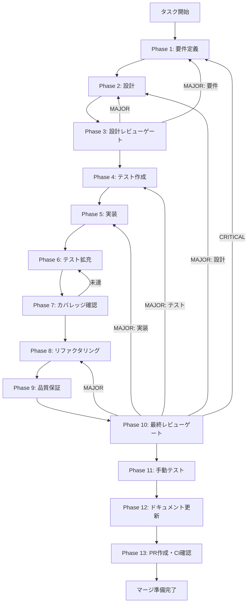

# CONV-06-04 エンティティ抽出サービス (NER) - タスク実行仕様書

## ユーザーからの元の指示

```
HybridRAGパイプラインのPhase 3（埋め込み・エンティティ抽出）において、
チャンクからエンティティを抽出しKnowledge Graphのノード候補を生成する
エンティティ抽出サービス（NER）を実装する。
```

## メタ情報

| 項目         | 内容                                         |
| ------------ | -------------------------------------------- |
| タスクID     | CONV-06-04                                   |
| タスク名     | entity-extraction-ner                        |
| 分類         | 機能追加                                     |
| 対象機能     | エンティティ抽出サービス（NER）              |
| 優先度       | 高                                           |
| 見積もり規模 | 中規模                                       |
| ステータス   | 未実施                                       |
| 作成日       | 2026-01-18                                   |
| 依存タスク   | CONV-03-04（エンティティ・関係スキーマ定義） |

---

## タスク概要

### 目的

チャンクからエンティティ（人物、組織、技術、概念など）を抽出し、Knowledge Graphのノード候補を生成するNERサービスを実装する。RAGパイプラインにおいて、ドキュメントから構造化情報を抽出する中核コンポーネントとなる。

### 背景

HybridRAGパイプラインでは、GraphRAGによる高精度検索（90%+）を実現するために、ドキュメントからエンティティを抽出しKnowledge Graphを構築する必要がある。NERサービスは以下の役割を担う：

1. テキストチャンクからエンティティを識別
2. エンティティのタイプ（person, organization, technology等）を分類
3. エンティティの正規化・重複除去
4. Knowledge Graph（entitiesテーブル）への永続化準備

### 最終ゴール

1. **IEntityExtractorインターフェース**の実装
2. **LLMEntityExtractor**（高精度）の実装
3. **RuleBasedEntityExtractor**（高速・フォールバック）の実装
4. **entities + chunk_entitiesテーブル**への永続化連携
5. **テストカバレッジ80%以上**の達成

### 成果物一覧

| 種別         | 成果物                           | 配置先                                                            |
| ------------ | -------------------------------- | ----------------------------------------------------------------- |
| 機能         | IEntityExtractorインターフェース | `packages/shared/src/services/extraction/types.ts`                |
| 機能         | LLMEntityExtractor               | `packages/shared/src/services/extraction/entity-extractor.ts`     |
| 機能         | RuleBasedEntityExtractor         | `packages/shared/src/services/extraction/rule-based-extractor.ts` |
| 機能         | エンティティ抽出プロンプト       | `packages/shared/src/services/extraction/prompts/`                |
| テスト       | ユニットテスト                   | `packages/shared/src/services/extraction/__tests__/`              |
| ドキュメント | 設計ドキュメント                 | `outputs/phase-2/`                                                |
| PR           | GitHub Pull Request              | GitHub UI                                                         |

---

## 参照ファイル

本仕様書の設計は以下を参照：

| 参照資料                   | パス                                                                              | 内容                    |
| -------------------------- | --------------------------------------------------------------------------------- | ----------------------- |
| RAGアーキテクチャ          | `.claude/skills/aiworkflow-requirements/references/architecture-rag.md`           | NERサービス設計仕様     |
| APIエンドポイント          | `.claude/skills/aiworkflow-requirements/references/api-endpoints.md`              | NER API仕様             |
| エンティティ・関係スキーマ | `packages/shared/src/types/rag/knowledge-graph/`                                  | EntityEntity型定義      |
| データベーススキーマ       | `.claude/skills/aiworkflow-requirements/references/database-schema.md`            | entities/chunk_entities |
| アーキテクチャ概要         | `docs/30-workflows/unassigned-task/task-**-architecture-overview-rag-pipeline.md` | HybridRAG全体設計       |

---

## タスク分解サマリー

| ID     | フェーズ | サブタスク名       | 責務                         | 依存 |
| ------ | -------- | ------------------ | ---------------------------- | ---- |
| T-01-1 | Phase 1  | 要件定義           | 機能・非機能要件の明確化     | -    |
| T-02-1 | Phase 2  | アーキテクチャ設計 | インターフェース・クラス設計 | T-01 |
| T-03-1 | Phase 3  | 設計レビュー       | 設計の妥当性検証             | T-02 |
| T-04-1 | Phase 4  | テスト作成（Red）  | 失敗するテストを作成         | T-03 |
| T-05-1 | Phase 5  | 実装（Green）      | テストを通す実装             | T-04 |
| T-06-1 | Phase 6  | テスト拡充         | カバレッジ向上               | T-05 |
| T-07-1 | Phase 7  | カバレッジ確認     | 目標達成検証                 | T-06 |
| T-08-1 | Phase 8  | リファクタリング   | コード品質改善               | T-07 |
| T-09-1 | Phase 9  | 品質保証           | 静的解析・セキュリティ確認   | T-08 |
| T-10-1 | Phase 10 | 最終レビュー       | 全体品質検証                 | T-09 |
| T-11-1 | Phase 11 | 手動テスト         | UX・実環境確認               | T-10 |
| T-12-1 | Phase 12 | ドキュメント更新   | 仕様・ガイド更新             | T-11 |
| T-13-1 | Phase 13 | PR作成             | コミット・PR・CI確認         | T-12 |

**総サブタスク数**: 13個

---

## 実行フロー図



---

## Phase一覧

| Phase | 名称               | 仕様書                                                 | ステータス |
| ----- | ------------------ | ------------------------------------------------------ | ---------- |
| 1     | 要件定義           | [phase-1-requirements.md](phase-1-requirements.md)     | 未実施     |
| 2     | 設計               | [phase-2-design.md](phase-2-design.md)                 | 未実施     |
| 3     | 設計レビューゲート | [phase-3-design-review.md](phase-3-design-review.md)   | 未実施     |
| 4     | テスト作成         | [phase-4-test-creation.md](phase-4-test-creation.md)   | 未実施     |
| 5     | 実装               | [phase-5-implementation.md](phase-5-implementation.md) | 未実施     |
| 6     | テスト拡充         | [phase-6-test-expansion.md](phase-6-test-expansion.md) | 未実施     |
| 7     | カバレッジ確認     | [phase-7-coverage-check.md](phase-7-coverage-check.md) | 未実施     |
| 8     | リファクタリング   | [phase-8-refactoring.md](phase-8-refactoring.md)       | 未実施     |
| 9     | 品質保証           | [phase-9-quality.md](phase-9-quality.md)               | 未実施     |
| 10    | 最終レビューゲート | [phase-10-final-review.md](phase-10-final-review.md)   | 未実施     |
| 11    | 手動テスト         | [phase-11-manual-test.md](phase-11-manual-test.md)     | 未実施     |
| 12    | ドキュメント更新   | [phase-12-documentation.md](phase-12-documentation.md) | 未実施     |
| 13    | PR作成             | [phase-13-pr-creation.md](phase-13-pr-creation.md)     | 未実施     |

---

## テストカバレッジ目標

### ユニットテスト

| 指標              | 最低基準 | 推奨基準 |
| ----------------- | -------- | -------- |
| Line Coverage     | 80%      | 90%      |
| Branch Coverage   | 60%      | 70%      |
| Function Coverage | 80%      | 90%      |

### 結合テスト

| 指標                         | 目標 |
| ---------------------------- | ---- |
| APIエンドポイント            | 100% |
| モジュール間インターフェース | 100% |
| 正常系シナリオ               | 100% |
| 異常系シナリオ               | 80%+ |
| 外部連携ポイント             | 100% |

---

## 統合テスト連携（Phase 1〜11で必須）

各Phaseで以下の統合テスト連携アクションを実施すること:

| Phase | 統合テスト連携アクション                          |
| ----- | ------------------------------------------------- |
| 1     | LLM API接続要件、チャンク入力インターフェース定義 |
| 2     | IEntityExtractor統合ポイント、永続化フロー設計    |
| 3     | 統合テスト観点のレビューゲートを実施              |
| 4     | 統合テストシナリオを全カテゴリで作成              |
| 5     | LLM呼び出し、DB保存の統合実装                     |
| 6     | 統合テストの拡充（全カテゴリのカバレッジ向上）    |
| 7     | 統合テストの再実行とゲート判定                    |
| 8     | リファクタ後の統合テスト継続成功を確認            |
| 9     | 品質保証で統合テスト結果を確認                    |
| 10    | 最終レビューで統合テスト結果を確認                |
| 11    | 手動統合テスト（NER精度検証）を確認               |

---

## Phase完了時の必須アクション

**各Phase完了時に以下を必ず実行すること:**

1. **タスク100%実行**: Phase内で指定された全タスクを完全に実行
2. **成果物確認**: 全ての必須成果物が生成されていることを検証
3. **実行記録**: 実行タスクの結果を記録
4. **artifacts.json更新**: Phase完了ステータスを更新
5. **Phase末端の実行確認**: 各タスクを100%実行し、各タスクを完遂した旨を必ず明記

```bash
# Phase完了時の検証コマンド
node .claude/skills/task-specification-creator/scripts/validate-phase-output.js docs/30-workflows/CONV-06-04-entity-extraction-ner --phase {{PHASE_NUMBER}}

# Phase完了・成果物登録
node .claude/skills/task-specification-creator/scripts/complete-phase.js \
  --workflow docs/30-workflows/CONV-06-04-entity-extraction-ner --phase {{PHASE_NUMBER}} --artifacts "..."
```

---

## 技術仕様

### IEntityExtractor インターフェース

```typescript
interface IEntityExtractor {
  extract(
    chunk: ChunkEntity,
    options?: ExtractionOptions,
  ): Promise<Result<ExtractionResult, Error>>;
  extractBatch(
    chunks: ChunkEntity[],
  ): Promise<Result<BatchExtractionResult, Error>>;
  mergeEntities(results: ExtractionResult[]): ExtractedEntity[];
}
```

### 抽出方式

| 方式         | 実装クラス               | 特性                                   |
| ------------ | ------------------------ | -------------------------------------- |
| LLMベース    | LLMEntityExtractor       | 高精度、未知エンティティ対応           |
| ルールベース | RuleBasedEntityExtractor | 高速、パターンマッチ、フォールバック用 |

### エンティティタイプ

| タイプ       | 説明         | 例                        |
| ------------ | ------------ | ------------------------- |
| person       | 人物         | 山田太郎、John Doe        |
| organization | 組織・会社   | Microsoft、Google         |
| technology   | 技術・ツール | TypeScript、React、Docker |
| concept      | 概念・用語   | マイクロサービス、CI/CD   |
| location     | 場所         | 東京、Silicon Valley      |
| event        | イベント     | re:Invent、Google I/O     |

### データフロー

```
チャンク → NER → ExtractedEntity[] → EntityEntity[] → entities テーブル
                                   ↓
                          chunk_entities テーブル（関連付け）
```

---

## 更新履歴

| 日付       | 更新内容 | 担当 |
| ---------- | -------- | ---- |
| 2026-01-18 | 初版作成 | AI   |
