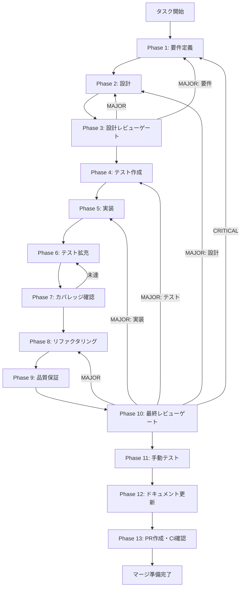

# TASK-3-1-A SDK query() 基本実装 - タスク実行仕様書

## ユーザーからの元の指示

```
Claude Agent SDK の `query()` API を使用してスキルを実行する基本構造を実装する。
ストリーミング処理とAbort機能を含む。
```

## メタ情報

| 項目         | 内容                                                   |
| ------------ | ------------------------------------------------------ |
| タスクID     | TASK-3-1-A                                             |
| タスク名     | SDK query() 基本実装                                   |
| 分類         | 新機能                                                 |
| 対象機能     | スキル実行エンジン                                     |
| 優先度       | 高                                                     |
| 見積もり規模 | 中規模                                                 |
| ステータス   | 未実施                                                 |
| 作成日       | 2026-01-24                                             |
| 依存タスク   | TASK-2A (SkillScanner), TASK-2C (セキュリティパターン) |
| ブロック     | TASK-3-1-B (Hooks実装)                                 |

---

## タスク概要

### 目的

Claude Agent SDK の `query()` API を使用してスキルを実行する基本構造（SkillExecutor クラス）を実装する。
ストリーミング処理によるリアルタイムメッセージ配信と、AbortController によるキャンセル機能を含む。

### 背景

スキルインポートシステムにおいて、インポートされたスキルを実際に実行するためのエンジンが必要。
Claude Agent SDK の `query()` API を使用してスキルのプロンプトをClaudeに送信し、
ストリーミングレスポンスをRenderer Processに配信する基盤を構築する。

### 最終ゴール

- SkillExecutor クラスが `execute()` メソッドでスキルを実行できる
- ストリーミングメッセージがRenderer Processにリアルタイム配信される
- `abort()` メソッドで実行中のスキルをキャンセルできる
- 複数の同時実行を管理できる（executionId による追跡）

### 成果物一覧

| 種別         | 成果物                     | 配置先                                                  |
| ------------ | -------------------------- | ------------------------------------------------------- |
| 機能         | SkillExecutor クラス       | `apps/desktop/src/main/services/skill/SkillExecutor.ts` |
| テスト       | ユニットテスト・統合テスト | `apps/desktop/src/main/services/skill/__tests__/`       |
| ドキュメント | Phase別成果物              | `outputs/phase-*/`                                      |
| PR           | GitHub Pull Request        | GitHub UI                                               |

---

## 参照ファイル

本仕様書のコマンド選定は以下を参照：

- `docs/00-requirements/master_system_design.md` - システム要件
- `.claude/skills/aiworkflow-requirements/references/interfaces-agent-sdk.md` - Agent SDK インターフェース仕様
- `.claude/skills/aiworkflow-requirements/references/security-skill-execution.md` - スキル実行セキュリティ
- `docs/30-workflows/skill-import-agent-system/specification.md` - システム仕様書
- `docs/30-workflows/skill-import-agent-system/tasks/completed-task/task-2a-skill-scanner.md` - SkillScanner仕様
- `docs/30-workflows/skill-import-agent-system/tasks/completed-task/task-2c-security-patterns.md` - セキュリティパターン

---

## タスク分解サマリー

| ID     | フェーズ | サブタスク名       | 責務                            | 依存 |
| ------ | -------- | ------------------ | ------------------------------- | ---- |
| T-01-1 | Phase 1  | 要件定義           | 機能・非機能要件の抽出          | -    |
| T-02-1 | Phase 2  | 設計               | クラス設計・API設計             | T-01 |
| T-03-1 | Phase 3  | 設計レビューゲート | 設計妥当性検証                  | T-02 |
| T-04-1 | Phase 4  | テスト作成         | TDD: Red（失敗テスト作成）      | T-03 |
| T-05-1 | Phase 5  | 実装               | TDD: Green（SkillExecutor実装） | T-04 |
| T-06-1 | Phase 6  | テスト拡充         | カバレッジ向上                  | T-05 |
| T-07-1 | Phase 7  | カバレッジ確認     | カバレッジ基準達成検証          | T-06 |
| T-08-1 | Phase 8  | リファクタリング   | TDD: Refactor                   | T-07 |
| T-09-1 | Phase 9  | 品質保証           | 静的解析・セキュリティ確認      | T-08 |
| T-10-1 | Phase 10 | 最終レビューゲート | 全体品質検証                    | T-09 |
| T-11-1 | Phase 11 | 手動テスト         | 実環境動作確認                  | T-10 |
| T-12-1 | Phase 12 | ドキュメント更新   | 実装ガイド・仕様書更新          | T-11 |
| T-13-1 | Phase 13 | PR作成             | コミット・PR・CI確認            | T-12 |

**総サブタスク数**: 13個

---

## 実行フロー図



---

## Phase一覧

| Phase | 名称               | 仕様書                                                 | ステータス |
| ----- | ------------------ | ------------------------------------------------------ | ---------- |
| 1     | 要件定義           | [phase-1-requirements.md](phase-1-requirements.md)     | 未実施     |
| 2     | 設計               | [phase-2-design.md](phase-2-design.md)                 | 未実施     |
| 3     | 設計レビューゲート | [phase-3-design-review.md](phase-3-design-review.md)   | 未実施     |
| 4     | テスト作成         | [phase-4-test-creation.md](phase-4-test-creation.md)   | 未実施     |
| 5     | 実装               | [phase-5-implementation.md](phase-5-implementation.md) | 未実施     |
| 6     | テスト拡充         | [phase-6-test-expansion.md](phase-6-test-expansion.md) | 未実施     |
| 7     | カバレッジ確認     | [phase-7-coverage-check.md](phase-7-coverage-check.md) | 未実施     |
| 8     | リファクタリング   | [phase-8-refactoring.md](phase-8-refactoring.md)       | 未実施     |
| 9     | 品質保証           | [phase-9-quality.md](phase-9-quality.md)               | 未実施     |
| 10    | 最終レビューゲート | [phase-10-final-review.md](phase-10-final-review.md)   | 未実施     |
| 11    | 手動テスト         | [phase-11-manual-test.md](phase-11-manual-test.md)     | 未実施     |
| 12    | ドキュメント更新   | [phase-12-documentation.md](phase-12-documentation.md) | 未実施     |
| 13    | PR作成             | [phase-13-pr-creation.md](phase-13-pr-creation.md)     | 未実施     |

---

## テストカバレッジ目標

### ユニットテスト

| 指標              | 最低基準 | 推奨基準 |
| ----------------- | -------- | -------- |
| Line Coverage     | 80%      | 90%      |
| Branch Coverage   | 60%      | 70%      |
| Function Coverage | 80%      | 90%      |

### 結合テスト

| 指標                         | 目標 |
| ---------------------------- | ---- |
| APIエンドポイント            | 100% |
| モジュール間インターフェース | 100% |
| 正常系シナリオ               | 100% |
| 異常系シナリオ               | 80%+ |
| 外部連携ポイント             | 100% |

---

## 統合テスト連携（Phase 1〜11で必須）

各Phaseで以下の統合テスト連携アクションを実施すること:

| Phase | 統合テスト連携アクション                                 |
| ----- | -------------------------------------------------------- |
| 1     | SDK連携要件（query API/ストリーミング/中断）を要件に明記 |
| 2     | IPC連携ポイント・メッセージ契約を設計に反映              |
| 3     | 統合テスト観点のレビューゲートを実施                     |
| 4     | 統合テストシナリオを全カテゴリで作成                     |
| 5     | Main→Renderer ストリーミング配信の実装                   |
| 6     | SDK連携・IPC連携の統合テストを拡充                       |
| 7     | 統合テストの再実行とゲート判定                           |
| 8     | リファクタ後の統合テスト継続成功を確認                   |
| 9     | 品質保証で統合テスト結果を確認                           |
| 10    | 最終レビューで統合テスト結果を確認                       |
| 11    | 手動統合テスト（SDK実行・ストリーミング・中断）を確認    |

---

## Phase完了時の必須アクション

**各Phase完了時に以下を必ず実行すること:**

1. **タスク100%実行**: Phase内で指定された全タスクを完全に実行
2. **成果物確認**: 全ての必須成果物が生成されていることを検証
3. **実行記録**: 実行タスクの結果を記録
4. **artifacts.json更新**: Phase完了ステータスを更新
5. **Phase末端の実行確認**: 各タスクを100%実行し、各タスクを完遂した旨を必ず明記

```bash
# Phase完了時の検証コマンド
node .claude/skills/task-specification-creator/scripts/validate-phase-output.js docs/30-workflows/skill-import-agent-system/tasks/TASK-3-1-A-sdk-query --phase {{PHASE_NUMBER}}

# Phase完了・成果物登録
node .claude/skills/task-specification-creator/scripts/complete-phase.js \
  --workflow docs/30-workflows/skill-import-agent-system/tasks/TASK-3-1-A-sdk-query --phase {{PHASE_NUMBER}} --artifacts "..."
```

---

## 変更履歴

| バージョン | 日付       | 変更内容 |
| ---------- | ---------- | -------- |
| 1.0.0      | 2026-01-24 | 初版作成 |
