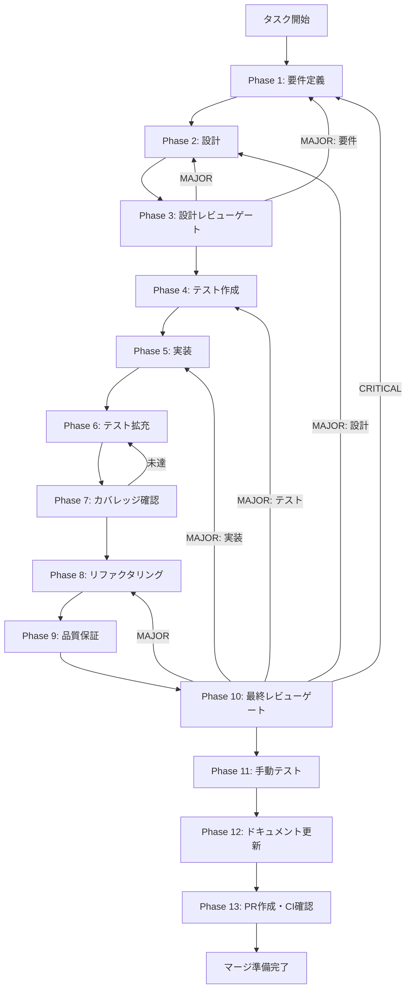

# TASK-3-1-D: Renderer側権限ダイアログUI実装 - タスク実行仕様書

## メタ情報

```yaml
issue_number: 509
```

| 項目         | 内容                                     |
| ------------ | ---------------------------------------- |
| タスクID     | TASK-3-1-D                               |
| タスク名     | Renderer側権限ダイアログUI実装           |
| 分類         | 新機能                                   |
| 対象機能     | スキル実行権限確認ダイアログ             |
| 優先度       | 中                                       |
| 見積もり規模 | 中規模                                   |
| ステータス   | 未実施                                   |
| 作成日       | 2026-01-25                               |
| 発見元       | TASK-3-1-C（PermissionRequest Hook統合） |

---

## ユーザーからの元の指示

```
TASK-3-1-C完了時に、Main Process側のPermissionRequest Hook統合は完成した。
Renderer側UI（ダイアログ表示）は別タスクで実装予定。
- 権限ダイアログコンポーネント: TASK-3-1-Dで実装予定
- ダイアログの視認性: UI実装後に確認
- キーボードナビゲーション: UI実装後に確認
```

---

## タスク概要

### 目的

Renderer Process側に権限確認ダイアログのIPC連携機能を実装し、PermissionRequest Hook統合を完成させる。skillAPIにpermission関連メソッドを追加し、Main ProcessからのIPCリクエストをRenderer側で受信・処理できるようにする。

### 背景

TASK-3-1-Cで、Main ProcessにPermissionRequest Hook統合を実装した。これによりSkillExecutorからRenderer Processへ権限リクエストがIPC経由で送信されるようになった。

しかし、以下が未実装:

- skillAPIにpermission関連メソッド（`onPermission`, `respondPermission`）がない
- SkillStreamDisplayコンポーネントとPermissionDialogの連携がない
- skillAPI経由のpermission通知を受け取る仕組みがない

### 最終ゴール

- skillAPIにpermission関連メソッドが追加されている
- Main Processからの権限リクエスト（IPC）を受信できる
- PermissionDialogが表示され、ユーザーが「許可」「拒否」を選択できる
- 選択結果がMain Processに正しく送信される
- 既存のPermissionDialogコンポーネントを再利用する

### 成果物一覧

| 種別         | 成果物                               | 配置先                                                            |
| ------------ | ------------------------------------ | ----------------------------------------------------------------- |
| 機能         | skillAPI permission拡張              | `apps/desktop/src/preload/skill-api.ts`                           |
| 機能         | SkillStreamDisplay Permission統合    | `apps/desktop/src/renderer/components/AgentView/`                 |
| テスト       | skillAPI permission テスト           | `apps/desktop/src/preload/__tests__/skill-api.permission.test.ts` |
| テスト       | SkillStreamDisplay permission テスト | `apps/desktop/src/renderer/components/AgentView/__tests__/`       |
| ドキュメント | 実装ガイド                           | `outputs/phase-12/implementation-guide.md`                        |
| PR           | GitHub Pull Request                  | GitHub UI                                                         |

---

## 参照ファイル

本仕様書の実装は以下を参照:

| 参照資料                    | パス                                                                        | 内容                         |
| --------------------------- | --------------------------------------------------------------------------- | ---------------------------- |
| Agent SDKインターフェース   | `.claude/skills/aiworkflow-requirements/references/interfaces-agent-sdk.md` | PermissionRequest型、IPC仕様 |
| UI/UXコンポーネント         | `.claude/skills/aiworkflow-requirements/references/ui-ux-components.md`     | PermissionDialog設計仕様     |
| PermissionRequest実装ガイド | `docs/guides/permission-request-hook.md`                                    | Hook実装パターン             |
| TASK-3-1-Cタスク仕様書      | `docs/30-workflows/task-3-1-c-permission-request/`                          | 前提タスク仕様               |
| 既存PermissionDialog        | `apps/desktop/src/renderer/components/organisms/PermissionDialog/`          | 再利用コンポーネント         |

---

## タスク分解サマリー

| ID     | フェーズ | サブタスク名       | 責務                                   | 依存 |
| ------ | -------- | ------------------ | -------------------------------------- | ---- |
| T-01-1 | Phase 1  | 要件定義           | 機能要件・非機能要件の明確化           | -    |
| T-02-1 | Phase 2  | 設計               | skillAPI拡張設計・IPC連携設計          | T-01 |
| T-03-1 | Phase 3  | 設計レビューゲート | 設計の妥当性検証                       | T-02 |
| T-04-1 | Phase 4  | テスト作成         | skillAPI permission テスト作成         | T-03 |
| T-05-1 | Phase 5  | 実装               | skillAPI拡張・UI統合実装               | T-04 |
| T-06-1 | Phase 6  | テスト拡充         | カバレッジ向上・エッジケーステスト     | T-05 |
| T-07-1 | Phase 7  | カバレッジ確認     | 80%以上カバレッジ達成確認              | T-06 |
| T-08-1 | Phase 8  | リファクタリング   | コード品質改善                         | T-07 |
| T-09-1 | Phase 9  | 品質保証           | 静的解析・セキュリティ・型チェック     | T-08 |
| T-10-1 | Phase 10 | 最終レビューゲート | 全体品質・整合性検証                   | T-09 |
| T-11-1 | Phase 11 | 手動テスト         | UX・実環境動作確認                     | T-10 |
| T-12-1 | Phase 12 | ドキュメント更新   | 仕様書更新・実装ガイド作成             | T-11 |
| T-13-1 | Phase 13 | PR作成             | `/ai:diff-to-pr`でコミット・PR・CI確認 | T-12 |

**総サブタスク数**: 13個

---

## 実行フロー図



---

## Phase一覧

| Phase | 名称               | 仕様書                                                 | ステータス |
| ----- | ------------------ | ------------------------------------------------------ | ---------- |
| 1     | 要件定義           | [phase-1-requirements.md](phase-1-requirements.md)     | 未実施     |
| 2     | 設計               | [phase-2-design.md](phase-2-design.md)                 | 未実施     |
| 3     | 設計レビューゲート | [phase-3-design-review.md](phase-3-design-review.md)   | 未実施     |
| 4     | テスト作成         | [phase-4-test-creation.md](phase-4-test-creation.md)   | 未実施     |
| 5     | 実装               | [phase-5-implementation.md](phase-5-implementation.md) | 未実施     |
| 6     | テスト拡充         | [phase-6-test-expansion.md](phase-6-test-expansion.md) | 未実施     |
| 7     | カバレッジ確認     | [phase-7-coverage-check.md](phase-7-coverage-check.md) | 未実施     |
| 8     | リファクタリング   | [phase-8-refactoring.md](phase-8-refactoring.md)       | 未実施     |
| 9     | 品質保証           | [phase-9-quality.md](phase-9-quality.md)               | 未実施     |
| 10    | 最終レビューゲート | [phase-10-final-review.md](phase-10-final-review.md)   | 未実施     |
| 11    | 手動テスト         | [phase-11-manual-test.md](phase-11-manual-test.md)     | 未実施     |
| 12    | ドキュメント更新   | [phase-12-documentation.md](phase-12-documentation.md) | 未実施     |
| 13    | PR作成             | [phase-13-pr-creation.md](phase-13-pr-creation.md)     | 未実施     |

---

## テストカバレッジ目標

### ユニットテスト

| 指標              | 最低基準 | 推奨基準 |
| ----------------- | -------- | -------- |
| Line Coverage     | 80%      | 90%      |
| Branch Coverage   | 60%      | 70%      |
| Function Coverage | 80%      | 90%      |

### 結合テスト

| 指標                         | 目標 |
| ---------------------------- | ---- |
| APIエンドポイント（IPC）     | 100% |
| モジュール間インターフェース | 100% |
| 正常系シナリオ               | 100% |
| 異常系シナリオ               | 80%+ |

---

## 統合テスト連携（Phase 1〜11で必須）

| Phase | 統合テスト連携アクション                                     |
| ----- | ------------------------------------------------------------ |
| 1     | IPC通信要件（permission request/response）を要件に明記       |
| 2     | skillAPI拡張設計、PermissionDialog連携インターフェースを設計 |
| 3     | IPC統合テスト観点のレビューゲートを実施                      |
| 4     | skillAPI permission統合テストシナリオを作成                  |
| 5     | skillAPI permission実装、SkillStreamDisplay連携実装          |
| 6     | 統合テストの拡充（タイムアウト、キャンセル等）               |
| 7     | 統合テストの再実行とゲート判定                               |
| 8     | リファクタ後の統合テスト継続成功を確認                       |
| 9     | 品質保証で統合テスト結果を確認                               |
| 10    | 最終レビューで統合テスト結果を確認                           |
| 11    | 手動統合テスト（UI/IPC接続）を確認                           |

---

## スコープ

### 含むもの

- skillAPIへのpermission関連メソッド追加（`onPermission`, `respondPermission`）
- SkillStreamDisplayコンポーネントとPermissionDialogの連携
- 既存PermissionDialogコンポーネントの再利用
- Zustand状態管理との連携（skillSliceまたはagentSliceのpendingPermission）
- アクセシビリティ対応（WCAG 2.1 AA準拠、既存実装を活用）

### 含まないもの

- 「次回から確認しない」（rememberChoice）の永続化実装
- 複数リクエストのキュー管理
- 新規PermissionDialogコンポーネントの作成（既存を再利用）

---

## Phase完了時の必須アクション

**各Phase完了時に以下を必ず実行すること:**

1. **タスク100%実行**: Phase内で指定された全タスクを完全に実行
2. **成果物確認**: 全ての必須成果物が生成されていることを検証
3. **実行記録**: 実行タスクの結果を記録
4. **artifacts.json更新**: Phase完了ステータスを更新
5. **Phase末端の実行確認**: 各タスクを100%実行し、各タスクを完遂した旨を必ず明記

```bash
# Phase完了時の検証コマンド
node .claude/skills/task-specification-creator/scripts/validate-phase-output.js docs/30-workflows/TASK-3-1-D-permission-dialog-ui --phase {{PHASE_NUMBER}}

# Phase完了・成果物登録
node .claude/skills/task-specification-creator/scripts/complete-phase.js \
  --workflow docs/30-workflows/TASK-3-1-D-permission-dialog-ui --phase {{PHASE_NUMBER}} --artifacts "..."
```

---

## 備考

### 既存実装の確認

| コンポーネント               | パス                                                               | 状態     |
| ---------------------------- | ------------------------------------------------------------------ | -------- |
| PermissionDialog             | `apps/desktop/src/renderer/components/organisms/PermissionDialog/` | 実装済み |
| agentSlice pendingPermission | `apps/desktop/src/renderer/store/slices/agentSlice.ts`             | 実装済み |
| agentAPI permission methods  | `apps/desktop/src/preload/index.ts`                                | 実装済み |
| skillAPI (permission なし)   | `apps/desktop/src/preload/skill-api.ts`                            | 拡張必要 |
| IPCチャネル定義              | `apps/desktop/src/preload/channels.ts`                             | 定義済み |

### IPCチャネル

| チャネル                    | 定数名                     | 用途                           |
| --------------------------- | -------------------------- | ------------------------------ |
| `skill:permission:request`  | 未定義（追加が必要な場合） | Main → Renderer 権限リクエスト |
| `skill:permission:response` | 未定義（追加が必要な場合） | Renderer → Main 権限応答       |
| `agent:permission-request`  | AGENT_PERMISSION_REQUEST   | 既存Agent用                    |
| `agent:permission-respond`  | AGENT_PERMISSION_RESPOND   | 既存Agent用                    |

### 設計方針

skillAPIがSKILL_STREAMチャネル経由でpermissionメッセージを受信する設計を検討する。
または、skillAPI専用のpermissionチャネルを追加する。
Phase 2で詳細設計を行う。
