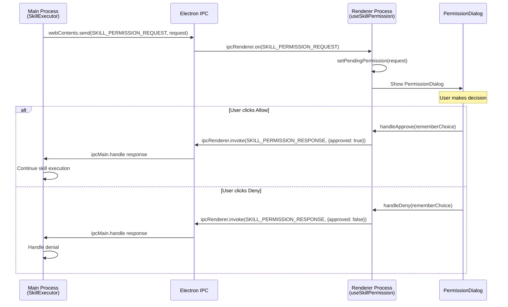

# Skill Permission IPC通信ドキュメント

## 概要

TASK-3-1-DでSkill実行時の権限確認に必要なIPC通信を実装。
Main ProcessとRenderer Process間で権限リクエスト/レスポンスを送受信する。

## チャンネル定義

| 定数名                      | チャンネル値                | 方向            | 用途               |
| --------------------------- | --------------------------- | --------------- | ------------------ |
| `SKILL_PERMISSION_REQUEST`  | `skill:permission:request`  | Main → Renderer | Permission要求送信 |
| `SKILL_PERMISSION_RESPONSE` | `skill:permission:response` | Renderer → Main | Permission応答送信 |

## ホワイトリスト登録

`apps/desktop/src/preload/channels.ts`:

```typescript
// IPC_CHANNELS定義
export const IPC_CHANNELS = {
  // ...
  SKILL_PERMISSION_REQUEST: "skill:permission:request",
  SKILL_PERMISSION_RESPONSE: "skill:permission:response",
};

// ALLOWED_ON_CHANNELS（Main→Renderer）
export const ALLOWED_ON_CHANNELS: readonly string[] = [
  // ...
  IPC_CHANNELS.SKILL_PERMISSION_REQUEST,
];

// ALLOWED_INVOKE_CHANNELS（Renderer→Main）
export const ALLOWED_INVOKE_CHANNELS: readonly string[] = [
  // ...
  IPC_CHANNELS.SKILL_PERMISSION_RESPONSE,
];
```

## シーケンス図



## データ形式

### SKILL_PERMISSION_REQUEST ペイロード

```typescript
interface SkillPermissionRequest {
  executionId: string; // スキル実行ID
  requestId: string; // リクエストID（UUID v4）
  toolName: string; // ツール名（例: "Bash"）
  args: {
    // サニタイズ済み引数
    [key: string]: unknown;
  };
  reason?: string; // ユーザー向け説明
}
```

**例**:

```json
{
  "executionId": "exec-123e4567-e89b-12d3-a456-426614174000",
  "requestId": "req-987fcdeb-51a2-43bf-9876-543210fedcba",
  "toolName": "Bash",
  "args": {
    "command": "echo Hello World"
  },
  "reason": "Execute shell command"
}
```

### SKILL_PERMISSION_RESPONSE ペイロード

```typescript
interface SkillPermissionResponse {
  requestId: string; // リクエストIDと一致必須
  approved: boolean; // true: 許可, false: 拒否
  rememberChoice?: boolean; // 選択を記憶
}
```

**例（許可）**:

```json
{
  "requestId": "req-987fcdeb-51a2-43bf-9876-543210fedcba",
  "approved": true,
  "rememberChoice": false
}
```

**例（拒否）**:

```json
{
  "requestId": "req-987fcdeb-51a2-43bf-9876-543210fedcba",
  "approved": false,
  "rememberChoice": true
}
```

## エラーハンドリング

| 状況                       | Renderer側対応               | Main側対応             |
| -------------------------- | ---------------------------- | ---------------------- |
| IPC送信失敗                | console.errorでログ出力      | タイムアウトで自動deny |
| 無効なrequestId            | 無視（状態なし）             | 警告ログ出力           |
| Rendererクラッシュ         | N/A                          | タイムアウトで自動deny |
| コンポーネントアンマウント | クリーンアップでリスナー解除 | タイムアウトで自動deny |

## セキュリティ考慮事項

1. **チャンネルホワイトリスト**: 許可されたチャンネルのみ使用可能
2. **safeInvoke/safeOn**: チャンネル検証を強制
3. **引数サニタイズ**: Main Process側で機密情報を除去（TASK-3-1-C）
4. **requestId紐付け**: リクエストとレスポンスの整合性を検証

## Date

2026-01-26
