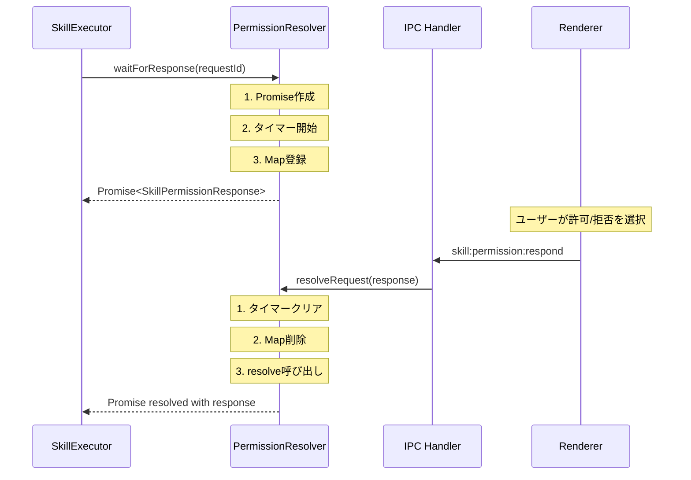
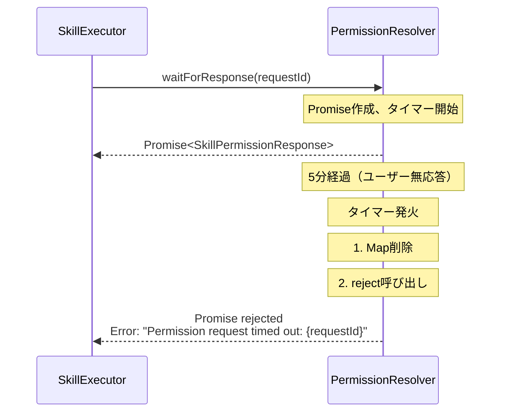
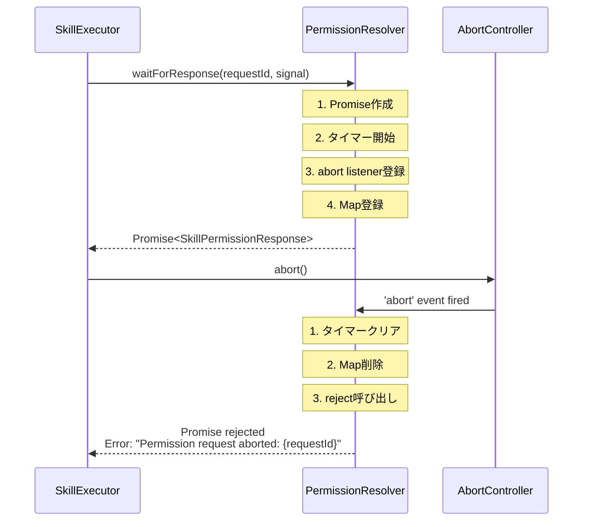
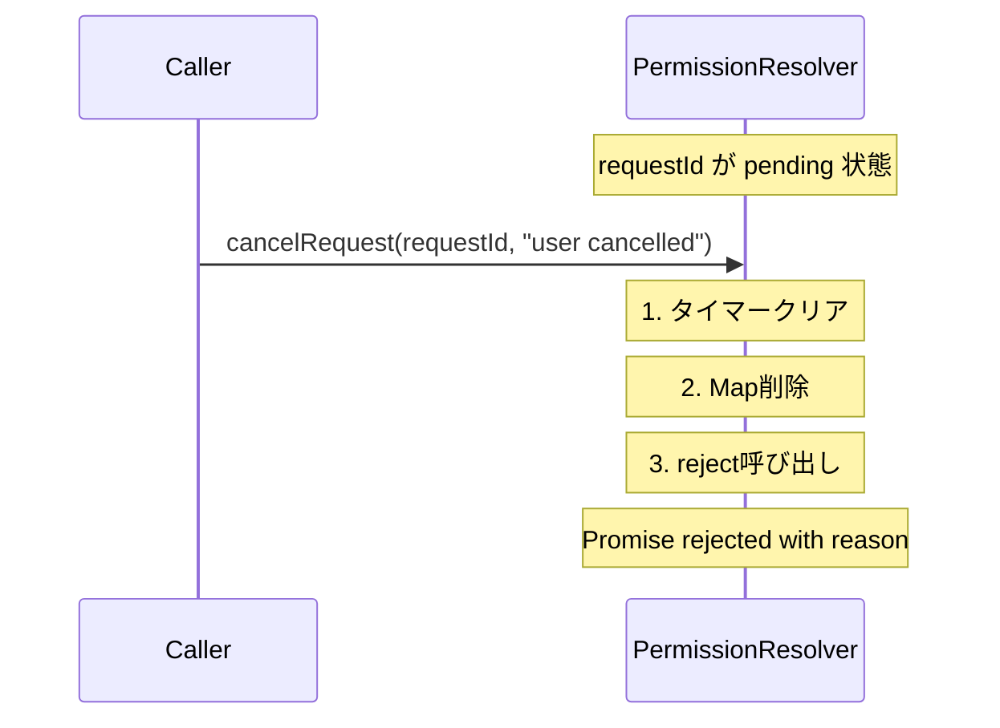
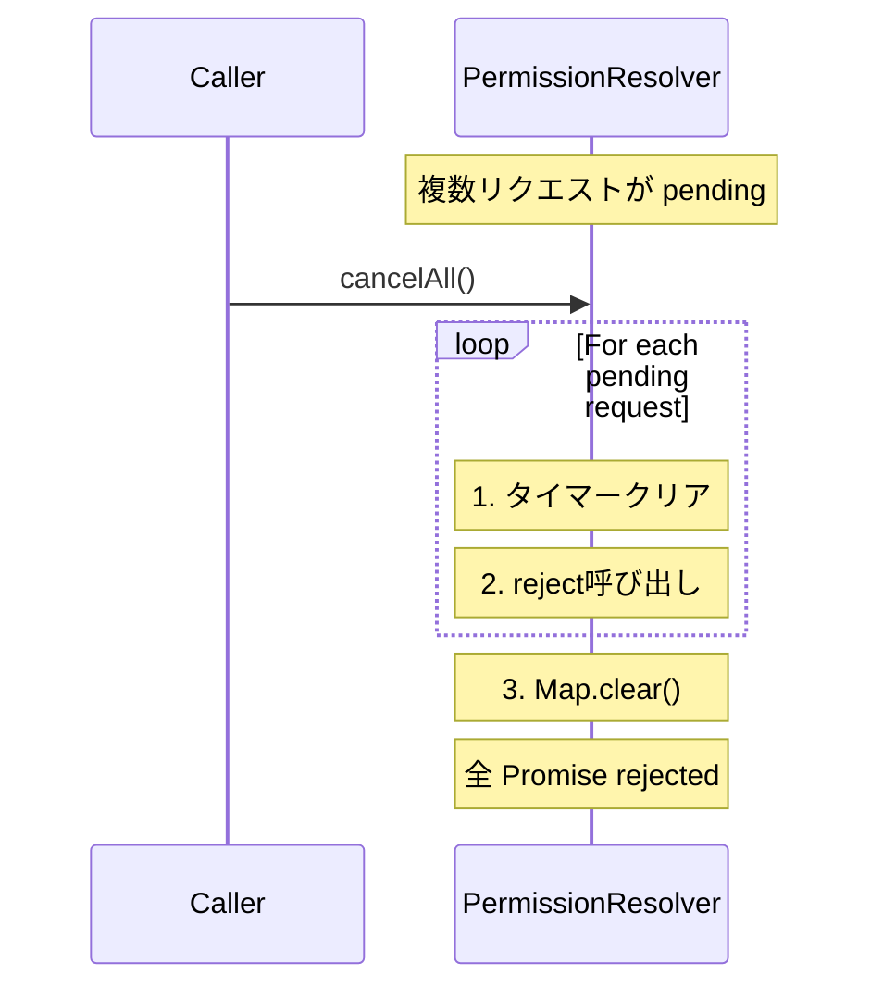

# Phase 2: 設計 - 成果物

## メタ情報

| 項目       | 内容       |
| ---------- | ---------- |
| Phase      | 2          |
| Phase名    | 設計       |
| 完了日時   | 2026-01-25 |
| ステータス | 完了       |
| 作成者     | Claude     |

---

## タスク 1: クラスインターフェース設計 ✅

### パブリックインターフェース

```typescript
import type { SkillPermissionResponse } from "@repo/shared";

export class PermissionResolver {
  /**
   * コンストラクタ
   * @param defaultTimeout タイムアウト時間（ミリ秒）。デフォルト: 300000（5分）
   */
  constructor(defaultTimeout?: number);

  /**
   * 権限応答を待機
   * @param requestId リクエストID
   * @param signal AbortSignal（キャンセル用）
   * @returns 権限応答
   * @throws Error タイムアウトまたはキャンセル時
   */
  waitForResponse(
    requestId: string,
    signal?: AbortSignal,
  ): Promise<SkillPermissionResponse>;

  /**
   * 権限リクエストを解決
   * @param response 権限応答
   */
  resolveRequest(response: SkillPermissionResponse): void;

  /**
   * 保留中のリクエストをキャンセル
   * @param requestId リクエストID
   * @param reason キャンセル理由
   */
  cancelRequest(requestId: string, reason?: string): void;

  /**
   * 全ての保留中リクエストをキャンセル
   */
  cancelAll(): void;

  /**
   * 保留中のリクエスト数を取得
   */
  get pendingCount(): number;
}
```

---

## タスク 2: 内部データ構造設計 ✅

### PendingRequest インターフェース

```typescript
/**
 * 待機中リクエストの内部表現
 */
interface PendingRequest {
  /** Promise を解決する関数 */
  resolve: (response: SkillPermissionResponse) => void;
  /** Promise を拒否する関数 */
  reject: (error: Error) => void;
  /** タイムアウト用タイマーID */
  timeoutId: NodeJS.Timeout;
}
```

### 内部状態

```typescript
class PermissionResolver {
  /** 待機中のリクエストを管理する Map（O(1) アクセス） */
  private pendingRequests: Map<string, PendingRequest> = new Map();

  /** デフォルトタイムアウト（ミリ秒） */
  private readonly defaultTimeout: number;
}
```

### 設計判断

| 判断項目                 | 選択       | 理由                                   |
| ------------------------ | ---------- | -------------------------------------- |
| データ構造               | Map        | O(1)のキーベースアクセス、順序保持不要 |
| タイムアウト管理         | setTimeout | Node.js標準、シンプル                  |
| AbortSignal リスナー登録 | once: true | メモリリーク防止                       |

---

## タスク 3: シーケンス図作成 ✅

### 正常フロー



### タイムアウトフロー



### AbortSignal キャンセルフロー



### cancelRequest フロー



### cancelAll フロー



---

## 実装設計

### ファイル構成

```
apps/desktop/src/main/services/skill/
├── PermissionResolver.ts          # 実装ファイル
├── __tests__/
│   └── PermissionResolver.test.ts # テストファイル
└── index.ts                       # export追加
```

### 実装コード（完全版）

```typescript
// apps/desktop/src/main/services/skill/PermissionResolver.ts

import type { SkillPermissionResponse } from "@repo/shared";

/**
 * 待機中リクエストの内部表現
 */
interface PendingRequest {
  resolve: (response: SkillPermissionResponse) => void;
  reject: (error: Error) => void;
  timeoutId: NodeJS.Timeout;
}

/**
 * 権限確認リクエストの待機・解決を管理するクラス
 *
 * Main Process で使用し、Renderer からの IPC 応答を待機・解決する。
 */
export class PermissionResolver {
  private pendingRequests: Map<string, PendingRequest> = new Map();
  private readonly defaultTimeout: number;

  /**
   * コンストラクタ
   * @param defaultTimeout タイムアウト時間（ミリ秒）。デフォルト: 300000（5分）
   */
  constructor(defaultTimeout: number = 300000) {
    this.defaultTimeout = defaultTimeout;
  }

  /**
   * 権限応答を待機
   * @param requestId リクエストID
   * @param signal AbortSignal（キャンセル用）
   * @returns 権限応答
   * @throws Error タイムアウトまたはキャンセル時
   */
  waitForResponse(
    requestId: string,
    signal?: AbortSignal,
  ): Promise<SkillPermissionResponse> {
    return new Promise((resolve, reject) => {
      // タイムアウト設定
      const timeoutId = setTimeout(() => {
        this.pendingRequests.delete(requestId);
        reject(new Error(`Permission request timed out: ${requestId}`));
      }, this.defaultTimeout);

      // AbortSignal 処理
      if (signal) {
        const onAbort = () => {
          clearTimeout(timeoutId);
          this.pendingRequests.delete(requestId);
          reject(new Error(`Permission request aborted: ${requestId}`));
        };
        signal.addEventListener("abort", onAbort, { once: true });
      }

      // 保留リクエストを登録
      this.pendingRequests.set(requestId, {
        resolve,
        reject,
        timeoutId,
      });
    });
  }

  /**
   * 権限リクエストを解決
   * @param response 権限応答
   */
  resolveRequest(response: SkillPermissionResponse): void {
    const pending = this.pendingRequests.get(response.requestId);
    if (pending) {
      clearTimeout(pending.timeoutId);
      this.pendingRequests.delete(response.requestId);
      pending.resolve(response);
    }
    // 存在しない requestId の場合は何もしない
  }

  /**
   * 保留中のリクエストをキャンセル
   * @param requestId リクエストID
   * @param reason キャンセル理由
   */
  cancelRequest(requestId: string, reason?: string): void {
    const pending = this.pendingRequests.get(requestId);
    if (pending) {
      clearTimeout(pending.timeoutId);
      this.pendingRequests.delete(requestId);
      pending.reject(new Error(reason || `Request cancelled: ${requestId}`));
    }
    // 存在しない requestId の場合は何もしない
  }

  /**
   * 全ての保留中リクエストをキャンセル
   */
  cancelAll(): void {
    for (const [requestId, pending] of this.pendingRequests) {
      clearTimeout(pending.timeoutId);
      pending.reject(new Error(`Request cancelled: ${requestId}`));
    }
    this.pendingRequests.clear();
  }

  /**
   * 保留中のリクエスト数を取得
   */
  get pendingCount(): number {
    return this.pendingRequests.size;
  }
}
```

---

## Phase 2 完了条件チェック

- [x] クラスインターフェースが TypeScript 型で定義されている
- [x] 内部データ構造（PendingRequest）が設計されている
- [x] 正常フローのシーケンス図が作成されている
- [x] タイムアウトフローのシーケンス図が作成されている
- [x] AbortSignal キャンセルフローのシーケンス図が作成されている
- [x] cancelRequest / cancelAll フローも追加
- [x] 実装コードの詳細設計が完成している

---

## 次のPhase

Phase 3: 設計レビューゲート へ進む

`docs/30-workflows/TASK-3-2-permission-resolver/phase-3-design-review.md`
