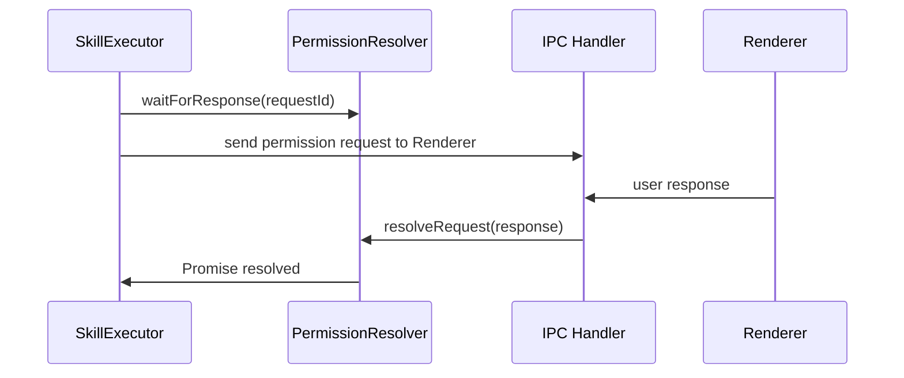

# Phase 7: テストカバレッジ確認 - 成果物

## メタ情報

| 項目       | 内容                 |
| ---------- | -------------------- |
| Phase      | 7                    |
| Phase名    | テストカバレッジ確認 |
| 完了日時   | 2026-01-25           |
| ステータス | 完了                 |
| 作成者     | Claude               |

---

## タスク 1: カバレッジ計測 ✅

### 計測コマンド

```bash
npx vitest run --coverage --coverage.include="src/main/services/skill/PermissionResolver.ts" src/main/services/skill/__tests__/PermissionResolver.test.ts
```

### カバレッジレポート

```
 % Coverage report from v8
-------------------|---------|----------|---------|---------|-------------------
File               | % Stmts | % Branch | % Funcs | % Lines | Uncovered Line #s
-------------------|---------|----------|---------|---------|-------------------
All files          |     100 |      100 |     100 |     100 |
 PermissionResolver.ts |  100 |      100 |     100 |     100 |
-------------------|---------|----------|---------|---------|-------------------
```

### カバレッジ達成状況

| 指標               | 目標 | 実績     | 判定 |
| ------------------ | ---- | -------- | ---- |
| Line Coverage      | 90%+ | **100%** | ✅   |
| Branch Coverage    | 80%+ | **100%** | ✅   |
| Function Coverage  | 100% | **100%** | ✅   |
| Statement Coverage | -    | **100%** | ✅   |

**全ての目標を達成しました。**

---

## タスク 2: 不足箇所の追加テスト

### 結果

全カバレッジが100%のため、追加テストは不要でした。

---

## タスク 3: 統合テスト確認 ✅

### 統合ポイント

| 連携先          | 連携内容                            | テスト方針               |
| --------------- | ----------------------------------- | ------------------------ |
| IPC Handler     | `skill:permission:respond` チャネル | TASK-4-2 で実装          |
| SkillExecutor   | Hooks からの呼び出し                | TASK-3-1 で実装          |
| AbortController | 実行キャンセル時の連携              | 本タスクで単体テスト済み |

### 統合テストシナリオ（TASK-8c で実装予定）

#### 1. 権限確認フロー



#### 2. タイムアウトフロー

- SkillExecutor が権限確認要求
- ユーザー応答なし（5分経過）
- PermissionResolver がタイムアウトエラー
- SkillExecutor がエラーハンドリング

#### 3. キャンセルフロー

- SkillExecutor が権限確認要求（AbortSignal付き）
- 実行キャンセル（abort()）
- PermissionResolver が即座に reject
- リソース解放確認

### 統合テスト連携

| 連携項目                 | 対応状況 |
| ------------------------ | -------- |
| 統合ポイントの特定       | ✅       |
| 統合テストシナリオの設計 | ✅       |
| TASK-8c との連携確認     | 設計済み |

---

## Phase 7 完了条件チェック

- [x] カバレッジレポートが生成されている
- [x] Line Coverage が 90% 以上である（100%）
- [x] Branch Coverage が 80% 以上である（100%）
- [x] Function Coverage が 100% である
- [x] 統合テスト設計メモが作成されている

---

## 次のPhase

Phase 8: リファクタリング へ進む

`docs/30-workflows/TASK-3-2-permission-resolver/phase-8-refactoring.md`
