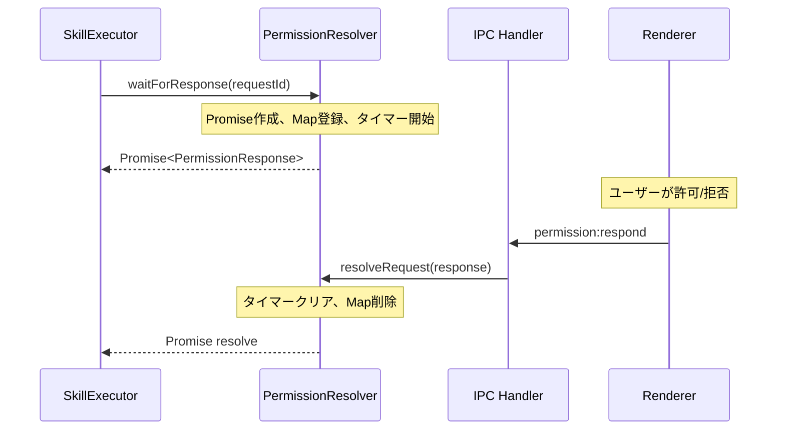
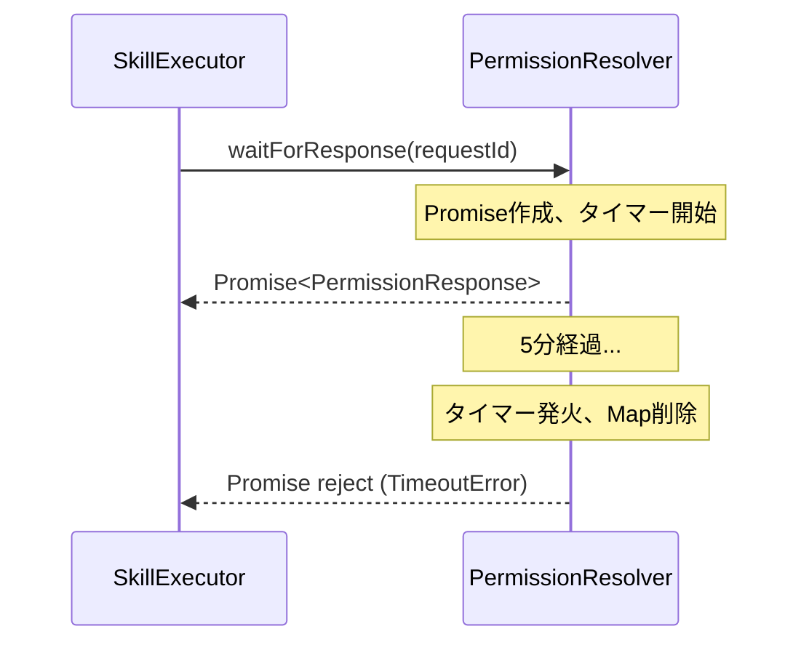
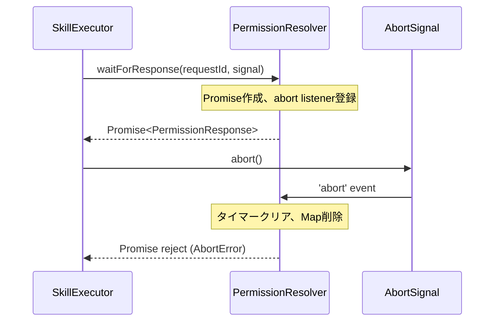

# Phase 2: 設計 - タスク仕様書

## メタ情報

| 項目       | 内容                    |
| ---------- | ----------------------- |
| Phase      | 2                       |
| Phase名    | 設計                    |
| 前提Phase  | Phase 1                 |
| 後続Phase  | Phase 3                 |
| ステータス | 未実施                  |
| 作成日     | 2026-01-25              |
| 機能名     | PermissionResolver 実装 |

---

## 目的

PermissionResolver クラスの詳細設計を行い、実装可能な設計書を作成する。

## 背景

Phase 1 で定義した要件を満たすクラス設計を行う。
Promise ベースの非同期待機、タイムアウト、AbortSignal 対応を含む設計とする。

---

## 実行タスク

### タスク 1: クラスインターフェース設計

**目的**: 公開インターフェースを設計する

**実行手順**:

1. クラスのパブリックメソッド・プロパティを定義
2. 各メソッドの引数・戻り値を明確化
3. TypeScript 型定義を作成

**期待される成果物**:

- クラスインターフェース定義

### タスク 2: 内部データ構造設計

**目的**: 待機中リクエストの管理構造を設計する

**実行手順**:

1. `PendingRequest` インターフェースを設計
2. `Map<string, PendingRequest>` の使用を決定
3. タイマー管理方式を設計

**期待される成果物**:

- 内部データ構造定義

### タスク 3: シーケンス図作成

**目的**: 主要フローの動作を可視化する

**実行手順**:

1. 正常フロー（待機→解決）のシーケンスを作成
2. タイムアウトフローを作成
3. AbortSignal キャンセルフローを作成

**期待される成果物**:

- シーケンス図（Mermaid形式）

---

## 参照資料

| 参照資料       | パス                                 | 内容                  |
| -------------- | ------------------------------------ | --------------------- |
| Phase 1 成果物 | `phase-1-requirements.md`            | 要件定義              |
| 型定義         | `packages/shared/src/types/skill.ts` | PermissionResponse 型 |

### システム仕様（aiworkflow-requirements）

> 実装前に必ず以下のシステム仕様を確認し、既存設計との整合性を確保してください。

| 参照資料              | パス                                                                         | 内容            |
| --------------------- | ---------------------------------------------------------------------------- | --------------- |
| interfaces-agent-sdk  | `.claude/skills/aiworkflow-requirements/references/interfaces-agent-sdk.md`  | 型定義・IPC仕様 |
| architecture-patterns | `.claude/skills/aiworkflow-requirements/references/architecture-patterns.md` | 設計パターン    |

---

## 成果物

| 成果物       | パス             | 内容               |
| ------------ | ---------------- | ------------------ |
| クラス設計書 | 本ドキュメント内 | インターフェース等 |
| シーケンス図 | 本ドキュメント内 | フロー可視化       |

---

## クラスインターフェース設計（タスク 1 成果物）

### パブリックインターフェース

```typescript
import type { PermissionResponse } from "@repo/shared";

export class PermissionResolver {
  /**
   * コンストラクタ
   * @param defaultTimeout タイムアウト時間（ミリ秒）。デフォルト: 300000（5分）
   */
  constructor(defaultTimeout?: number);

  /**
   * 権限応答を待機
   * @param requestId リクエストID
   * @param signal AbortSignal（キャンセル用）
   * @returns 権限応答
   * @throws Error タイムアウトまたはキャンセル時
   */
  async waitForResponse(
    requestId: string,
    signal?: AbortSignal,
  ): Promise<PermissionResponse>;

  /**
   * 権限リクエストを解決
   * @param response 権限応答
   */
  resolveRequest(response: PermissionResponse): void;

  /**
   * 保留中のリクエストをキャンセル
   * @param requestId リクエストID
   * @param reason キャンセル理由
   */
  cancelRequest(requestId: string, reason?: string): void;

  /**
   * 全ての保留中リクエストをキャンセル
   */
  cancelAll(): void;

  /**
   * 保留中のリクエスト数を取得
   */
  get pendingCount(): number;
}
```

---

## 内部データ構造設計（タスク 2 成果物）

### PendingRequest インターフェース

```typescript
interface PendingRequest {
  /** Promise を解決する関数 */
  resolve: (response: PermissionResponse) => void;
  /** Promise を拒否する関数 */
  reject: (error: Error) => void;
  /** タイムアウト用タイマーID */
  timeoutId: NodeJS.Timeout;
}
```

### 内部状態

```typescript
class PermissionResolver {
  /** 待機中のリクエストを管理する Map */
  private pendingRequests: Map<string, PendingRequest> = new Map();

  /** デフォルトタイムアウト（ミリ秒） */
  private defaultTimeout: number;
}
```

---

## シーケンス図（タスク 3 成果物）

### 正常フロー



### タイムアウトフロー



### AbortSignal キャンセルフロー



---

## 実装クラス設計

```typescript
// apps/desktop/src/main/services/skill/PermissionResolver.ts

import type { PermissionResponse } from "@repo/shared";

interface PendingRequest {
  resolve: (response: PermissionResponse) => void;
  reject: (error: Error) => void;
  timeoutId: NodeJS.Timeout;
}

export class PermissionResolver {
  private pendingRequests: Map<string, PendingRequest> = new Map();
  private defaultTimeout: number;

  constructor(defaultTimeout: number = 300000) {
    this.defaultTimeout = defaultTimeout;
  }

  async waitForResponse(
    requestId: string,
    signal?: AbortSignal,
  ): Promise<PermissionResponse> {
    return new Promise((resolve, reject) => {
      // タイムアウト設定
      const timeoutId = setTimeout(() => {
        this.pendingRequests.delete(requestId);
        reject(new Error(`Permission request timed out: ${requestId}`));
      }, this.defaultTimeout);

      // AbortSignal 処理
      if (signal) {
        signal.addEventListener("abort", () => {
          clearTimeout(timeoutId);
          this.pendingRequests.delete(requestId);
          reject(new Error(`Permission request aborted: ${requestId}`));
        });
      }

      // 保留リクエストを登録
      this.pendingRequests.set(requestId, {
        resolve,
        reject,
        timeoutId,
      });
    });
  }

  resolveRequest(response: PermissionResponse): void {
    const pending = this.pendingRequests.get(response.requestId);
    if (pending) {
      clearTimeout(pending.timeoutId);
      this.pendingRequests.delete(response.requestId);
      pending.resolve(response);
    }
  }

  cancelRequest(requestId: string, reason?: string): void {
    const pending = this.pendingRequests.get(requestId);
    if (pending) {
      clearTimeout(pending.timeoutId);
      this.pendingRequests.delete(requestId);
      pending.reject(new Error(reason || `Request cancelled: ${requestId}`));
    }
  }

  cancelAll(): void {
    for (const [requestId, pending] of this.pendingRequests) {
      clearTimeout(pending.timeoutId);
      pending.reject(new Error(`Request cancelled: ${requestId}`));
    }
    this.pendingRequests.clear();
  }

  get pendingCount(): number {
    return this.pendingRequests.size;
  }
}
```

---

## 完了条件

- [ ] クラスインターフェースが TypeScript 型で定義されている
- [ ] 内部データ構造（PendingRequest）が設計されている
- [ ] 正常フローのシーケンス図が作成されている
- [ ] タイムアウトフローのシーケンス図が作成されている
- [ ] AbortSignal キャンセルフローのシーケンス図が作成されている
- [ ] 実装コードの擬似実装が完成している

---

## Phase末端アクション【必須】

- [ ] 本Phase内の全タスクを100%実行完了
- [ ] 各タスクを100%完了し、完了を明記
- [ ] 成果物が全て生成されていることを確認

---

## 依存関係

- **前提**: Phase 1 が完了していること
- **後続**: Phase 3 へ進む

---

## 次のPhase

完了後、以下のファイルを実行してください:

`docs/30-workflows/skill-import-agent-system/tasks/TASK-3-2-permission-resolver/phase-3-design-review.md`
