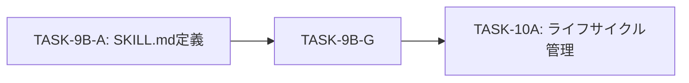

# TASK-9B-G: SkillCreatorService 実装

## 概要

skill-creator スキルのバックエンドサービスを実装し、`~/.aiworkflow/skills/skill-creator/` 配下の既存リソース（104+ファイル）を活用して、スキル生成・改善・タスク実行・オーケストレーション機能を提供する。

## 目的

**解決する問題**: skill-creatorのTypeScript API化により、Electronアプリケーションからプログラマティックにスキル作成・管理を行えるようにする。

## スコープ

### 含まれるもの

| カテゴリ                   | 内容                          |
| -------------------------- | ----------------------------- |
| 型定義                     | skillCreator.ts（共有型定義） |
| Script First実行基盤       | ScriptExecutor.ts             |
| Progressive Disclosure基盤 | ResourceLoader.ts             |
| メインサービス             | SkillCreatorService.ts        |
| ユニットテスト             | SkillCreatorService.test.ts   |

### 含まれないもの

- UI実装（TASK-10A以降）
- IPC通信設定（別タスク）
- スキル実行時の権限管理（既存PermissionServiceを利用）

## 入力（既存リソース活用）

| カテゴリ    | 数  | パス                                             | 活用方法                       |
| ----------- | --- | ------------------------------------------------ | ------------------------------ |
| agents/     | 36+ | `~/.aiworkflow/skills/skill-creator/agents/`     | サブエージェントプロンプト呼出 |
| references/ | 40+ | `~/.aiworkflow/skills/skill-creator/references/` | 設計ガイド・パターン参照       |
| scripts/    | 28+ | `~/.aiworkflow/skills/skill-creator/scripts/`    | 決定論的処理の100%精度実行     |
| assets/     | 38+ | `~/.aiworkflow/skills/skill-creator/assets/`     | テンプレート・タイプ別雛形     |
| schemas/    | 38+ | `~/.aiworkflow/skills/skill-creator/schemas/`    | JSON Schema検証                |

## 設計原則（skill-creator準拠）

| 原則                       | 適用                                         | 実装ポイント                 |
| -------------------------- | -------------------------------------------- | ---------------------------- |
| **Script First**           | 決定論的処理はscripts/配下のスクリプトに委譲 | `ScriptExecutor`クラスで実装 |
| **Progressive Disclosure** | 必要な時にのみリソースを読み込み             | `ResourceLoader`クラスで実装 |
| **Collaborative First**    | AskUserQuestionでユーザー対話を重視          | モード別ワークフローで対応   |
| **Problem First**          | 機能の前に問題を特定                         | Phase 0-0から開始するフロー  |

## 成果物一覧

| 成果物         | パス                                                                         | 必須 | 説明             |
| -------------- | ---------------------------------------------------------------------------- | ---- | ---------------- |
| 型定義         | `packages/shared/src/types/skillCreator.ts`                                  | ✅   | 共有型定義       |
| ScriptExecutor | `apps/desktop/src/main/services/skill/ScriptExecutor.ts`                     | ✅   | Script First基盤 |
| ResourceLoader | `apps/desktop/src/main/services/skill/ResourceLoader.ts`                     | ✅   | 遅延読み込み基盤 |
| メインサービス | `apps/desktop/src/main/services/skill/SkillCreatorService.ts`                | ✅   | サービス実装     |
| ユニットテスト | `apps/desktop/src/main/services/skill/__tests__/SkillCreatorService.test.ts` | ✅   | テストコード     |

## Phase一覧

| Phase | 名称                 | カテゴリ     | 説明                                     |
| ----- | -------------------- | ------------ | ---------------------------------------- |
| 1     | 要件定義             | 要件         | FR/NFR抽出、受け入れ基準定義             |
| 2     | 設計                 | 設計         | アーキテクチャ設計、インターフェース定義 |
| 3     | 設計レビューゲート   | ゲート       | 設計妥当性検証                           |
| 4     | テスト作成           | TDD-Red      | テストファースト開発                     |
| 5     | 実装                 | TDD-Green    | 最小限の実装                             |
| 6     | テスト拡充           | 品質         | カバレッジ向上                           |
| 7     | テストカバレッジ確認 | 品質         | 基準達成検証                             |
| 8     | リファクタリング     | TDD-Refactor | コード品質改善                           |
| 9     | 品質保証             | 品質         | 全品質ゲートクリア                       |
| 10    | 最終レビューゲート   | ゲート       | 実装完了検証                             |
| 11    | 手動テスト検証       | 検証         | UI/UX検証                                |
| 12    | ドキュメント更新     | 文書化       | 仕様書・ガイド更新                       |
| 13    | PR作成               | 完了         | マージ準備                               |

## 依存関係

## 参照資料

| 資料名             | パス                                                                 | 説明                     |
| ------------------ | -------------------------------------------------------------------- | ------------------------ |
| SKILL.md定義       | `~/.aiworkflow/skills/skill-creator/SKILL.md`                        | スキル定義（依存成果物） |
| リソースマップ     | `~/.aiworkflow/skills/skill-creator/references/resource-map.md`      | 全リソース詳細           |
| 設計原則           | `~/.aiworkflow/skills/skill-creator/references/core-principles.md`   | Script First等原則       |
| スクリプトコマンド | `~/.aiworkflow/skills/skill-creator/references/script-commands.md`   | スクリプト実行詳細       |
| 品質基準           | `~/.aiworkflow/skills/skill-creator/references/quality-standards.md` | 検証基準                 |
| Agent SDK仕様      | `aiworkflow-requirements: interfaces-agent-sdk-skill.md`             | SDK統合仕様              |
| IPC設計            | `aiworkflow-requirements: api-ipc-agent.md`                          | IPC通信仕様              |
| 実装パターン       | `aiworkflow-requirements: architecture-implementation-patterns.md`   | 実装パターン             |

## 完了条件

- [ ] skillCreator.ts が作成されている
- [ ] ScriptExecutor.ts が実装されている
- [ ] ResourceLoader.ts が実装されている
- [ ] SkillCreatorService.ts が実装されている
- [ ] detectMode() がスクリプト委譲で動作する
- [ ] createSkill() が collaborative/orchestrate/create モードに対応
- [ ] executeTasks() が依存関係解決・並列実行に対応
- [ ] validateSkill() が validate_all.js を呼び出す
- [ ] validateWithSchema() が validate_schema.js を呼び出す
- [ ] 循環依存検出が機能する
- [ ] ユニットテストカバレッジ 80%+ 達成
- [ ] 統合テストが全て成功
- [ ] **本タスク内の全実装を100%完了**

## フォールバック手順

| 状況                   | 代替手順                                               |
| ---------------------- | ------------------------------------------------------ |
| スクリプト未存在       | エラーハンドリングで適切なメッセージを返す             |
| スキーマ検証失敗       | 詳細なバリデーションエラーをログ出力                   |
| 依存関係解決失敗       | 部分実行モードで実行可能なタスクのみ処理               |
| Claude Agent SDK未導入 | 直接Anthropic SDK（@anthropic-ai/sdk）でフォールバック |
