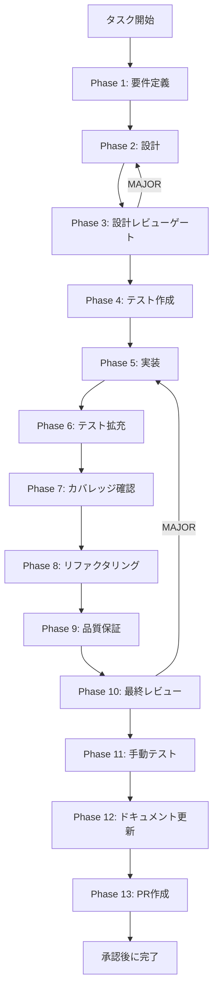

# TASK-CONFLICT-PREVENT-001 - タスク実行仕様書

## ユーザーからの元の指示

```
過去10個のプルリクを確認して.claude/skills/配下でコンフリクトが生じている場合が非常に多い。
タイムスタンプや数を数えているところでコンフリクトが生じているものは削除。
それ以外にもコンフリクトになるような部分があれば、コンフリクトにならない対策を練る。
30種の思考法で多角的に検証・改善したコンフリクト対策案を実装する。
```

## メタ情報

| 項目         | 内容                                                         |
| ------------ | ------------------------------------------------------------ |
| タスクID     | TASK-CONFLICT-PREVENT-001                                    |
| タスク名     | skill-merge-conflict-prevention                              |
| 分類         | インフラ / Git設定 / NON_VISUAL                              |
| 対象機能     | `.claude/skills/` / `.agents/skills/` マージコンフリクト防止 |
| 優先度       | High                                                         |
| 見積もり規模 | 小                                                           |
| ステータス   | Phase 5 完了（部分）                                         |
| 作成日       | 2026-04-17                                                   |
| depends_on   | なし                                                         |

---

## タスク概要

### 目的

複数の並列PRが`.claude/skills/`・`.agents/skills/`配下の同一ファイルを更新することで発生するマージコンフリクトを、Gitのマージ戦略設定・自動化フック・ファイル管理方針の整備により防止する。

### 背景

過去10件のPRで確認されたコンフリクト実績：

| ファイル                           | コンフリクト頻度 | 原因                                          |
| ---------------------------------- | ---------------- | --------------------------------------------- |
| `SKILL.md` 版管理テーブル          | 毎PR             | 並列ブランチが同一テーブル行を追記            |
| `indexes/keywords.json`（15000行） | 毎PR             | 自動生成JSONをmerge=oursで保護できていない    |
| `indexes/topic-map.md`             | 2PR毎            | 大量行変更が競合                              |
| `LOGS.md`                          | 毎PR             | 追記ログの先頭行競合                          |
| `settings.local.json`              | 3PR毎            | allow配列の並列エントリ追加                   |
| `.backups/`                        | 不定期           | タイムスタンプ付きバックアップの削除/修正競合 |

### 根本原因（Why×5分析）

1. なぜ → 複数ブランチが同一ファイルを編集
2. なぜ → スキル定義の更新が「追記」形式で分割設計がない
3. なぜ → ログ・メタデータ・キーワードが単一ファイルに混在
4. なぜ → スキルファイルのマージ戦略が未整備
5. なぜ → `.gitattributes`でコンフリクトタイプ別の戦略が定義されていない

### 最終ゴール

- 全コンフリクト頻出ファイルにマージ戦略が適用されていること
- `post-merge`フックが`keywords.json`を自動再生成すること
- `.backups/`ディレクトリがgit追跡対象外であること
- `settings.local.json`にマージ戦略が適用されていること

### 成果物一覧

| 種別         | 成果物                       | 配置先                          |
| ------------ | ---------------------------- | ------------------------------- |
| 設定         | `.gitattributes` 更新        | プロジェクトルート              |
| フック       | `.husky/post-merge` 新規作成 | `.husky/`                       |
| 除外設定     | `.gitignore` 更新            | プロジェクトルート              |
| ドキュメント | Phase 1-13 仕様・実行成果物  | `outputs/phase-1/ 〜 phase-13/` |

---

## 参照ファイル

- `.gitattributes` - マージ戦略定義ファイル
- `.husky/post-merge` - post-mergeフック
- `.gitignore` - 追跡除外設定
- `.claude/skills/aiworkflow-requirements/scripts/generate-index.js` - インデックス再生成スクリプト
- `.claude/hooks/post-merge-index-regenerate.sh` - 再生成スクリプト（参照元）

---

## 受入条件

| ID   | 条件                                                                       |
| ---- | -------------------------------------------------------------------------- |
| AC-1 | `.claude/skills/*/SKILL.md merge=union` が`.gitattributes`に設定されている |
| AC-2 | `.husky/post-merge`が`generate-index.js`を呼び出し、失敗時にexit 1する     |
| AC-3 | `.agents/skills/`ミラーがpost-mergeフックで同期される                      |
| AC-4 | `.claude/settings.local.json merge=ours`が`.gitattributes`に設定されている |
| AC-5 | `.backups/`が`.gitignore`に追加されており追跡対象外である                  |
| AC-6 | `git merge`実行後にコンフリクトマーカーが残らないことを確認                |

---

## タスク分解サマリー

| ID     | フェーズ | サブタスク名       | 責務                                                     | 依存 |
| ------ | -------- | ------------------ | -------------------------------------------------------- | ---- |
| T-01-1 | Phase 1  | 要件定義           | コンフリクト実績分析・受入条件策定                       | -    |
| T-02-1 | Phase 2  | 設計               | マージ戦略設計・フック設計・ファイル管理方針設計         | T-01 |
| T-03-1 | Phase 3  | 設計レビューゲート | 設計の整合性・リスク検証                                 | T-02 |
| T-04-1 | Phase 4  | テスト作成         | マージ動作確認テストケース定義（手動確認手順）           | T-03 |
| T-05-1 | Phase 5  | 実装               | .gitattributes / .husky/post-merge / .gitignore 更新     | T-04 |
| T-06-1 | Phase 6  | テスト拡充         | エッジケース確認（フック失敗時・JSON破損時）             | T-05 |
| T-07-1 | Phase 7  | カバレッジ確認     | 全コンフリクト源のカバレッジ確認                         | T-06 |
| T-08-1 | Phase 8  | リファクタリング   | .gitattributes コメント整理・フック最適化                | T-07 |
| T-09-1 | Phase 9  | 品質保証           | `.gitattributes`構文検証・フック実行確認                 | T-08 |
| T-10-1 | Phase 10 | 最終レビュー       | AC・依存関係・4条件の最終判定                            | T-09 |
| T-11-1 | Phase 11 | 手動テスト         | 実際のマージ動作確認（NON_VISUAL）                       | T-10 |
| T-12-1 | Phase 12 | ドキュメント更新   | 実装ガイド・未タスク・skill feedback・準拠チェックの固定 | T-11 |
| T-13-1 | Phase 13 | PR作成             | ユーザー承認後の変更要約と PR 作成                       | T-12 |

**総サブタスク数**: 13個

---

## 実行フロー図



---

## Phase一覧

| Phase | 名称               | 仕様書                                                       | ステータス |
| ----- | ------------------ | ------------------------------------------------------------ | ---------- |
| 1     | 要件定義           | [phase-1-requirements.md](phase-1-requirements.md)           | 完了       |
| 2     | 設計               | [phase-2-design.md](phase-2-design.md)                       | 完了       |
| 3     | 設計レビューゲート | [phase-3-design-review.md](phase-3-design-review.md)         | 完了       |
| 4     | テスト作成         | [phase-4-test-creation.md](phase-4-test-creation.md)         | 完了       |
| 5     | 実装               | [phase-5-implementation.md](phase-5-implementation.md)       | 部分完了   |
| 6     | テスト拡充         | [phase-6-test-expansion.md](phase-6-test-expansion.md)       | pending    |
| 7     | カバレッジ確認     | [phase-7-coverage-check.md](phase-7-coverage-check.md)       | pending    |
| 8     | リファクタリング   | [phase-8-refactoring.md](phase-8-refactoring.md)             | pending    |
| 9     | 品質保証           | [phase-9-quality-assurance.md](phase-9-quality-assurance.md) | pending    |
| 10    | 最終レビューゲート | [phase-10-final-review.md](phase-10-final-review.md)         | pending    |
| 11    | 手動テスト         | [phase-11-manual-test.md](phase-11-manual-test.md)           | pending    |
| 12    | ドキュメント更新   | [phase-12-documentation.md](phase-12-documentation.md)       | pending    |
| 13    | PR作成             | [phase-13-pr-creation.md](phase-13-pr-creation.md)           | pending    |

---

## 依存関係

- **depends_on**: なし（本タスクは独立して実施可能）
- **後続タスク**: なし

---

## Phase完了時の必須アクション

1. **タスク100%実行**: Phase内で指定された全タスクを完全に実行
2. **成果物確認**: 全ての必須成果物が生成されていることを検証
3. **artifacts.json更新**: Phase完了ステータスを更新
4. **完了条件チェック**: 各タスクを完遂した旨を必ず明記
