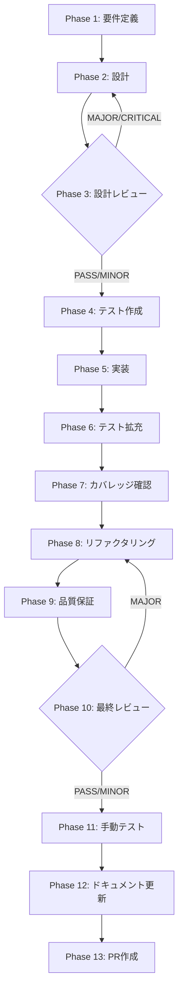

# TASK-SDK-04-U2: planId と execute payload の canonical binding drift を是正する

## メタ情報

| 項目           | 内容                                                            |
| -------------- | --------------------------------------------------------------- |
| タスクID       | TASK-SDK-04-U2                                                  |
| タスク名       | planId と execute payload の canonical binding drift を是正する |
| 分類           | 実装改善                                                        |
| 対象機能       | SkillLifecyclePanel execute flow                                |
| 優先度         | 高                                                              |
| 見積もり規模   | 小規模                                                          |
| ステータス     | spec_created                                                    |
| 発見元         | TASK-SDK-04 Phase 12 再監査                                     |
| 作成日         | 2026-03-27                                                      |
| Issue          | #1671                                                           |
| 親ワークフロー | step-03-par-task-04-user-interaction-bridge-and-phase-ui        |

---

## タスク概要

### 目的

`handleExecutePlan` が textarea の current draft を `executePlan` の第2引数に渡しているため、plan review 後にユーザーが textarea を編集すると承認済み plan と異なる内容が実行される問題を修正する。

### 背景

Task04 で plan review → execute の UI フローを追加したが、execute payload が canonical plan snapshot ではなく `request.trim()`（textarea の現在値）に依存している。これにより plan review の承認が実質無効化される。

### 最終ゴール

1. `planId` と execute payload が同一 plan snapshot を指す
2. review 後の textarea 編集が execute 対象を勝手に変えない
3. renderer test で drift 再発を防止する

---

## 成果物一覧

| Phase | 名称             | 成果物                                        |
| ----- | ---------------- | --------------------------------------------- |
| 1     | 要件定義         | `outputs/phase-1/requirements-definition.md`  |
| 2     | 設計             | `outputs/phase-2/design-document.md`          |
| 3     | 設計レビュー     | `outputs/phase-3/review-result.md`            |
| 4     | テスト作成       | `outputs/phase-4/test-specifications.md`      |
| 5     | 実装             | `outputs/phase-5/implementation-record.md`    |
| 6     | テスト拡充       | `outputs/phase-6/extended-test-record.md`     |
| 7     | カバレッジ確認   | `outputs/phase-7/coverage-report.md`          |
| 8     | リファクタリング | `outputs/phase-8/refactoring-record.md`       |
| 9     | 品質保証         | `outputs/phase-9/quality-report.md`           |
| 10    | 最終レビュー     | `outputs/phase-10/final-review-result.md`     |
| 11    | 手動テスト       | `outputs/phase-11/manual-test-result.md`      |
| 12    | ドキュメント更新 | `outputs/phase-12/implementation-guide.md` 他 |
| 13    | PR作成           | `outputs/phase-13/change-summary.md`          |

---

## 参照ファイル

- `apps/desktop/src/renderer/components/skill/SkillLifecyclePanel.tsx`
- `apps/desktop/src/renderer/components/skill/__tests__/SkillLifecyclePanel.llm-generation.test.tsx`
- `apps/desktop/src/renderer/store/slices/agentSlice.ts`
- `docs/30-workflows/completed-tasks/step-03-par-task-04-user-interaction-bridge-and-phase-ui/outputs/phase-12/implementation-guide.md`

---

## タスク分解サマリ（Phase 1-13）



| Phase | 名称             | パターン | 依存     | ゲート |
| ----- | ---------------- | -------- | -------- | ------ |
| 1     | 要件定義         | seq      | -        | -      |
| 2     | 設計             | seq      | Phase 1  | -      |
| 3     | 設計レビュー     | seq      | Phase 2  | GATE   |
| 4     | テスト作成       | seq      | Phase 3  | -      |
| 5     | 実装             | seq      | Phase 4  | -      |
| 6     | テスト拡充       | seq      | Phase 5  | -      |
| 7     | カバレッジ確認   | seq      | Phase 6  | -      |
| 8     | リファクタリング | seq      | Phase 7  | -      |
| 9     | 品質保証         | seq      | Phase 8  | -      |
| 10    | 最終レビュー     | seq      | Phase 9  | GATE   |
| 11    | 手動テスト       | seq      | Phase 10 | -      |
| 12    | ドキュメント更新 | par      | Phase 11 | -      |
| 13    | PR作成           | seq      | Phase 12 | -      |

---

## テストカバレッジ目標

| カテゴリ | 対象                                              | 目標       |
| -------- | ------------------------------------------------- | ---------- |
| ユニット | `SkillLifecyclePanel` handleExecutePlan           | 100%       |
| ユニット | approvedSkillSpec state 管理                      | 100%       |
| 統合     | plan 作成 → textarea 変更 → execute の E2E フロー | drift 検出 |

---

## Phase 完了時アクション

各 Phase 完了時に以下を実行:

```bash
node .claude/skills/task-specification-creator/scripts/complete-phase.js \
  --workflow TASK-SDK-04-U2-plan-execute-canonical-binding \
  --phase <PHASE_NUMBER>
```

---

## 出力ファイル構成

```
docs/30-workflows/TASK-SDK-04-U2-plan-execute-canonical-binding/
├── index.md
├── artifacts.json
├── phase-1-requirements.md
├── phase-2-design.md
├── phase-3-design-review.md
├── phase-4-test-creation.md
├── phase-5-implementation.md
├── phase-6-test-expansion.md
├── phase-7-coverage-check.md
├── phase-8-refactoring.md
├── phase-9-quality-assurance.md
├── phase-10-final-review.md
├── phase-11-manual-test.md
├── phase-12-documentation.md
├── phase-13-pr-creation.md
└── outputs/
    ├── phase-1/ ~ phase-13/
    └── phase-11/screenshots/
```
