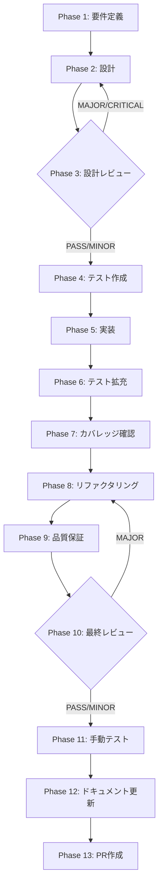

# TASK-SW-FIX-FEEDBACK-008: fetchSkills() 非ブロッキング化（follow-up）

## メタ情報

| 項目         | 内容                                        |
| ------------ | ------------------------------------------- |
| タスクID     | TASK-SW-FIX-FEEDBACK-008                    |
| タスク名     | fetchSkills() 非ブロッキング化（follow-up） |
| 分類         | バグ修正（フォローアップ）                  |
| 対象機能     | SkillLifecyclePanel（Wave C）               |
| 優先度       | 中                                          |
| 見積もり規模 | 中規模（小）                                |
| ステータス   | phase13_blocked（PR #2179でマージ済み）     |
| ウェーブ     | Wave C（TASK-SW-FIX-FEEDBACK-001完了後）    |
| 作成日       | 2026-04-15                                  |
| 親タスクID   | TASK-SW-FIX-FEEDBACK-001                    |
| 関連Issue    | #2176（CLOSED）                             |
| 実装PR       | #2179（マージ済み）                         |

---

## 現在の状態

- 実装は PR #2179 でマージ済み
- Phase 1〜3 は completed（仕様書のみ後追い作成）
- Phase 4〜12 は completed（PR #2179 の実装に対応）
- Phase 13 は blocked（PR 作成は保留、PR #2179 は既にマージ済み）

## タスク概要

### 目的

`SkillLifecyclePanel.tsx` の `handleExecutePlan` / `processWorkflowOutcome` において、
`fetchSkills()` が失敗した場合でも `selectSkillByName` が正常に実行されるよう、
`fetchSkills()` を非ブロッキング処理に変更する。あわせて、`workflowSnapshot`
が遅れて到着した場合でも `processWorkflowOutcome` を再実行して
`loadVerifyDetail` へつなぐ follow-up を含む。

### 背景

修正前のコードでは `fetchSkills()` を `try-catch` で囲み、失敗時に `return true` で
early return していたため、`selectSkillByName` が到達不能になっていた。
この問題は Issue #2176 で報告され、PR #2179 で修正された。
さらに、`executePlan` の ack 後に `workflowSnapshot` が遅れて到着する経路に対しても、
snapshot 再処理が必要だったため、`processWorkflowOutcome` を再適用する effect が追加された。

| 修正箇所   | 内容                                                                                 |
| ---------- | ------------------------------------------------------------------------------------ |
| L769-784   | `handleExecutePlan` 内の `fetchSkills()` try-catch を `.catch()` パターンへ変換      |
| L1110-1113 | `processWorkflowOutcome` 内の `fetchSkills()` try-catch を `.catch()` パターンへ変換 |
| L903-917   | `workflowSnapshot` 遅延到着時に `processWorkflowOutcome` を再実行する effect を追加  |

### 修正内容

**修正前（ブロッキング）**:

```typescript
try {
  await fetchSkills();
} catch (error) {
  setGenerationError(
    error instanceof Error ? error.message : "スキル一覧の取得に失敗しました。",
  );
  return true; // ← fetchSkills 失敗で early return、selectSkillByName が実行されない
}
if (executeResult.skillName) {
  selectSkillByName(executeResult.skillName); // ← fetchSkills 失敗時は到達しない
}
```

**修正後（非ブロッキング）**:

```typescript
// fetchSkills の失敗はスキル選択を妨げない（non-blocking）
await fetchSkills().catch((error) => {
  console.warn(
    "[SkillLifecyclePanel] fetchSkills failed (non-blocking):",
    error,
  );
});
if (executeResult.skillName) {
  selectSkillByName(executeResult.skillName);
}
```

### 依存タスク

- **依存**: TASK-SW-FIX-FEEDBACK-001（Wave B完了後に本タスクを開始可能）

### 最終ゴール

1. `processWorkflowOutcome` で `fetchSkills()` が失敗しても `selectSkillByName` が実行される
2. `handleExecutePlan` で `fetchSkills()` が失敗しても `selectSkillByName` が実行される
3. `fetchSkills()` 失敗時のエラーは `console.warn` で記録するが `generationError` には設定しない
4. 既存テスト U-8/U-13 が PASS（回帰なし）
5. TypeScript 型エラー・ESLint エラーなし
6. `workflowSnapshot` が遅れて到着しても `processWorkflowOutcome` が再実行され、`loadVerifyDetail` が維持される

---

## 受入条件

| ID   | 内容                                                                                            |
| ---- | ----------------------------------------------------------------------------------------------- |
| AC-1 | `processWorkflowOutcome` で `fetchSkills()` が throw した場合、`selectSkillByName` が実行される |
| AC-2 | `handleExecutePlan` で `fetchSkills()` が throw した場合、`selectSkillByName` が実行される      |
| AC-3 | `fetchSkills()` 失敗時のエラーは `console.warn` で記録するが `generationError` には設定しない   |
| AC-4 | 既存テスト U-8/U-13 が PASS（回帰なし）                                                         |
| AC-5 | TypeScript 型エラー・ESLint エラーなし                                                          |

---

## 変更対象ファイル

| ファイル                                                                                           | 修正内容                                            |
| -------------------------------------------------------------------------------------------------- | --------------------------------------------------- |
| `apps/desktop/src/renderer/components/skill/SkillLifecyclePanel.tsx`                               | L769-784 / L1110-1113: fetchSkills 非ブロッキング化 |
| `apps/desktop/src/renderer/components/skill/__tests__/SkillLifecyclePanel.llm-generation.test.tsx` | AC-1/AC-2 を検証するテストケース追加                |

---

## 成果物一覧

| Phase | 名称             | 成果物                                                                                                                                                                                                                                                                                                   |
| ----- | ---------------- | -------------------------------------------------------------------------------------------------------------------------------------------------------------------------------------------------------------------------------------------------------------------------------------------------------- |
| 1     | 要件定義         | `outputs/phase-1/requirements-definition.md`                                                                                                                                                                                                                                                             |
| 2     | 設計             | `outputs/phase-2/design-document.md`                                                                                                                                                                                                                                                                     |
| 3     | 設計レビュー     | `outputs/phase-3/review-result.md`                                                                                                                                                                                                                                                                       |
| 4     | テスト作成       | `outputs/phase-4/test-specifications.md`                                                                                                                                                                                                                                                                 |
| 5     | 実装             | `outputs/phase-5/implementation-record.md`                                                                                                                                                                                                                                                               |
| 6     | テスト拡充       | `outputs/phase-6/extended-test-record.md`                                                                                                                                                                                                                                                                |
| 7     | カバレッジ確認   | `outputs/phase-7/coverage-report.md`                                                                                                                                                                                                                                                                     |
| 8     | リファクタリング | `outputs/phase-8/refactoring-record.md`                                                                                                                                                                                                                                                                  |
| 9     | 品質保証         | `outputs/phase-9/quality-report.md`                                                                                                                                                                                                                                                                      |
| 10    | 最終レビュー     | `outputs/phase-10/final-review-result.md`                                                                                                                                                                                                                                                                |
| 11    | 手動テスト       | `outputs/phase-11/manual-test-checklist.md` / `outputs/phase-11/manual-test-result.md` / `outputs/phase-11/discovered-issues.md` / `outputs/phase-11/phase11-capture-metadata.json`                                                                                                                      |
| 12    | ドキュメント更新 | `outputs/phase-12/implementation-guide.md` / `outputs/phase-12/system-spec-update-summary.md` / `outputs/phase-12/documentation-changelog.md` / `outputs/phase-12/unassigned-task-detection.md` / `outputs/phase-12/skill-feedback-report.md` / `outputs/phase-12/phase12-task-spec-compliance-check.md` |
| 13    | PR作成           | `outputs/phase-13/pr-info.md`                                                                                                                                                                                                                                                                            |

---

## 参照ファイル

- `apps/desktop/src/renderer/components/skill/SkillLifecyclePanel.tsx`
- `apps/desktop/src/renderer/components/skill/__tests__/SkillLifecyclePanel.llm-generation.test.tsx`
- `docs/30-workflows/skill-wizard-bugfix-wave/index.md`

---

## タスク分解サマリ（Phase 1-13）



| Phase | 名称             | パターン | 依存     | ゲート     | ステータス |
| ----- | ---------------- | -------- | -------- | ---------- | ---------- |
| 1     | 要件定義         | seq      | -        | -          | completed  |
| 2     | 設計             | seq      | Phase 1  | -          | completed  |
| 3     | 設計レビュー     | seq      | Phase 2  | GATE       | completed  |
| 4     | テスト作成       | seq      | Phase 3  | -          | completed  |
| 5     | 実装             | seq      | Phase 4  | -          | completed  |
| 6     | テスト拡充       | seq      | Phase 5  | -          | completed  |
| 7     | カバレッジ確認   | seq      | Phase 6  | -          | completed  |
| 8     | リファクタリング | seq      | Phase 7  | -          | completed  |
| 9     | 品質保証         | seq      | Phase 8  | -          | completed  |
| 10    | 最終レビュー     | seq      | Phase 9  | GATE       | completed  |
| 11    | 手動テスト       | seq      | Phase 10 | NON_VISUAL | completed  |
| 12    | ドキュメント更新 | par      | Phase 11 | -          | completed  |
| 13    | PR作成           | seq      | Phase 12 | -          | blocked    |

---

## テストカバレッジ目標

| カテゴリ | 対象                                                                    | 目標     |
| -------- | ----------------------------------------------------------------------- | -------- |
| ユニット | processWorkflowOutcome: fetchSkills 失敗時の selectSkillByName 実行確認 | 100%     |
| ユニット | handleExecutePlan: fetchSkills 失敗時の selectSkillByName 実行確認      | 100%     |
| ユニット | fetchSkills 失敗時の console.warn 記録・generationError 非設定確認      | 100%     |
| 統合     | fetchSkills 失敗 → スキル選択継続の E2E フロー                          | 再発防止 |

---

## Phase 完了時アクション

各 Phase 完了時に以下を実行:

```bash
node .claude/skills/task-specification-creator/scripts/complete-phase.js \
  --workflow TASK-SW-FIX-FEEDBACK-008 \
  --phase <PHASE_NUMBER>
```

---

## 出力ファイル構成

```
docs/30-workflows/TASK-SW-FIX-FEEDBACK-008/
├── index.md
├── artifacts.json
├── phase-1-requirements.md
├── phase-2-design.md
├── phase-3-design-review.md
├── phase-4-test-creation.md
├── phase-5-implementation.md
├── phase-6-test-expansion.md
├── phase-7-coverage-check.md
├── phase-8-refactoring.md
├── phase-9-quality-assurance.md
├── phase-10-final-review.md
├── phase-11-manual-test.md
├── phase-12-documentation.md
├── phase-13-pr-creation.md
└── outputs/
    ├── phase-1/ ~ phase-13/
    └── phase-11/screenshots/
```
