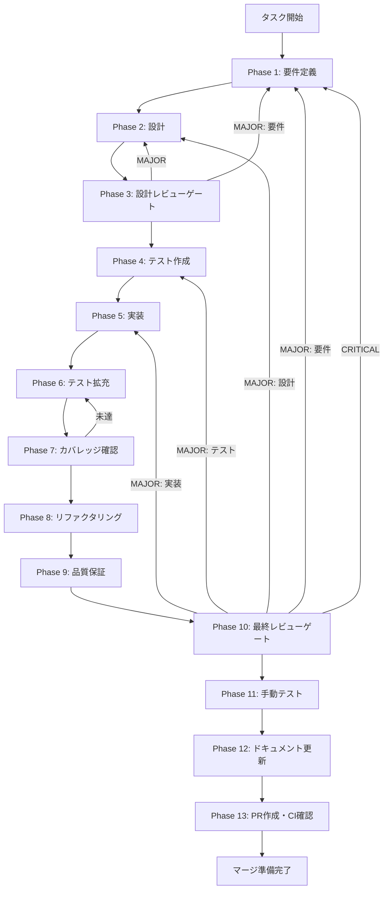

# UT-06-005-abort-skip-retry-fallback - タスク実行仕様書

## ユーザーからの元の指示

```
Permission 拒否時の挙動が実装に固定化されていない。abort/skip/retry 契約を実装しないと、
安全停止と継続実行の境界が曖昧になる。
abort 4ステップ、skip 契約、retry 最大3回、timeout 300000ms の挙動を SkillExecutor に実装する。
```

## メタ情報

| 項目         | 内容                                                                     |
| ------------ | ------------------------------------------------------------------------ |
| タスクID     | UT-06-005                                                                |
| タスク名     | abort-skip-retry-fallback                                                |
| 分類         | 実装                                                                     |
| 対象機能     | Permission拒否時のフォールバック制御                                     |
| 優先度       | 高                                                                       |
| 見積もり規模 | 中規模                                                                   |
| ステータス   | 未実施                                                                   |
| 作成日       | 2026-03-16                                                               |
| 依存タスク   | TASK-SKILL-LIFECYCLE-08                                                  |
| 発見元       | TASK-SKILL-LIFECYCLE-06 Phase 12                                         |
| GitHub Issue | [#1250](https://github.com/daishiman/AIWorkflowOrchestrator/issues/1250) |

---

## タスク概要

### 目的

SkillExecutor において Permission 拒否時の abort/skip/retry フォールバックフローを実装し、安全停止と継続実行の境界を明確に定義する。`PermissionResolver` と `PermissionStore` を利用し、fail-closed を基本にフロー分岐を実装する。

### 背景

現在の SkillExecutor は Permission 拒否時の挙動が実装に固定化されておらず、以下の問題がある:

1. **abort フロー未実装**: Permission 拒否時に cancelAll -> revokeSessionEntries -> log -> IPC の4ステップが定義されていない
2. **skip フロー未実装**: `{ approved: false, skip: true }` レスポンスによる後続処理継続の契約が未定義
3. **retry フロー未実装**: Permission 拒否時のリトライ（最大3回、3回目でabort）が組み込まれていない
4. **timeout -> abort 遷移未実装**: タイムアウト発生時に retry に行かず直接 abort に遷移する制御が未実装

### 最終ゴール

- abort フロー4ステップが SkillExecutor に実装され、安全に実行を停止できる
- skip フローで後続処理が正常に継続する
- retry が最大3回で打ち切られ、abort に遷移する
- timeout 発生時は retry を経由せず直接 abort に遷移する
- 全フローの冪等性テストが PASS する

### 成果物一覧

| 種別         | 成果物                               | 配置先                                                     |
| ------------ | ------------------------------------ | ---------------------------------------------------------- |
| 機能         | abort/skip/retry fallback フロー実装 | `apps/desktop/src/main/services/skill/SkillExecutor.ts`    |
| テスト       | フォールバックフローテスト           | `apps/desktop/src/main/services/skill/__tests__/*.test.ts` |
| ドキュメント | Phase別成果物                        | `outputs/phase-*/`                                         |
| PR           | GitHub Pull Request                  | GitHub UI                                                  |

---

## 参照ファイル

本仕様書のコマンド選定は以下を参照:

- `docs/00-requirements/master_system_design.md` - システム要件
- `.claude/skills/aiworkflow-requirements/references/` - システム仕様
- `docs/30-workflows/completed-tasks/step-05-par-task-06-trust-permission-governance/` - 前タスク成果物

---

## タスク分解サマリー

| ID     | フェーズ | サブタスク名                       | 責務                                  | 依存 |
| ------ | -------- | ---------------------------------- | ------------------------------------- | ---- |
| T-01-1 | Phase 1  | 要件抽出・受入基準定義             | abort/skip/retry/timeout 要件を明文化 | -    |
| T-02-1 | Phase 2  | フロー設計・インターフェース定義   | 4フローの状態遷移・IF設計             | T-01 |
| T-03-1 | Phase 3  | 設計レビューゲート                 | 要件・設計の妥当性検証                | T-02 |
| T-04-1 | Phase 4  | テストケース設計・テストコード作成 | abort/skip/retry/timeout テスト作成   | T-03 |
| T-05-1 | Phase 5  | フォールバックフロー実装           | SkillExecutor に4フローを実装         | T-04 |
| T-06-1 | Phase 6  | テスト拡充                         | 境界値・異常系・冪等性テスト追加      | T-05 |
| T-07-1 | Phase 7  | カバレッジ確認                     | Line 80%+ / Branch 60%+ 達成確認      | T-06 |
| T-08-1 | Phase 8  | リファクタリング                   | コード品質改善・重複排除              | T-07 |
| T-09-1 | Phase 9  | 品質保証                           | Lint・型チェック・全テスト実行        | T-08 |
| T-10-1 | Phase 10 | 最終レビューゲート                 | 多角的品質・整合性検証                | T-09 |
| T-11-1 | Phase 11 | 手動テスト                         | 実環境動作確認                        | T-10 |
| T-12-1 | Phase 12 | ドキュメント更新                   | 実装ガイド・仕様書更新・未タスク検出  | T-11 |
| T-13-1 | Phase 13 | PR作成                             | コミット・PR作成・CI確認              | T-12 |

**総サブタスク数**: 13個

---

## 実行フロー図



---

## Phase一覧

| Phase | 名称               | 仕様書                                                       | ステータス |
| ----- | ------------------ | ------------------------------------------------------------ | ---------- |
| 1     | 要件定義           | [phase-1-requirements.md](phase-1-requirements.md)           | 未実施     |
| 2     | 設計               | [phase-2-design.md](phase-2-design.md)                       | 未実施     |
| 3     | 設計レビューゲート | [phase-3-design-review.md](phase-3-design-review.md)         | 未実施     |
| 4     | テスト作成         | [phase-4-test-creation.md](phase-4-test-creation.md)         | 未実施     |
| 5     | 実装               | [phase-5-implementation.md](phase-5-implementation.md)       | 未実施     |
| 6     | テスト拡充         | [phase-6-test-expansion.md](phase-6-test-expansion.md)       | 未実施     |
| 7     | カバレッジ確認     | [phase-7-coverage-check.md](phase-7-coverage-check.md)       | 未実施     |
| 8     | リファクタリング   | [phase-8-refactoring.md](phase-8-refactoring.md)             | 未実施     |
| 9     | 品質保証           | [phase-9-quality-assurance.md](phase-9-quality-assurance.md) | 未実施     |
| 10    | 最終レビューゲート | [phase-10-final-review.md](phase-10-final-review.md)         | 未実施     |
| 11    | 手動テスト         | [phase-11-manual-test.md](phase-11-manual-test.md)           | 未実施     |
| 12    | ドキュメント更新   | [phase-12-documentation.md](phase-12-documentation.md)       | 未実施     |
| 13    | PR作成             | [phase-13-pr-creation.md](phase-13-pr-creation.md)           | 未実施     |

---

## テストカバレッジ目標

### ユニットテスト

| 指標              | 最低基準 | 推奨基準 |
| ----------------- | -------- | -------- |
| Line Coverage     | 80%      | 90%      |
| Branch Coverage   | 60%      | 70%      |
| Function Coverage | 80%      | 90%      |

### 結合テスト

| 指標                         | 目標 |
| ---------------------------- | ---- |
| APIエンドポイント            | 100% |
| モジュール間インターフェース | 100% |
| 正常系シナリオ               | 100% |
| 異常系シナリオ               | 80%+ |
| 外部連携ポイント             | 100% |

---

## 統合テスト連携（Phase 1〜11で必須）

各Phaseで以下の統合テスト連携アクションを実施すること:

| Phase | 統合テスト連携アクション                                       |
| ----- | -------------------------------------------------------------- |
| 1     | Permission拒否フローの要件をabort/skip/retry/timeoutで明記     |
| 2     | SkillExecutor-PermissionResolver-PermissionStore間の契約を設計 |
| 3     | abort/skip/retry/timeout 全フローの設計レビュー                |
| 4     | abort/skip/retry/timeout/冪等性 テストシナリオを作成           |
| 5     | SkillExecutor にフォールバックフローを実装                     |
| 6     | 境界値・異常系・並行実行のテスト拡充                           |
| 7     | カバレッジ測定・統合テスト再実行                               |
| 8     | リファクタ後の統合テスト継続成功を確認                         |
| 9     | 品質保証で統合テスト結果を確認                                 |
| 10    | 最終レビューで全テスト結果を確認                               |
| 11    | DevTools動作確認エビデンス取得                                 |

---

## Phase完了時の必須アクション

**各Phase完了時に以下を必ず実行すること:**

1. **タスク100%実行**: Phase内で指定された全タスクを完全に実行
2. **成果物確認**: 全ての必須成果物が生成されていることを検証
3. **実行記録**: 実行タスクの結果を記録
4. **artifacts.json更新**: Phase完了ステータスを更新
5. **Phase末端の実行確認**: 各タスクを100%実行し、各タスクを完遂した旨を必ず明記

```bash
# Phase完了時の検証コマンド
node .claude/skills/task-specification-creator/scripts/validate-phase-output.js docs/30-workflows/UT-06-005-abort-skip-retry-fallback --phase {{PHASE_NUMBER}}

# Phase完了・成果物登録
node .claude/skills/task-specification-creator/scripts/complete-phase.js \
  --workflow docs/30-workflows/UT-06-005-abort-skip-retry-fallback --phase {{PHASE_NUMBER}} --artifacts "..."
```
