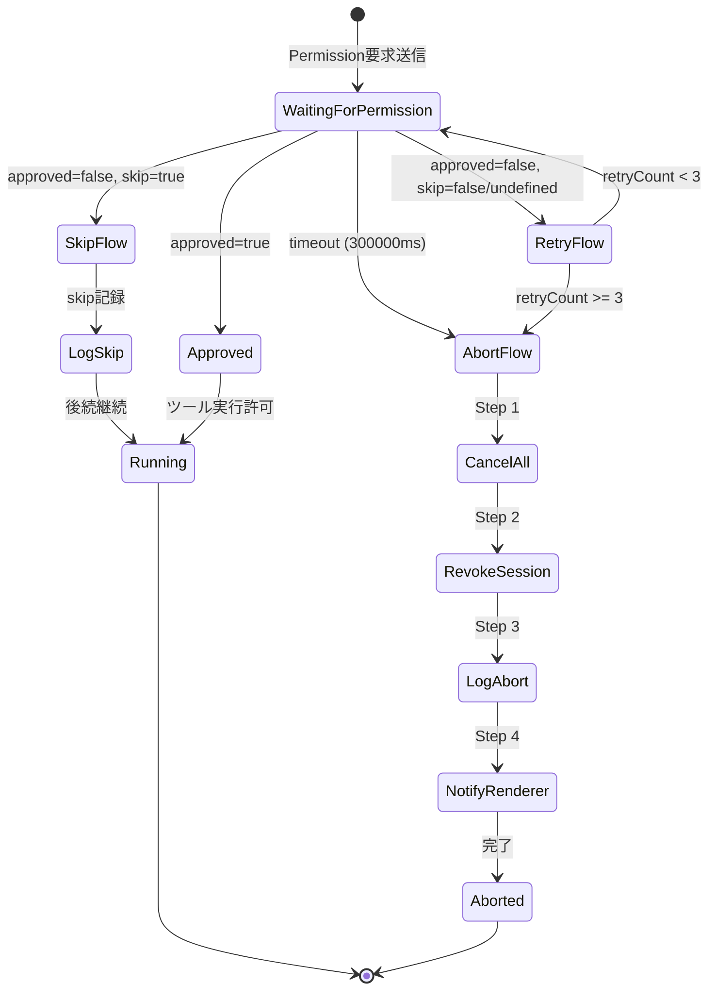
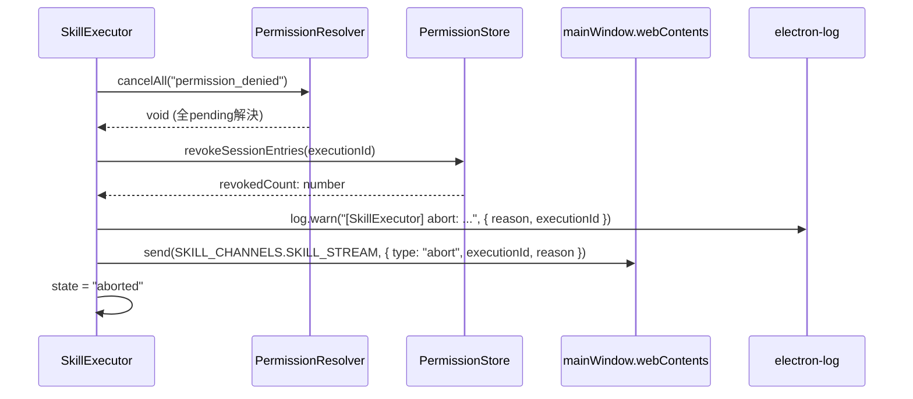
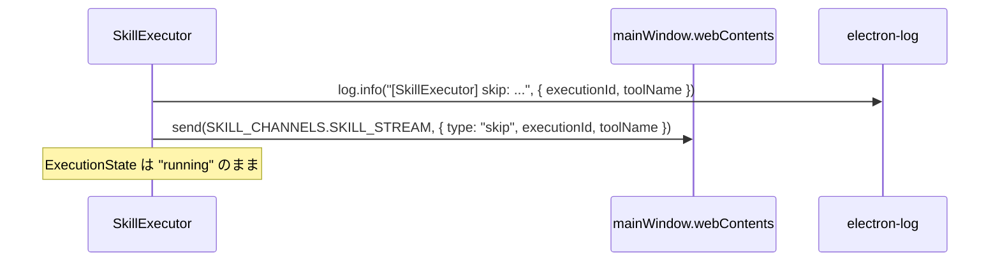
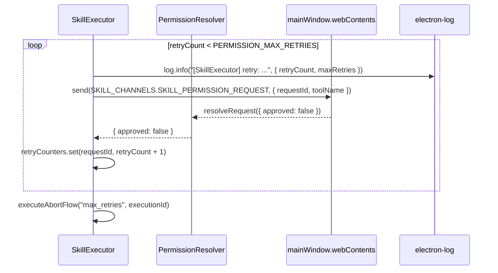

# Phase 2 成果物: 設計書

## メタ情報

| 項目   | 値                                  |
| ------ | ----------------------------------- |
| Phase  | 2                                   |
| 機能名 | UT-06-005-abort-skip-retry-fallback |
| 作成日 | 2026-03-16                          |
| 前提   | Phase 1 (P50: 部分実装) 完了        |

## 1. 状態遷移設計

### Permission応答フロー状態遷移図



### フロー分岐テーブル

| 条件                                                    | 遷移先    | 詳細                     |
| ------------------------------------------------------- | --------- | ------------------------ |
| `response.approved === true`                            | Running   | ツール実行許可           |
| `response.approved === false && response.skip === true` | SkipFlow  | 現在のツールをスキップ   |
| `response.approved === false && retryCount < 3`         | RetryFlow | リトライ（カウンタ+1）   |
| `response.approved === false && retryCount >= 3`        | AbortFlow | 3回失敗で安全停止        |
| timeout（300000ms）                                     | AbortFlow | retry不経由で即座にabort |
| 不明なエラー                                            | AbortFlow | fail-closed原則（NFR-1） |

## 2. インターフェース設計

### 2.1 型定義の追加・変更

#### SkillPermissionResponse への skip フィールド追加

**対象ファイル**: `packages/shared/src/types/skill.ts`

```typescript
export interface SkillPermissionResponse {
  requestId: string;
  approved: boolean;
  rememberChoice?: boolean;
  rejectReason?: string;
  skip?: boolean; // NEW: skip フロー用
}
```

**P32準拠**: Preload 側の型定義も同時更新が必要（`apps/desktop/src/preload/types.ts` に該当定義がある場合）。

#### 新規型定義

**対象ファイル**: `apps/desktop/src/main/services/skill/SkillExecutor.ts` 内

```typescript
/** abort 理由 */
type AbortReason = "denied" | "timeout" | "max_retries" | "unknown";

/** Permission フローコンテキスト */
interface PermissionFlowContext {
  executionId: string;
  requestId: string;
  toolName: string;
  retryCount: number;
  maxRetries: number; // デフォルト: 3
}

/** Permission フロー判定結果 */
interface PermissionFlowResult {
  action: "approved" | "skip" | "retry" | "abort";
  reason?: AbortReason;
  retryCount?: number;
}

/** Permission リトライ設定 */
const PERMISSION_MAX_RETRIES = 3;
```

### 2.2 SkillExecutor に追加するメソッド

```typescript
/**
 * Permission応答のフォールバック処理
 * handlePermissionResponse (既存L1424) をラップして fallback ロジックを追加
 */
private async processPermissionFallback(
  response: SkillPermissionResponse,
  context: PermissionFlowContext
): Promise<PermissionFlowResult>;

/**
 * abort 4ステップフローの実行
 * Step 1: cancelAll() → Step 2: revokeSessionEntries() → Step 3: log → Step 4: IPC
 */
private async executeAbortFlow(
  reason: AbortReason,
  executionId: string
): Promise<void>;

/**
 * skip フローの実行
 */
private executeSkipFlow(
  executionId: string,
  toolName: string
): void;
```

### 2.3 PermissionStore への追加

```typescript
/**
 * セッション内の一時許可エントリを一括取り消し
 * @param sessionId セッションID（executionId を使用）
 * @returns 取り消されたエントリ数
 */
revokeSessionEntries(sessionId: string): number;
```

### 2.4 PermissionResolver: 変更なし

既存の `cancelAll()`, `waitForResponse()` で要件を満たす。

## 3. クラス間連携設計

### 3.1 abort フローシーケンス



**設計判断**: 新規 IPC チャンネルではなく、既存の `SKILL_STREAM` チャンネルを活用し `type` フィールドで分岐する。理由:

1. 既存の `SKILL_ABORT` は Renderer→Main 方向（ユーザー中断リクエスト）で方向が逆
2. `SKILL_STREAM` は Main→Renderer のストリーム通知チャンネルとして既に存在
3. 新規チャンネル追加は IPC ホワイトリスト変更・Preload Bridge 変更を伴うため最小変更を優先

### 3.2 skip フローシーケンス



### 3.3 retry フローシーケンス



### 3.4 timeout フロー

```
PermissionResolver.waitForResponse() が 300000ms で reject
  ↓ catch (error)
error.message に "timeout" を含む → executeAbortFlow("timeout", executionId)
```

PermissionResolver は既にタイムアウト時に reject する実装を持っている。SkillExecutor 側で catch して abort フローに接続する。

## 4. リトライカウンタ管理

```typescript
// SkillExecutor 内部
private retryCounters: Map<string, number> = new Map();

// カウンタ操作
private getRetryCount(requestId: string): number {
  return this.retryCounters.get(requestId) ?? 0;
}

private incrementRetryCount(requestId: string): number {
  const current = this.getRetryCount(requestId);
  const next = current + 1;
  this.retryCounters.set(requestId, next);
  return next;
}

private clearRetryCounters(): void {
  this.retryCounters.clear();
}

// クリアタイミング:
// 1. abort フロー完了時
// 2. 実行完了時（completed 状態遷移時）
```

## 5. fail-closed 設計（NFR-1）

```typescript
// processPermissionFallback 内
try {
  // 正常なフロー分岐処理
} catch (error: unknown) {
  // 不明なエラー → abort に遷移（fail-closed）
  log.error("[SkillExecutor] unknown error in permission fallback", { error });
  await this.executeAbortFlow("unknown", context.executionId);
  return { action: "abort", reason: "unknown" };
}
```

## 6. 冪等性設計（NFR-3）

### 二重 abort 防止

```typescript
private async executeAbortFlow(reason: AbortReason, executionId: string): Promise<void> {
  // 既に aborted なら何もしない
  if (this.getState(executionId) === "aborted") {
    return;
  }
  // 4ステップ実行
  // ...
}
```

### 二重 skip 防止

skip は状態変更を伴わない（running のまま）ため、冪等性は自然に満たされる。ログの重複出力のみ注意。

## 7. 統合テスト連携ポイント

| 統合ポイント                  | 契約                                                           | テスト観点               |
| ----------------------------- | -------------------------------------------------------------- | ------------------------ |
| SE → PR: cancelAll            | 全 pending を reject し、Map をクリア                          | pendingCount === 0       |
| SE → PS: revokeSessionEntries | sessionId の一時許可を一括取消し、取消件数を返す               | 取消件数 === 期待値      |
| SE → IPC: abort 通知          | SKILL_STREAM で `{ type: "abort", executionId, reason }` 送信  | IPC send の mock 検証    |
| SE → IPC: skip 通知           | SKILL_STREAM で `{ type: "skip", executionId, toolName }` 送信 | IPC send の mock 検証    |
| PR → timeout                  | 300000ms で reject + timeout エラー                            | advanceTimersByTime 使用 |
| retryCounters                 | requestId ごとにインクリメント、abort/完了時にクリア           | カウンタ値の assert      |
