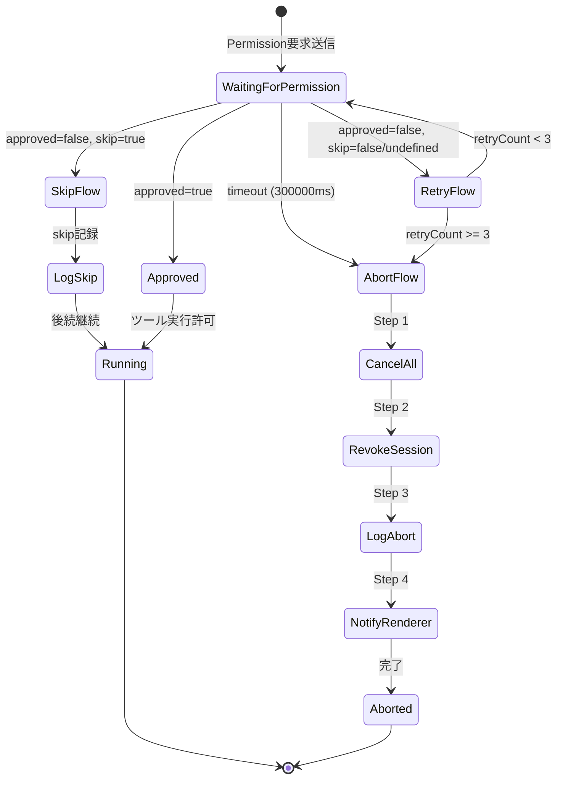
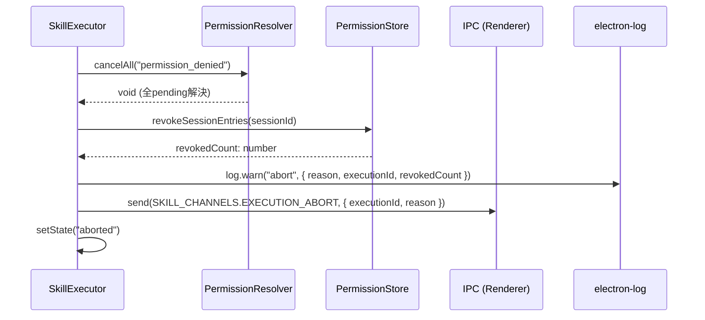
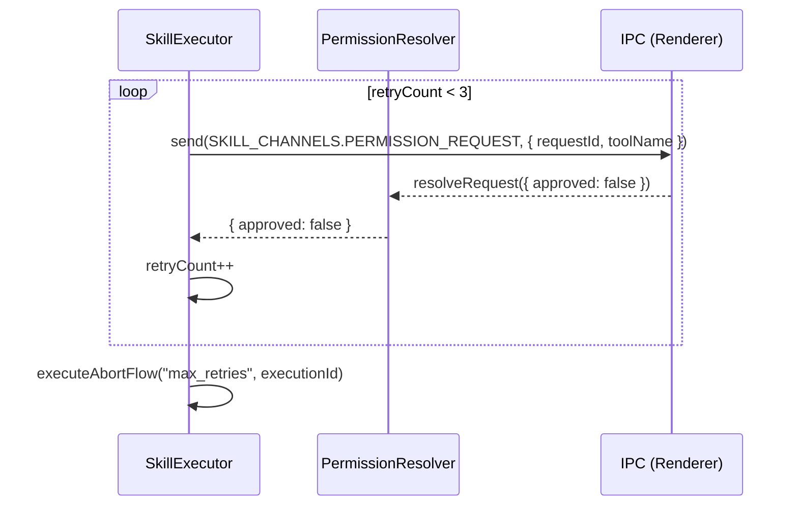

# Phase 2: 設計

## メタ情報

| 項目   | 値                                  |
| ------ | ----------------------------------- |
| Phase  | 2                                   |
| 機能名 | UT-06-005-abort-skip-retry-fallback |
| 作成日 | 2026-03-16                          |

## 目的

abort/skip/retry/timeout の4つのフォールバックフローの状態遷移、インターフェース、クラス間連携を設計し、SkillExecutor への統合方針を確定する。

## 実行タスク

- 状態遷移設計: Permission拒否時の4フローの状態遷移図を作成
- インターフェース設計: 新規/変更するメソッドシグネチャを定義
- クラス間連携設計: SkillExecutor-PermissionResolver-PermissionStore間の呼び出しフローを設計
- IPC通信設計: abort/skip通知のRendererへの配信方式を設計

## 参照資料

| 資料名         | パス                                  | 説明           |
| -------------- | ------------------------------------- | -------------- |
| Phase 1 成果物 | `outputs/phase-1/requirements.md`     | 要件定義書     |
| P50チェック    | `outputs/phase-1/p50-check-result.md` | 既実装調査結果 |

### システム仕様（aiworkflow-requirements）

> 実装前に必ず以下のシステム仕様を確認し、既存設計との整合性を確保してください。

| 参照資料                        | パス                                                                                         | 内容                                                               |
| ------------------------------- | -------------------------------------------------------------------------------------------- | ------------------------------------------------------------------ |
| セキュリティ（スキル実行）      | `.claude/skills/aiworkflow-requirements/references/security-skill-execution.md`              | fail-closed原則                                                    |
| セキュリティ（スキルIPC）       | `.claude/skills/aiworkflow-requirements/references/security-skill-ipc.md`                    | スキルIPC通信セキュリティ                                          |
| Agent SDK Skillインターフェース | `.claude/skills/aiworkflow-requirements/references/interfaces-agent-sdk-skill.md`            | Permission関連型定義                                               |
| 実装パターン                    | `.claude/skills/aiworkflow-requirements/references/architecture-implementation-patterns.md`  | DI/状態遷移パターン                                                |
| エラーハンドリング              | `.claude/skills/aiworkflow-requirements/references/error-handling.md`                        | エラーコード体系                                                   |
| エラーハンドリング（コア）      | `.claude/skills/aiworkflow-requirements/references/error-handling-core.md`                   | エラーコード範囲（1000-5999）、ERR_2002 PERMISSION_DENIED          |
| エラーハンドリング（詳細）      | `.claude/skills/aiworkflow-requirements/references/error-handling-details.md`                | SkillExecutor実行エラーコード（PERMISSION_DENIED, TIMEOUT, ABORT） |
| Agent SDK Executor（コア）      | `.claude/skills/aiworkflow-requirements/references/interfaces-agent-sdk-executor-core.md`    | ExecutionState列挙型、RetryConfig、SkillExecutionErrorCode、DI構成 |
| Agent SDK Executor（詳細）      | `.claude/skills/aiworkflow-requirements/references/interfaces-agent-sdk-executor-details.md` | PermissionResolver完全仕様、DEFAULT_TIMEOUT_MS=300000              |

## 実行手順

### ステップ1: 状態遷移設計

#### Permission応答フロー状態遷移図



#### フロー分岐テーブル

| 条件                                                    | 遷移先    | 詳細                     |
| ------------------------------------------------------- | --------- | ------------------------ |
| `response.approved === true`                            | Running   | ツール実行許可           |
| `response.approved === false && response.skip === true` | SkipFlow  | 現在のツールをスキップ   |
| `response.approved === false && retryCount < 3`         | RetryFlow | リトライ（カウンタ+1）   |
| `response.approved === false && retryCount >= 3`        | AbortFlow | 3回失敗で安全停止        |
| timeout（300000ms）                                     | AbortFlow | retry不経由で即座にabort |
| 不明なエラー                                            | AbortFlow | fail-closed原則（NFR-1） |

### ステップ2: インターフェース設計

#### SkillExecutor に追加するメソッド

```typescript
/** Permission応答のフォールバック処理 */
interface PermissionFallbackHandler {
  /**
   * Permission応答を処理し、適切なフローに分岐する
   * @param response - PermissionResolver からの応答
   * @param context - 現在の実行コンテキスト
   * @returns フロー判定結果
   */
  handlePermissionResponse(
    response: SkillPermissionResponse,
    context: PermissionFlowContext,
  ): Promise<PermissionFlowResult>;

  /**
   * abort フロー4ステップを実行
   * @param reason - abort 理由（"denied" | "timeout" | "max_retries" | "unknown"）
   * @param executionId - 実行ID
   */
  executeAbortFlow(reason: AbortReason, executionId: string): Promise<void>;

  /**
   * skip フローを実行
   * @param executionId - 実行ID
   * @param toolName - スキップ対象のツール名
   */
  executeSkipFlow(executionId: string, toolName: string): Promise<void>;
}

/** abort 理由の列挙型 */
type AbortReason = "denied" | "timeout" | "max_retries" | "unknown";

/** Permission フローコンテキスト */
interface PermissionFlowContext {
  executionId: string;
  requestId: string;
  toolName: string;
  retryCount: number;
  maxRetries: number; // デフォルト: 3
  timeoutMs: number; // デフォルト: 300000
}

/** Permission フロー判定結果 */
interface PermissionFlowResult {
  action: "approved" | "skip" | "retry" | "abort";
  reason?: AbortReason;
  retryCount?: number;
}
```

#### PermissionResolver への変更

```typescript
// 既存メソッド: 変更なし
waitForResponse(requestId: string, signal?: AbortSignal): Promise<SkillPermissionResponse>;
resolveRequest(response: SkillPermissionResponse): void;
cancelAll(reason?: string): void;

// 追加不要: 既存の cancelAll で abort Step 1 を実現
```

#### PermissionStore への変更

```typescript
// 追加メソッド
/**
 * セッション内の一時許可エントリを一括取り消し
 * @param sessionId - セッションID
 * @returns 取り消されたエントリ数
 */
revokeSessionEntries(sessionId: string): number;
```

### ステップ3: クラス間連携設計

#### abort フローシーケンス図



#### retry フローシーケンス図



### ステップ4: IPC通信設計

#### 新規/変更 IPC チャンネル

| チャンネル                        | 方向            | ペイロード                                           | 用途       |
| --------------------------------- | --------------- | ---------------------------------------------------- | ---------- |
| `SKILL_CHANNELS.EXECUTION_ABORT`  | Main → Renderer | `{ executionId, reason: AbortReason }`               | abort 通知 |
| `SKILL_CHANNELS.EXECUTION_SKIP`   | Main → Renderer | `{ executionId, toolName, message }`                 | skip 通知  |
| `SKILL_CHANNELS.PERMISSION_RETRY` | Main → Renderer | `{ executionId, requestId, retryCount, maxRetries }` | retry 通知 |

#### リトライカウンタ管理

```typescript
// SkillExecutor 内部に Map で管理
private retryCounters: Map<string, number> = new Map();

// requestId ごとにカウンタを管理
// abort/完了時にクリア
```

## 統合テスト連携【必須】

SkillExecutor-PermissionResolver-PermissionStore間の契約を設計し、統合ポイントを明確化する。

| 統合ポイント                  | 契約                                                         | テスト観点               |
| ----------------------------- | ------------------------------------------------------------ | ------------------------ |
| SE → PR: cancelAll            | 全pending を reject し、Map をクリア                         | pending=0 の assert      |
| SE → PS: revokeSessionEntries | sessionId の一時許可を一括取消                               | 取消件数の assert        |
| SE → IPC: abort通知           | EXECUTION_ABORT チャンネルで `{ executionId, reason }` 送信  | IPC send の mock 検証    |
| SE → IPC: skip通知            | EXECUTION_SKIP チャンネルで `{ executionId, toolName }` 送信 | IPC send の mock 検証    |
| PR → timeout                  | 300000ms で reject + AbortError                              | advanceTimersByTime 使用 |

## 多角的チェック観点（AIが判断）

| 観点               | 適用判断                         | 仕様参照先                                                         |
| ------------------ | -------------------------------- | ------------------------------------------------------------------ |
| セキュリティ       | fail-closed 原則の設計反映が必要 | `aiworkflow-requirements: security-skill-execution.md`             |
| エラーハンドリング | AbortReason の分類が必要         | `aiworkflow-requirements: error-handling.md`                       |
| アーキテクチャ     | DI パターンでの依存注入設計      | `aiworkflow-requirements: architecture-implementation-patterns.md` |

**Electronデスクトップアプリ観点**:

| 層                   | 適用判断                  | 仕様参照先                                             |
| -------------------- | ------------------------- | ------------------------------------------------------ |
| バックエンド（Main） | abort/skip/retry ロジック | `aiworkflow-requirements: architecture-*.md`           |
| IPC通信              | abort/skip/retry 通知     | `aiworkflow-requirements: api-*.md`, `interfaces-*.md` |

## 成果物

| 成果物     | パス                               | 説明                 |
| ---------- | ---------------------------------- | -------------------- |
| 設計書     | `outputs/phase-2/design.md`        | フロー・IF・連携設計 |
| 状態遷移図 | `outputs/phase-2/state-diagram.md` | 状態遷移の詳細       |

## 完了条件

- [ ] 状態遷移図（Permission応答フロー）が作成されている
- [ ] フロー分岐テーブルが定義されている
- [ ] 新規/変更インターフェース（メソッドシグネチャ）が定義されている
- [ ] クラス間連携（シーケンス図）が作成されている
- [ ] IPC通信設計（チャンネル・ペイロード）が定義されている
- [ ] リトライカウンタ管理方式が設計されている
- [ ] 統合テストポイントの契約が明確化されている
- [ ] fail-closed 原則が設計に反映されている
- [ ] **本Phase内の全タスクを100%実行完了**

## サブタスク管理

Phase実行開始時に、以下のサブタスクを作成すること:

1. 参照資料の確認（Phase 1成果物 + システム仕様）
2. 状態遷移設計
3. インターフェース設計
4. クラス間連携設計
5. IPC通信設計
6. 統合テスト連携の実施
7. 成果物の作成・配置
8. 完了条件の検証

## タスク100%実行確認【必須】

Phase完了前に以下を確認:

- [ ] 本Phase内の全タスクを100%実行完了
- [ ] 各タスクの成果物が生成されている
- [ ] artifacts.jsonが更新されている
- [ ] Phase末端で各タスクを100%完了し、完了を明記している

```bash
node .claude/skills/task-specification-creator/scripts/validate-phase-output.js docs/30-workflows/UT-06-005-abort-skip-retry-fallback --phase 2
```

## 次のPhase

Phase 3: 設計レビューゲート
