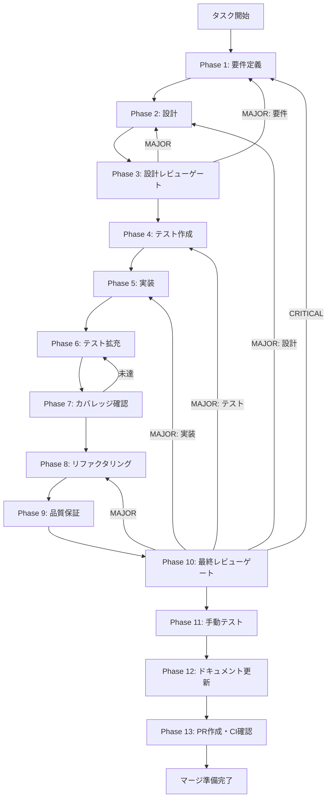

# agent-dashboard-foundation - タスク実行仕様書

## ユーザーからの元の指示

```
エージェントダッシュボード基盤を実装する。
Claude CodeのClaude Agent SDKを使用したエージェント機能をアプリケーションに統合するため、
専用のダッシュボード画面を作成する。
```

## メタ情報

| 項目         | 内容                       |
| ------------ | -------------------------- |
| タスクID     | AGENT-001                  |
| タスク名     | agent-dashboard-foundation |
| 分類         | 要件                       |
| 対象機能     | エージェント機能           |
| 優先度       | 高                         |
| 見積もり規模 | 中規模                     |
| ステータス   | 未実施                     |
| 作成日       | 2026-01-10                 |

---

## タスク概要

### 目的

エージェント機能のためのフロントエンド基盤を構築し、ユーザーがエージェント画面にアクセスできるようにする。

### 背景

Claude CodeのClaude Agent SDKを使用したエージェント機能をアプリケーションに統合するため、専用のダッシュボード画面が必要。現状はダッシュボード、エディタ、チャット、グラフ、設定の5つのビューのみ存在し、エージェント管理機能がない。

#### 問題点・課題

- エージェント（スキル）を管理・実行するUIが存在しない
- AppDockにエージェント用のナビゲーション項目がない
- エージェント状態を管理するZustand sliceがない
- エージェント関連のIPCチャネルが定義されていない

#### 放置した場合の影響

- エージェント機能の統合が不可能
- ユーザーがスキルベースのエージェントを活用できない
- アプリケーションの拡張性が制限される

### 最終ゴール

- サイドバー（AppDock）に「Agent」メニュー項目が表示される
- 「Agent」をクリックするとAgentViewが表示される
- agentSliceでエージェント状態が管理される
- エージェント関連のIPCチャネルが定義されている

### スコープ

#### 含むもの

- ViewType定義への「agent」追加
- AppDockへのエージェントメニュー項目追加
- AgentView基本コンポーネントの実装
- agentSlice（Zustand）の実装
- IPC_CHANNELS定義の追加
- ルーティング設定の更新

#### 含まないもの

- スキル一覧表示機能（別タスク: AGENT-002）
- エージェント実行機能（別タスク: AGENT-003）
- カスタム実行環境（別タスク: AGENT-004）
- バックエンド実装（別タスク: AGENT-005〜008）

### 成果物一覧

| 種別         | 成果物                  | 配置先                                                             |
| ------------ | ----------------------- | ------------------------------------------------------------------ |
| ViewType更新 | navigationSlice更新     | `apps/desktop/src/renderer/store/slices/navigationSlice.ts`        |
| AgentView    | AgentViewコンポーネント | `apps/desktop/src/renderer/views/AgentView/index.tsx`              |
| agentSlice   | Zustand slice           | `apps/desktop/src/renderer/store/slices/agentSlice.ts`             |
| AppDock更新  | ナビゲーション項目追加  | `apps/desktop/src/renderer/components/organisms/AppDock/index.tsx` |
| IPCチャネル  | チャネル定義            | `apps/desktop/src/preload/channels.ts`                             |
| テスト       | テストファイル          | `apps/desktop/src/**/*.test.ts`                                    |
| ドキュメント | Phase出力               | `outputs/phase-*/`                                                 |
| PR           | GitHub Pull Request     | GitHub UI                                                          |

---

## 参照ファイル

本仕様書のコマンド選定は以下を参照：

- `docs/00-requirements/master_system_design.md` - システム要件
- `.claude/skills/aiworkflow-requirements/references/` - システム仕様

### システム仕様（aiworkflow-requirements）

> 実装前に必ず以下のシステム仕様を確認し、既存設計との整合性を確保してください。

| 参照資料                   | パス                                                                         | 内容                          |
| -------------------------- | ---------------------------------------------------------------------------- | ----------------------------- |
| UI/UXナビゲーション        | `.claude/skills/aiworkflow-requirements/references/ui-ux-navigation.md`      | ナビゲーションボタン仕様      |
| UI/UXコンポーネント        | `.claude/skills/aiworkflow-requirements/references/ui-ux-components.md`      | コンポーネント設計原則        |
| UI/UXデザインシステム      | `.claude/skills/aiworkflow-requirements/references/ui-ux-design-system.md`   | Design Tokens、カラーシステム |
| Electron IPC               | `.claude/skills/aiworkflow-requirements/references/api-endpoints.md`         | Electron IPC API設計          |
| アーキテクチャパターン     | `.claude/skills/aiworkflow-requirements/references/architecture-patterns.md` | 機能追加パターン              |
| Agent SDK インターフェース | `.claude/skills/aiworkflow-requirements/references/interfaces-agent-sdk.md`  | Agent SDK型定義               |

---

## 依存関係マップ

```
agent-dashboard-foundation (AGENT-001/本タスク) ← 起点
    │
    ├──► task-agent-02-skill-management-ui.md (AGENT-002)
    │
    └──► task-agent-03-skill-management-backend.md (AGENT-003) ※02と並行可能
              │
              └──► task-agent-04-execution-ui.md (AGENT-004)
                        │
                        └──► ...
```

| 項目                     | 内容                                                           |
| ------------------------ | -------------------------------------------------------------- |
| 直接依存                 | なし（起点タスク）                                             |
| 並行実行可能             | なし                                                           |
| 本タスク完了後に開始可能 | AGENT-002（スキル管理UI）, AGENT-003（スキル管理バックエンド） |

---

## タスク分解サマリー

| ID     | フェーズ | サブタスク名         | 責務                       | 依存 |
| ------ | -------- | -------------------- | -------------------------- | ---- |
| T-01-1 | Phase 1  | 要件定義             | 受け入れ基準・スコープ定義 | -    |
| T-02-1 | Phase 2  | 設計                 | アーキテクチャ・型定義設計 | T-01 |
| T-03-1 | Phase 3  | 設計レビューゲート   | 設計妥当性検証             | T-02 |
| T-04-1 | Phase 4  | テスト作成           | TDD: Red                   | T-03 |
| T-05-1 | Phase 5  | 実装                 | TDD: Green                 | T-04 |
| T-06-1 | Phase 6  | テスト拡充           | カバレッジ向上             | T-05 |
| T-07-1 | Phase 7  | テストカバレッジ確認 | カバレッジゲート           | T-06 |
| T-08-1 | Phase 8  | リファクタリング     | TDD: Refactor              | T-07 |
| T-09-1 | Phase 9  | 品質保証             | 静的解析・セキュリティ     | T-08 |
| T-10-1 | Phase 10 | 最終レビューゲート   | 全体品質検証               | T-09 |
| T-11-1 | Phase 11 | 手動テスト検証       | UX・実環境動作確認         | T-10 |
| T-12-1 | Phase 12 | ドキュメント更新     | 仕様反映・未タスク検出     | T-11 |
| T-13-1 | Phase 13 | PR作成               | コミット・PR・CI確認       | T-12 |

**総サブタスク数**: 13個

---

## 実行フロー図



---

## Phase一覧

| Phase | 名称               | 仕様書                                                 | ステータス |
| ----- | ------------------ | ------------------------------------------------------ | ---------- |
| 1     | 要件定義           | [phase-1-requirements.md](phase-1-requirements.md)     | 未実施     |
| 2     | 設計               | [phase-2-design.md](phase-2-design.md)                 | 未実施     |
| 3     | 設計レビューゲート | [phase-3-design-review.md](phase-3-design-review.md)   | 未実施     |
| 4     | テスト作成         | [phase-4-test-creation.md](phase-4-test-creation.md)   | 未実施     |
| 5     | 実装               | [phase-5-implementation.md](phase-5-implementation.md) | 未実施     |
| 6     | テスト拡充         | [phase-6-test-expansion.md](phase-6-test-expansion.md) | 未実施     |
| 7     | カバレッジ確認     | [phase-7-coverage-check.md](phase-7-coverage-check.md) | 未実施     |
| 8     | リファクタリング   | [phase-8-refactoring.md](phase-8-refactoring.md)       | 未実施     |
| 9     | 品質保証           | [phase-9-quality.md](phase-9-quality.md)               | 未実施     |
| 10    | 最終レビューゲート | [phase-10-final-review.md](phase-10-final-review.md)   | 未実施     |
| 11    | 手動テスト         | [phase-11-manual-test.md](phase-11-manual-test.md)     | 未実施     |
| 12    | ドキュメント更新   | [phase-12-documentation.md](phase-12-documentation.md) | 未実施     |
| 13    | PR作成             | [phase-13-pr-creation.md](phase-13-pr-creation.md)     | 未実施     |

---

## テストカバレッジ目標

### ユニットテスト

| 指標              | 最低基準 | 推奨基準 |
| ----------------- | -------- | -------- |
| Line Coverage     | 80%      | 90%      |
| Branch Coverage   | 60%      | 70%      |
| Function Coverage | 80%      | 90%      |

### 結合テスト

| 指標                         | 目標 |
| ---------------------------- | ---- |
| APIエンドポイント            | 100% |
| モジュール間インターフェース | 100% |
| 正常系シナリオ               | 100% |
| 異常系シナリオ               | 80%+ |
| 外部連携ポイント             | 100% |

---

## 統合テスト連携（Phase 1〜11で必須）

各Phaseで以下の統合テスト連携アクションを実施すること:

| Phase | 統合テスト連携アクション                             |
| ----- | ---------------------------------------------------- |
| 1     | 接続要件（IPC/状態管理/ナビゲーション）を要件に明記  |
| 2     | 統合ポイント/契約（Zustand・IPC）を設計に反映        |
| 3     | 統合テスト観点のレビューゲートを実施                 |
| 4     | 統合テストシナリオを全カテゴリで作成                 |
| 5     | ナビゲーション/Store接続の実装とテスト支援コード整備 |
| 6     | 統合テストの拡充（全カテゴリのカバレッジ向上）       |
| 7     | 統合テストの再実行とゲート判定                       |
| 8     | リファクタ後の統合テスト継続成功を確認               |
| 9     | 品質保証で統合テスト結果を確認                       |
| 10    | 最終レビューで統合テスト結果を確認                   |
| 11    | 手動統合テスト（UI/Store/IPC接続）を確認             |

---

## Phase完了時の必須アクション

**各Phase完了時に以下を必ず実行すること:**

1. **スキル100%実行**: Phase内で指定された全スキルを完全に実行
2. **成果物確認**: 全ての必須成果物が生成されていることを検証
3. **フィードバック記録**: 使用スキルの結果をLOGS.mdに記録
4. **artifacts.json更新**: Phase完了ステータスを更新
5. **Phase末端の実行確認**: 各スキルを100%実行し、各タスクを完遂した旨を必ず明記

```bash
# Phase完了時の検証コマンド
node .claude/skills/task-specification-creator/scripts/validate-phase-output.mjs docs/30-workflows/agent-dashboard-foundation --phase {{PHASE_NUMBER}}

# Phase完了・成果物登録
node .claude/skills/task-specification-creator/scripts/complete-phase.mjs \
  --workflow docs/30-workflows/agent-dashboard-foundation --phase {{PHASE_NUMBER}} --artifacts "..."
```

---

## リスクと対策

| リスク                     | 影響度 | 発生確率 | 対策                             |
| -------------------------- | ------ | -------- | -------------------------------- |
| 既存ナビゲーションとの競合 | 中     | 低       | 既存パターンに厳密に従う         |
| Store永続化の問題          | 中     | 低       | partializeで適切にフィルタリング |

---

## 参照情報

### 関連ドキュメント

- `apps/desktop/src/renderer/store/index.ts` - Store構造
- `apps/desktop/src/renderer/views/DashboardView/index.tsx` - View実装例
- `apps/desktop/src/renderer/components/organisms/AppDock/index.tsx` - AppDock実装
- `apps/desktop/src/preload/channels.ts` - IPCチャネル定義

### 参考資料

- [Zustand Documentation](https://docs.pmnd.rs/zustand/getting-started/introduction)
- [Electron IPC](https://www.electronjs.org/docs/latest/tutorial/ipc)
