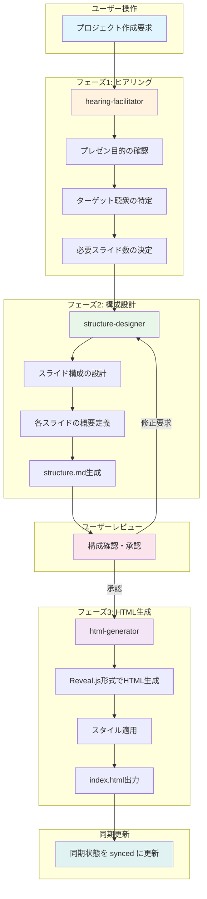
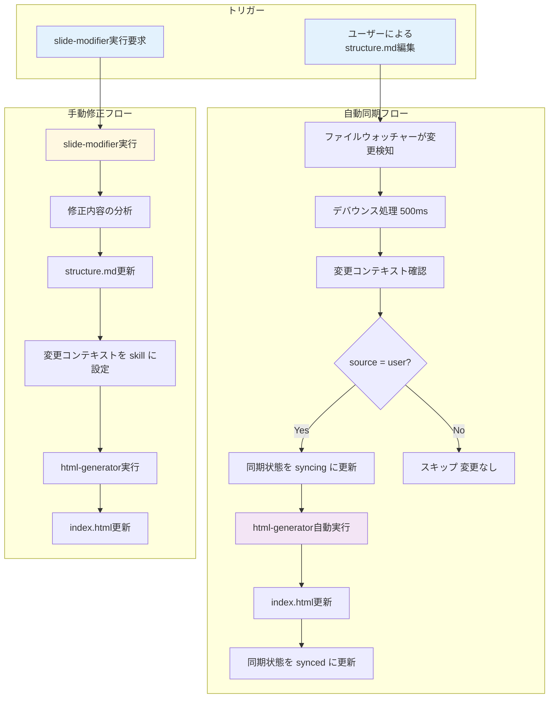
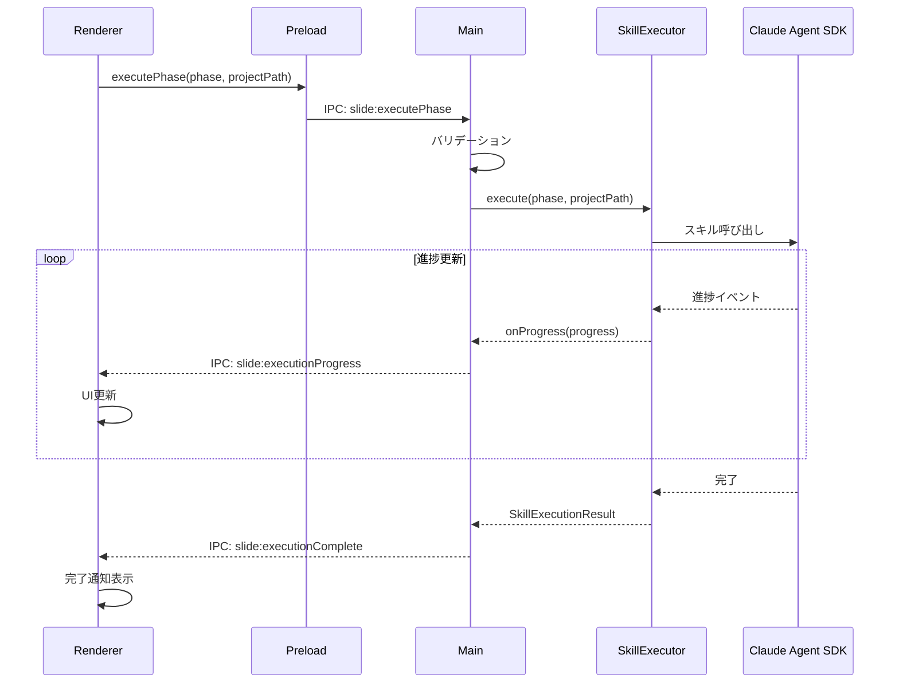
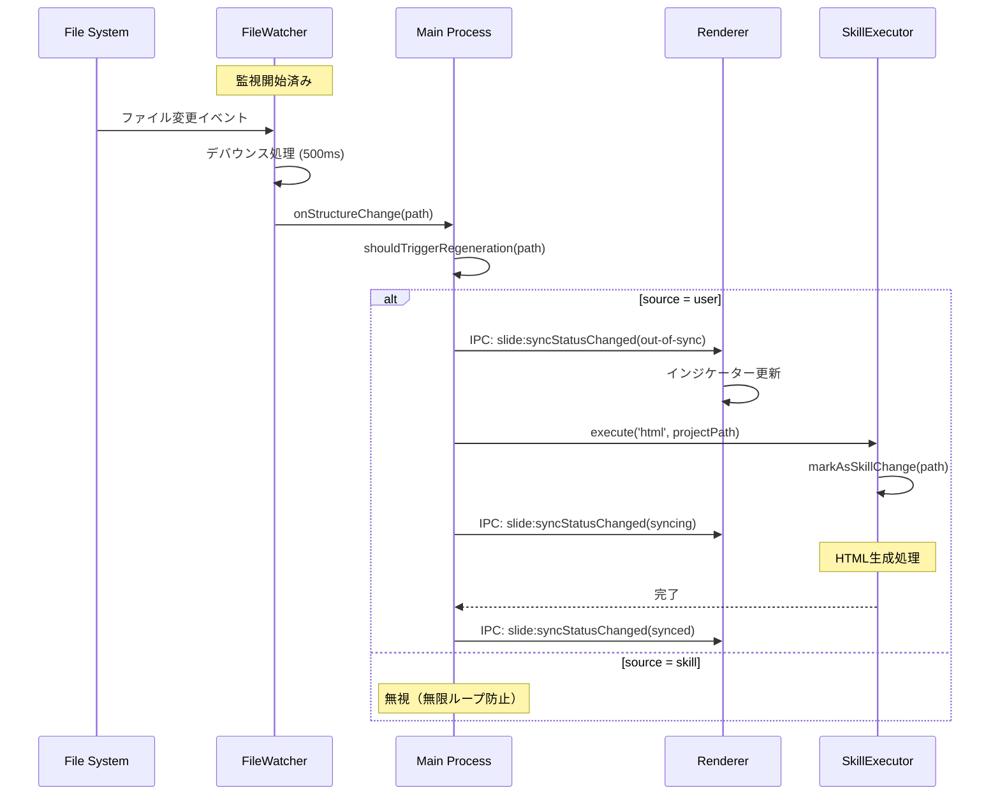
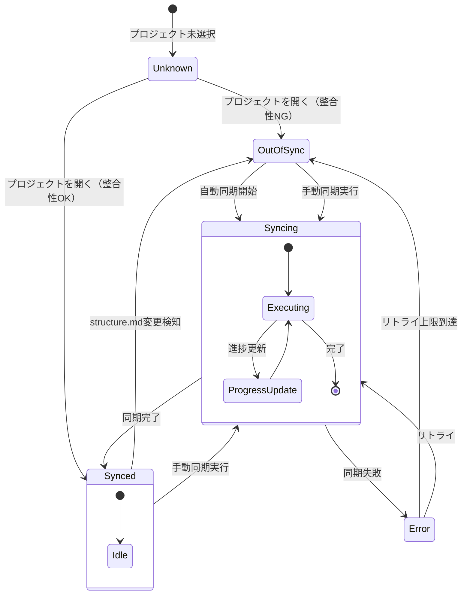
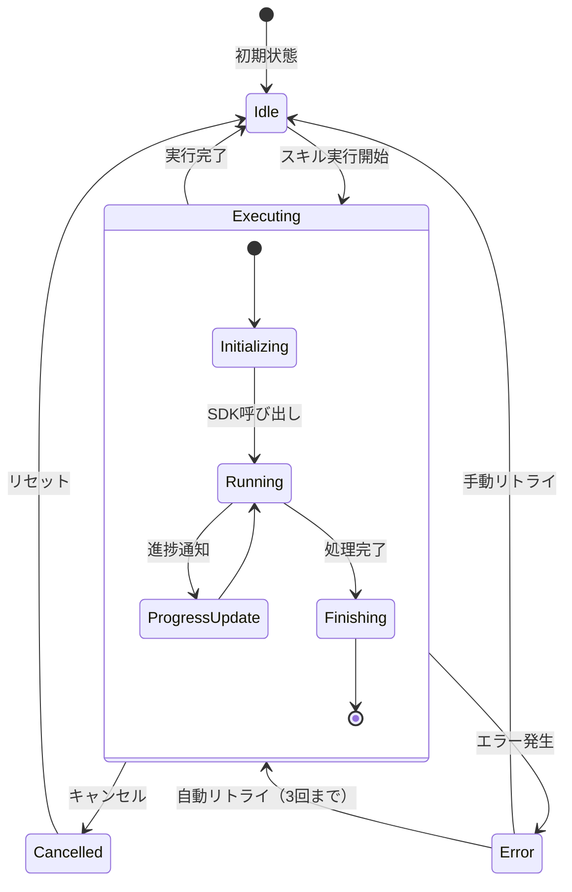
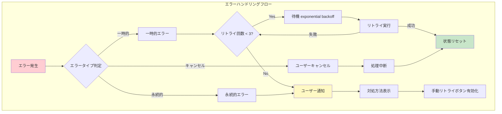

# スキル連携フロー図 - スライド依存関係管理システム

## 1. ドキュメント情報

| 項目       | 内容                                      |
| ---------- | ----------------------------------------- |
| タスクID   | task-feat-slide-dependency-management-003 |
| バージョン | 1.0.0                                     |
| 作成日     | 2026-01-09                                |
| 作成者     | Claude (event-driven-file-watching skill) |

---

## 2. スキルフェーズ概要

### 2.1 4つのスキルフェーズ

| フェーズ | スキル名            | 役割                 | 入力           | 出力             |
| -------- | ------------------- | -------------------- | -------------- | ---------------- |
| 1        | hearing-facilitator | ヒアリング・要件整理 | ユーザー要求   | ヒアリング結果   |
| 2        | structure-designer  | スライド構成設計     | ヒアリング結果 | structure.md     |
| 3        | html-generator      | HTML生成             | structure.md   | index.html       |
| 4        | slide-modifier      | スライド修正・微調整 | 修正指示       | 更新済みファイル |

---

## 3. メインフロー図

### 3.1 新規作成フロー



### 3.2 修正・改善フロー



---

## 4. IPC通信フロー

### 4.1 スキル実行シーケンス



### 4.2 ファイル監視シーケンス



---

## 5. 状態遷移図

### 5.1 同期状態の遷移



### 5.2 スキル実行状態の遷移



---

## 6. データフロー図

### 6.1 レベル0: コンテキストダイアグラム

```
                    ┌─────────────────────────────────────┐
                    │    スライド依存関係管理システム        │
                    │                                     │
    ユーザー操作    │                                     │    ファイル出力
    ─────────────▶  │  ┌─────────┐    ┌─────────────┐    │  ─────────────▶
                    │  │   UI    │    │   Engine    │    │    structure.md
    状態表示        │  │  Layer  │◀──▶│   Layer     │    │    index.html
    ◀─────────────  │  └─────────┘    └─────────────┘    │
                    │                                     │
                    └─────────────────────────────────────┘
                                      │
                                      │ スキル呼び出し
                                      ▼
                              ┌───────────────┐
                              │ Claude Agent  │
                              │     SDK       │
                              └───────────────┘
```

### 6.2 レベル1: プロセス分解

```
┌────────────────────────────────────────────────────────────────┐
│                     Renderer Process                            │
│  ┌──────────────────────────────────────────────────────────┐  │
│  │ 1.0 UI Layer                                              │  │
│  │  ┌─────────────┐  ┌─────────────┐  ┌─────────────────┐   │  │
│  │  │ 1.1 Skill   │  │ 1.2 Sync    │  │ 1.3 Project     │   │  │
│  │  │ PhasePanel  │  │ Status      │  │ Selector        │   │  │
│  │  │             │  │ Indicator   │  │                 │   │  │
│  │  └─────────────┘  └─────────────┘  └─────────────────┘   │  │
│  └──────────────────────────────────────────────────────────┘  │
│                              │ IPC                              │
└──────────────────────────────┼──────────────────────────────────┘
                               │
┌──────────────────────────────┼──────────────────────────────────┐
│                     Main Process                                │
│                              │                                  │
│  ┌───────────────────────────▼───────────────────────────────┐ │
│  │ 2.0 Engine Layer                                           │ │
│  │  ┌─────────────┐  ┌─────────────┐  ┌─────────────────┐    │ │
│  │  │ 2.1 File    │  │ 2.2 Skill   │  │ 2.3 Sync        │    │ │
│  │  │ Watcher     │  │ Executor    │  │ Manager         │    │ │
│  │  │             │  │             │  │                 │    │ │
│  │  └──────┬──────┘  └──────┬──────┘  └────────┬────────┘    │ │
│  │         │                │                   │             │ │
│  │         ▼                ▼                   ▼             │ │
│  │  ┌─────────────────────────────────────────────────────┐  │ │
│  │  │ 2.4 State Store (Shared)                             │  │ │
│  │  │  - projectPath, syncStatus, currentPhase, isWatching │  │ │
│  │  └─────────────────────────────────────────────────────┘  │ │
│  └───────────────────────────────────────────────────────────┘ │
│                              │                                  │
└──────────────────────────────┼──────────────────────────────────┘
                               │
                    ┌──────────▼──────────┐
                    │ External Systems    │
                    │  - File System      │
                    │  - Claude Agent SDK │
                    └─────────────────────┘
```

---

## 7. エラーハンドリングフロー



---

## 8. 変更履歴

| バージョン | 日付       | 変更内容 |
| ---------- | ---------- | -------- |
| 1.0.0      | 2026-01-09 | 初版作成 |
