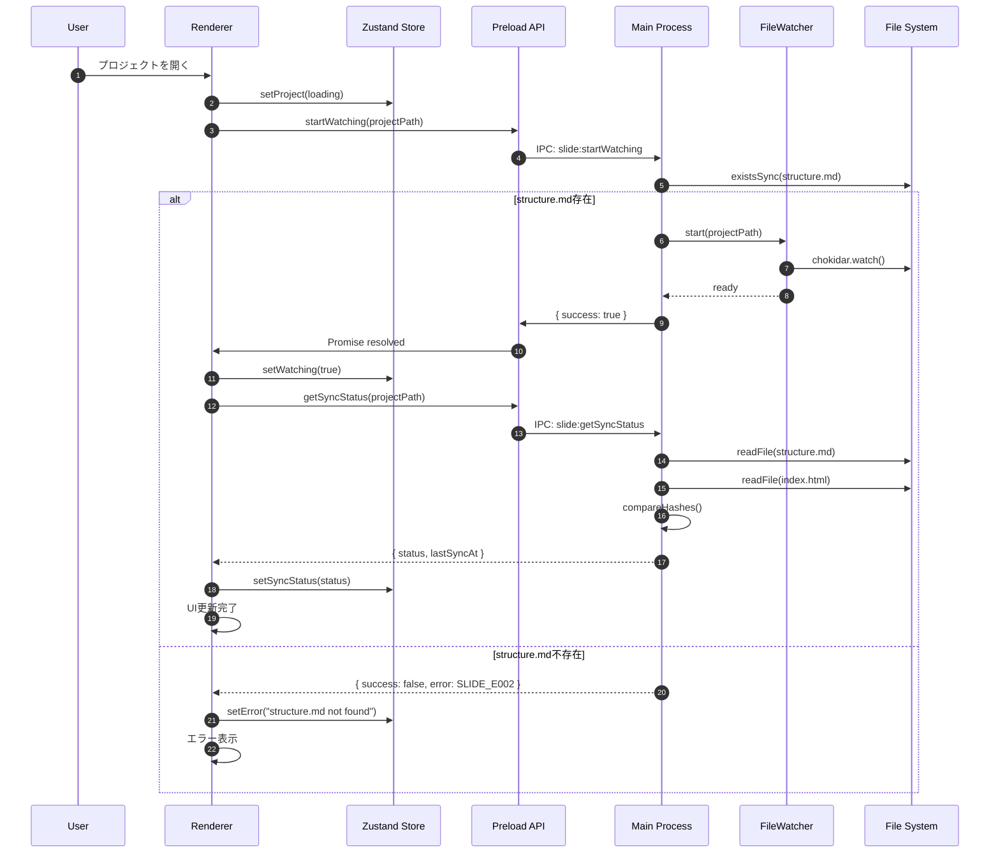
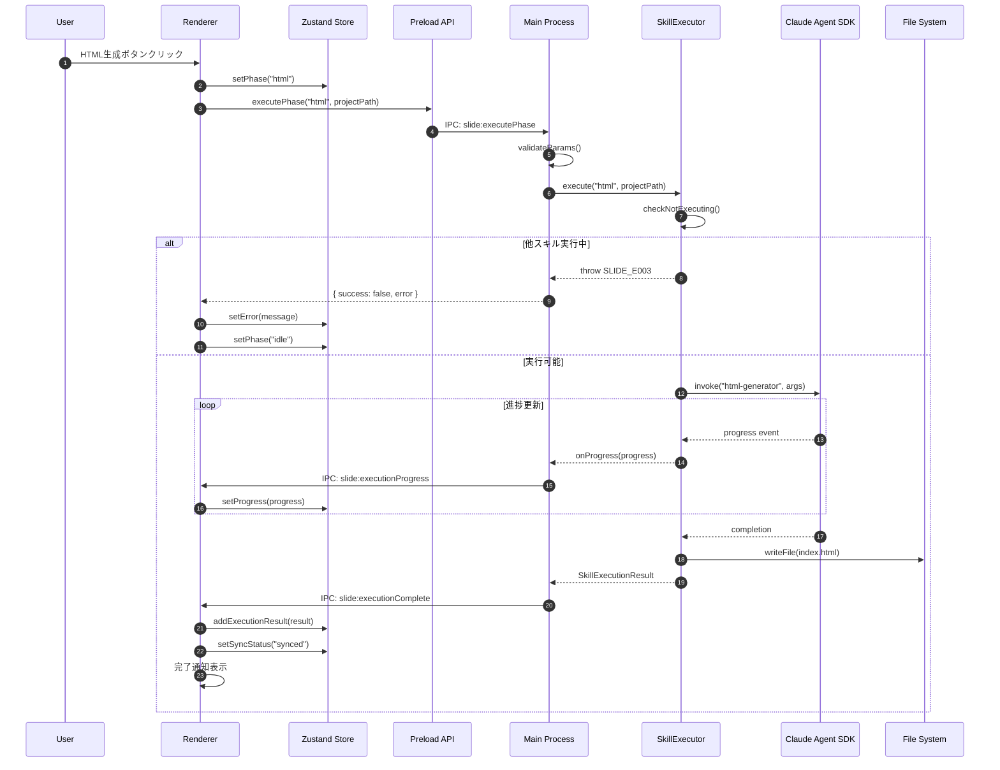
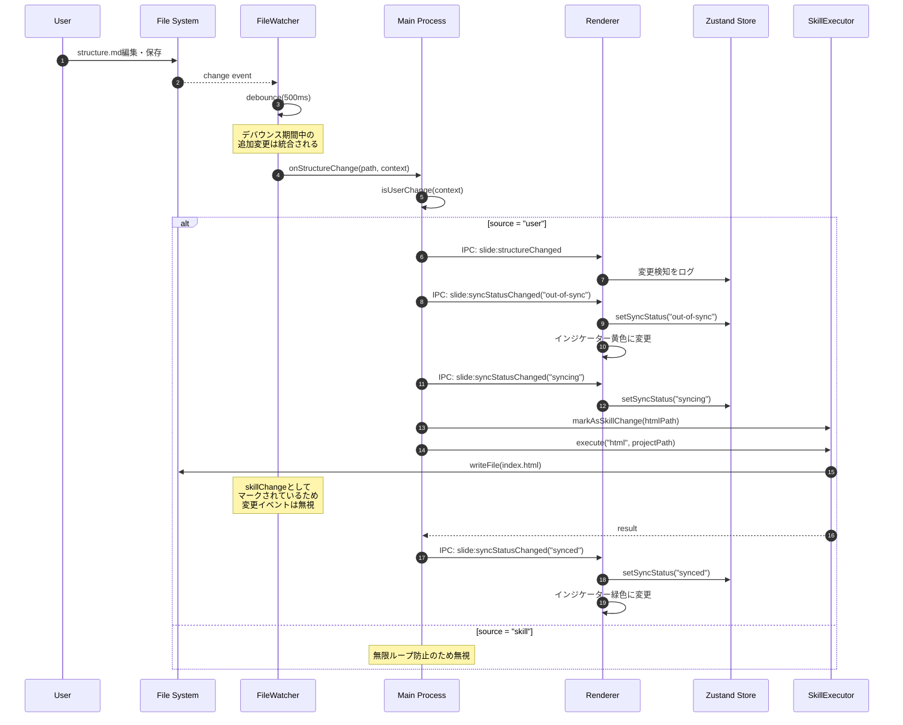
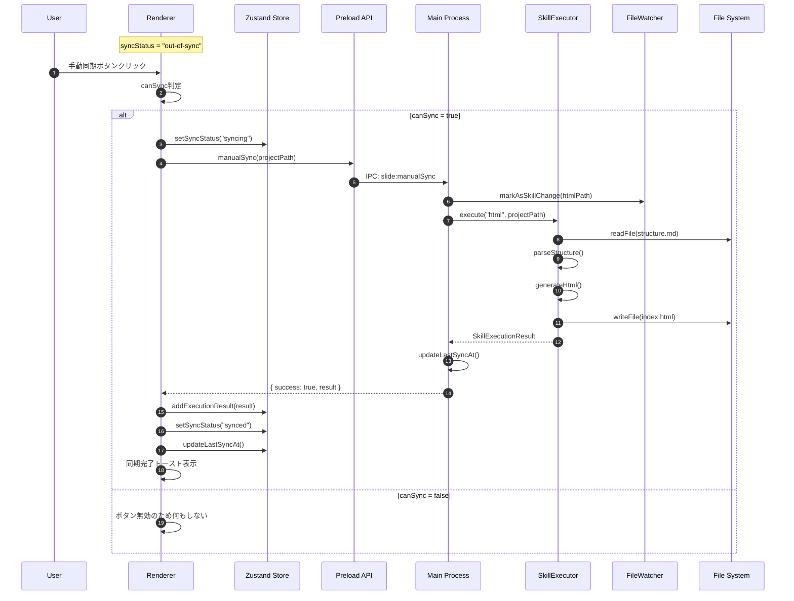
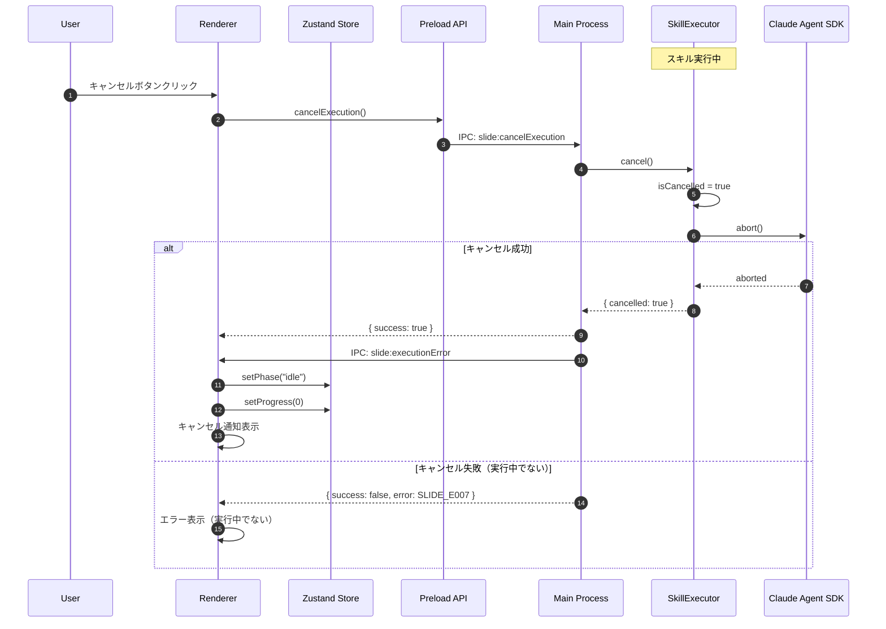
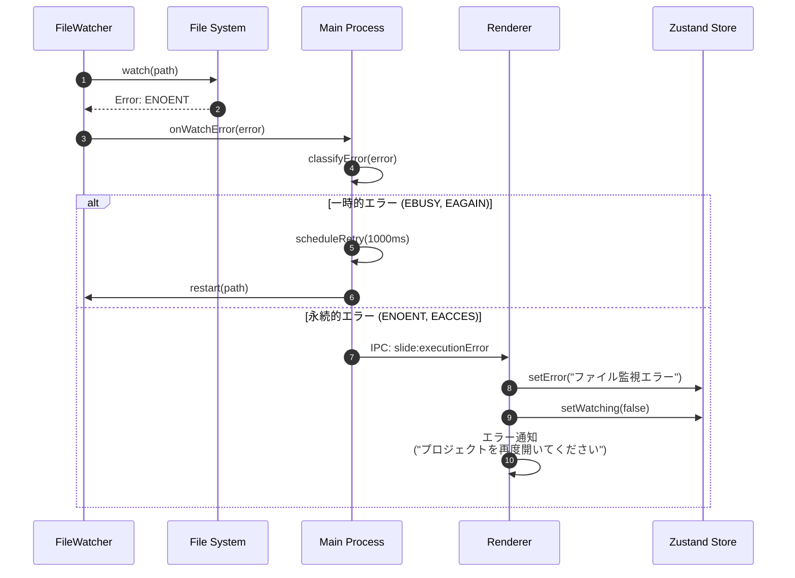
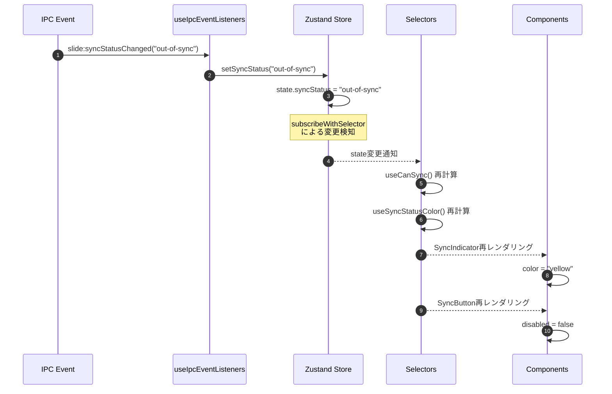
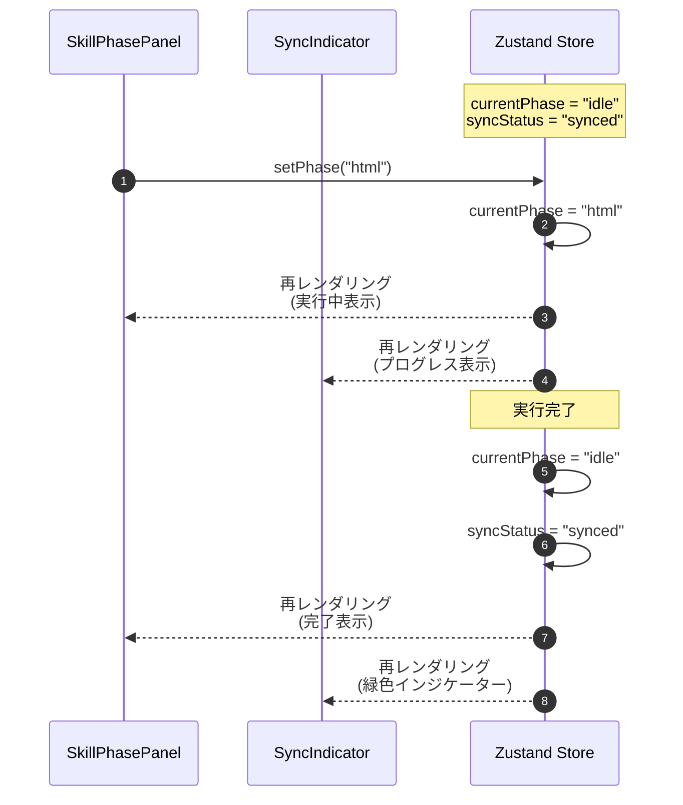
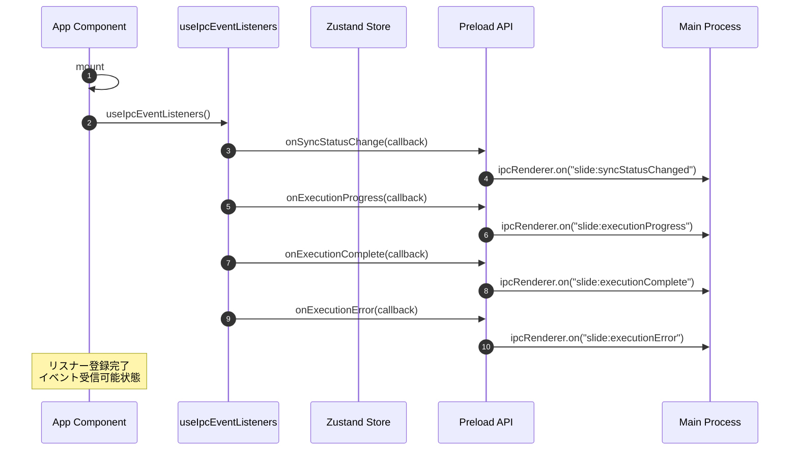
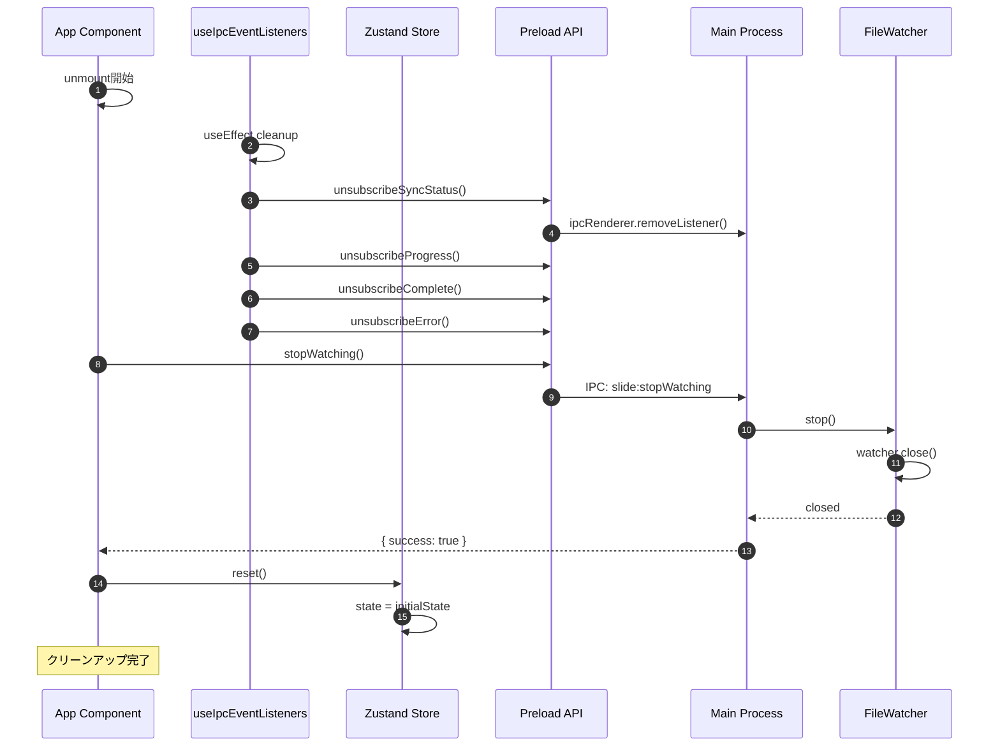

# シーケンス図 - スライド依存関係管理システム

## 1. ドキュメント情報

| 項目       | 内容                                      |
| ---------- | ----------------------------------------- |
| タスクID   | task-feat-slide-dependency-management-003 |
| バージョン | 1.0.0                                     |
| 作成日     | 2026-01-09                                |
| 作成者     | Claude (dependency-analysis skill)        |

---

## 2. 主要シーケンス図

### 2.1 プロジェクト起動シーケンス



### 2.2 スキル実行シーケンス（html-generator）



### 2.3 ファイル変更検知・自動同期シーケンス



### 2.4 手動同期シーケンス



### 2.5 スキルキャンセルシーケンス



---

## 3. エラーハンドリングシーケンス

### 3.1 スキル実行エラー・リトライシーケンス

```mermaid
sequenceDiagram
    autonumber
    participant R as Renderer
    participant S as Zustand Store
    participant M as Main Process
    participant E as SkillExecutor
    participant SDK as Claude Agent SDK

    E->>SDK: invoke(skill, args)
    SDK-->>E: Error: API timeout

    E->>E: retryCount++

    loop リトライ (max 3回)
        alt retryCount <= 3
            E->>E: wait(1000 * 2^retryCount)
            E->>SDK: invoke(skill, args)

            alt 成功
                SDK-->>E: result
                E-->>M: SkillExecutionResult
                break
            else 再度失敗
                SDK-->>E: Error
                E->>E: retryCount++
            end
        end
    end

    alt リトライ上限到達
        E-->>M: { error: SLIDE_E004 }
        M->>R: IPC: slide:executionError
        R->>S: setError(message)
        R->>S: setSyncStatus("error")
        R->>S: setPhase("idle")
        R->>R: エラー通知表示<br/>("手動リトライボタン有効化")
    end
```

### 3.2 ファイルシステムエラーシーケンス



---

## 4. 状態同期シーケンス

### 4.1 Zustand Store更新・UI反映シーケンス



### 4.2 複数コンポーネント間の状態共有



---

## 5. 初期化・クリーンアップシーケンス

### 5.1 アプリケーション起動シーケンス



### 5.2 アプリケーション終了シーケンス



---

## 6. 変更履歴

| バージョン | 日付       | 変更内容 |
| ---------- | ---------- | -------- |
| 1.0.0      | 2026-01-09 | 初版作成 |
