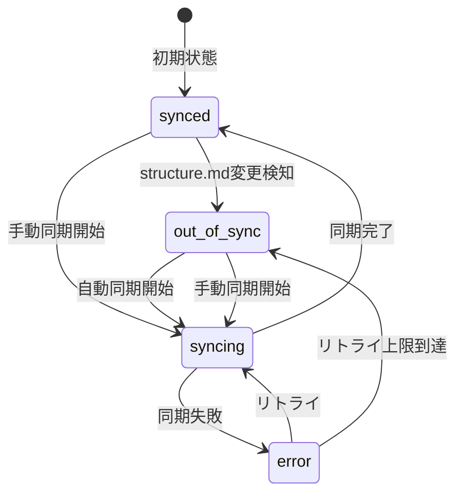
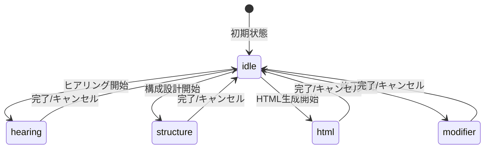

# 状態管理設計書 - スライド依存関係管理システム

## 1. ドキュメント情報

| 項目       | 内容                                      |
| ---------- | ----------------------------------------- |
| タスクID   | task-feat-slide-dependency-management-003 |
| バージョン | 1.0.0                                     |
| 作成日     | 2026-01-09                                |
| 作成者     | Claude (state-management skill)           |

---

## 2. 状態管理方針

### 2.1 ライブラリ選定

**選定ライブラリ**: Zustand

| 評価項目         | Zustand | Redux Toolkit | Recoil | 選定理由 |
| ---------------- | ------- | ------------- | ------ | -------- |
| 学習コスト       | 低      | 中            | 中     | ○        |
| バンドルサイズ   | 小      | 大            | 中     | ○        |
| TypeScript対応   | 優秀    | 優秀          | 良好   | -        |
| ボイラープレート | 少      | 中            | 少     | ○        |
| DevTools         | 有      | 有            | 有     | -        |
| 既存利用         | 有      | 無            | 無     | ○        |

**選定理由**:

- プロジェクトで既にZustandを使用している
- シンプルなAPIで学習コストが低い
- TypeScriptとの親和性が高い
- スライス設計パターンで機能単位の分割が容易

### 2.2 状態の分類

| 状態種別     | スコープ       | 管理方法            | 例               |
| ------------ | -------------- | ------------------- | ---------------- |
| グローバル   | アプリ全体     | Zustand Store       | プロジェクト情報 |
| ローカル     | コンポーネント | useState/useReducer | フォーム入力     |
| サーバー状態 | Main Process   | IPC通信 + Store     | ファイル監視状態 |
| 派生状態     | -              | 計算（Selector）    | 同期可否の判定   |

---

## 3. Zustand Store設計

### 3.1 Store構成

```typescript
// apps/desktop/src/renderer/slide/store/slideProjectStore.ts

import { create } from "zustand";
import { devtools, subscribeWithSelector } from "zustand/middleware";
import type {
  SlideProject,
  SyncStatus,
  SkillPhase,
  SkillExecutionResult,
} from "@repo/shared/slide";

// ============================================
// State Interface
// ============================================

interface SlideProjectState {
  // Project State
  projectPath: string | null;
  project: SlideProject | null;

  // Sync State
  syncStatus: SyncStatus;
  lastSyncAt: Date | null;

  // Watcher State
  isWatching: boolean;

  // Execution State
  currentPhase: SkillPhase | "idle";
  executionProgress: number;
  executionHistory: SkillExecutionResult[];

  // Error State
  lastError: string | null;
}

interface SlideProjectActions {
  // Project Actions
  setProject: (project: SlideProject) => void;
  clearProject: () => void;

  // Sync Actions
  setSyncStatus: (status: SyncStatus) => void;
  updateLastSyncAt: () => void;

  // Watcher Actions
  setWatching: (isWatching: boolean) => void;

  // Execution Actions
  setPhase: (phase: SkillPhase | "idle") => void;
  setProgress: (progress: number) => void;
  addExecutionResult: (result: SkillExecutionResult) => void;

  // Error Actions
  setError: (error: string | null) => void;

  // Reset
  reset: () => void;
}

type SlideProjectStore = SlideProjectState & SlideProjectActions;

// ============================================
// Initial State
// ============================================

const initialState: SlideProjectState = {
  projectPath: null,
  project: null,
  syncStatus: "synced",
  lastSyncAt: null,
  isWatching: false,
  currentPhase: "idle",
  executionProgress: 0,
  executionHistory: [],
  lastError: null,
};

// ============================================
// Store Implementation
// ============================================

export const useSlideProjectStore = create<SlideProjectStore>()(
  devtools(
    subscribeWithSelector((set, get) => ({
      ...initialState,

      // Project Actions
      setProject: (project) =>
        set(
          {
            project,
            projectPath: project.path,
            syncStatus: project.syncStatus,
            lastSyncAt: project.lastSyncAt,
          },
          false,
          "setProject",
        ),

      clearProject: () =>
        set(
          {
            project: null,
            projectPath: null,
            syncStatus: "synced",
            isWatching: false,
          },
          false,
          "clearProject",
        ),

      // Sync Actions
      setSyncStatus: (status) =>
        set({ syncStatus: status }, false, "setSyncStatus"),

      updateLastSyncAt: () =>
        set({ lastSyncAt: new Date() }, false, "updateLastSyncAt"),

      // Watcher Actions
      setWatching: (isWatching) => set({ isWatching }, false, "setWatching"),

      // Execution Actions
      setPhase: (phase) =>
        set(
          {
            currentPhase: phase,
            executionProgress: phase === "idle" ? 0 : get().executionProgress,
          },
          false,
          "setPhase",
        ),

      setProgress: (progress) =>
        set({ executionProgress: progress }, false, "setProgress"),

      addExecutionResult: (result) =>
        set(
          (state) => ({
            executionHistory: [...state.executionHistory, result].slice(-10), // 最新10件を保持
            currentPhase: "idle",
            executionProgress: 0,
          }),
          false,
          "addExecutionResult",
        ),

      // Error Actions
      setError: (error) => set({ lastError: error }, false, "setError"),

      // Reset
      reset: () => set(initialState, false, "reset"),
    })),
    { name: "SlideProjectStore" },
  ),
);
```

### 3.2 Selectors（派生状態）

```typescript
// apps/desktop/src/renderer/slide/store/selectors.ts

import { useSlideProjectStore } from "./slideProjectStore";

// 同期可能かどうか
export const useCanSync = () =>
  useSlideProjectStore(
    (state) =>
      state.syncStatus === "out-of-sync" && state.currentPhase === "idle",
  );

// スキル実行可能かどうか
export const useCanExecuteSkill = () =>
  useSlideProjectStore(
    (state) =>
      state.project !== null &&
      state.currentPhase === "idle" &&
      state.isWatching,
  );

// 実行中かどうか
export const useIsExecuting = () =>
  useSlideProjectStore((state) => state.currentPhase !== "idle");

// プロジェクトが開かれているかどうか
export const useHasProject = () =>
  useSlideProjectStore((state) => state.project !== null);

// 最新の実行結果
export const useLatestExecutionResult = () =>
  useSlideProjectStore((state) =>
    state.executionHistory.length > 0
      ? state.executionHistory[state.executionHistory.length - 1]
      : null,
  );

// 同期状態の色
export const useSyncStatusColor = () =>
  useSlideProjectStore((state) => {
    switch (state.syncStatus) {
      case "synced":
        return "green";
      case "out-of-sync":
        return "yellow";
      case "syncing":
        return "blue";
      case "error":
        return "red";
      default:
        return "gray";
    }
  });
```

---

## 4. IPC連携

### 4.1 IPC Event Listeners

```typescript
// apps/desktop/src/renderer/slide/hooks/useIpcEventListeners.ts

import { useEffect } from "react";
import { useSlideProjectStore } from "../store/slideProjectStore";
import type { SyncStatus, SkillExecutionResult } from "@repo/shared/slide";

export const useIpcEventListeners = () => {
  const { setSyncStatus, setProgress, addExecutionResult, setError, setPhase } =
    useSlideProjectStore();

  useEffect(() => {
    // 同期状態変更イベント
    const unsubscribeSyncStatus = window.slideApi.onSyncStatusChange(
      (status: SyncStatus) => {
        setSyncStatus(status);
      },
    );

    // 実行進捗イベント
    const unsubscribeProgress = window.slideApi.onExecutionProgress(
      (progress: number) => {
        setProgress(progress);
      },
    );

    // 実行完了イベント
    const unsubscribeComplete = window.slideApi.onExecutionComplete(
      (result: SkillExecutionResult) => {
        addExecutionResult(result);
        if (result.phase === "html") {
          setSyncStatus("synced");
        }
      },
    );

    // エラーイベント
    const unsubscribeError = window.slideApi.onExecutionError(
      (error: string) => {
        setError(error);
        setPhase("idle");
      },
    );

    return () => {
      unsubscribeSyncStatus();
      unsubscribeProgress();
      unsubscribeComplete();
      unsubscribeError();
    };
  }, [setSyncStatus, setProgress, addExecutionResult, setError, setPhase]);
};
```

### 4.2 カスタムHook

```typescript
// apps/desktop/src/renderer/slide/hooks/useSlideProject.ts

import { useCallback } from "react";
import { useSlideProjectStore } from "../store/slideProjectStore";
import type { SkillPhase, SlideProject } from "@repo/shared/slide";
import { useCanExecuteSkill, useIsExecuting } from "../store/selectors";

export const useSlideProject = () => {
  const {
    project,
    projectPath,
    syncStatus,
    currentPhase,
    executionProgress,
    isWatching,
    setProject,
    clearProject,
    setPhase,
    setSyncStatus,
    setWatching,
  } = useSlideProjectStore();

  const canExecuteSkill = useCanExecuteSkill();
  const isExecuting = useIsExecuting();

  // プロジェクトを開く
  const openProject = useCallback(
    async (path: string) => {
      try {
        await window.slideApi.startWatching(path);
        const syncStatus = await window.slideApi.getSyncStatus(path);

        const project: SlideProject = {
          path,
          structurePath: `${path}/structure.md`,
          htmlPath: `${path}/index.html`,
          syncStatus,
          lastSyncAt: null,
          structureHash: null,
          htmlHash: null,
        };

        setProject(project);
        setWatching(true);
      } catch (error) {
        console.error("Failed to open project:", error);
        throw error;
      }
    },
    [setProject, setWatching],
  );

  // プロジェクトを閉じる
  const closeProject = useCallback(async () => {
    await window.slideApi.stopWatching();
    clearProject();
  }, [clearProject]);

  // スキルフェーズを実行
  const executePhase = useCallback(
    async (phase: SkillPhase) => {
      if (!projectPath || !canExecuteSkill) {
        return;
      }

      setPhase(phase);
      try {
        await window.slideApi.executePhase(phase, projectPath);
      } catch (error) {
        setPhase("idle");
        throw error;
      }
    },
    [projectPath, canExecuteSkill, setPhase],
  );

  // 手動同期
  const manualSync = useCallback(async () => {
    if (!projectPath || syncStatus !== "out-of-sync") {
      return;
    }

    setSyncStatus("syncing");
    try {
      await window.slideApi.manualSync(projectPath);
    } catch (error) {
      setSyncStatus("error");
      throw error;
    }
  }, [projectPath, syncStatus, setSyncStatus]);

  return {
    // State
    project,
    projectPath,
    syncStatus,
    currentPhase,
    executionProgress,
    isWatching,
    canExecuteSkill,
    isExecuting,

    // Actions
    openProject,
    closeProject,
    executePhase,
    manualSync,
  };
};
```

---

## 5. 状態遷移設計

### 5.1 SyncStatus状態遷移



### 5.2 ExecutionPhase状態遷移



---

## 6. エラーハンドリング

### 6.1 エラー状態の管理

```typescript
// エラー状態の型
interface ErrorState {
  lastError: string | null;
  errorCount: number;
  lastErrorAt: Date | null;
}

// エラーリカバリーロジック
const handleError = (error: Error) => {
  const { lastError, errorCount } = useSlideProjectStore.getState();

  if (errorCount < 3) {
    // リトライ
    setTimeout(() => retryLastAction(), 1000 * Math.pow(2, errorCount));
  } else {
    // ユーザー通知
    setError(error.message);
  }
};
```

### 6.2 楽観的更新パターン

```typescript
// 楽観的更新の例（手動同期）
const optimisticSync = async () => {
  const previousStatus = useSlideProjectStore.getState().syncStatus;

  // 楽観的にUIを更新
  setSyncStatus("syncing");

  try {
    await window.slideApi.manualSync(projectPath);
    setSyncStatus("synced");
  } catch (error) {
    // ロールバック
    setSyncStatus(previousStatus);
    throw error;
  }
};
```

---

## 7. テスト戦略

### 7.1 Store単体テスト

```typescript
// __tests__/slideProjectStore.test.ts

import { renderHook, act } from "@testing-library/react";
import { useSlideProjectStore } from "../slideProjectStore";

describe("slideProjectStore", () => {
  beforeEach(() => {
    act(() => {
      useSlideProjectStore.getState().reset();
    });
  });

  it("should set project correctly", () => {
    const { result } = renderHook(() => useSlideProjectStore());

    const mockProject = {
      path: "/test/project",
      structurePath: "/test/project/structure.md",
      htmlPath: "/test/project/index.html",
      syncStatus: "synced" as const,
      lastSyncAt: null,
      structureHash: null,
      htmlHash: null,
    };

    act(() => {
      result.current.setProject(mockProject);
    });

    expect(result.current.project).toEqual(mockProject);
    expect(result.current.projectPath).toBe("/test/project");
  });

  it("should update sync status", () => {
    const { result } = renderHook(() => useSlideProjectStore());

    act(() => {
      result.current.setSyncStatus("out-of-sync");
    });

    expect(result.current.syncStatus).toBe("out-of-sync");
  });
});
```

### 7.2 Selector単体テスト

```typescript
// __tests__/selectors.test.ts

import { renderHook, act } from "@testing-library/react";
import { useSlideProjectStore } from "../slideProjectStore";
import { useCanSync, useCanExecuteSkill } from "../selectors";

describe("selectors", () => {
  beforeEach(() => {
    act(() => {
      useSlideProjectStore.getState().reset();
    });
  });

  it("useCanSync returns true when out-of-sync and idle", () => {
    act(() => {
      useSlideProjectStore.getState().setSyncStatus("out-of-sync");
    });

    const { result } = renderHook(() => useCanSync());
    expect(result.current).toBe(true);
  });
});
```

---

## 8. 変更履歴

| バージョン | 日付       | 変更内容 |
| ---------- | ---------- | -------- |
| 1.0.0      | 2026-01-09 | 初版作成 |
