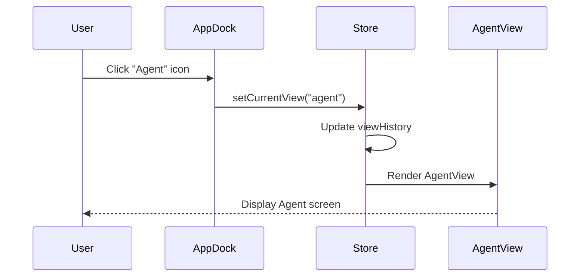

# 統合テスト設計書 - エージェントダッシュボード基盤

## 概要情報

| 項目     | 内容                       |
| -------- | -------------------------- |
| タスクID | AGENT-001                  |
| 機能名   | agent-dashboard-foundation |
| Phase    | 4                          |
| 作成日   | 2026-01-10                 |

---

## 統合テストシナリオ

### シナリオ1: ナビゲーション遷移テスト

**目的**: AppDockからAgentViewへの遷移が正しく動作することを検証

**テストファイル**: `apps/desktop/src/renderer/__tests__/navigation.integration.test.ts`

#### テストフロー



#### テストケース

```typescript
describe("Navigation Integration", () => {
  describe("AppDock → AgentView 遷移", () => {
    it("should render Agent icon in AppDock", async () => {
      // Given: AppDockがレンダリングされている
      // When: Agent iconを探す
      // Then: "Agent" aria-labelを持つボタンが存在する
    });

    it("should navigate to AgentView on Agent icon click", async () => {
      // Given: currentViewが"dashboard"である
      // When: Agent iconをクリックする
      // Then: AgentViewがレンダリングされる
    });

    it("should update currentView to 'agent'", async () => {
      // Given: currentViewが"dashboard"である
      // When: Agent iconをクリックする
      // Then: store.currentViewが"agent"になる
    });

    it("should set Agent icon as active", async () => {
      // Given: currentViewが"agent"である
      // When: AppDockを確認する
      // Then: Agent iconがアクティブ状態になっている
    });
  });
});
```

---

### シナリオ2: 状態同期テスト

**目的**: agentSliceとnavigationSlice間の状態同期を検証

**テストファイル**: `apps/desktop/src/renderer/__tests__/state-sync.integration.test.ts`

#### 状態遷移図

```
┌─────────────────────────────────────────────────────────┐
│                    Zustand Store                         │
├─────────────────────────┬───────────────────────────────┤
│    navigationSlice      │        agentSlice             │
├─────────────────────────┼───────────────────────────────┤
│ currentView: "dashboard"│ skills: []                    │
│ viewHistory: ["dash"]   │ isLoading: false              │
│                         │ error: null                   │
├─────────────────────────┼───────────────────────────────┤
│        ↓ setCurrentView("agent")                        │
├─────────────────────────┼───────────────────────────────┤
│ currentView: "agent"    │ skills: []                    │
│ viewHistory: ["d","a"]  │ isLoading: false              │
│                         │ error: null                   │
└─────────────────────────┴───────────────────────────────┘
```

#### テストケース

```typescript
describe("State Sync Integration", () => {
  describe("agentSlice ↔ navigationSlice 連携", () => {
    it("should maintain independent state between slices", async () => {
      // Given: Store初期化済み
      // When: navigationでagentに遷移
      // Then: agentSliceの状態は変わらない（独立性）
    });

    it("should sync viewHistory when navigating to agent", async () => {
      // Given: viewHistory = ["dashboard"]
      // When: setCurrentView("agent")
      // Then: viewHistory = ["dashboard", "agent"]
    });

    it("should correctly goBack from agent", async () => {
      // Given: currentView = "agent", viewHistory = ["dashboard", "agent"]
      // When: goBack()
      // Then: currentView = "dashboard", viewHistory = ["dashboard"]
    });
  });
});
```

---

### シナリオ3: Store永続化テスト

**目的**: agentSliceが永続化対象から除外されていることを検証

**テストファイル**: `apps/desktop/src/renderer/__tests__/store-persistence.test.ts`

#### 永続化設計

```typescript
// 永続化対象
partialize: (state) => ({
  theme: state.theme,
  sidebarWidth: state.sidebarWidth,
  // agentSliceは含まない
});
```

#### テストケース

```typescript
describe("Store Persistence", () => {
  describe("agentSlice 永続化除外", () => {
    it("should not persist agentSlice state", async () => {
      // Given: agentSliceに状態を設定
      // When: Store永続化データを取得
      // Then: agentSlice関連のキーが含まれない
    });

    it("should reset agentSlice on app restart simulation", async () => {
      // Given: agentSlice.skills に値を設定
      // When: Storeを再初期化（リスタートシミュレーション）
      // Then: agentSlice.skills は空配列
    });
  });
});
```

---

## 統合テスト環境設定

### モック設定

```typescript
// integration-test-setup.ts
import { cleanup } from "@testing-library/react";
import { afterEach, beforeEach, vi } from "vitest";

beforeEach(() => {
  // Reset store before each test
  vi.resetModules();
});

afterEach(() => {
  cleanup();
});
```

### Store統合テスト用ユーティリティ

```typescript
// test-utils/store-utils.ts
import { create } from "zustand";
import { createNavigationSlice } from "../store/slices/navigationSlice";
import { createAgentSlice } from "../store/slices/agentSlice";

export const createTestStore = () => {
  return create((set, get, store) => ({
    ...createNavigationSlice(set, get, store),
    ...createAgentSlice(set, get, store),
  }));
};
```

---

## 検証マトリクス

| 統合ポイント              | テスト方法           | 検証内容                 |
| ------------------------- | -------------------- | ------------------------ |
| AppDock → navigationSlice | コンポーネントテスト | クリック→状態更新        |
| navigationSlice → View    | 統合テスト           | currentView変更→View切替 |
| agentSlice 独立性         | ユニットテスト       | 他sliceからの影響なし    |
| Store永続化               | 統合テスト           | agentSlice除外確認       |

---

## テスト実行順序

1. **ユニットテスト**: agentSlice, channels
2. **コンポーネントテスト**: AgentView
3. **統合テスト**: Navigation, State Sync, Persistence

```bash
# 順序付き実行
pnpm --filter @repo/desktop test slices/agentSlice
pnpm --filter @repo/desktop test views/AgentView
pnpm --filter @repo/desktop test __tests__/*.integration
```

---

## 期待される失敗（TDD: Red状態）

Phase 4完了時点で、以下の統合テストは全て失敗する：

| テストファイル                 | 失敗理由                           |
| ------------------------------ | ---------------------------------- |
| navigation.integration.test.ts | AgentView未実装、navItem未追加     |
| state-sync.integration.test.ts | agentSlice未実装                   |
| store-persistence.test.ts      | agentSlice未実装、partialize未更新 |

これはTDDの「Red」状態として正常である。Phase 5で実装を行い「Green」状態に移行する。
