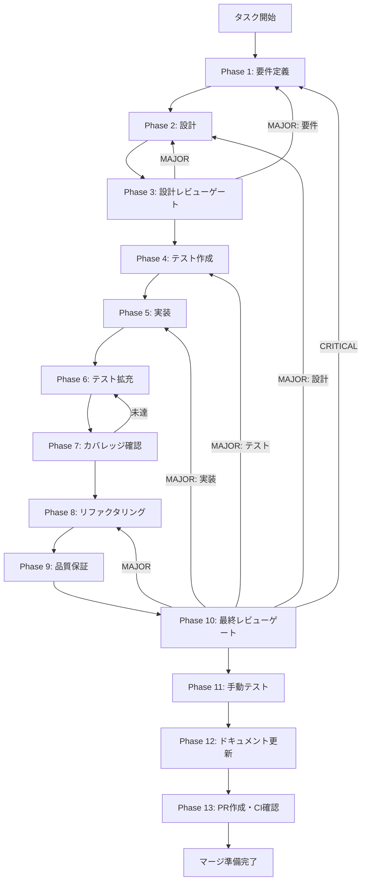

# agent-execution-ui - タスク実行仕様書

## ユーザーからの元の指示

```
エージェント実行UI: 選択したスキルに基づいてClaude Codeエージェントを実行し、
ストリーミング出力を表示し、ユーザーと対話できるUIを提供する。
- チャット形式のUI
- ストリーミング出力表示
- 実行制御（実行、キャンセル、クリア）
- Permission Dialog（権限確認ダイアログ）
```

## メタ情報

| 項目         | 内容               |
| ------------ | ------------------ |
| タスクID     | AGENT-004          |
| タスク名     | agent-execution-ui |
| 分類         | 要件               |
| 対象機能     | エージェント機能   |
| 優先度       | 高                 |
| 見積もり規模 | 大規模             |
| ステータス   | 未実施             |
| 作成日       | 2026-01-12         |

---

## タスク概要

### 目的

選択したスキルに基づいてClaude Codeエージェントを実行し、ストリーミング出力を表示し、ユーザーと対話できるUIを提供する。

### 背景

Claude Codeのスキルを実行し、エージェントとの対話を行うためのUIが必要。ユーザーはスキルを選択後、そのスキルに基づいたエージェントとチャット形式で対話し、タスクを実行したい。現状では以下の課題がある：

- スキルを実行するUIがない
- エージェントとの対話（チャット）インターフェースがない
- 実行中の状態（ストリーミング出力）を表示する機能がない
- 実行のキャンセル・中断機能がない
- 権限確認ダイアログ（Permission Dialog）がない

### 最終ゴール

- スキル選択後、実行画面に遷移できる
- ユーザーがメッセージを入力してエージェントに送信できる
- エージェントの出力がストリーミングで表示される
- 実行をキャンセルできる
- Permission Dialogで権限確認ができる
- 実行履歴が保持される

### 成果物一覧

| 種別         | 成果物                 | 配置先                                                 |
| ------------ | ---------------------- | ------------------------------------------------------ |
| 機能         | AgentExecutionView     | `apps/desktop/src/renderer/views/AgentExecutionView/`  |
| 機能         | AgentChatInterface     | `apps/desktop/src/renderer/components/organisms/`      |
| 機能         | AgentOutputStream      | `apps/desktop/src/renderer/components/molecules/`      |
| 機能         | AgentMessageInput      | `apps/desktop/src/renderer/components/molecules/`      |
| 機能         | AgentExecutionControls | `apps/desktop/src/renderer/components/molecules/`      |
| 機能         | PermissionDialog       | `apps/desktop/src/renderer/components/organisms/`      |
| 状態管理     | agentSlice拡張         | `apps/desktop/src/renderer/store/slices/agentSlice.ts` |
| テスト       | ユニット/統合テスト    | `apps/desktop/src/renderer/**/*.test.{ts,tsx}`         |
| ドキュメント | 実装ガイド             | `outputs/phase-12/implementation-guide.md`             |
| PR           | GitHub Pull Request    | GitHub UI                                              |

---

## 参照ファイル

本仕様書の作成は以下を参照：

### システム仕様（aiworkflow-requirements）

> 実装前に必ず以下のシステム仕様を確認し、既存設計との整合性を確保してください。

| 参照資料               | パス                                                                         | 内容                           |
| ---------------------- | ---------------------------------------------------------------------------- | ------------------------------ |
| Agent SDK仕様          | `.claude/skills/aiworkflow-requirements/references/interfaces-agent-sdk.md`  | Agent SDK/Skill Dashboard型    |
| UI/UXコンポーネント    | `.claude/skills/aiworkflow-requirements/references/ui-ux-components.md`      | Atomic Design/アクセシビリティ |
| アーキテクチャパターン | `.claude/skills/aiworkflow-requirements/references/architecture-patterns.md` | レイヤードアーキテクチャ       |
| セキュリティ原則       | `.claude/skills/aiworkflow-requirements/references/security-principles.md`   | 入力検証/IPC通信セキュリティ   |

### 依存タスク

| タスク    | パス/説明                                               |
| --------- | ------------------------------------------------------- |
| AGENT-001 | エージェントダッシュボード基盤（完了済み）              |
| AGENT-002 | スキル管理UI（完了済み）                                |
| AGENT-003 | スキル管理バックエンド（完了済み）                      |
| AGENT-005 | Claude Code統合（並行開発可能、本タスクではモック使用） |

---

## タスク分解サマリー

| ID     | フェーズ | サブタスク名                      | 責務                               | 依存 |
| ------ | -------- | --------------------------------- | ---------------------------------- | ---- |
| T-01-1 | Phase 1  | 要件抽出・受け入れ基準定義        | 機能・非機能要件の明文化           | -    |
| T-02-1 | Phase 2  | アーキテクチャ・型定義設計        | 実行状態型・IPC通信設計            | T-01 |
| T-03-1 | Phase 3  | 設計レビューゲート                | 設計妥当性検証                     | T-02 |
| T-04-1 | Phase 4  | テスト作成（TDD: Red）            | ユニット/統合テスト作成            | T-03 |
| T-05-1 | Phase 5  | 実装（TDD: Green）                | コンポーネント実装                 | T-04 |
| T-06-1 | Phase 6  | テスト拡充                        | カバレッジ向上                     | T-05 |
| T-07-1 | Phase 7  | テストカバレッジ確認              | カバレッジ基準達成検証             | T-06 |
| T-08-1 | Phase 8  | リファクタリング（TDD: Refactor） | コード品質改善                     | T-07 |
| T-09-1 | Phase 9  | 品質保証                          | 静的解析・セキュリティ検証         | T-08 |
| T-10-1 | Phase 10 | 最終レビューゲート                | 全体品質・整合性検証               | T-09 |
| T-11-1 | Phase 11 | 手動テスト検証                    | UX・実環境動作確認                 | T-10 |
| T-12-1 | Phase 12 | ドキュメント更新                  | 実装ガイド・仕様更新・未タスク検出 | T-11 |
| T-13-1 | Phase 13 | PR作成                            | コミット・PR・CI確認               | T-12 |

**総サブタスク数**: 13個

---

## 実行フロー図



---

## Phase一覧

| Phase | 名称               | 仕様書                                                 | ステータス |
| ----- | ------------------ | ------------------------------------------------------ | ---------- |
| 1     | 要件定義           | [phase-1-requirements.md](phase-1-requirements.md)     | 未実施     |
| 2     | 設計               | [phase-2-design.md](phase-2-design.md)                 | 未実施     |
| 3     | 設計レビューゲート | [phase-3-design-review.md](phase-3-design-review.md)   | 未実施     |
| 4     | テスト作成         | [phase-4-test-creation.md](phase-4-test-creation.md)   | 未実施     |
| 5     | 実装               | [phase-5-implementation.md](phase-5-implementation.md) | 未実施     |
| 6     | テスト拡充         | [phase-6-test-expansion.md](phase-6-test-expansion.md) | 未実施     |
| 7     | カバレッジ確認     | [phase-7-coverage-check.md](phase-7-coverage-check.md) | 未実施     |
| 8     | リファクタリング   | [phase-8-refactoring.md](phase-8-refactoring.md)       | 未実施     |
| 9     | 品質保証           | [phase-9-quality.md](phase-9-quality.md)               | 未実施     |
| 10    | 最終レビューゲート | [phase-10-final-review.md](phase-10-final-review.md)   | 未実施     |
| 11    | 手動テスト         | [phase-11-manual-test.md](phase-11-manual-test.md)     | 未実施     |
| 12    | ドキュメント更新   | [phase-12-documentation.md](phase-12-documentation.md) | 未実施     |
| 13    | PR作成             | [phase-13-pr-creation.md](phase-13-pr-creation.md)     | 未実施     |

---

## テストカバレッジ目標

### ユニットテスト

| 指標              | 最低基準 | 推奨基準 |
| ----------------- | -------- | -------- |
| Line Coverage     | 80%      | 90%      |
| Branch Coverage   | 60%      | 70%      |
| Function Coverage | 80%      | 90%      |

### 結合テスト

| 指標                         | 目標 |
| ---------------------------- | ---- |
| APIエンドポイント            | 100% |
| モジュール間インターフェース | 100% |
| 正常系シナリオ               | 100% |
| 異常系シナリオ               | 80%+ |
| 外部連携ポイント             | 100% |

---

## 統合テスト連携（Phase 1〜11で必須）

各Phaseで以下の統合テスト連携アクションを実施すること:

| Phase | 統合テスト連携アクション                                     |
| ----- | ------------------------------------------------------------ |
| 1     | 接続要件（IPC/ストリーミング/Permission）を要件に明記        |
| 2     | 統合ポイント/契約（IPCチャンネル・メッセージ型）を設計に反映 |
| 3     | 統合テスト観点のレビューゲートを実施                         |
| 4     | 統合テストシナリオを全カテゴリで作成                         |
| 5     | Renderer/Main Process接続の実装とテスト支援コード整備        |
| 6     | 統合テストの拡充（全カテゴリのカバレッジ向上）               |
| 7     | 統合テストの再実行とゲート判定                               |
| 8     | リファクタ後の統合テスト継続成功を確認                       |
| 9     | 品質保証で統合テスト結果を確認                               |
| 10    | 最終レビューで統合テスト結果を確認                           |
| 11    | 手動統合テスト（UI/IPC接続）を確認                           |

---

## Phase完了時の必須アクション

**各Phase完了時に以下を必ず実行すること:**

1. **タスク100%実行**: Phase内で指定された全タスクを完全に実行
2. **成果物確認**: 全ての必須成果物が生成されていることを検証
3. **実行記録**: 実行タスクの結果を記録
4. **artifacts.json更新**: Phase完了ステータスを更新
5. **Phase末端の実行確認**: 各タスクを100%実行し、各タスクを完遂した旨を必ず明記

```bash
# Phase完了時の検証コマンド
node .claude/skills/task-specification-creator/scripts/validate-phase-output.mjs docs/30-workflows/agent-execution-ui --phase {{PHASE_NUMBER}}

# Phase完了・成果物登録
node .claude/skills/task-specification-creator/scripts/complete-phase.mjs \
  --workflow docs/30-workflows/agent-execution-ui --phase {{PHASE_NUMBER}} --artifacts "..."
```

---

## 変更履歴

| Version | Date       | Changes  |
| ------- | ---------- | -------- |
| 1.0.0   | 2026-01-12 | 初版作成 |
