# AI Runtime / Access Surface UI/UX 図解

## 前提の明確化

今回の `Claude Code Terminal Surface` は、`裏で Claude Code を自動実行して出力だけ見せる構造` ではない。

| 項目         | 今回の採用                                           | 採用しない構造                                 |
| ------------ | ---------------------------------------------------- | ---------------------------------------------- |
| 実行主体     | ユーザーが terminal 上で `claude` を実行する         | アプリが裏で `claude` を自動起動・自動送信する |
| アプリの役割 | terminal UI / transcript 表示 / copy / open cwd      | hidden prompt injection / headless automation  |
| 出力表示     | ユーザー操作で始まった session transcript を表示する | アプリ内部ジョブの代理実行結果を表示する       |

## 図解フォーマット

各 surface について、次の 5 種の図解をそろえる。

1. 核となる責務図
2. 画面構成図
3. 状態遷移図
4. 必要マイコンポーネント図
5. CTA / handoff flow 図

## Core Access Model

### 1. 核となる責務図

```text
User Intent
   |
   v
Surface UI
   |
   v
Access Capability Resolver
   |------------------------ integrated-api ----------------------> Main Runtime -> Provider
   |------------------------ terminal-handoff --------------------> Handoff Card -> User-operated Terminal
   |------------------------ terminal-only -----------------------> Terminal Surface
   |------------------------ guidance-only -----------------------> Guidance Block
```

### 2. 画面構成図

```text
+------------------------------------------------------------------+
| App Shell Header                                   [Terminal]    |
+------------------------------------------------------------------+
| Access Capability Card | Runtime Banner | Guidance / Health      |
+------------------------------------------------------------------+
| Primary Work Area                                               |
| - Chat / Edit / Skill / Docs / Slide / Status Row               |
+------------------------------------------------------------------+
| Handoff Card / Permission / Control Rail / Terminal Dock        |
+------------------------------------------------------------------+
```

### 3. 状態遷移図

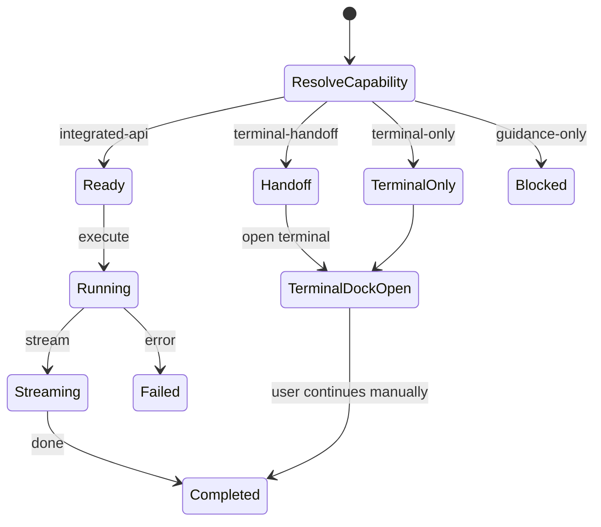

### 4. 必要マイコンポーネント図

```text
AccessCapabilityCard
RuntimeBanner
GuidanceBlock
HandoffCard
StatusRow
Composer / Input
TranscriptPanel
PermissionDialog
ContextSummary
HealthIndicator
PersistentTerminalLauncher
TerminalDockToggle
```

### 5. CTA / handoff flow 図

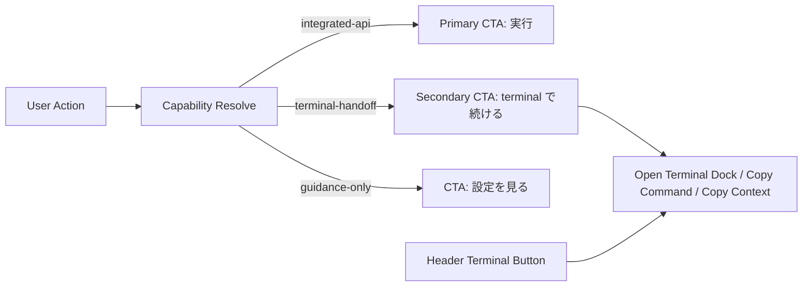

## Terminal Transcript -> Chat Manual Bridge

### 1. 核となる責務図

```text
Terminal Transcript
  -> user selects output
  -> explicit share action
  -> chat composer receives attachment / pasted text
```

### 2. 画面構成図

```text
+----------------------------------+----------------------------------+
| Terminal Dock                    | Chat Composer                    |
| - transcript                     | - input                          |
| - selected range                 | - attachment chips               |
| - share actions                  | - provenance label               |
+----------------------------------+----------------------------------+
```

### 3. 状態遷移図

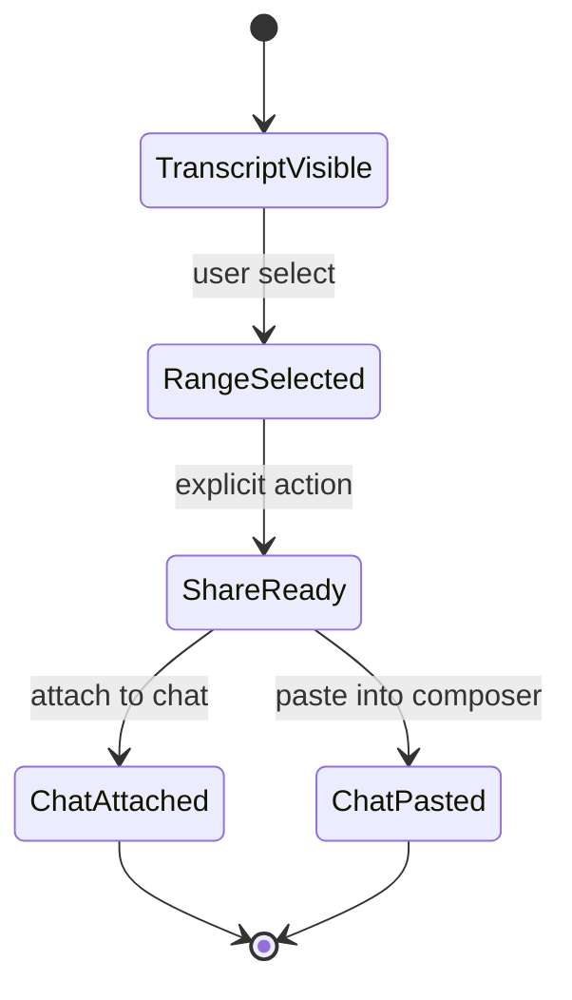

### 4. 必要マイコンポーネント図

```text
TranscriptSelectionToolbar
ShareToChatButton
AttachRecentOutputButton
PasteSessionButton
ComposerAttachmentChip
TranscriptProvenanceLabel
```

### 5. CTA / handoff flow 図

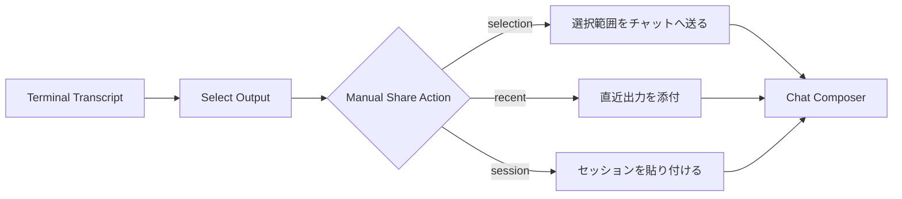

## Settings / Access Matrix

### 1. 核となる責務図

```text
SettingsView
  -> AccessCapabilityCard group
  -> Provider / Model Selector
  -> System Prompt Section
  -> Health / RAG Row
  -> Persistent Terminal Launcher
```

### 2. 画面構成図

```text
+------------------------------------------------------------------+
| Settings Header                                   [Terminal]     |
+------------------------------------------------------------------+
| Access Matrix Cards                                              |
| [Integrated API] [Claude Code Terminal] [Guidance Only]          |
+------------------------------------------------------------------+
| Provider / Model Selector                                        |
+------------------------------------------------------------------+
| System Prompt Section                                            |
+------------------------------------------------------------------+
| Health / RAG / Connection Status                                 |
+------------------------------------------------------------------+
| Terminal Dock (collapsed / expanded)                             |
+------------------------------------------------------------------+
```

### 3. 状態遷移図

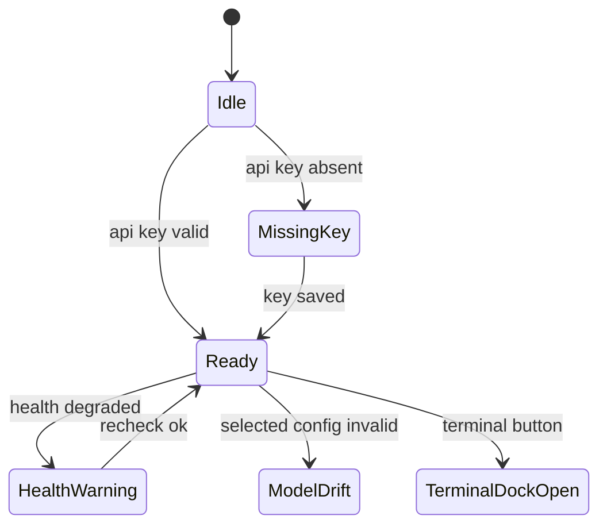

### 4. 必要マイコンポーネント図

```text
SettingsHeader
AccessCapabilityCard
TerminalAvailabilityCard
LLMSelectorPanel
SystemPromptPanel
HealthIndicator
RagStatusRow
GuidanceBlock
PersistentTerminalLauncher
TerminalDock
```

### 5. CTA / handoff flow 図

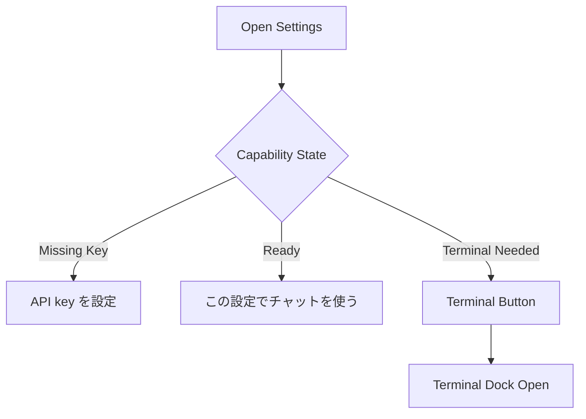

## Claude Code Terminal Surface

### 1. 核となる責務図

```text
Terminal Surface
  -> user-operated shell
  -> transcript viewer
  -> abort / retry / reconnect controls
  -> no auto-send boundary
  -> always-open entry from app shell
```

### 2. 画面構成図

```text
+----------------------+--------------------------------------------+
| Session List         | Transcript Panel                           |
| - current            | > stdout / stderr                          |
| - history            | > status badge                             |
| - reconnect          | > scroll / virtualization                  |
+----------------------+--------------------------------------------+
| Action Rail: Copy Cmd | Copy Context | Open CWD | Abort | Retry   |
+------------------------------------------------------------------+
```

### 3. 状態遷移図

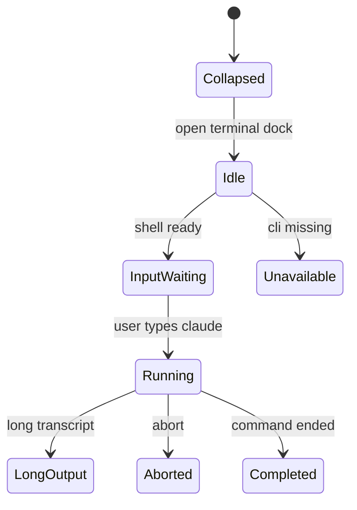

### 4. 必要マイコンポーネント図

```text
PersistentTerminalLauncher
TerminalDock
SessionList
TranscriptPanel
StatusBadge
ActionRail
AbortButton
RetryButton
CopyCommandButton
CopyContextButton
UnavailableGuidance
```

### 5. CTA / handoff flow 図

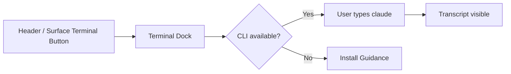

## ChatPanel

### 1. 核となる責務図

```text
ChatPanel
  -> message list
  -> composer
  -> runtime banner
  -> handoff block
  -> persistent terminal entry
```

### 2. 画面構成図

```text
+------------------------------------------------------------------+
| Runtime Banner                                      [Terminal]   |
+------------------------------------------------------------------+
| Message List                                                     |
| - empty state                                                    |
| - streaming message                                              |
| - error guidance                                                 |
+------------------------------------------------------------------+
| Composer: input | send | terminal handoff                        |
+------------------------------------------------------------------+
| Terminal Dock (bottom sheet / side dock)                         |
| Share Actions: 選択範囲を送る / 直近出力を添付                   |
+------------------------------------------------------------------+
```

### 3. 状態遷移図

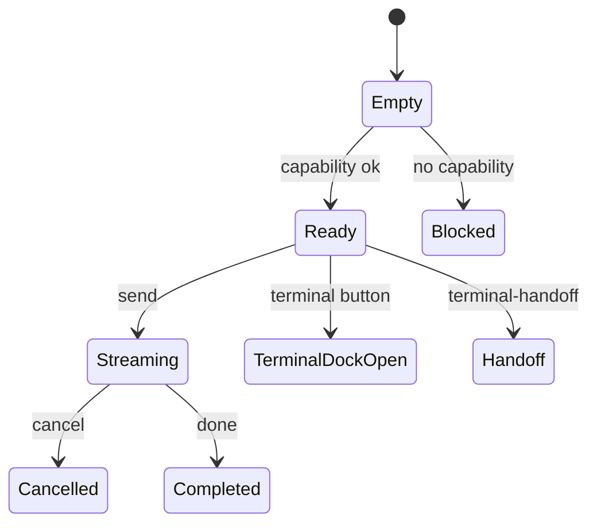

### 4. 必要マイコンポーネント図

```text
RuntimeBanner
ChatMessageList
StreamingMessage
ComposerInput
SendButton
HandoffBlock
ErrorGuidance
PersistentTerminalLauncher
TerminalDock
ComposerAttachmentChip
TranscriptProvenanceLabel
```

### 5. CTA / handoff flow 図

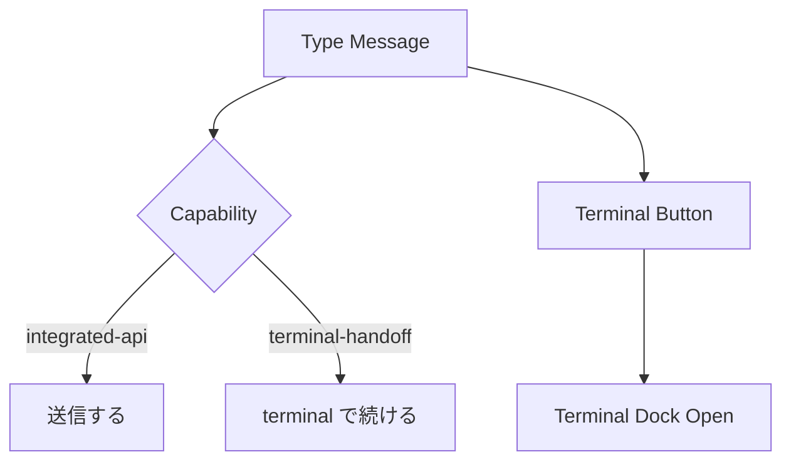

## Workspace Chat Panel

### 1. 核となる責務図

```text
WorkspaceChatPanel
  -> file context chips
  -> mention / selected files
  -> streaming chat
  -> compact guidance
  -> persistent terminal entry
```

### 2. 画面構成図

```text
+------------------------------------------------------------------+
| Panel Header / Capability                           [Terminal]   |
+------------------------------------------------------------------+
| Context Chips / Mention Summary                                  |
+------------------------------------------------------------------+
| Message Log                                                      |
+------------------------------------------------------------------+
| Composer: input | add file | mention | send | handoff            |
+------------------------------------------------------------------+
| Guidance Block / Compact fallback / Terminal Dock                |
| Share Actions: 選択範囲を送る / 直近出力を添付                   |
+------------------------------------------------------------------+
```

### 3. 状態遷移図

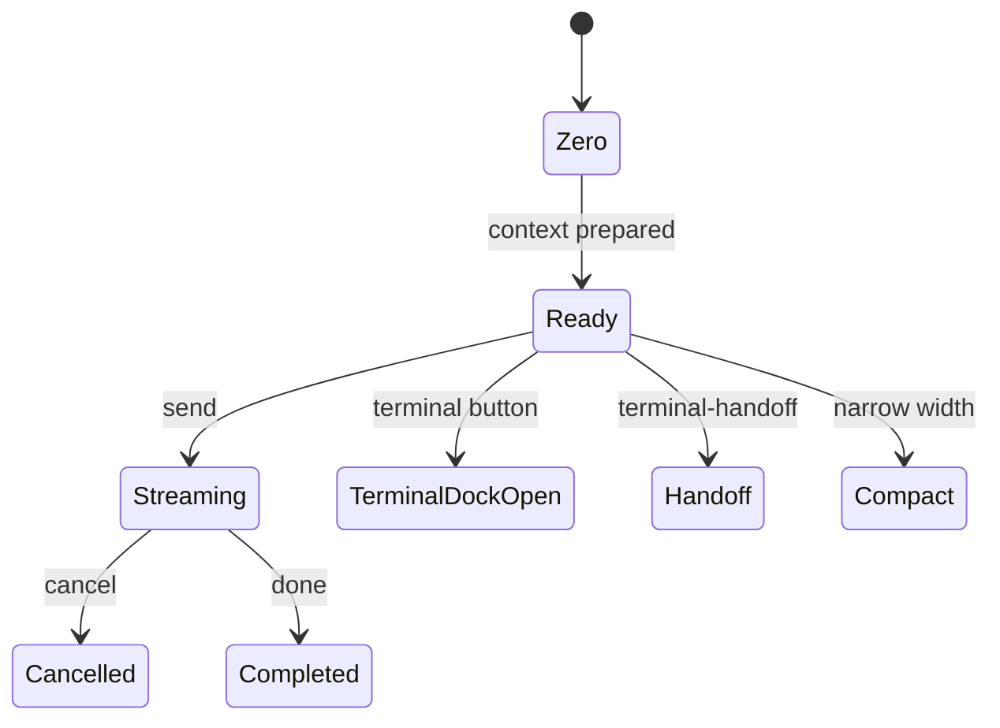

### 4. 必要マイコンポーネント図

```text
WorkspaceChatHeader
WorkspaceFileContextChips
WorkspaceMentionDropdown
WorkspaceChatMessageList
WorkspaceChatInput
CapabilityBanner
CompactGuidanceBlock
PersistentTerminalLauncher
TerminalDock
ComposerAttachmentChip
TranscriptProvenanceLabel
```

### 5. CTA / handoff flow 図

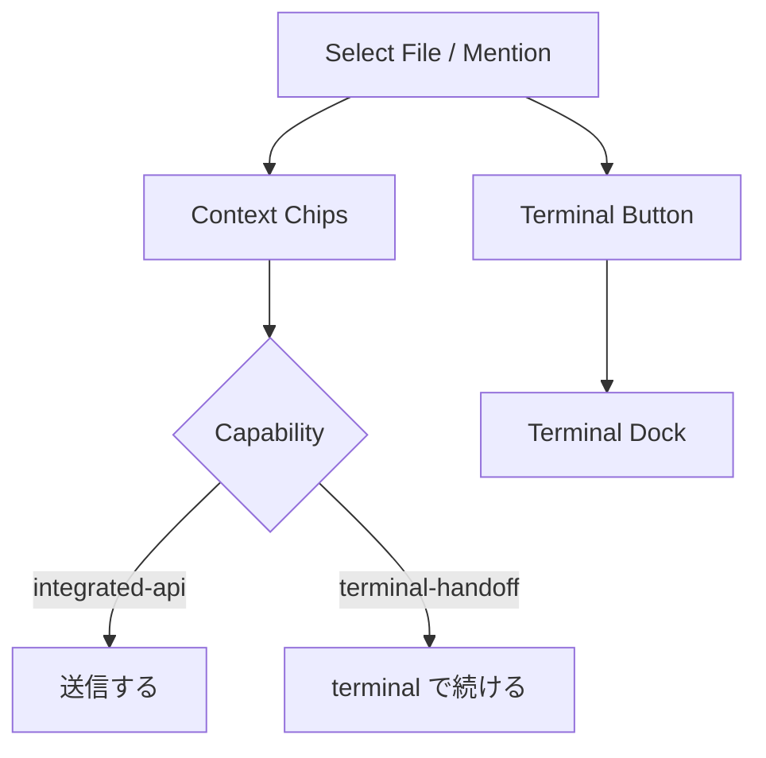

## Skill / Agent / Creator Execution Surface

### 1. 核となる責務図

```text
Lifecycle Job Surface
  -> create / execute / improve as user jobs
  -> permission dialog
  -> runtime banner
  -> result summary
  -> persistent terminal entry
```

### 2. 画面構成図

```text
+------------------------------------------------------------------+
| Lifecycle Header / Current Job                      [Terminal]   |
+------------------------------------------------------------------+
| Runtime Banner / Permission Summary                              |
+------------------------------------------------------------------+
| Execution Stream / Result Summary                                |
+------------------------------------------------------------------+
| Primary CTA | Secondary CTA | terminal handoff                   |
+------------------------------------------------------------------+
| Terminal Dock / Transcript Preview                               |
+------------------------------------------------------------------+
```

### 3. 状態遷移図

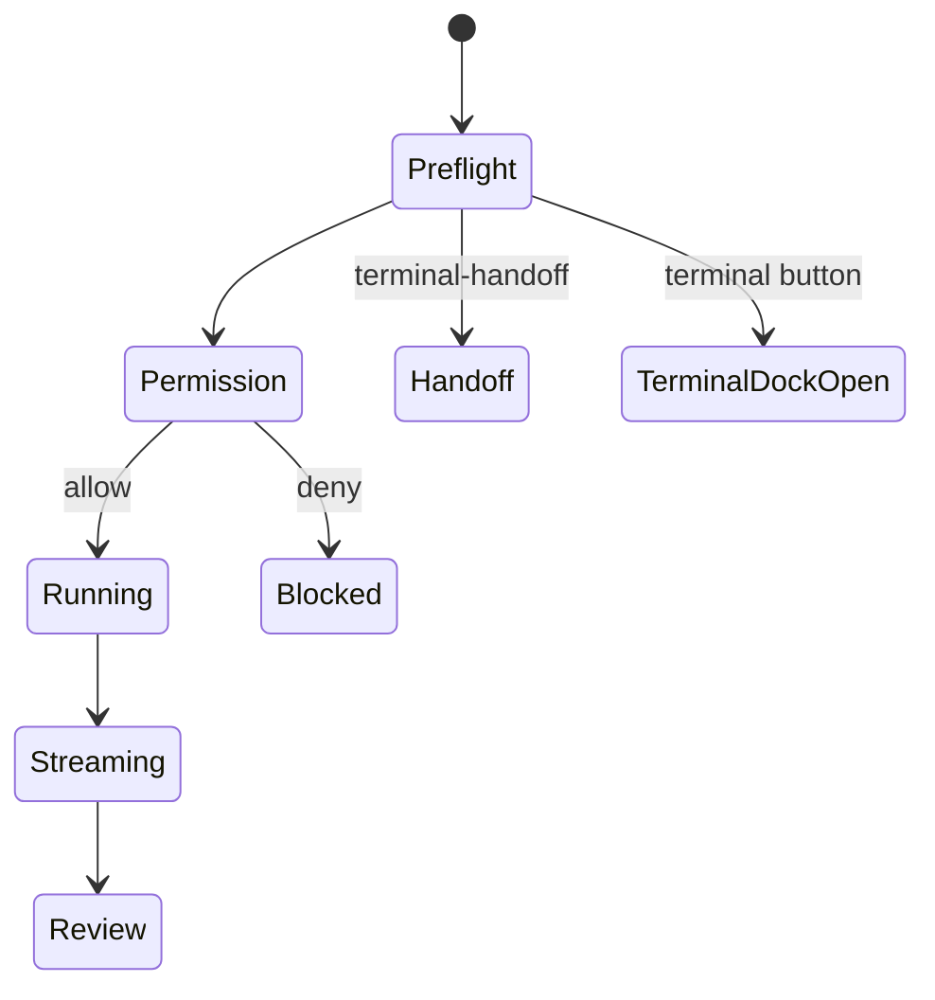

### 4. 必要マイコンポーネント図

```text
LifecycleHeader
RuntimeBanner
PermissionDialog
ExecutionStreamPanel
ResultSummary
HandoffCard
PrimaryActionButton
PersistentTerminalLauncher
TerminalDock
```

### 5. CTA / handoff flow 図

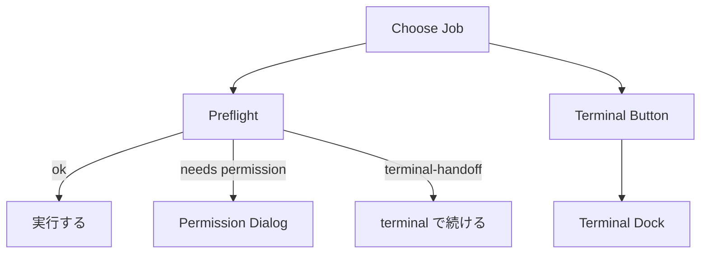
