# AI Runtime Execution Responsibility UI/UX 図解

## 前提の明確化

今回の terminal lane は、`裏で claude を自動実行して結果だけ見せる仕組み` ではない。
本パックは、manual terminal lane を first-class にしつつ mainline UI を回復するための spec-only workflow である。

| 項目             | 今回の採用                                             | 採用しない構造                                 |
| ---------------- | ------------------------------------------------------ | ---------------------------------------------- |
| 実行主体         | ユーザーが terminal 上で `claude` を実行する           | アプリが裏で `claude` を自動起動・自動送信する |
| アプリの役割     | terminal UI、transcript 表示、copy、launcher、open cwd | hidden prompt injection、headless automation   |
| mainline UI      | capability と next action を説明する                   | local 判定で黙って fallback する               |
| transcript share | 明示手動で chat へ共有する                             | 自動 message 化する                            |

## 図解フォーマット

各 surface について、次の 5 種の図解をそろえる。

1. 核となる責務図
2. 画面構成図
3. 状態遷移図
4. 必要マイコンポーネント図
5. CTA / handoff flow 図

## Core Execution Model

### 1. 核となる責務図

```text
User Intent
   |
   v
Surface UI
   |
   v
Central Policy / Capability Resolver
   |---------------- integrated-runtime -----------------> Main Runtime -> Provider
   |---------------- terminal-handoff -------------------> Handoff Card -> User-operated Terminal
   |---------------- terminal-only ----------------------> Terminal Surface
   |---------------- guidance-only ----------------------> Guidance Block / Settings
```

### 2. 画面構成図

```text
+------------------------------------------------------------------+
| App Shell Header                                   [Terminal]    |
+------------------------------------------------------------------+
| Access Card / Runtime Banner / Health / Guidance                 |
+------------------------------------------------------------------+
| Primary Work Area                                                |
| - Settings / Chat / Workspace / Docs / Slide                     |
+------------------------------------------------------------------+
| Handoff Card / Transcript Dock / Share Actions                   |
+------------------------------------------------------------------+
```

### 3. 状態遷移図

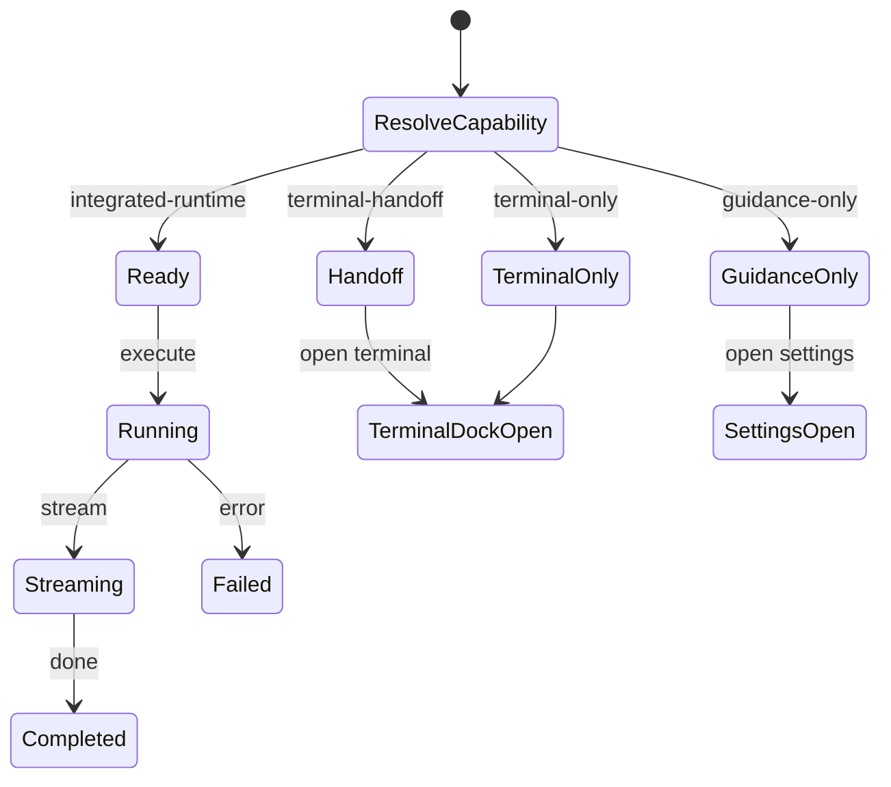

### 4. 必要マイコンポーネント図

```text
AccessCapabilityCard
RuntimeBanner
HealthRow
GuidanceBlock
HandoffCard
PersistentTerminalLauncher
TerminalDock
TranscriptPanel
TranscriptSelectionToolbar
ProvenanceChip
```

### 5. CTA / handoff flow 図

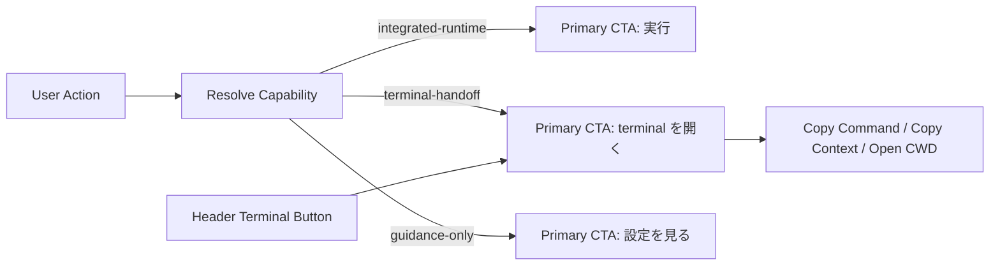

## Settings / Shell Access Matrix Mainline

### 1. 核となる責務図

```text
Settings / Shell
  -> AccessCapabilityCard group
  -> Provider / Selected Config Summary
  -> Health Row
  -> Public Shell Fallback
  -> Persistent Terminal Launcher
```

### 2. 画面構成図

```text
+------------------------------------------------------------------+
| Settings Header                                   [Terminal]     |
+------------------------------------------------------------------+
| Access Matrix Cards                                              |
| [Integrated Runtime] [Terminal Surface] [Unavailable / Blocked]  |
+------------------------------------------------------------------+
| Provider / Model / Selected Config Summary                       |
+------------------------------------------------------------------+
| Health Row / Connection Status                                   |
+------------------------------------------------------------------+
| Public Shell / Settings Bypass Guidance                          |
+------------------------------------------------------------------+
| Terminal Dock (collapsed / expanded)                             |
+------------------------------------------------------------------+
```

### 3. 状態遷移図

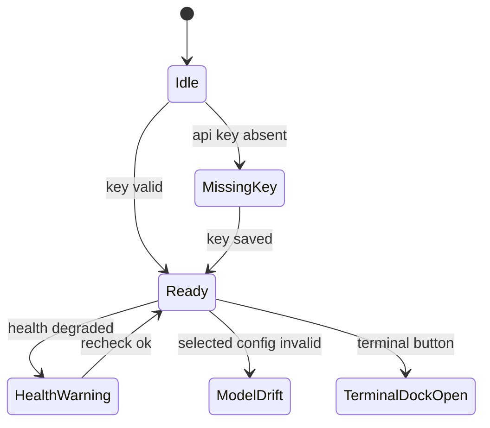

### 4. 必要マイコンポーネント図

```text
SettingsHeader
AccessCapabilityCard
ProviderSummary
SelectedConfigSummary
HealthRow
GuidanceBlock
PersistentTerminalLauncher
TerminalDock
PublicShellPanel
```

### 5. CTA / handoff flow 図

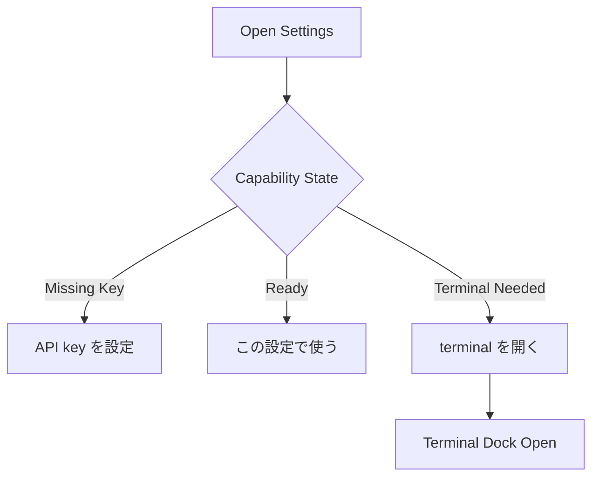

## Main Chat / Workspace Guidance Wiring

### 1. 核となる責務図

```text
Main Chat / Workspace
  -> Composer / Context Chips
  -> Runtime Banner
  -> Guidance Block
  -> Terminal Handoff Action
  -> No local resolve
```

### 2. 画面構成図

```text
+------------------------------------------------------------------+
| Header / Capability                                 [Terminal]   |
+------------------------------------------------------------------+
| Context Chips / Runtime Banner / Guidance                        |
+------------------------------------------------------------------+
| Message Log                                                      |
+------------------------------------------------------------------+
| Composer: input | add file | mention | send                      |
+------------------------------------------------------------------+
| Guidance Block / Handoff Card / Terminal Dock                    |
+------------------------------------------------------------------+
```

### 3. 状態遷移図

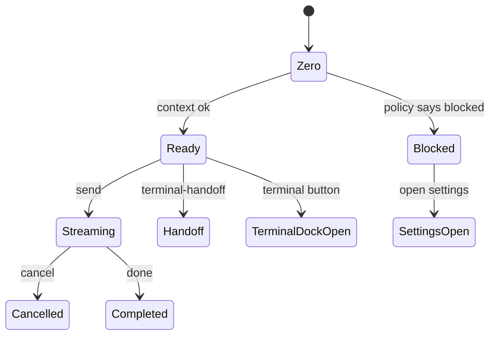

### 4. 必要マイコンポーネント図

```text
RuntimeBanner
GuidanceBlock
ChatComposer
WorkspaceContextChips
WorkspaceMentionDropdown
SendButton
TerminalLaunchButton
HandoffCard
TerminalDock
```

### 5. CTA / handoff flow 図

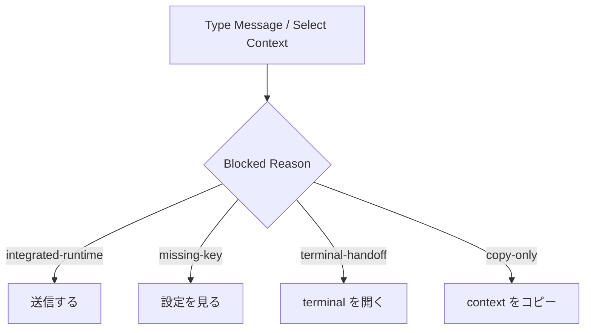

## Terminal Handoff Surface / Docs Consumer

### 1. 核となる責務図

```text
Terminal Handoff Surface
  -> user-operated shell
  -> transcript viewer
  -> copy command / copy context / open cwd
  -> docs consumer handoff
  -> no auto-send boundary
```

### 2. 画面構成図

```text
+----------------------+--------------------------------------------+
| Session List         | Transcript Panel                           |
| - current            | > stdout / stderr                          |
| - history            | > status badge                             |
| - reconnect          | > selection toolbar                        |
+----------------------+--------------------------------------------+
| Action Rail: Copy Cmd | Copy Context | Open CWD | Abort | Retry   |
+------------------------------------------------------------------+
| Docs Consumer Guidance / Shared Handoff Card                     |
+------------------------------------------------------------------+
```

### 3. 状態遷移図

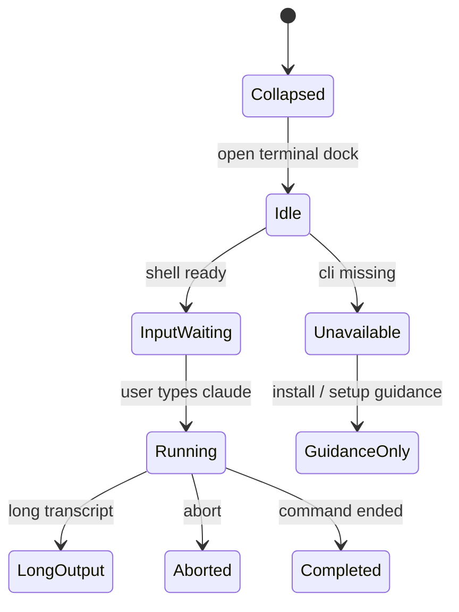

### 4. 必要マイコンポーネント図

```text
PersistentTerminalLauncher
TerminalDock
SessionList
TranscriptPanel
StatusBadge
ActionRail
CopyCommandButton
CopyContextButton
OpenCwdButton
AbortButton
RetryButton
DocsHandoffCard
```

### 5. CTA / handoff flow 図

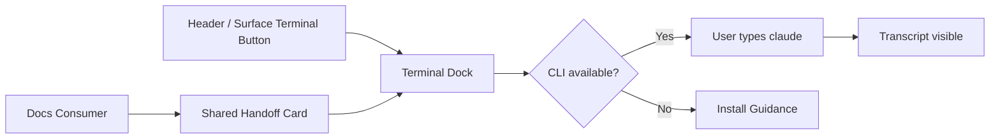

## Transcript -> Chat Manual Bridge

### 1. 核となる責務図

```text
Terminal Transcript
  -> user selects output
  -> explicit share action
  -> chat composer receives text / attachment
  -> provenance chip records the source
```

### 2. 画面構成図

```text
+----------------------------------+----------------------------------+
| Terminal Dock                    | Chat Composer                    |
| - transcript                     | - input                          |
| - selected range                 | - attachment chips               |
| - share actions                  | - provenance label               |
+----------------------------------+----------------------------------+
```

### 3. 状態遷移図

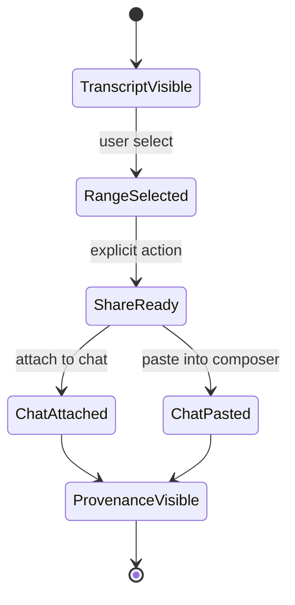

### 4. 必要マイコンポーネント図

```text
TranscriptSelectionToolbar
ShareToChatButton
AttachRecentOutputButton
PasteSessionButton
ComposerAttachmentChip
TranscriptProvenanceChip
```

### 5. CTA / handoff flow 図

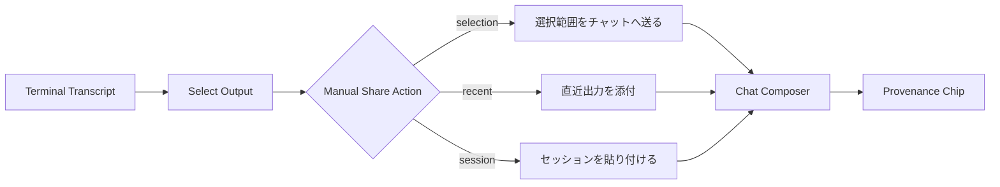

## ChatPanel Review Harness

### 1. 核となる責務図

```text
ChatPanel Review Harness
  -> mainline contract replay
  -> message list
  -> composer
  -> runtime banner
  -> launcher
  -> never placeholder / no-op
```

### 2. 画面構成図

```text
+------------------------------------------------------------------+
| Review Harness Header                               [Terminal]   |
+------------------------------------------------------------------+
| Runtime Banner / Guidance                                       |
+------------------------------------------------------------------+
| Message List                                                     |
+------------------------------------------------------------------+
| Composer: input | send | terminal                                |
+------------------------------------------------------------------+
| Terminal Dock / Transcript Share / Provenance                    |
+------------------------------------------------------------------+
```

### 3. 状態遷移図

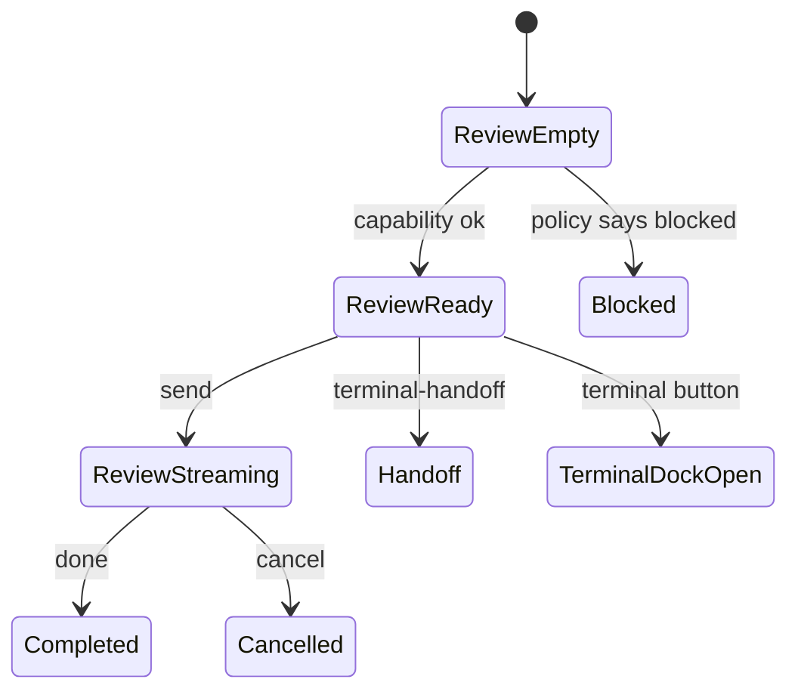

### 4. 必要マイコンポーネント図

```text
ReviewHarnessHeader
RuntimeBanner
ChatMessageList
ComposerInput
SendButton
GuidanceBlock
PersistentTerminalLauncher
TerminalDock
ProvenanceChip
```

### 5. CTA / handoff flow 図

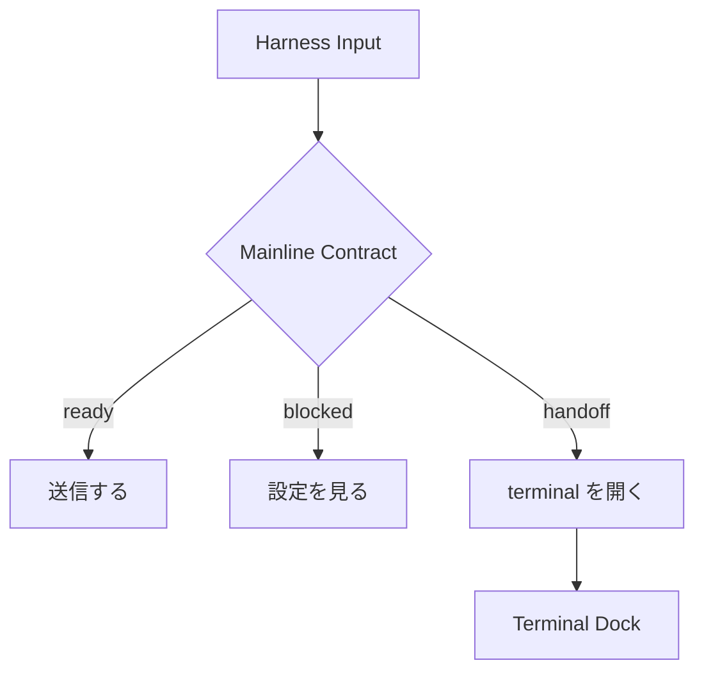

## Slide / Modifier Manual Fallback

### 1. 核となる責務図

```text
Slide / Modifier
  -> reverse-sync request
  -> integrated lane or degraded legacy lane
  -> manual fallback guidance
  -> no silent direct SDK path
```

### 2. 画面構成図

```text
+------------------------------------------------------------------+
| Slide Header                                        [Terminal]   |
+------------------------------------------------------------------+
| Progress Row / Runtime Banner / Degraded Notice                  |
+------------------------------------------------------------------+
| Workspace / Preview / Result Summary                             |
+------------------------------------------------------------------+
| Primary CTA | Manual Fallback | Guidance                         |
+------------------------------------------------------------------+
| Terminal Dock / Legacy Cleanup Note                              |
+------------------------------------------------------------------+
```

### 3. 状態遷移図

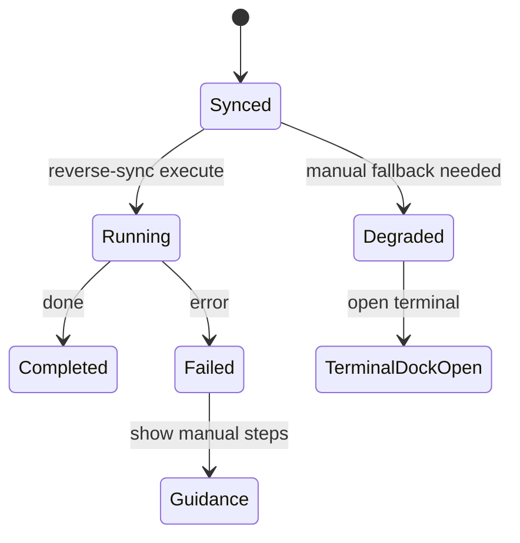

### 4. 必要マイコンポーネント図

```text
SlideRuntimeBanner
ProgressRow
DegradedNotice
ManualFallbackCard
PrimaryActionButton
PersistentTerminalLauncher
TerminalDock
LegacyCleanupNote
```

### 5. CTA / handoff flow 図

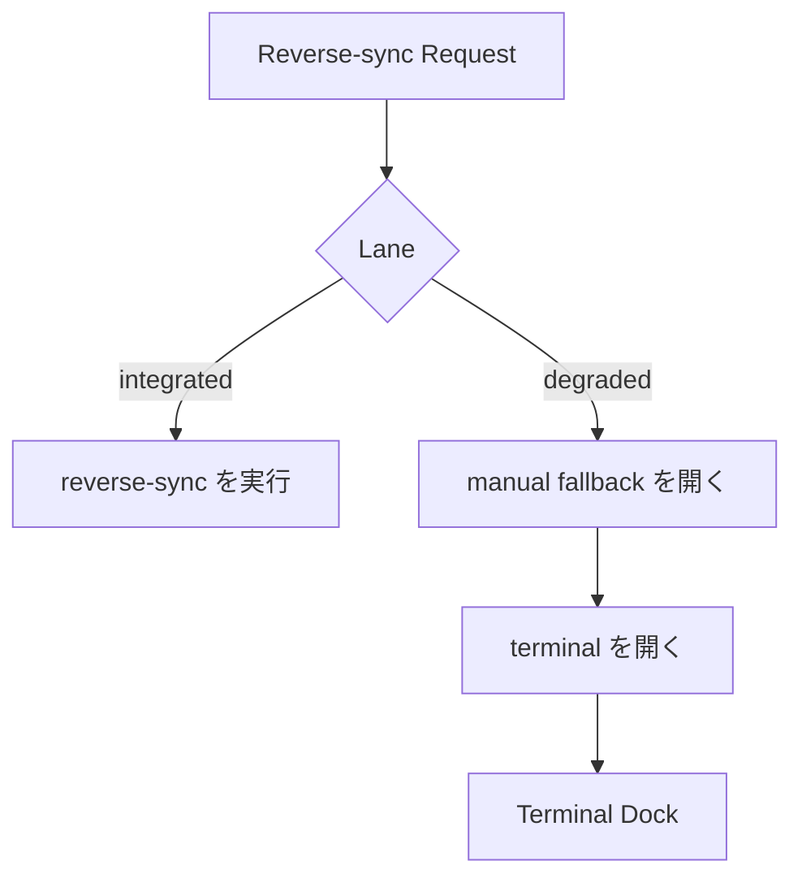
